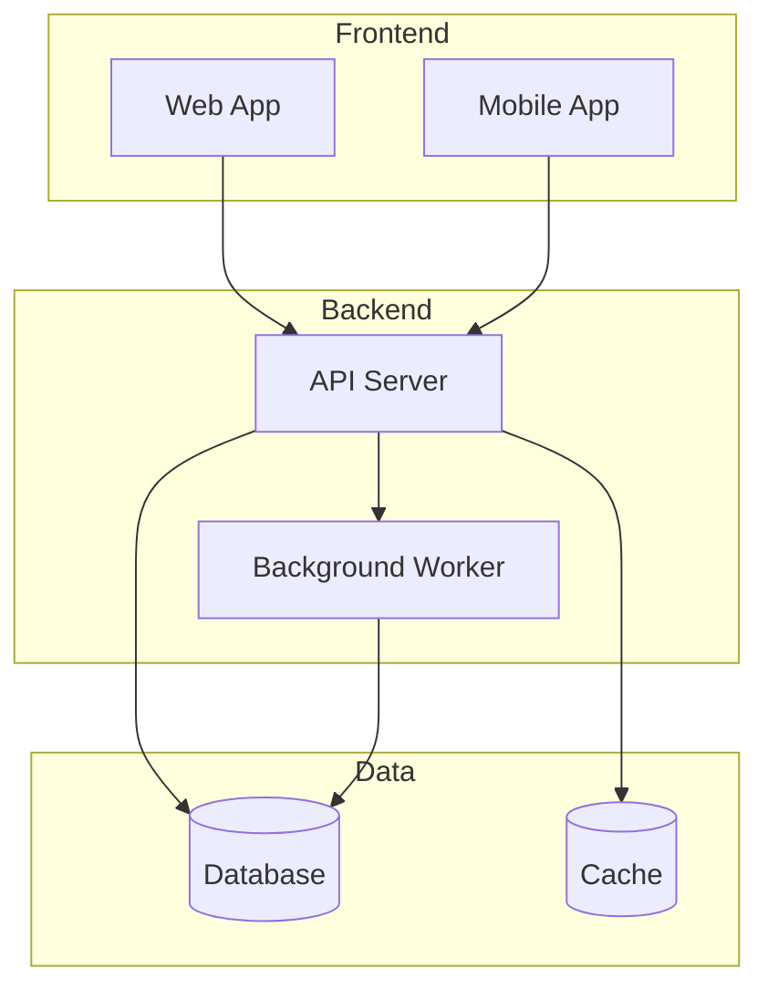
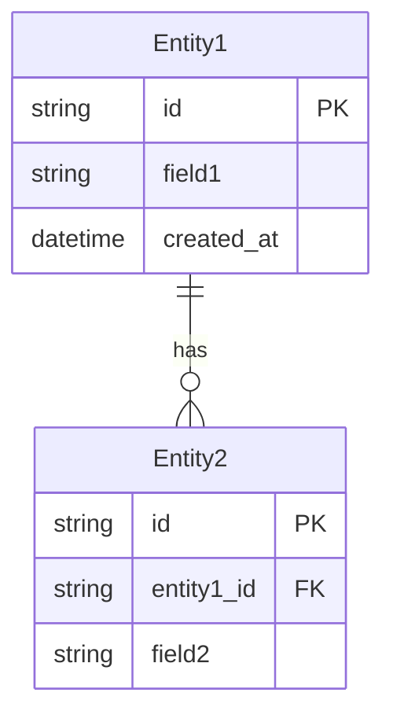
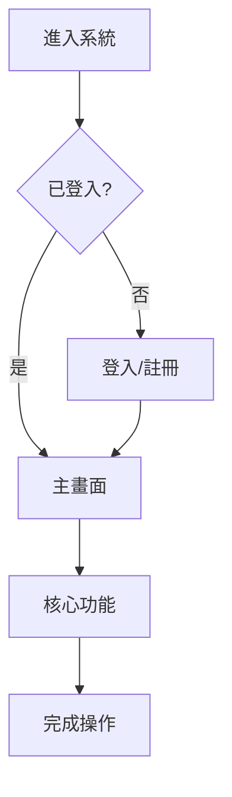

# 專案範疇規劃（Project Scope Planning）

## 環境資訊
- 當前時間: !`date "+%Y-%m-%d %H:%M"`
- 當前目錄: !`pwd`

## 輸入
專案描述：$ARGUMENTS

---

## 定位說明

**此工具的定位**：
- 專案初期發想階段
- 需求龐大、需要整體 Scope 分析
- 專案尚未進入實作
- 需要產出書面的專案架構文件

**與 SOP 的差異**：
- `/scope`：整體專案架構規劃（高層次、全貌）
- `/s0-understand`：單一功能需求分析（細節、可執行）

---

## Agent 調度

**本 Command 調度 Agents**：`scope-planner` + `uiux-designer`

### 1. 範疇規劃（scope-planner）

使用 Agent tool 調度範疇規劃師：

```
Agent(
  subagent_type: "scope-planner",
  prompt: "進行專案範疇規劃，專案描述如下：\n\n{專案描述}\n\n請產出完整的 Project Scope Document，包含：\n1. 專案目標與方向\n2. 功能清單\n3. 技術架構\n4. 範圍定義\n5. 驗收標準",
  description: "專案範疇規劃"
)
```

### 2. UI/UX 設計（uiux-designer）

使用 Agent tool 調度 UI/UX 設計專家：

```
Agent(
  subagent_type: "uiux-designer",
  prompt: "根據專案範疇規劃，設計整體 User Flow 與主要畫面架構：\n\n專案描述：{專案描述}\n\n請產出：\n1. 整體 User Flow（Mermaid 流程圖）\n2. 主要畫面 Wireframe（ASCII）\n3. 頁面架構清單",
  description: "專案 UI/UX 架構設計"
)
```

### 調度順序

1. 先調度 `scope-planner` 進行整體範疇規劃
2. 再調度 `uiux-designer` 進行 UI/UX 架構設計
3. 整合兩者產出至 `project_scope.md`

---

## 工作流程

### 階段 1：理解專案背景

**核心問題**
- 這個專案要解決什麼問題？
- 為什麼需要這個專案？
- 目前的痛點是什麼？

**目標定義**
- 專案的主要目標是什麼？
- 成功的標準是什麼？
- 目標用戶是誰？

**限制條件**
- 時間限制
- 技術限制
- 資源限制

### 階段 2：功能範圍界定

**In Scope（範圍內）**

| 優先級 | 定義 | 判斷標準 |
|--------|------|----------|
| P0 | 核心功能 | 沒有它專案無法運作 |
| P1 | 重要功能 | 沒有它體驗明顯不完整 |
| P2 | 次要功能 | 有它更好，沒有也行 |

**Out of Scope（範圍外）**
- 明確排除的功能
- 未來版本才考慮的功能
- 不在此次專案範圍的需求

### 階段 3：功能清單規劃

以模組為單位組織功能：

```markdown
## 功能清單

### 模組 A：{模組名稱}
| 功能 | 優先級 | 描述 | 備註 |
|------|--------|------|------|
| A1. 功能名稱 | P0 | 功能描述 | |
| A2. 功能名稱 | P1 | 功能描述 | |
```

### 階段 4：技術架構設計

**技術選型**

| 層級 | 選擇 | 理由 |
|------|------|------|
| 前端 | ... | ... |
| 後端 | ... | ... |
| 資料庫 | ... | ... |
| 部署 | ... | ... |

**系統架構圖**



**資料結構設計**



### 階段 5：使用者流程定義

**User Flow**



**Use Case 表**

| ID | 使用者 | 場景 | 前置條件 | 步驟 | 預期結果 |
|----|--------|------|----------|------|----------|
| UC01 | 用戶 | 場景描述 | ... | 1. 步驟... | ... |

### 階段 6：驗收標準制定

**功能驗收**

| 功能 | 驗收項目 | 通過標準 |
|------|----------|----------|
| 功能 A1 | 驗收項目 | 標準描述 |

**非功能驗收**

| 項目 | 標準 |
|------|------|
| 效能 | ... |
| 安全 | ... |
| 可用性 | ... |

---

## 文件產出

### 建立 Spec 目錄

```bash
# 建立專案 spec 目錄
mkdir -p specs/$(date +%Y-%m-%d)_{專案名稱}
```

### 產出文件

**必須產出** `project_scope.md`，存放於：
```
specs/{YYYY-MM-DD}_{專案名稱}/project_scope.md
```

---

## 輸出格式

### 專案範疇報告

#### 專案概述
- **專案名稱**：
- **專案目標**：
- **成功標準**：
- **目標用戶**：

#### 功能清單摘要
- 模組數量：X 個
- P0 功能：Y 個
- P1 功能：Z 個
- P2 功能：W 個

#### 技術架構摘要
- 前端：
- 後端：
- 資料庫：
- 部署：

#### 產出文件
| 文件 | 路徑 | 狀態 |
|------|------|------|
| Project Scope | `specs/{folder}/project_scope.md` | 完成 |

---

## 後續動作

完成 Scope 規劃後，可以：

1. **審閱與調整**：確認範圍、功能、技術選型
2. **選擇功能開始開發**：挑選一個功能，啟動 SOP 流程
   ```
   開始SOP: {功能名稱}
   ```

---

## 確認點

請確認以下內容：
- 專案目標是否清晰？
- 功能清單是否完整且明確？
- 技術選型是否合理？
- 使用者流程是否涵蓋核心場景？
- 驗收標準是否可執行？

如需調整，請說明修改需求。
