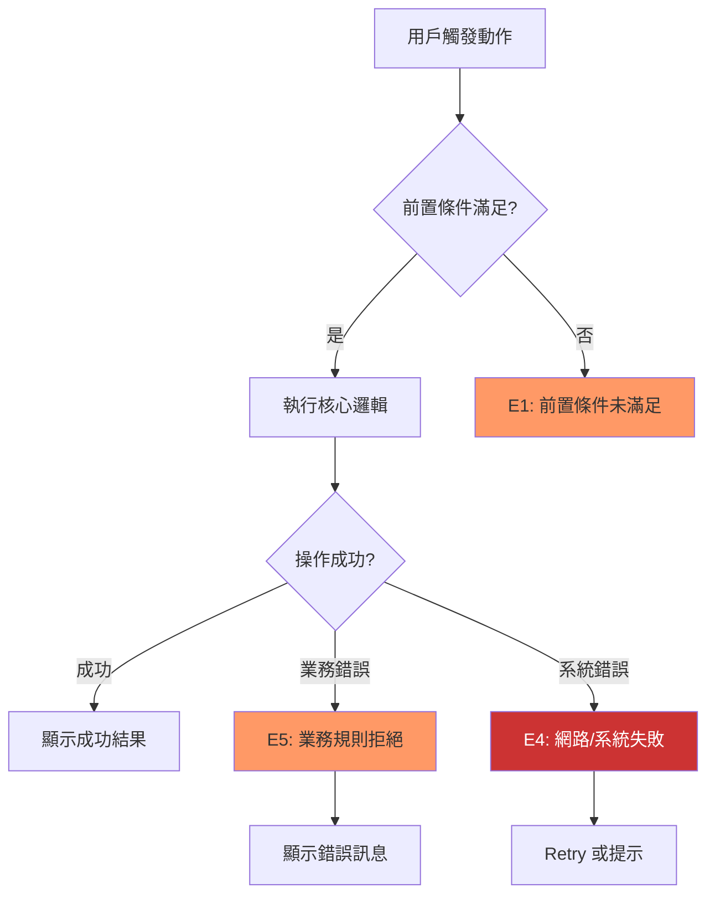

# 例外情境發現框架（Exception Discovery Framework）

> 版本：1.0
> 用途：SOP S0~S2 各階段的例外情境系統化盤點

---

## 1. 六維度探測框架

| # | 維度 | 探測問題 | 典型例外 |
|---|------|---------|---------|
| 1 | **並行/競爭** | 同一操作能被同時觸發嗎？多用戶同時操作同一資源？ | 雙擊、Race condition、樂觀鎖衝突 |
| 2 | **狀態轉換** | 操作中途狀態改變？前置條件在操作過程中失效？ | 中途狀態變更、Token 過期、權限撤銷 |
| 3 | **資料邊界** | 空值、零、極大值、特殊字元、跨頁邊界？ | 空列表、超長文字、0 元、最後一筆 |
| 4 | **網路/外部** | 斷線、超時、部分成功、第三方 API 失敗？ | 支付回調遺失、推播失敗、CDN 逾時 |
| 5 | **業務邏輯** | 規則衝突、道具不足、資格喪失、時間窗口？ | 餘額不足、資格失效、重複操作 |
| 6 | **UI/體驗** | Loading 中返回、切頁、切 App、旋轉螢幕？ | 操作中殺 App、深連結打斷、背景返回 |

---

## 2. E{N} 編號規範

### 格式
- `E{N}`，N 從 1 起算（例如 E1, E2, ... E12）
- 在單一 SOP 的 spec 範圍內唯一即可，不需跨 SOP 全域唯一

### 生命週期
- **S0 建立**：requirement-analyst 在 brief_spec 中為每個例外情境分配 E{N}
- **S1 追溯**：architect 在 dev_spec §3.2 引用 S0 的 E{N}，在 §3.3 建立追溯表
- **S2 審查**：reviewer 核對 S0 的 E{N} 清單與 S1 §3.3 追溯表是否完整對應

### 編號規則
- 按維度順序分配（並行/競爭 → 狀態轉換 → 資料邊界 → 網路/外部 → 業務邏輯 → UI/體驗）
- 同一維度有多個例外時，連續編號（E1, E2 都可以是「並行/競爭」維度）
- 不需要每個維度都有例外 — 「不適用」的維度不分配 E{N}

---

## 3. 各階段使用指引

### S0 — 需求討論（requirement-analyst）

**Full Spec 模式**：
1. 用六維度探測問答逐一向用戶確認每個維度的例外情境
2. 將確認結果寫入 brief_spec §4.3 六維度例外清單（含 E{N} 編號）
3. 為每個關鍵決策點畫例外流程圖（Mermaid flowchart，紅色節點標記例外，§4.2）
4. 在 §4.4 撰寫白話文摘要

**Quick Mode**：
1. 在對話中快速走過六個維度的精簡探測問題（見 §5）
2. 不產出文件，但確保每個維度都有探測結果
3. 用一句話記錄每個維度的結論（「適用/不適用 + 原因」）

### S1 — 技術分析

**codebase-explorer（Phase 1）**：
- 掃描目標模組的現有 error handling pattern
- 識別已有的 try-catch 結構、Error state 定義、retry 機制
- 輸出「例外處理現況地圖」供 architect 參考

**architect（Phase 3）**：
- 在 §3.2 異常流程表中引用 S0 的 E{N} 編號
- 在 §3.3 建立 S0→S1 追溯表，確保每個 E{N} 都有對應處理
- 在 §4 Data Flow 的 sequenceDiagram 中加入 alt/opt 區塊展示錯誤傳播路徑

### S2 — Spec 審查

**Phase 0 預審**：
- 檢查 dev_spec §3.2 是否覆蓋六維度
- 檢查 §3.3 追溯表是否完整（S0 每個 E{N} 都有對應）

**R1 挑戰**：
- 依六維度 checklist 逐項檢查覆蓋率
- 依覆蓋率判定規則給出嚴重度（見 §6）

---

## 4. 例外流程圖繪製指引

### 何時畫
- **S0 Full Spec**：每個核心流程至少一張例外流程圖（強制）
- **S0 Quick Mode**：不要求畫圖
- **S1**：User Flow 必須包含例外分支；Data Flow 必須包含 alt/opt

### 怎麼畫
- 使用 Mermaid `flowchart TD`
- 正常路徑用預設節點樣式
- 例外路徑用 `style X fill:#f96`（橘色 = 可恢復）或 `style X fill:#c33,color:#fff`（紅色 = 不可恢復）
- 用 subgraph 區分「用戶操作」「系統處理」「結果呈現」
- 決策節點用菱形 `{判斷條件}`

### 範例骨架

### 超過 10 條例外分支的拆圖規則
- 依維度或業務場景拆成多張圖
- 每張圖聚焦一個主題（如「金流例外」「權限例外」「網路例外」）
- 每張圖的例外分支不超過 7 條（保持可讀性）
- 在圖上方用 `> 本圖聚焦：{主題}` 標記

---

## 5. Quick Mode 簡化版探測問題

> 在對話中快速走過，每個問題用一句話回答即可。

| # | 維度 | 精簡探測問題 |
|---|------|------------|
| 1 | 並行/競爭 | 這個操作會被快速連點或多人同時觸發嗎？ |
| 2 | 狀態轉換 | 操作過程中，前置條件有沒有可能失效？ |
| 3 | 資料邊界 | 輸入值有沒有空值、零、超長、邊界的情況？ |
| 4 | 網路/外部 | 會不會斷線、超時、或第三方服務掛掉？ |
| 5 | 業務邏輯 | 有沒有餘額不足、資格失效、規則衝突的情況？ |
| 6 | UI/體驗 | 用戶在 Loading 時會不會切頁、殺 App、按返回？ |

---

## 6. 覆蓋率判定規則（S2 審查用）

### 三分類

| 分類 | 符號 | 定義 |
|------|------|------|
| A | ✅ | 有覆蓋 — 該維度有至少一個例外情境被識別和處理 |
| B | ➖ | 不適用 — 該維度不適用於本功能，且有合理說明 |
| C | ❌ | 未覆蓋 — 該維度可能適用但未被探測或處理 |

### 判定規則

| 條件 | 結果 | 嚴重度 |
|------|------|--------|
| C = 0（所有維度為 A 或 B） | **Pass** | — |
| C ≤ 2 且每個 C 維度嚴重度為 P1/P2 | **Conditional Pass** | P1 |
| C ≤ 2 但有任一 C 維度嚴重度為 P0 | **Fail** | P0 |
| C ≥ 3 | **Fail** | P0 |
| B ≥ 4（超過 3 個維度標記不適用） | **需質疑** | P1（需 reviewer 確認不適用理由是否合理） |

---

## 7. 白話文摘要撰寫指引

### 目標讀者
- 非技術人員（PM、利害關係人）
- 不了解 Mermaid、sequenceDiagram、BLoC 等技術概念

### 格式
- 1-3 段白話文，每段 2-3 句
- 第一段：什麼情況會出錯
- 第二段：出錯了系統怎麼處理
- 第三段（選填）：用戶會看到什麼

### 語氣
- 用「如果...就會...」的條件句
- 避免技術名詞（用「網路斷線」而非「NetworkException」）
- 具體而非抽象（用「顯示重試按鈕」而非「進入錯誤狀態」）

### 範例

> **什麼情況會出錯**：如果用戶在操作過程中網路斷線，或操作的資源被其他用戶搶先修改，
> 系統就無法完成原本的操作。如果用戶的餘額不足，相關功能也無法使用。
>
> **系統怎麼處理**：網路問題會自動重試，都失敗才提示用戶。資源衝突會即時通知，
> 不會產生不一致的資料。餘額不足會引導用戶進行充值。
>
> **用戶會看到什麼**：錯誤訊息會用彈窗顯示，說明發生了什麼和可以做什麼。
> 不會出現空白畫面或卡住的情況。

---

## 8. 「不適用」標記規則

### 什麼情況可以標記「不適用」
- 該維度的探測問題在本功能的脈絡下確實不會發生
- 例如：純 UI 文字修改不涉及並行/競爭和網路/外部

### 要求
- 必須附一句理由說明為什麼不適用
- 格式：`➖ 不適用：{理由}`
- 例如：`➖ 不適用：本功能為純前端文字修改，不涉及 API 呼叫`

### 不可以標記「不適用」的情況
- 只是「還沒想到」或「不確定」— 這種情況應標記「待探測」
- 超過 3 個維度標記不適用時，S2 reviewer 會質疑（見 §6）
