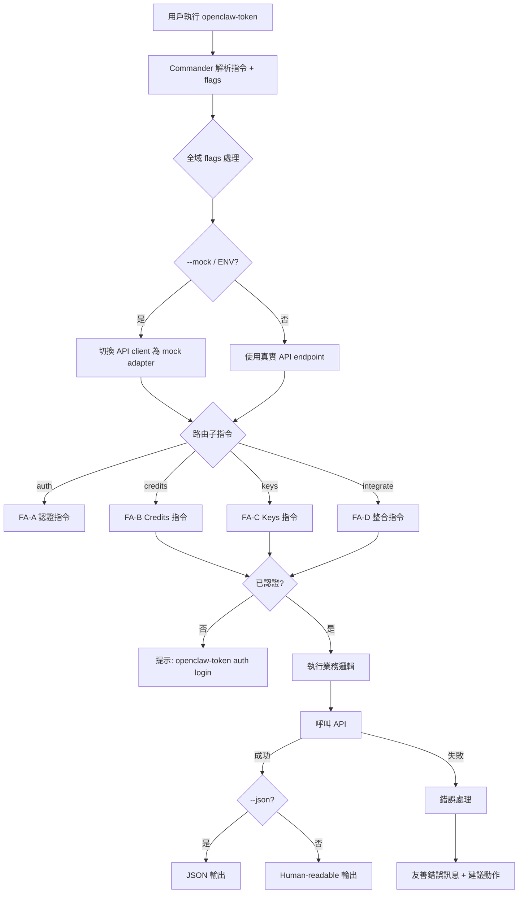
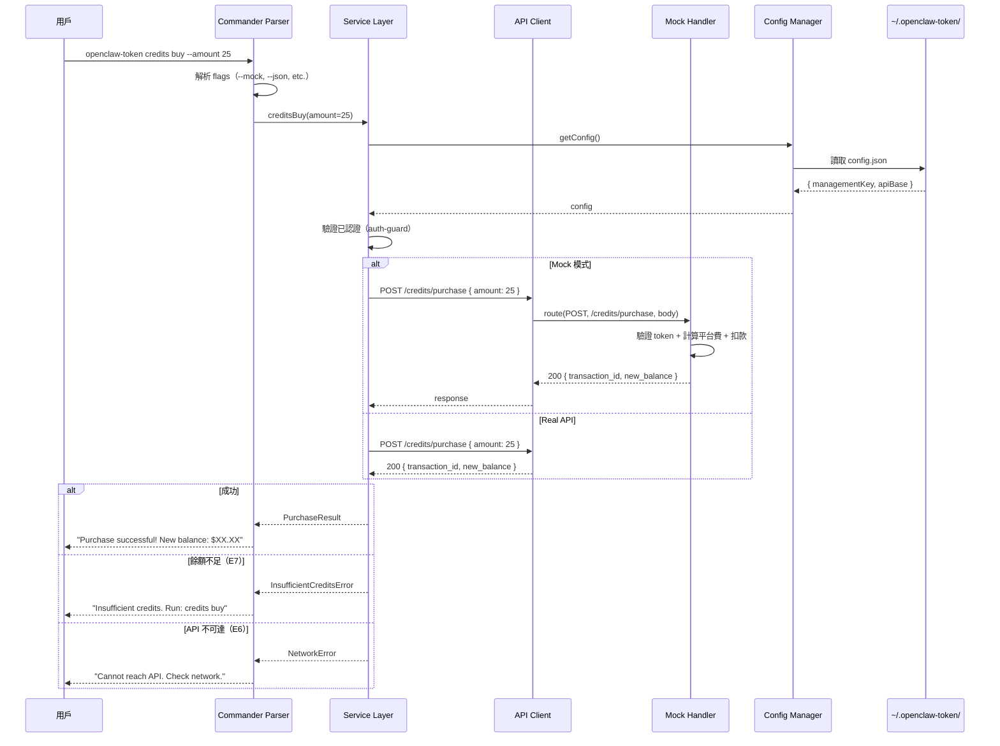

# Spec Review Task

你是嚴格的 Spec 審查專家。請審查以下 spec，找出所有問題。

## Review Standards

# Spec & Code Review 審查標準

> 本檔案為統一審查標準，涵蓋 Spec / Code / Test 三類審查。
> 用於：`review-dialogue.md` Context Assembly、`spec-review` / `code-review` 參考。

## 審查範圍規則

| 文件 | 角色 | 說明 |
|------|------|------|
| S1 dev_spec | **審查目標**（Spec Review） | 主要審查對象 |
| git diff + source | **審查目標**（Code Review） | 主要審查對象 |
| S0 brief_spec | **背景參考** | 用於對照需求是否被涵蓋，不對 S0 提 P0/P1 |
| SDD Context | **上下文** | 用於理解階段進度與決策脈絡 |

---

## Spec Review 審查項目

### 1. 完整性
- 每個任務都有可測試的 DoD
- 驗收標準使用 Given-When-Then，覆蓋 happy + error path
- 任務依賴關係清楚、粒度合理
- 涵蓋所有 S0 成功標準
- 技術決策有理由、有替代方案考量

### 2. 技術合規
- Data Flow 遵循專案既有的分層架構
- 各層職責清晰，不越界
- 命名與既有 codebase 風格一致

### 3. Codebase 一致性
- 提到的 class/method/endpoint 名稱存在或明確標為新建
- endpoint 路徑與路由定義一致
- DB 表/欄位名稱與現有 schema 一致
- 未違反已知架構約束

### 4. 風險與影響
- 影響範圍（impact_scope）完整列出
- 回歸風險、相依關係、安全性影響、效能影響已評估

### 5. S0 成功標準對照
- 每條成功標準可追溯到任務/驗收標準
- 無遺漏、無超出 scope_out

---

## 嚴重度判定

| 等級 | 定義 |
|------|------|
| **P0** | 阻斷：安全漏洞、資料遺失、架構根本錯誤、需求理解偏差 |
| **P1** | 重要：邏輯錯誤、缺驗證、效能瓶頸、不符規範、DoD 不可測試 |
| **P2** | 建議：命名風格、註解品質、可讀性、最佳實踐 |

## 問題分類

| Category | 說明 |
|----------|------|
| `security` | SQL injection、XSS、未驗證端點 |
| `logic` | 業務邏輯錯誤、計算錯誤、邊界條件 |
| `architecture` | 架構違規（層級混亂、職責不清） |
| `naming` | 命名不符慣例 |
| `performance` | N+1、缺 index、timeout |
| `compliance` | 不符 spec/DoD 要求 |
| `completeness` | 缺少必要實作（Spec Review） |
| `consistency` | 不符既有 codebase 風格 |

## Output Format

# Spec Review Output Schema — Convergence Mode

> 禁止在最終輸出夾帶思考過程/內部推理，只允許結論與必要依據。
> 本 schema 專用於收斂模式（spec-converge），與對抗式審查的 output-schema.md 有以下差異：
> - decision 使用 `APPROVED | REJECTED`（非 `PASS | PASS_WITH_FIXES | BLOCKED`）
> - APPROVED 條件：P0=0 且 P1=0 且 P2=0

## Severity Definition

- P0: 設計/規格層錯誤，會導致方向錯誤或架構衝突，必須先修再做
- P1: 實作層問題，會造成 bug/風險/不可維護，必須修
- P2: 改善建議，不阻擋合併

## Findings

### [SR-P1-001] P1 - 問題標題

- id: `SR-P1-001`
- severity: `P0 | P1 | P2`
- category: `architecture | logic | security | test | hardcode | duplication | performance | consistency`
- file: `path/to/file` or `spec section`
- line: `行號 or N/A`
- rule: `違反的規則/標準`
- evidence: `具體觀察到的事實，不要抽象形容`
- impact: `風險與影響範圍`
- fix: `可執行修復建議`

### ID 命名規則

- Spec Review: `SR-{severity}-{序號}` (e.g. `SR-P0-001`, `SR-P1-002`)
- 嚴重度只允許：`P0 | P1 | P2`
- 序號固定三碼，同一輪不可重複，`001` 起跳
- 一個 finding 只講一件事
- 必填：id / severity / file / rule / evidence / fix
- 沒有證據就不要開 finding

## Summary

- totals: `P0=N, P1=N, P2=N`
- decision: `APPROVED | REJECTED`

> **APPROVED** 條件：P0=0 且 P1=0 且 P2=0。有任何 finding 就是 REJECTED。

> **收斂模式補充規則**：
> - 如果前輪修正已解決某問題，不要重複提出。
> - 每個 finding 必須有具體 evidence，不可模糊形容。
> - 本次為收斂模式審查，不提供 codebase 檔案。請基於 spec 內部一致性和技術合規性審查。

## 待審查 Spec

# S1 Dev Spec: OpenClaw Token CLI

> **階段**: S1 技術分析
> **建立時間**: 2026-03-14 22:00
> **Agent**: architect (Phase 1 + Phase 2, greenfield 無需 codebase-explorer)
> **工作類型**: new_feature
> **複雜度**: L

---

## 1. 概述

### 1.1 需求參照
> 完整需求見 `s0_brief_spec.md`，以下僅摘要。

建立 credit-based API proxy CLI 客戶端（`openclaw-token`），讓 OpenClaw 用戶管理 credits、provisioning API keys，並一鍵整合為 agent fallback provider。

### 1.2 技術方案摘要

以 Node.js + TypeScript + Commander.js 建構 CLI 工具。採用分層架構：Commands Layer（指令定義與參數解析）→ Services Layer（業務邏輯）→ API Client Layer（HTTP 通訊，支援 mock/real 切換）。Mock backend 以內建 handler map 實作，不啟動獨立 server process，透過 `--mock` flag 或環境變數切換。Config 持久化為 `~/.openclaw-token/config.json`，使用 atomic write 避免競爭損壞。輸出層統一處理 human-readable（chalk + ora + cli-table3）與 `--json` 兩種格式。

---

## 2. 影響範圍

### 2.1 專案結構（Greenfield）

```
openclaw-token/
├── package.json
├── tsconfig.json
├── vitest.config.ts
├── bin/
│   └── openclaw-token.ts          # CLI entry point (shebang)
├── src/
│   ├── index.ts                    # Commander program 定義 + 全域 flags
│   ├── commands/
│   │   ├── auth.ts                 # FA-A: register, login, logout, whoami
│   │   ├── credits.ts              # FA-B: balance, buy, history, auto-topup
│   │   ├── keys.ts                 # FA-C: create, list, info, update, revoke
│   │   └── integrate.ts            # FA-D: integrate, --remove, --status
│   ├── services/
│   │   ├── auth.service.ts         # 認證業務邏輯
│   │   ├── credits.service.ts      # Credits 業務邏輯
│   │   ├── keys.service.ts         # Key provisioning 業務邏輯
│   │   └── integrate.service.ts    # OpenClaw 整合業務邏輯
│   ├── api/
│   │   ├── client.ts               # HTTP client（axios instance + interceptors）
│   │   ├── types.ts                # API request/response 型別
│   │   └── endpoints.ts            # Endpoint path 常數
│   ├── mock/
│   │   ├── handler.ts              # Mock request router
│   │   ├── store.ts                # In-memory mock data store
│   │   └── handlers/
│   │       ├── auth.mock.ts        # FA-A mock handlers
│   │       ├── credits.mock.ts     # FA-B mock handlers
│   │       └── keys.mock.ts        # FA-C mock handlers
│   ├── config/
│   │   ├── manager.ts              # Config 讀寫（atomic write）
│   │   ├── paths.ts                # 路徑常數（~/.openclaw-token/）
│   │   └── schema.ts               # Config JSON schema + 型別
│   ├── output/
│   │   ├── formatter.ts            # 統一輸出：human / json 切換
│   │   ├── table.ts                # cli-table3 封裝
│   │   └── spinner.ts              # ora 封裝
│   ├── errors/
│   │   ├── base.ts                 # CLIError base class
│   │   ├── api.ts                  # API 錯誤轉換（HTTP status → 友善訊息）
│   │   └── messages.ts             # 錯誤訊息常數
│   └── utils/
│       ├── auth-guard.ts           # 檢查已認證 middleware
│       ├── validation.ts           # 參數驗證工具
│       └── fs.ts                   # Atomic write + 檔案操作
├── tests/
│   ├── unit/
│   │   ├── services/               # Service 單元測試
│   │   ├── config/                 # Config manager 測試
│   │   └── mock/                   # Mock handler 測試
│   └── integration/
│       ├── auth.test.ts            # FA-A 整合測試
│       ├── credits.test.ts         # FA-B 整合測試
│       ├── keys.test.ts            # FA-C 整合測試
│       └── integrate.test.ts       # FA-D 整合測試
└── .github/                        # (placeholder)
```

### 2.2 依賴套件

| 套件 | 版本 | 用途 |
|------|------|------|
| `commander` | ^12.x | CLI framework — 指令解析、子指令、flags |
| `axios` | ^1.x | HTTP client — interceptors + mock adapter 支援佳 |
| `chalk` | ^5.x | Terminal 顏色輸出 |
| `ora` | ^8.x | Spinner（非同步操作等待提示） |
| `cli-table3` | ^0.6.x | 表格輸出 |
| `inquirer` | ^9.x | 互動式 prompt（密碼輸入、確認） |
| `zod` | ^3.x | Runtime 驗證（參數 + API response） |
| `which` | ^4.x | 跨平台 binary 偵測（FA-D OpenClaw 安裝偵測） |

**Dev Dependencies**

| 套件 | 版本 | 用途 |
|------|------|------|
| `typescript` | ^5.x | TypeScript 編譯器 |
| `vitest` | ^2.x | 測試框架 |
| `tsup` | ^8.x | 打包 |
| `@types/node` | ^20.x | Node.js 型別 |
| `execa` | ^8.x | CLI smoke test 用（spawn 子程序執行 binary） |

### 2.3 依賴關係

- **上游依賴**: 無（greenfield）
- **下游影響**: 無（新專案）
- **外部依賴**: OpenClaw CLI（FA-D 整合時需偵測）

### 2.4 現有模式與技術考量

Greenfield 專案，無既有模式。以下為本專案建立的慣例：

- **Command 模式**：每個 FA 一個 command 檔案，內含子指令，透過 `program.command()` 註冊
- **Service 模式**：業務邏輯與 CLI 層分離，方便單元測試
- **API Client 模式**：單一 axios instance，mock 模式透過自訂 adapter 攔截
- **錯誤處理模式**：所有錯誤統一轉成 `CLIError`，在最外層 catch 並格式化輸出

---

## 3. User Flow

### 3.0 整體流程



### 3.1 主要流程

| 步驟 | 用戶動作 | 系統回應 | 備註 |
|------|---------|---------|------|
| 1 | 執行 `openclaw-token auth register` | 提示輸入 email + password（互動式） | 首次使用 |
| 2 | 輸入認證資訊 | POST /auth/register → 取得 Management Key → 儲存 config | Key 僅此時回傳完整值 |
| 3 | 執行 `credits buy --amount 25` | 顯示明細（含 5.5% 平台費）→ 確認 → POST /credits/purchase | 需已認證 |
| 4 | 確認購買 | 顯示 transaction ID + 新餘額 | |
| 5 | 執行 `keys create --name my-agent --limit 10` | POST /keys → 顯示 provisioned key（僅一次） | 需已認證 |
| 6 | 執行 `integrate` | 偵測 OpenClaw → 注入 fallback config → 驗證 | 需已有 provisioned key |

### 3.2 異常流程

| S0 ID | 情境 | 觸發條件 | 系統處理 | 用戶看到 |
|-------|------|---------|---------|---------|
| E1 | 多 terminal 同時購買 | 並行 POST /credits/purchase | API 冪等（idempotency key） | 正常回應，不重複扣款 |
| E2 | 同時建立同名 key | 並行 POST /keys with same name | API 回傳 409 | "Key name 'xxx' already exists" |
| E3 | Management Key 被撤銷 | 操作中收到 401 | 清除本地 config | "Session expired. Please run: openclaw-token auth login" |
| E4 | OpenClaw config 被外部修改 | 寫回 config 時內容已變 | Atomic write + 衝突偵測 | "Config conflict detected. Please retry or edit manually." |
| E5 | 無效參數 | 負數 limit、空 name 等 | CLI 端 zod 驗證 | 明確錯誤 + 正確用法範例 |
| E6 | API 不可達 / 超時 | 網路斷線或後端維護 | 10s timeout → 友善錯誤 | "Cannot reach API. Check your network and retry." |
| E7 | Credits 餘額不足 | 餘額 < 所需金額 | 顯示當前餘額 | "Insufficient credits ($X remaining). Run: openclaw-token credits buy" |
| E8 | Key credit limit 耗盡 | Agent 請求被 proxy 拒絕 | 回傳 402 | Agent 端由 OpenClaw fallback 處理；CLI 可 `keys info` 查看 |

### 3.3 S0→S1 例外追溯表

| S0 ID | 維度 | S0 描述 | S1 處理位置 | 覆蓋狀態 |
|-------|------|---------|-----------|---------|
| E1 | 並行/競爭 | 多 terminal 同時購買 credits | `api/client.ts` — idempotency key header; `mock/handlers/credits.mock.ts` — 冪等檢查; `services/credits.service.ts` — 產生 UUID v4 idempotency key | ✅ 覆蓋 |
| E2 | 並行/競爭 | 同時建立同名 key | `mock/handlers/keys.mock.ts` — 409 回傳; `errors/api.ts` — 409 → 友善訊息 | ✅ 覆蓋 |
| E3 | 狀態轉換 | Management Key 被撤銷 | `api/client.ts` — 401 interceptor → 清除 config + 提示重新登入 | ✅ 覆蓋 |
| E4 | 狀態轉換 | OpenClaw config 被外部修改 | `utils/fs.ts` — atomic write; `services/integrate.service.ts` — 讀寫衝突偵測 | ✅ 覆蓋 |
| E5 | 資料邊界 | 無效參數 | `utils/validation.ts` — zod schema 驗證; 各 command 檔案 — 參數前處理 | ✅ 覆蓋 |
| E6 | 網路/外部 | API 不可達/超時 | `api/client.ts` — timeout 10s + retry 無; `errors/api.ts` — 友善錯誤訊息 | ✅ 覆蓋 |
| E7 | 業務邏輯 | Credits 餘額不足 | `errors/api.ts` — 402 → 引導購買; `mock/handlers/credits.mock.ts` — 餘額檢查 | ✅ 覆蓋 |
| E8 | 業務邏輯 | Key credit limit 耗盡 | `mock/handlers/keys.mock.ts` — 402; `errors/messages.ts` — 提示更新 limit 或購買 | ✅ 覆蓋 |

---

## 4. Data Flow

### 4.1 主要 Sequence Diagram



### 4.2 API 契約摘要

> 完整 API 規格（Request/Response/Error Codes）見 [`s1_api_spec.md`](./s1_api_spec.md)。

| Method | Path | 說明 | FA |
|--------|------|------|----|
| `POST` | `/auth/register` | 註冊帳戶 | FA-A |
| `POST` | `/auth/login` | 登入取得 Management Key | FA-A |
| `GET` | `/auth/me` | 查看帳戶資訊 | FA-A |
| `GET` | `/credits` | 查詢 credits 餘額 | FA-B |
| `POST` | `/credits/purchase` | 購買 credits | FA-B |
| `GET` | `/credits/history` | 交易紀錄 | FA-B |
| `GET` | `/credits/auto-topup` | 查詢 auto top-up 設定 | FA-B |
| `PUT` | `/credits/auto-topup` | 更新 auto top-up 設定 | FA-B |
| `POST` | `/keys` | 建立 provisioned API key | FA-C |
| `GET` | `/keys` | 列出所有 key | FA-C |
| `GET` | `/keys/:hash` | 查看 key 詳情 | FA-C |
| `PATCH` | `/keys/:hash` | 更新 key | FA-C |
| `DELETE` | `/keys/:hash` | 撤銷 key | FA-C |

**認證方式**: `Authorization: Bearer <management_key>`（除 register/login 外皆需）

### 4.3 資料模型

#### Config JSON Schema (`~/.openclaw-token/config.json`)

```typescript
interface OpenClawTokenConfig {
  management_key: string;         // Management API Key
  api_base: string;               // API base URL (default: https://proxy.openclaw-token.dev/v1)
  email: string;                  // 帳戶 email
  created_at: string;             // ISO8601 config 建立時間
  last_login: string;             // ISO8601 最近登入時間
}
```

#### API Response Types

```typescript
// Auth
interface AuthRegisterResponse {
  management_key: string;
  email: string;
  created_at: string;
}

interface AuthMeResponse {
  email: string;
  plan: string;                   // "free" | "pro"
  credits_remaining: number;      // USD
  keys_count: number;
  created_at: string;
}

// Credits
interface CreditsResponse {
  total_credits: number;          // USD 總購買
  total_usage: number;            // USD 總消耗
  remaining: number;              // USD 剩餘
}

interface CreditsPurchaseResponse {
  transaction_id: string;
  amount: number;                 // USD 購買金額
  platform_fee: number;           // USD 平台費
  total_charged: number;          // amount + platform_fee
  new_balance: number;            // USD 新餘額
}

interface CreditHistoryEntry {
  id: string;
  type: "purchase" | "usage" | "refund";
  amount: number;
  balance_after: number;
  description: string;
  created_at: string;
}

interface AutoTopupConfig {
  enabled: boolean;
  threshold: number;              // USD
  amount: number;                 // USD
}

// Keys
interface ProvisionedKey {
  hash: string;                   // Key identifier (always visible)
  key?: string;                   // Full key value (only on create)
  name: string;
  credit_limit: number | null;    // USD, null = unlimited
  limit_reset: "daily" | "weekly" | "monthly" | null;
  usage: number;                  // USD used
  disabled: boolean;
  created_at: string;
  expires_at: string | null;
}

interface KeyDetailResponse extends ProvisionedKey {
  usage_daily: number;            // USD used today
  usage_weekly: number;           // USD used this week
  usage_monthly: number;          // USD used this month
  requests_count: number;         // total request count
  model_usage: Array<{
    model: string;
    requests: number;
    usage_usd: number;
  }>;
}
```

---

## 5. 任務清單

### 5.1 任務總覽

| # | 任務 | FA | 類型 | 複雜度 | Agent | 依賴 | Wave |
|---|------|----|------|--------|-------|------|------|
| 1 | 專案初始化（package.json, tsconfig, vitest, tsup） | Infra | 基礎設施 | S | node-expert | - | 1 |
| 2 | Config 模組（paths, schema, manager + atomic write） | Infra | 基礎設施 | M | node-expert | #1 | 1 |
| 3 | API Client（axios instance + mock adapter 切換） | Infra | 基礎設施 | M | node-expert | #1 | 1 |
| 4 | 錯誤處理模組（CLIError, API error mapping, messages） | Infra | 基礎設施 | S | node-expert | #1 | 1 |
| 5 | 輸出模組（formatter, table, spinner） | Infra | 基礎設施 | S | node-expert | #1 | 1 |
| 6 | 參數驗證模組（zod schemas + auth-guard） | Infra | 基礎設施 | S | node-expert | #1, #4 | 1 |
| 7 | Commander 主程式 + 全域 flags | Infra | 基礎設施 | S | node-expert | #1 | 1 |
| 8 | Mock Store（in-memory data store） | Infra | 基礎設施 | M | node-expert | #1 | 1 |
| 9 | Auth Mock Handlers | FA-A | Mock | M | node-expert | #3, #8 | 2 |
| 10 | Auth Service + Commands（register, login, logout, whoami） | FA-A | 指令 | M | node-expert | #2, #3, #4, #5, #6, #7, #9 | 2 |
| 11 | Credits Mock Handlers | FA-B | Mock | M | node-expert | #3, #8 | 3 |
| 12 | Credits Service + Commands（balance, buy, history, auto-topup） | FA-B | 指令 | L | node-expert | #10, #11 | 3 |
| 13 | Keys Mock Handlers | FA-C | Mock | M | node-expert | #3, #8 | 4 |
| 14 | Keys Service + Commands（create, list, info, update, revoke） | FA-C | 指令 | L | node-expert | #10, #13 | 4 |
| 15 | Integrate Service + Command（integrate, --remove, --status） | FA-D | 指令 | L | node-expert | #10, #14 | 5 |
| 16 | 單元測試（Services + Config + Mock handlers） | 全域 | 測試 | M | node-expert | #10, #12, #14, #15 | 6 |
| 17 | 整合測試（CLI 端到端 mock 模式） | 全域 | 測試 | M | node-expert | #16 | 6 |
| 18 | README + --help 文案完善 | 全域 | 文件 | S | node-expert | #15 | 6 |

### 5.2 任務詳情

(See full task details in spec sections Task #1 through Task #18)

---

## 6. 技術決策

### 6.1 架構決策

| 決策點 | 選項 | 選擇 | 理由 |
|--------|------|------|------|
| CLI Framework | Commander.js / oclif / yargs | Commander.js | 需求已指定。輕量、API 直覺、社群活躍。 |
| HTTP Client | axios / node-fetch / undici | axios | Interceptor 機制適合統一處理 auth header + error mapping。 |
| 輸出美化 | chalk + ora + cli-table3 / ink | chalk + ora + cli-table3 | 組合式選擇，各自職責明確。 |
| 互動式 Prompt | inquirer / prompts / enquirer | inquirer | 最成熟、功能最完整。 |
| 驗證 | zod / joi / yup | zod | TypeScript-first、tree-shakeable。 |
| 測試框架 | vitest / jest | vitest | 原生 ESM 支援、更快。 |
| Mock 架構 | 內建 handler map / Express mock server / MSW | 內建 handler map | 不需啟動獨立 process。 |
| 打包 | tsup / esbuild / tsc | tsup | 基於 esbuild 但提供 DTS generation。 |

---

## 7. 驗收標準

### 7.1 功能驗收

23 項驗收標準，覆蓋 FA-A (6), FA-B (5), FA-C (5), FA-D (3), 全域 (4)。
所有標準使用 Given-When-Then 格式。

### 7.2 非功能驗收

| 項目 | 標準 |
|------|------|
| 啟動速度 | CLI 冷啟動 < 500ms（不含網路） |
| Timeout | API 呼叫超時 10 秒 |
| 安全 | Management key 不 log 到 stdout |
| 相容性 | Node.js >= 18.0.0, macOS / Linux / Windows |
| 輸出 | 所有指令支援 `--json` 和 `--no-color` |

### 7.3 測試計畫

- 單元測試: 覆蓋率 >= 80%
- 整合測試: CLI in-process + execa smoke test
- E2E: N/A（MVP）

---

## 8. 風險與緩解

5 項風險已評估（ESM import、CI TTY、Mock/Real 不一致、OpenClaw config 變更、Windows atomic write）。
