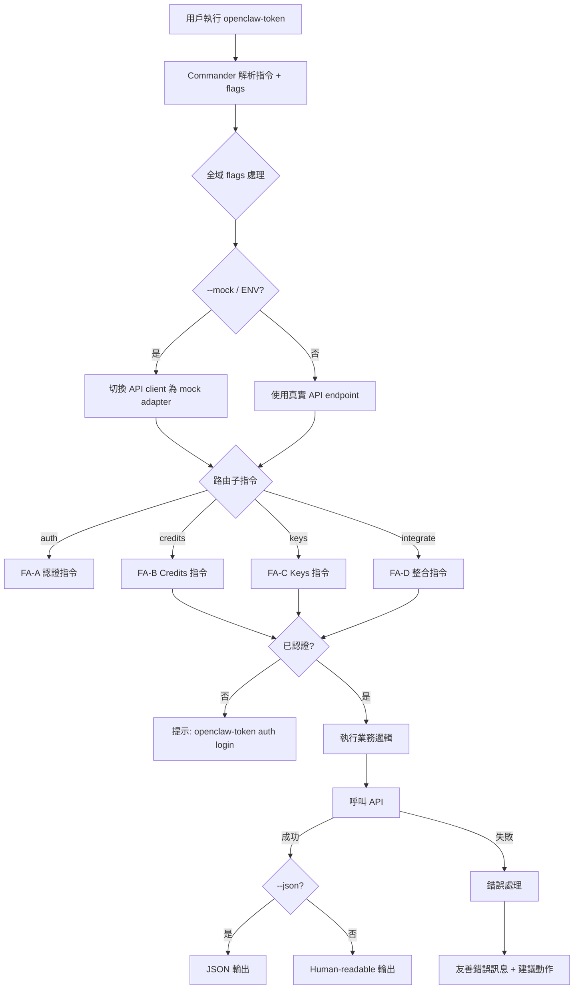
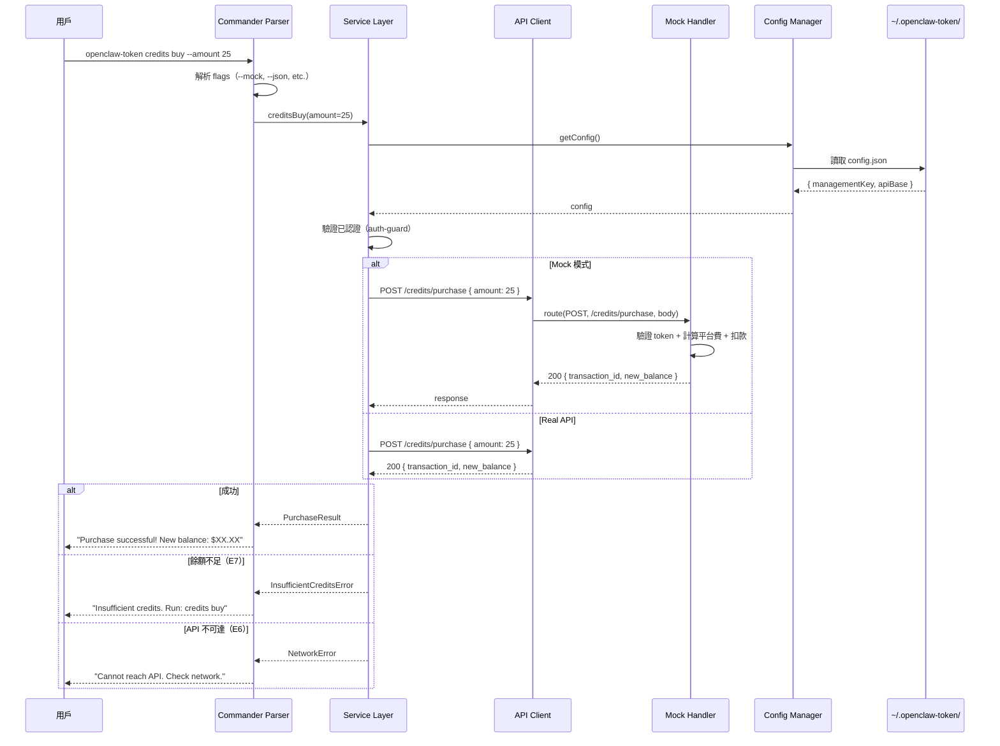

# S1 Dev Spec: OpenClaw Token CLI

> **階段**: S1 技術分析
> **建立時間**: 2026-03-14 22:00
> **Agent**: architect (Phase 1 + Phase 2, greenfield 無需 codebase-explorer)
> **工作類型**: new_feature
> **複雜度**: L

---

## 1. 概述

### 1.1 需求參照
> 完整需求見 `s0_brief_spec.md`，以下僅摘要。

建立 credit-based API proxy CLI 客戶端（`openclaw-token`），讓 OpenClaw 用戶管理 credits、provisioning API keys，並一鍵整合為 agent fallback provider。

### 1.2 技術方案摘要

以 Node.js + TypeScript + Commander.js 建構 CLI 工具。採用分層架構：Commands Layer（指令定義與參數解析）→ Services Layer（業務邏輯）→ API Client Layer（HTTP 通訊，支援 mock/real 切換）。Mock backend 以內建 handler map 實作，不啟動獨立 server process，透過 `--mock` flag 或環境變數切換。Config 持久化為 `~/.openclaw-token/config.json`，使用 atomic write 避免競爭損壞。輸出層統一處理 human-readable（chalk + ora + cli-table3）與 `--json` 兩種格式。

---

## 2. 影響範圍

### 2.1 專案結構（Greenfield）

```
openclaw-token/
├── package.json
├── tsconfig.json
├── vitest.config.ts
├── bin/
│   └── openclaw-token.ts          # CLI entry point (shebang)
├── src/
│   ├── index.ts                    # Commander program 定義 + 全域 flags
│   ├── commands/
│   │   ├── auth.ts                 # FA-A: register, login, logout, whoami
│   │   ├── credits.ts              # FA-B: balance, buy, history, auto-topup
│   │   ├── keys.ts                 # FA-C: create, list, info, update, revoke
│   │   └── integrate.ts            # FA-D: integrate, --remove, --status
│   ├── services/
│   │   ├── auth.service.ts         # 認證業務邏輯
│   │   ├── credits.service.ts      # Credits 業務邏輯
│   │   ├── keys.service.ts         # Key provisioning 業務邏輯
│   │   └── integrate.service.ts    # OpenClaw 整合業務邏輯
│   ├── api/
│   │   ├── client.ts               # HTTP client（axios instance + interceptors）
│   │   ├── types.ts                # API request/response 型別
│   │   └── endpoints.ts            # Endpoint path 常數
│   ├── mock/
│   │   ├── handler.ts              # Mock request router
│   │   ├── store.ts                # In-memory mock data store
│   │   └── handlers/
│   │       ├── auth.mock.ts        # FA-A mock handlers
│   │       ├── credits.mock.ts     # FA-B mock handlers
│   │       └── keys.mock.ts        # FA-C mock handlers
│   ├── config/
│   │   ├── manager.ts              # Config 讀寫（atomic write）
│   │   ├── paths.ts                # 路徑常數（~/.openclaw-token/）
│   │   └── schema.ts               # Config JSON schema + 型別
│   ├── output/
│   │   ├── formatter.ts            # 統一輸出：human / json 切換
│   │   ├── table.ts                # cli-table3 封裝
│   │   └── spinner.ts              # ora 封裝
│   ├── errors/
│   │   ├── base.ts                 # CLIError base class
│   │   ├── api.ts                  # API 錯誤轉換（HTTP status → 友善訊息）
│   │   └── messages.ts             # 錯誤訊息常數
│   └── utils/
│       ├── auth-guard.ts           # 檢查已認證 middleware
│       ├── validation.ts           # 參數驗證工具
│       └── fs.ts                   # Atomic write + 檔案操作
├── tests/
│   ├── unit/
│   │   ├── services/               # Service 單元測試
│   │   ├── config/                 # Config manager 測試
│   │   └── mock/                   # Mock handler 測試
│   └── integration/
│       ├── auth.test.ts            # FA-A 整合測試
│       ├── credits.test.ts         # FA-B 整合測試
│       ├── keys.test.ts            # FA-C 整合測試
│       └── integrate.test.ts       # FA-D 整合測試
└── .github/                        # (placeholder)
```

### 2.2 依賴套件

| 套件 | 版本 | 用途 |
|------|------|------|
| `commander` | ^12.x | CLI framework — 指令解析、子指令、flags |
| `axios` | ^1.x | HTTP client — interceptors + mock adapter 支援佳 |
| `chalk` | ^5.x | Terminal 顏色輸出 |
| `ora` | ^8.x | Spinner（非同步操作等待提示） |
| `cli-table3` | ^0.6.x | 表格輸出 |
| `inquirer` | ^9.x | 互動式 prompt（密碼輸入、確認） |
| `zod` | ^3.x | Runtime 驗證（參數 + API response） |
| `which` | ^4.x | 跨平台 binary 偵測（FA-D OpenClaw 安裝偵測） |

**Dev Dependencies**

| 套件 | 版本 | 用途 |
|------|------|------|
| `typescript` | ^5.x | TypeScript 編譯器 |
| `vitest` | ^2.x | 測試框架 |
| `tsup` | ^8.x | 打包 |
| `@types/node` | ^20.x | Node.js 型別 |
| `execa` | ^8.x | CLI smoke test 用（spawn 子程序執行 binary） |

### 2.3 依賴關係

- **上游依賴**: 無（greenfield）
- **下游影響**: 無（新專案）
- **外部依賴**: OpenClaw CLI（FA-D 整合時需偵測）

### 2.4 現有模式與技術考量

Greenfield 專案，無既有模式。以下為本專案建立的慣例：

- **Command 模式**：每個 FA 一個 command 檔案，內含子指令，透過 `program.command()` 註冊
- **Service 模式**：業務邏輯與 CLI 層分離，方便單元測試
- **API Client 模式**：單一 axios instance，mock 模式透過自訂 adapter 攔截
- **錯誤處理模式**：所有錯誤統一轉成 `CLIError`，在最外層 catch 並格式化輸出

---

## 3. User Flow

### 3.0 整體流程



### 3.1 主要流程

| 步驟 | 用戶動作 | 系統回應 | 備註 |
|------|---------|---------|------|
| 1 | 執行 `openclaw-token auth register` | 提示輸入 email + password（互動式） | 首次使用 |
| 2 | 輸入認證資訊 | POST /auth/register → 取得 Management Key → 儲存 config | Key 僅此時回傳完整值 |
| 3 | 執行 `credits buy --amount 25` | 顯示明細（含 5.5% 平台費）→ 確認 → POST /credits/purchase | 需已認證 |
| 4 | 確認購買 | 顯示 transaction ID + 新餘額 | |
| 5 | 執行 `keys create --name my-agent --limit 10` | POST /keys → 顯示 provisioned key（僅一次） | 需已認證 |
| 6 | 執行 `integrate` | 偵測 OpenClaw → 注入 fallback config → 驗證 | 需已有 provisioned key |

### 3.2 異常流程

| S0 ID | 情境 | 觸發條件 | 系統處理 | 用戶看到 |
|-------|------|---------|---------|---------|
| E1 | 多 terminal 同時購買 | 並行 POST /credits/purchase | API 冪等（idempotency key） | 正常回應，不重複扣款 |
| E2 | 同時建立同名 key | 並行 POST /keys with same name | API 回傳 409 | "Key name 'xxx' already exists" |
| E3 | Management Key 被撤銷 | 操作中收到 401 | 清除本地 config | "Session expired. Please run: openclaw-token auth login" |
| E4 | OpenClaw config 被外部修改 | 寫回 config 時內容已變 | Atomic write + 衝突偵測 | "Config conflict detected. Please retry or edit manually." |
| E5 | 無效參數 | 負數 limit、空 name 等 | CLI 端 zod 驗證 | 明確錯誤 + 正確用法範例 |
| E6 | API 不可達 / 超時 | 網路斷線或後端維護 | 10s timeout → 友善錯誤 | "Cannot reach API. Check your network and retry." |
| E7 | Credits 餘額不足 | 餘額 < 所需金額 | 顯示當前餘額 | "Insufficient credits ($X remaining). Run: openclaw-token credits buy" |
| E8 | Key credit limit 耗盡 | Agent 請求被 proxy 拒絕 | 回傳 402 | Agent 端由 OpenClaw fallback 處理；CLI 可 `keys info` 查看 |

### 3.3 S0→S1 例外追溯表

| S0 ID | 維度 | S0 描述 | S1 處理位置 | 覆蓋狀態 |
|-------|------|---------|-----------|---------|
| E1 | 並行/競爭 | 多 terminal 同時購買 credits | `api/client.ts` — idempotency key header; `mock/handlers/credits.mock.ts` — 冪等檢查; `services/credits.service.ts` — 產生 UUID v4 idempotency key | ✅ 覆蓋 |
| E2 | 並行/競爭 | 同時建立同名 key | `mock/handlers/keys.mock.ts` — 409 回傳; `errors/api.ts` — 409 → 友善訊息 | ✅ 覆蓋 |
| E3 | 狀態轉換 | Management Key 被撤銷 | `api/client.ts` — 401 interceptor → 清除 config + 提示重新登入 | ✅ 覆蓋 |
| E4 | 狀態轉換 | OpenClaw config 被外部修改 | `utils/fs.ts` — atomic write; `services/integrate.service.ts` — 讀寫衝突偵測 | ✅ 覆蓋 |
| E5 | 資料邊界 | 無效參數 | `utils/validation.ts` — zod schema 驗證; 各 command 檔案 — 參數前處理 | ✅ 覆蓋 |
| E6 | 網路/外部 | API 不可達/超時 | `api/client.ts` — timeout 10s + retry 無; `errors/api.ts` — 友善錯誤訊息 | ✅ 覆蓋 |
| E7 | 業務邏輯 | Credits 餘額不足 | `errors/api.ts` — 402 → 引導購買; `mock/handlers/credits.mock.ts` — 餘額檢查 | ✅ 覆蓋 |
| E8 | 業務邏輯 | Key credit limit 耗盡 | `mock/handlers/keys.mock.ts` — 402; `errors/messages.ts` — 提示更新 limit 或購買 | ✅ 覆蓋 |

---

## 4. Data Flow

### 4.1 主要 Sequence Diagram



### 4.2 API 契約摘要

> 完整 API 規格（Request/Response/Error Codes）見 [`s1_api_spec.md`](./s1_api_spec.md)。

| Method | Path | 說明 | FA |
|--------|------|------|----|
| `POST` | `/auth/register` | 註冊帳戶 | FA-A |
| `POST` | `/auth/login` | 登入取得 Management Key | FA-A |
| `GET` | `/auth/me` | 查看帳戶資訊 | FA-A |
| `GET` | `/credits` | 查詢 credits 餘額 | FA-B |
| `POST` | `/credits/purchase` | 購買 credits | FA-B |
| `GET` | `/credits/history` | 交易紀錄 | FA-B |
| `GET` | `/credits/auto-topup` | 查詢 auto top-up 設定 | FA-B |
| `PUT` | `/credits/auto-topup` | 更新 auto top-up 設定 | FA-B |
| `POST` | `/keys` | 建立 provisioned API key | FA-C |
| `GET` | `/keys` | 列出所有 key | FA-C |
| `GET` | `/keys/:hash` | 查看 key 詳情 | FA-C |
| `PATCH` | `/keys/:hash` | 更新 key | FA-C |
| `DELETE` | `/keys/:hash` | 撤銷 key | FA-C |

**認證方式**: `Authorization: Bearer <management_key>`（除 register/login 外皆需）

### 4.3 資料模型

#### Config JSON Schema (`~/.openclaw-token/config.json`)

```typescript
interface OpenClawTokenConfig {
  management_key: string;         // Management API Key
  api_base: string;               // API base URL (default: https://proxy.openclaw-token.dev/v1)
  email: string;                  // 帳戶 email
  created_at: string;             // ISO8601 config 建立時間
  last_login: string;             // ISO8601 最近登入時間
}
```

#### API Response Types

```typescript
// Auth
interface AuthRegisterResponse {
  management_key: string;
  email: string;
  created_at: string;
}

interface AuthMeResponse {
  email: string;
  plan: string;                   // "free" | "pro"
  credits_remaining: number;      // USD
  keys_count: number;
  created_at: string;
}

// Credits
interface CreditsResponse {
  total_credits: number;          // USD 總購買
  total_usage: number;            // USD 總消耗
  remaining: number;              // USD 剩餘
}

interface CreditsPurchaseResponse {
  transaction_id: string;
  amount: number;                 // USD 購買金額
  platform_fee: number;           // USD 平台費
  total_charged: number;          // amount + platform_fee
  new_balance: number;            // USD 新餘額
}

interface CreditHistoryEntry {
  id: string;
  type: "purchase" | "usage" | "refund";
  amount: number;
  balance_after: number;
  description: string;
  created_at: string;
}

interface AutoTopupConfig {
  enabled: boolean;
  threshold: number;              // USD
  amount: number;                 // USD
}

// Keys
interface ProvisionedKey {
  hash: string;                   // Key identifier (always visible)
  key?: string;                   // Full key value (only on create)
  name: string;
  credit_limit: number | null;    // USD, null = unlimited
  limit_reset: "daily" | "weekly" | "monthly" | null;
  usage: number;                  // USD used
  disabled: boolean;
  created_at: string;
  expires_at: string | null;
}

interface KeyDetailResponse extends ProvisionedKey {
  usage_daily: number;            // USD used today
  usage_weekly: number;           // USD used this week
  usage_monthly: number;          // USD used this month
  requests_count: number;         // total request count
  model_usage: Array<{
    model: string;
    requests: number;
    usage_usd: number;
  }>;
}
```

---

## 5. 任務清單

### 5.1 任務總覽

| # | 任務 | FA | 類型 | 複雜度 | Agent | 依賴 | Wave |
|---|------|----|------|--------|-------|------|------|
| 1 | 專案初始化（package.json, tsconfig, vitest, tsup） | Infra | 基礎設施 | S | node-expert | - | 1 |
| 2 | Config 模組（paths, schema, manager + atomic write） | Infra | 基礎設施 | M | node-expert | #1 | 1 |
| 3 | API Client（axios instance + mock adapter 切換） | Infra | 基礎設施 | M | node-expert | #1 | 1 |
| 4 | 錯誤處理模組（CLIError, API error mapping, messages） | Infra | 基礎設施 | S | node-expert | #1 | 1 |
| 5 | 輸出模組（formatter, table, spinner） | Infra | 基礎設施 | S | node-expert | #1 | 1 |
| 6 | 參數驗證模組（zod schemas + auth-guard） | Infra | 基礎設施 | S | node-expert | #1, #4 | 1 |
| 7 | Commander 主程式 + 全域 flags | Infra | 基礎設施 | S | node-expert | #1 | 1 |
| 8 | Mock Store（in-memory data store） | Infra | 基礎設施 | M | node-expert | #1 | 1 |
| 9 | Auth Mock Handlers | FA-A | Mock | M | node-expert | #3, #8 | 2 |
| 10 | Auth Service + Commands（register, login, logout, whoami） | FA-A | 指令 | M | node-expert | #2, #3, #4, #5, #6, #7, #9 | 2 |
| 11 | Credits Mock Handlers | FA-B | Mock | M | node-expert | #3, #8 | 3 |
| 12 | Credits Service + Commands（balance, buy, history, auto-topup） | FA-B | 指令 | L | node-expert | #10, #11 | 3 |
| 13 | Keys Mock Handlers | FA-C | Mock | M | node-expert | #3, #8 | 4 |
| 14 | Keys Service + Commands（create, list, info, update, revoke） | FA-C | 指令 | L | node-expert | #10, #13 | 4 |
| 15 | Integrate Service + Command（integrate, --remove, --status） | FA-D | 指令 | L | node-expert | #10, #14 | 5 |
| 16 | 單元測試（Services + Config + Mock handlers） | 全域 | 測試 | M | node-expert | #10, #12, #14, #15 | 6 |
| 17 | 整合測試（CLI 端到端 mock 模式） | 全域 | 測試 | M | node-expert | #16 | 6 |
| 18 | README + --help 文案完善 | 全域 | 文件 | S | node-expert | #15 | 6 |

### 5.2 任務詳情

#### Task #1: 專案初始化
- **類型**: 基礎設施
- **複雜度**: S
- **Agent**: node-expert
- **描述**: 初始化 Node.js + TypeScript 專案。設定 package.json（name: `openclaw-token`, bin entry）、tsconfig.json（strict mode, ES2022 target, NodeNext module）、vitest.config.ts、tsup.config.ts（bundle to CJS+ESM）。建立 `bin/openclaw-token.ts` entry point with shebang。
- **DoD**:
  - [ ] `npm install` 成功
  - [ ] `npx tsc --noEmit` 無錯誤
  - [ ] `npx vitest run` 可執行（即使 0 test）
  - [ ] `npx tsup` 可 build
  - [ ] `bin/openclaw-token.ts` 可執行顯示 help
- **驗收方式**: 執行上述指令無報錯

#### Task #2: Config 模組
- **類型**: 基礎設施
- **複雜度**: M
- **Agent**: node-expert
- **依賴**: Task #1
- **描述**: 實作 `config/paths.ts`（CONFIG_DIR, CONFIG_FILE 常數，支援 `OPENCLAW_TOKEN_CONFIG_DIR` 環境變數覆蓋）、`config/schema.ts`（zod schema + TS 型別）、`config/manager.ts`（read/write/delete/exists，write 使用 atomic write — 先寫 temp 再 rename）。**Config 欄位優先序**：(1) `management_key`：`OPENCLAW_TOKEN_KEY` 環境變數 > config.json；(2) `api_base`：`OPENCLAW_TOKEN_API_BASE` 環境變數 > config.json > 預設值；(3) `email`：僅來自 config.json。設定了 `OPENCLAW_TOKEN_KEY` 時，即使 config.json 不存在，`requireAuth()` 也視為已認證。
- **DoD**:
  - [ ] `ConfigManager.read()` 可讀取 config，不存在時回傳 null
  - [ ] `ConfigManager.write()` 使用 atomic write
  - [ ] `ConfigManager.delete()` 清除 config 檔案
  - [ ] 支援 `OPENCLAW_TOKEN_CONFIG_DIR` 環境變數
  - [ ] `ConfigManager.resolve()` 合併 env vars + config.json，按優先序回傳最終值
  - [ ] `OPENCLAW_TOKEN_KEY` 環境變數覆蓋 management_key（無 config 也可用）
  - [ ] Config schema 驗證無效格式時拋出明確錯誤
  - [ ] 路徑使用 `os.homedir()` + `path.join()` 組合，禁止字串拼接 `~/` 或硬編碼路徑分隔符
  - [ ] 單元測試覆蓋（使用 temp dir，含 env var 覆蓋 case）
- **驗收方式**: vitest 單元測試通過

#### Task #3: API Client
- **類型**: 基礎設施
- **複雜度**: M
- **Agent**: node-expert
- **依賴**: Task #1
- **描述**: 實作 `api/client.ts` — 建立 axios instance factory，支援兩種模式：(1) Real mode：直接打 API base URL，(2) Mock mode：使用自訂 adapter 路由到 mock handlers。透過 `createApiClient(options)` factory pattern 切換。加入 request interceptor 自動附加 `Authorization: Bearer <key>` header，以及 response interceptor 統一錯誤轉換。`api/endpoints.ts` 定義所有 path 常數。`api/types.ts` 定義所有 request/response 型別。
- **DoD**:
  - [ ] `createApiClient({ mock: true })` 回傳 mock adapter client
  - [ ] `createApiClient({ mock: false, baseURL, token })` 回傳 real client
  - [ ] Request interceptor 自動加 Authorization header
  - [ ] Response interceptor 將 4xx/5xx 轉為 `APIError`
  - [ ] Timeout 設為 10 秒
  - [ ] 所有 endpoint path 常數化
  - [ ] Request/Response 型別完整定義
  - [ ] `post()` 方法支援選用 `idempotencyKey` 選項，自動帶入 `Idempotency-Key` header
- **驗收方式**: 單元測試 mock 模式可正常路由

#### Task #4: 錯誤處理模組
- **類型**: 基礎設施
- **複雜度**: S
- **Agent**: node-expert
- **依賴**: Task #1
- **描述**: 實作 `errors/base.ts`（CLIError class with exitCode, suggestion）、`errors/api.ts`（HTTP status code → CLIError mapping，含 401/402/409 等特殊處理）、`errors/messages.ts`（所有錯誤訊息常數）。
- **DoD**:
  - [ ] `CLIError` 包含 message, exitCode, suggestion 欄位
  - [ ] 401 → "Session expired" + 建議重新登入
  - [ ] 402 → "Insufficient credits" + 建議購買
  - [ ] 409 → "Resource conflict" + 具體描述
  - [ ] 410 → "This key has already been revoked."
  - [ ] Network error → "Cannot reach API" + 建議重試
  - [ ] 所有錯誤訊息定義為常數，不散落在各處
  - [ ] `redactSecret(secret: string): string` 函式：保留前 12 char + 末 4 char，總長 <= 16 時全遮蔽為 `****`
- **驗收方式**: 單元測試覆蓋各 error code mapping

#### Task #5: 輸出模組
- **類型**: 基礎設施
- **複雜度**: S
- **Agent**: node-expert
- **依賴**: Task #1
- **描述**: 實作 `output/formatter.ts`（統一 output 函式，根據 `--json` flag 決定 JSON.stringify 或 human-readable）、`output/table.ts`（cli-table3 封裝，統一 table style）、`output/spinner.ts`（ora 封裝，API call 時顯示 spinner）。支援 `--no-color`（respect NO_COLOR env）。
- **DoD**:
  - [ ] `output(data, { json: true })` → JSON string
  - [ ] `output(data, { json: false })` → 格式化文字
  - [ ] `createTable(headers, rows)` → 對齊表格
  - [ ] `withSpinner(text, asyncFn)` → 自動 start/stop/fail
  - [ ] `--no-color` 和 `NO_COLOR=1` 正確停用顏色
  - [ ] `formatVerboseRequest()` 輸出 API call 摘要時自動對 Authorization header 執行 `redactSecret()`
- **驗收方式**: 單元測試 + 手動檢查輸出格式

#### Task #6: 參數驗證模組
- **類型**: 基礎設施
- **複雜度**: S
- **Agent**: node-expert
- **依賴**: Task #1, #4
- **描述**: 實作 `utils/validation.ts`（zod schemas for CLI params：email, password, amount, key name, limit 等）和 `utils/auth-guard.ts`（檢查 config 中有 management_key，沒有則拋出 CLIError + 建議 auth login）。
- **DoD**:
  - [ ] Email 驗證（格式合法）
  - [ ] Amount 驗證（>= 5, 數字）
  - [ ] Key name 驗證（1-100 chars, alphanumeric + dash）
  - [ ] Credit limit 驗證（>= 0 或 null）
  - [ ] `requireAuth()` — 無 config 時拋出帶建議的 CLIError
  - [ ] `requireAuth()` — 有 config 時回傳 management_key
- **驗收方式**: 單元測試覆蓋正向 + 負向 case

#### Task #7: Commander 主程式 + 全域 flags
- **類型**: 基礎設施
- **複雜度**: S
- **Agent**: node-expert
- **依賴**: Task #1
- **描述**: 實作 `src/index.ts` — 建立 Commander program，設定 name, description, version。註冊全域 options：`--json`, `--mock`, `--no-color`, `--verbose`。設定全域 error handler（catch CLIError → 格式化輸出 + process.exit）。預留 command 註冊點。**Verbose 模式輸出規格**：每次 API call 前輸出 `[verbose] → METHOD /path`，call 後輸出 `[verbose] ← HTTP_STATUS (Xms)`。Authorization header 遮蔽為 `sk-mgmt-****...****`（保留前 8 碼、後 4 碼）。Response body 不輸出。Verbose 寫到 stderr，不影響 `--json` 的 stdout。
- **DoD**:
  - [ ] `openclaw-token --version` 顯示版本
  - [ ] `openclaw-token --help` 顯示所有子指令
  - [ ] 全域 flags 可在任何子指令使用
  - [ ] 未知指令顯示建議
  - [ ] 全域 error handler 正確 catch 並格式化錯誤
  - [ ] `--verbose` 輸出 API call 摘要（method + path + status + latency），Authorization 自動遮蔽，寫到 stderr
- **驗收方式**: CLI 可執行並正確解析全域 flags

#### Task #8: Mock Store
- **類型**: 基礎設施
- **複雜度**: M
- **Agent**: node-expert
- **依賴**: Task #1
- **描述**: 實作 `mock/store.ts` — in-memory 資料儲存，包含 users, credits, transactions, keys 四個 collection。提供 CRUD 方法。每次 CLI 執行時初始化預設資料（一個 demo 帳戶）。`mock/handler.ts` — mock request router，根據 method + path 分派到對應 handler。**Mock 採用「stateless demo account」策略**：認證驗證改為 token 格式驗證（`sk-mgmt-<uuid>` 格式即視為有效），不做 store lookup，統一回傳 demo 帳戶資料。此設計確保跨 CLI 指令的 mock 流程不因 in-memory store 重置而斷裂。
- **DoD**:
  - [ ] MockStore 包含 users / credits / transactions / keys 四個 Map
  - [ ] 預設初始化含一個 demo 帳戶（email: demo@openclaw.dev, credits: $100.00）
  - [ ] Mock 認證：任何符合 `sk-mgmt-<uuid>` 格式的 token 視為有效，回傳 demo 帳戶資料
  - [ ] MockRouter 可根據 `{ method, path, body, headers }` 路由到 handler
  - [ ] 不匹配的路由回傳 404
  - [ ] Store 支援 reset（測試用）
  - [ ] MockStore 支援 constructor injection 初始狀態（`new MockStore(initialState?)`），未傳入時使用預設 demo 資料，預設行為不變
  - [ ] 測試可透過注入自訂初始狀態隔離測試資料，不依賴全域 singleton 重置
- **驗收方式**: 單元測試驗證 CRUD + 路由

#### Task #9: Auth Mock Handlers
- **類型**: Mock
- **FA**: FA-A
- **複雜度**: M
- **Agent**: node-expert
- **依賴**: Task #3, #8
- **描述**: 實作 `mock/handlers/auth.mock.ts` — 處理 POST /auth/register、POST /auth/login、GET /auth/me。Register 建立新 user + 產生 management key（UUID v4）。Login 驗證 email + password。Me 回傳帳戶資訊。
- **DoD**:
  - [ ] POST /auth/register — 成功：201 + management_key；重複 email：409
  - [ ] POST /auth/login — 成功：200 + management_key；密碼錯：401
  - [ ] GET /auth/me — token 符合 `sk-mgmt-<uuid>` 格式：200 + demo 帳戶資訊；token 格式不符或缺失：401
  - [ ] Management key 格式為 `sk-mgmt-<uuid-v4>`，完整長度 44 chars
  - [ ] 單元測試覆蓋成功 + 失敗 case
- **驗收方式**: vitest 測試通過

#### Task #10: Auth Service + Commands
- **類型**: 指令
- **FA**: FA-A
- **複雜度**: M
- **Agent**: node-expert
- **依賴**: Task #2, #3, #4, #5, #6, #7, #9
- **描述**: 實作 `services/auth.service.ts`（register, login, logout, whoami 業務邏輯）和 `commands/auth.ts`（Commander 子指令定義，含互動式 prompt — inquirer）。Register/login 成功後自動儲存 config。Logout 清除 config。Whoami 呼叫 GET /auth/me 顯示資訊。支援 `OPENCLAW_TOKEN_KEY` 環境變數覆蓋。
- **DoD**:
  - [ ] `auth register` — 互動式輸入 email/password/confirm → 註冊成功 → config 儲存
  - [ ] `auth login` — 互動式輸入 email/password → 登入成功 → config 儲存
  - [ ] `auth logout` — 清除 config → 顯示成功
  - [ ] `auth whoami` — 顯示 email, plan, credits, keys count
  - [ ] 支援 `OPENCLAW_TOKEN_KEY` 環境變數
  - [ ] `--json` 模式輸出 JSON
  - [ ] 錯誤訊息友善（認證失敗、網路錯誤）
- **驗收方式**: Mock 模式下 CLI 端到端測試

#### Task #11: Credits Mock Handlers
- **類型**: Mock
- **FA**: FA-B
- **複雜度**: M
- **Agent**: node-expert
- **依賴**: Task #3, #8
- **描述**: 實作 `mock/handlers/credits.mock.ts` — 處理 GET /credits、POST /credits/purchase、GET /credits/history、GET/PUT /credits/auto-topup。Purchase 含冪等性檢查（idempotency_key header）與平台費計算。
- **DoD**:
  - [ ] GET /credits — 回傳 total_credits, total_usage, remaining
  - [ ] POST /credits/purchase — 計算 5.5% 平台費（min $0.80），更新餘額，建立 transaction
  - [ ] POST /credits/purchase — 支援 idempotency_key 防重複
  - [ ] GET /credits/history — 回傳 transaction 列表（支援 limit/offset 分頁）
  - [ ] GET /credits/auto-topup — 回傳目前設定
  - [ ] PUT /credits/auto-topup — 更新設定
  - [ ] 單元測試覆蓋
- **驗收方式**: vitest 測試通過

#### Task #12: Credits Service + Commands
- **類型**: 指令
- **FA**: FA-B
- **複雜度**: L
- **Agent**: node-expert
- **依賴**: Task #10, #11
- **描述**: 實作 `services/credits.service.ts`（balance, buy, history, autoTopup 業務邏輯）和 `commands/credits.ts`（Commander 子指令）。Buy 含確認流程（顯示明細 → 確認 → 購買）。History 支援分頁參數。Auto-topup 支援 enable/disable/查詢。
- **DoD**:
  - [ ] `credits balance` — 表格顯示 total / used / remaining
  - [ ] `credits buy --amount 25` — 顯示明細（含平台費）→ 確認 → 購買成功
  - [ ] `credits buy --amount 25 --yes` — 跳過確認直接購買
  - [ ] `credits history` — 表格顯示交易紀錄
  - [ ] `credits history --limit 10 --offset 0 --type purchase` — 分頁 + 類型過濾
  - [ ] `credits auto-topup --threshold 5 --amount 25 --enable` — 設定成功
  - [ ] `credits auto-topup` （無參數）— 顯示目前設定
  - [ ] `credits auto-topup --disable` — 停用
  - [ ] 所有子指令支援 `--json`
  - [ ] 金額驗證：>= $5 minimum purchase
  - [ ] `buy()` 在呼叫 API 前產生 UUID v4 作為 `Idempotency-Key`，透過 `apiClient.post()` 的 `idempotencyKey` 選項傳入
- **驗收方式**: Mock 模式下 CLI 端到端測試

#### Task #13: Keys Mock Handlers
- **類型**: Mock
- **FA**: FA-C
- **複雜度**: M
- **Agent**: node-expert
- **依賴**: Task #3, #8
- **描述**: 實作 `mock/handlers/keys.mock.ts` — 處理 POST /keys、GET /keys、GET /keys/:hash、PATCH /keys/:hash、DELETE /keys/:hash。Create 時生成 key 值（sk-prov- 開頭 + random）和 hash。支援 409 Conflict（同名 key）。
- **DoD**:
  - [ ] POST /keys — 成功：201 + key 值 + metadata；同名：409
  - [ ] GET /keys — 回傳所有 key（不含 key 值）
  - [ ] GET /keys/:hash — 回傳單一 key 詳情 + usage
  - [ ] PATCH /keys/:hash — 更新 limit / limit_reset / disabled
  - [ ] DELETE /keys/:hash — 標記為 revoked：200；key 不存在：404 `KEY_NOT_FOUND`；key 已撤銷：410 `KEY_ALREADY_REVOKED`
  - [ ] 單元測試覆蓋
- **驗收方式**: vitest 測試通過

#### Task #14: Keys Service + Commands
- **類型**: 指令
- **FA**: FA-C
- **複雜度**: L
- **Agent**: node-expert
- **依賴**: Task #10, #13
- **描述**: 實作 `services/keys.service.ts` 和 `commands/keys.ts`。Create 時強調 key 值僅顯示一次。Revoke 需確認（除非 `--yes`）。Info 顯示用量統計。
- **DoD**:
  - [ ] `keys create --name my-agent --limit 10` — 顯示 key 值 + 警告僅此一次
  - [ ] `keys create --name my-agent --limit 10 --limit-reset monthly` — 含 reset 頻率
  - [ ] `keys list` — 表格顯示所有 key（欄位：hash, name, credit_limit, limit_reset, usage, disabled, created_at）
  - [ ] `keys info <hash>` — 顯示詳情，含 usage_daily / usage_weekly / usage_monthly / requests_count / model_usage 表格
  - [ ] `keys update <hash> --limit 20` — 更新成功
  - [ ] `keys update <hash> --disabled` — 停用 key
  - [ ] `keys revoke <hash>` — 確認 → 撤銷
  - [ ] `keys revoke <hash> --yes` — 跳過確認
  - [ ] 所有子指令支援 `--json`
  - [ ] Key name 驗證（1-100 chars）
- **驗收方式**: Mock 模式下 CLI 端到端測試

#### Task #15: Integrate Service + Command
- **類型**: 指令
- **FA**: FA-D
- **複雜度**: L
- **Agent**: node-expert
- **依賴**: Task #10, #14
- **描述**: 實作 `services/integrate.service.ts` 和 `commands/integrate.ts`。偵測 OpenClaw 安裝使用 `which` npm 套件封裝（`whichOpenClaw()`），避免直接呼叫 shell `which` 指令，確保跨平台相容（macOS/Linux/Windows）。另外偵測 `~/.openclaw/` 目錄時使用 `os.homedir()` + `path.join()`。讀取/修改 `openclaw.json` 注入 fallback provider config。支援 `--remove`（移除整合）和 `--status`（查看狀態）。使用 atomic write 寫回 config。
- **DoD**:
  - [ ] `integrate` — 偵測 OpenClaw → 選擇/建立 key → 注入 fallback → 驗證
  - [ ] `integrate` — OpenClaw 未安裝時顯示安裝指引
  - [ ] `integrate` — 無 provisioned key 時自動建立
  - [ ] `integrate --remove` — 從 OpenClaw config 移除 fallback provider
  - [ ] `integrate --status` — 顯示整合狀態 + fallback chain
  - [ ] Atomic write 寫回 openclaw.json
  - [ ] 衝突偵測：寫回時如果 hash 不同則提示
  - [ ] 支援 `--json`
  - [ ] OpenClaw binary 偵測使用 `which` npm 套件（不依賴 shell `which`），跨平台可用
  - [ ] 路徑操作使用 `os.homedir()` + `path.join()`，不字串拼接 `~/`
- **驗收方式**: Mock 模式 + mock OpenClaw config 端到端測試

#### Task #16: 單元測試
- **類型**: 測試
- **FA**: 全域
- **複雜度**: M
- **Agent**: node-expert
- **依賴**: Task #10, #12, #14, #15
- **描述**: 補齊各模組單元測試。Services 層用 mock API client 測試業務邏輯。Config manager 用 temp dir。Mock handlers 直接測試 request → response。驗證所有 error path。
- **DoD**:
  - [ ] Services 單元測試覆蓋所有 public methods
  - [ ] Config manager 測試覆蓋 read/write/delete + 邊界 case
  - [ ] Mock handlers 測試覆蓋所有 endpoint + error case
  - [ ] Validation 測試覆蓋正向 + 負向
  - [ ] 總體行覆蓋率 >= 80%
- **驗收方式**: `vitest run --coverage` 通過

#### Task #17: 整合測試
- **類型**: 測試
- **FA**: 全域
- **複雜度**: M
- **Agent**: node-expert
- **依賴**: Task #16
- **描述**: CLI 整合測試採 **in-process** 架構：透過 program factory（`createProgram(mockStore)`）直接在 vitest 程序內初始化 Commander instance，注入共享的 MockStore 實例，驗證完整 user flow 狀態連續性（register → buy credits → create key → integrate）。**execa 僅保留 smoke test** — 確認 binary 可執行、`--help` 輸出正確、process.exit code 符合預期；不以 execa 執行完整業務流程。
- **DoD**:
  - [ ] FA-A: register → whoami → logout → login 完整流程（in-process，共享 MockStore）
  - [ ] FA-B: balance → buy → history → auto-topup 完整流程（in-process，共享 MockStore）
  - [ ] FA-C: create → list → info → update → revoke 完整流程（in-process，共享 MockStore）
  - [ ] FA-D: integrate → --status → --remove 完整流程（in-process，共享 MockStore）
  - [ ] `--json` 輸出為 valid JSON
  - [ ] Error case 測試（未認證、無效參數、API 錯誤）
  - [ ] Smoke test（execa）：binary 可執行、`--version` 輸出版本、`--help` 輸出指令列表、非法指令回傳非 0 exit code
- **驗收方式**: `vitest run tests/integration` 全部通過

#### Task #18: README + Help 文案
- **類型**: 文件
- **FA**: 全域
- **複雜度**: S
- **Agent**: node-expert
- **依賴**: Task #15
- **描述**: 撰寫 README.md（安裝、Quick Start、指令參考、環境變數）。確保每個 command/subcommand 的 `--help` 文案清楚完整。
- **DoD**:
  - [ ] README 含：安裝步驟、Quick Start、完整指令參考、環境變數列表
  - [ ] 每個 command 的 `--help` 含 description + usage + examples
  - [ ] 每個 option 含 description + default value
- **驗收方式**: 人工審閱 README + 執行 `--help` 檢查

---

## 6. 技術決策

### 6.1 架構決策

| 決策點 | 選項 | 選擇 | 理由 |
|--------|------|------|------|
| CLI Framework | Commander.js / oclif / yargs | Commander.js | 需求已指定。輕量、API 直覺、社群活躍。oclif 過重（plugin 系統不需要），yargs 語法囉嗦。 |
| HTTP Client | axios / node-fetch / undici | axios | Interceptor 機制適合統一處理 auth header + error mapping。Mock adapter 支援佳（可自訂 adapter 不需啟動 server）。node-fetch 太底層，undici 的 mock 機制較不直覺。 |
| 輸出美化 | chalk + ora + cli-table3 / ink | chalk + ora + cli-table3 | 組合式選擇，各自職責明確。ink（React-based TUI）太重，不適合簡單的指令輸出。 |
| 互動式 Prompt | inquirer / prompts / enquirer | inquirer | 最成熟、功能最完整（password mask、confirm、list select）。prompts 較輕但缺 TypeScript 支援。 |
| 驗證 | zod / joi / yup | zod | TypeScript-first、tree-shakeable、不需 peer dependency。Joi 太大，yup 偏 form validation。 |
| 測試框架 | vitest / jest | vitest | 原生 ESM 支援、與 TypeScript 整合更好、faster。Jest ESM 支援仍是 experimental。 |
| Mock 架構 | 內建 handler map / Express mock server / MSW | 內建 handler map | 不需啟動獨立 process，CLI 單次執行模型適合。MSW 偏 browser/Node server interception，過於複雜。Express mock server 需管理 process lifecycle，不值得。 |
| 打包 | tsup / esbuild / tsc | tsup | 基於 esbuild 但提供 DTS generation + 多 format 支援。比直接 tsc 快，比直接 esbuild 方便。 |

### 6.2 設計模式

- **Factory Pattern**: `createApiClient()` — 根據 mock flag 產出不同行為的 client instance
- **Service Layer Pattern**: Commands → Services → API Client，每層單一職責
- **Strategy Pattern**: Output formatter 根據 `--json` flag 切換格式化策略
- **Guard Pattern**: `requireAuth()` 在需要認證的指令前檢查 config
- **Repository Pattern**: MockStore 提供資料 CRUD 抽象，模擬後端 DB

### 6.3 相容性考量

- **向後相容**: N/A（greenfield）
- **Migration**: N/A
- **Node.js 版本**: >= 18.0.0（LTS, 支援原生 fetch 但我們用 axios）
- **ESM vs CJS**: 專案使用 ESM（`"type": "module"` in package.json），tsup build 出 CJS 供 legacy 環境
- **跨平台路徑**: 所有涉及 home directory 或路徑組合的程式碼，一律使用 `os.homedir()` + `path.join()`，嚴禁字串拼接 `~/` 或硬編碼 `/`、`\` 路徑分隔符。OpenClaw binary 偵測改用 `which` npm 套件，不依賴 shell `which` 指令，確保 Windows 相容。

---

## 7. 驗收標準

### 7.1 功能驗收

| # | 場景 | Given | When | Then | 優先級 | FA |
|---|------|-------|------|------|--------|----|
| 1 | 首次註冊 | 無 config 檔案 | 執行 `auth register`，輸入 email/password | 建立帳戶，config.json 已儲存 management_key | P0 | FA-A |
| 2 | 登入 | 已有帳戶 | 執行 `auth login`，輸入正確 email/password | Config 更新，顯示帳戶資訊 | P0 | FA-A |
| 3 | 登入失敗 | 已有帳戶 | 執行 `auth login`，輸入錯誤 password | 顯示 "Invalid credentials" 錯誤 | P1 | FA-A |
| 4 | 查看身份 | 已登入 | 執行 `auth whoami` | 顯示 email, plan, credits, keys count | P0 | FA-A |
| 5 | 登出 | 已登入 | 執行 `auth logout` | Config 檔案已刪除 | P1 | FA-A |
| 6 | 環境變數覆蓋 | 設定 `OPENCLAW_TOKEN_KEY=sk-xxx` | 執行 `auth whoami` | 使用 env var 的 key 而非 config | P1 | FA-A |
| 7 | 查餘額 | 已登入 | 執行 `credits balance` | 顯示 total / used / remaining | P0 | FA-B |
| 8 | 購買 credits | 已登入 | 執行 `credits buy --amount 25` → 確認 | 顯示 receipt（含平台費），餘額增加 | P0 | FA-B |
| 9 | 購買跳過確認 | 已登入 | 執行 `credits buy --amount 25 --yes` | 直接購買，無確認 prompt | P1 | FA-B |
| 10 | 交易紀錄 | 已有購買紀錄 | 執行 `credits history` | 表格顯示交易 | P1 | FA-B |
| 11 | Auto top-up 設定 | 已登入 | 執行 `credits auto-topup --threshold 5 --amount 25 --enable` | 設定成功，顯示新設定 | P1 | FA-B |
| 12 | 建立 key | 已登入 | 執行 `keys create --name my-agent --limit 10` | 顯示 key 值（含警告僅此一次）+ metadata | P0 | FA-C |
| 13 | 列出 keys | 已有 key | 執行 `keys list` | 表格顯示所有 key | P0 | FA-C |
| 14 | 查看 key 詳情 | 已有 key | 執行 `keys info <hash>` | 顯示 usage 統計 | P1 | FA-C |
| 15 | 更新 key | 已有 key | 執行 `keys update <hash> --limit 20` | Limit 更新為 $20 | P1 | FA-C |
| 16 | 撤銷 key | 已有 key | 執行 `keys revoke <hash>` → 確認 | Key 已停用 | P1 | FA-C |
| 17 | 一鍵整合 | 已有 provisioned key + OpenClaw 已安裝 | 執行 `integrate` | Fallback provider 已注入 openclaw.json | P0 | FA-D |
| 18 | 移除整合 | 已整合 | 執行 `integrate --remove` | Fallback provider 已移除 | P1 | FA-D |
| 19 | 整合狀態 | 已整合 | 執行 `integrate --status` | 顯示整合狀態 + fallback chain | P1 | FA-D |
| 20 | 未認證操作 | 無 config | 執行 `credits balance` | 顯示 "Not logged in. Run: openclaw-token auth login" | P0 | 全域 |
| 21 | API 不可達 | 已登入、網路斷線 | 執行任何 API 指令 | 顯示友善錯誤 + 建議重試 | P1 | 全域 |
| 22 | JSON 輸出 | 已登入 | 執行 `credits balance --json` | 輸出 valid JSON | P0 | 全域 |
| 23 | Mock 模式 | 任何狀態 | 執行 `auth register --mock` | 使用 mock backend，不打真實 API | P0 | 全域 |

### 7.2 非功能驗收

| 項目 | 標準 |
|------|------|
| 啟動速度 | CLI 冷啟動 < 500ms（不含網路） |
| Timeout | API 呼叫超時 10 秒 |
| 安全 | Management key 不 log 到 stdout（verbose 模式遮蔽中間字元） |
| 相容性 | Node.js >= 18.0.0, macOS / Linux / Windows |
| 輸出 | 所有指令支援 `--json` 和 `--no-color` |

### 7.3 測試計畫

- **單元測試**: Services, Config manager, Mock handlers, Validation — 覆蓋率 >= 80%
- **整合測試**: CLI in-process（program factory + 共享 MockStore）— 覆蓋所有 FA 的 happy path + 主要 error path；execa 保留 smoke test
- **E2E 測試**: N/A（需真實後端，MVP 階段不適用）

---

## 8. 風險與緩解

| 風險 | 影響 | 機率 | 緩解措施 | 負責 |
|------|------|------|---------|------|
| chalk/ora ESM import 問題 | 高 — build 失敗 | 中 | chalk v5+ 和 ora v8+ 為 pure ESM，確保 tsconfig target ESNext + tsup 設定正確 | Task #1 |
| inquirer 在 CI 環境無 TTY | 中 — 測試卡住 | 中 | 整合測試使用 `--yes` flag 跳過 prompt，或 mock stdin | Task #17 |
| Mock 與真實 API 行為不一致 | 中 — 真實環境出錯 | 高 | Mock handlers 嚴格按照 api_spec 實作，response 格式一致；未來加入 contract test | Task #9, #11, #13 |
| OpenClaw config 格式變更 | 中 — 整合失敗 | 低 | FA-D 讀寫 OpenClaw config 時做 defensive parsing，未知欄位保留不刪除 | Task #15 |
| Atomic write 在 Windows 上行為不同 | 低 — Windows 用戶 config 損壞 | 低 | 使用 `fs.rename` 替代（POSIX atomic），Windows 上 fallback 為 write + sync | Task #2 |

### 回歸風險

- N/A（greenfield 專案，無既有功能可回歸）

---

## SDD Context

```json
{
  "sdd_context": {
    "stages": {
      "s1": {
        "status": "completed",
        "agents": ["architect"],
        "completed_at": "2026-03-14T22:00:00+08:00",
        "output": {
          "completed_phases": [1, 2],
          "dev_spec_path": "dev/specs/2026-03-14_1_openclaw-token-cli/s1_dev_spec.md",
          "api_spec_path": "dev/specs/2026-03-14_1_openclaw-token-cli/s1_api_spec.md",
          "impact_scope": {
            "new_files": 30,
            "modified_files": 0,
            "layers": ["CLI Commands", "Services", "API Client", "Mock Backend", "Config", "Output"]
          },
          "tasks": 18,
          "acceptance_criteria": 23,
          "risks": 5,
          "solution_summary": "Node.js + TypeScript + Commander.js CLI 工具，分層架構（Commands → Services → API Client），內建 mock handler 支援開發測試，zod 參數驗證，chalk/ora/cli-table3 輸出格式化"
        }
      }
    }
  }
}
```
