# S0 Brief Spec: OpenClaw Token CLI

> **階段**: S0 需求討論
> **建立時間**: 2026-03-14 21:15
> **修訂時間**: 2026-03-14 21:30
> **Agent**: requirement-analyst
> **Spec Mode**: Full Spec
> **工作類型**: new_feature

---

## 0. 工作類型

| 類型 | 代碼 | 說明 |
|------|------|------|
| 新需求 | `new_feature` | 全新功能或流程，S1 聚焦影響範圍+可複用元件 |

**本次工作類型**：`new_feature`

## 1. 一句話描述

建立一個 CLI 工具，採用類似 OpenRouter 的 credit-based API proxy 模式，讓 OpenClaw 用戶可以預購 credits、取得 provisioned API key，作為 agent 的 fallback token provider，確保 agent 不因主要 API key 額度耗盡而中斷。

## 2. 為什麼要做

### 2.1 痛點

- **Agent 中斷風險**：OpenClaw agent 使用 fallback chain（`models fallbacks list`）切換 provider，但如果用戶所有 API key 額度都用完，agent 就完全停擺，正在執行的任務直接失敗。
- **缺乏即時備援 token 來源**：目前 OpenClaw 的 fallback 機制只支援「不同 provider 之間切換」（如 Anthropic → OpenAI → Gemini），但沒有一個統一的 credit pool 作為最後一道防線。
- **購買流程脫離開發者工作流**：要補充 API credits 需要分別去 OpenAI Console、Anthropic Dashboard、Google Cloud 等各平台操作，無法在 terminal 一站式完成。

### 2.2 目標

- 提供 **credit-based API proxy 服務的 CLI 客戶端**（類似 OpenRouter 的 credit 系統）
- 用戶預購 credits（USD 計價），每次 API 呼叫按模型的 per-million-token 價格扣款
- 產出 **provisioned API key**，可直接注入 OpenClaw 的 fallback chain 作為最後備援
- 支援 auto top-up（credits 低於門檻時自動補充），確保 agent 永不斷線

## 3. 使用者

| 角色 | 說明 |
|------|------|
| OpenClaw 開發者 | 使用 CLI 管理 credits、provisioning API keys、設定 auto top-up、查看用量 |
| OpenClaw Agent（系統角色） | 當主要 provider 的 API key 失敗時，透過 provisioned key 路由到 proxy 服務繼續運作 |
| 平台營運者（未來） | 管理定價、監控 proxy 使用量（本次 MVP 不含） |

## 4. 核心流程

> **閱讀順序**：功能區拆解（理解全貌）→ 系統架構總覽 → 各功能區流程圖（對焦細節）→ 例外處理（邊界情境）

> 圖例：🟦 藍色 = CLI 介面　｜　🟩 綠色 = 後端服務/API　｜　🟧 橘色 = 第三方 LLM Provider　｜　🟪 紫色 = 資料儲存　｜　🟥 紅色 = 例外/錯誤

### 4.0 功能區拆解（Functional Area Decomposition）

#### 功能區識別表

| FA ID | 功能區名稱 | 一句話描述 | 入口 | 獨立性 |
|-------|-----------|-----------|------|--------|
| FA-A | 帳戶與認證 | 註冊/登入帳戶、管理 Management API Key | `openclaw-token auth login` | 高 |
| FA-B | Credits 管理 | 購買 credits、查餘額、auto top-up、查交易紀錄 | `openclaw-token credits buy` | 中 |
| FA-C | API Key Provisioning | 建立/管理 provisioned API keys（帶 credit limit） | `openclaw-token keys create` | 中 |
| FA-D | OpenClaw 整合 | 一鍵注入 provisioned key 到 OpenClaw fallback chain | `openclaw-token integrate` | 中 |

#### 拆解策略

**本次策略**：`single_sop_fa_labeled`

> 4 個 FA，中~高獨立性。一份 spec 按 FA 標籤組織，S3 波次按 FA 分組。

#### 跨功能區依賴

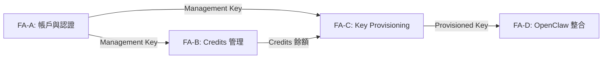

| 來源 FA | 目標 FA | 依賴類型 | 說明 |
|---------|---------|---------|------|
| FA-A | FA-B | 資料共用 | Credits 操作需要已認證的 Management Key |
| FA-A | FA-C | 資料共用 | Key provisioning 需要已認證的 Management Key |
| FA-B | FA-C | 資料共用 | 建立 key 時可設定 credit limit，需知道可用餘額 |
| FA-C | FA-D | 資料共用 | 整合需要已建立的 provisioned API key |

---

### 4.1 系統架構總覽

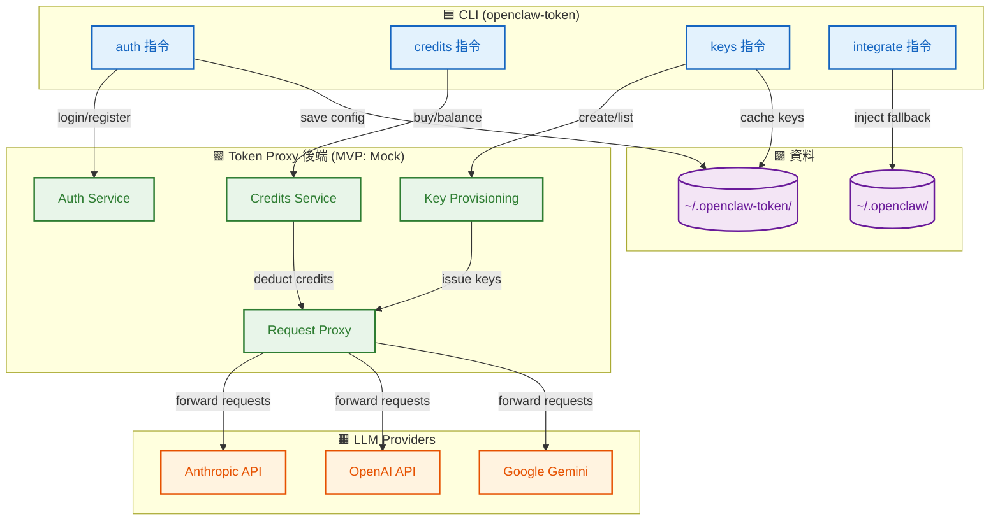

**架構重點**：

| 層級 | 組件 | 職責 |
|------|------|------|
| **CLI** | `openclaw-token` | 用戶介面，所有操作的入口 |
| **後端** | Token Proxy（MVP 用 mock） | 帳戶管理、credit 計費、key provisioning、request 轉發 |
| **第三方** | LLM Providers | 實際執行 inference，proxy 轉發請求到這些 provider |
| **資料** | `~/.openclaw-token/` + `~/.openclaw/` | 本地 config 持久化 + OpenClaw agent config |

---

### 4.2 FA-A: 帳戶與認證

#### 4.2.1 全局流程圖

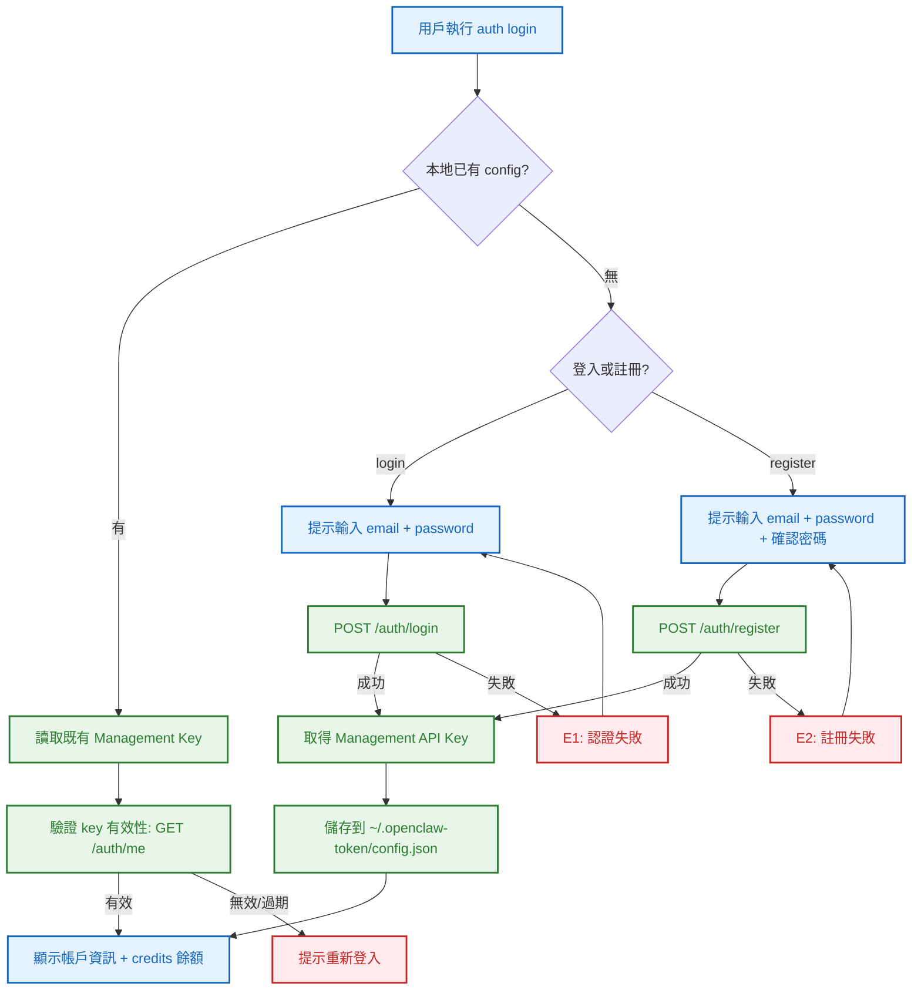

**技術細節補充**：
- Config 儲存路徑：`~/.openclaw-token/config.json`（與 OpenClaw 的 `~/.openclaw/` 分離）
- Management API Key 類似 OpenRouter 的概念：用於管理操作（查餘額、建 key），不能直接做 inference
- 支援環境變數 `OPENCLAW_TOKEN_KEY` 覆蓋 config

#### 4.2.2 登出與 whoami（局部）

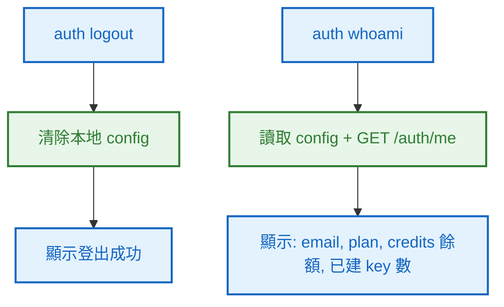

#### 4.2.N Happy Path 摘要

| 路徑 | 入口 | 結果 |
|------|------|------|
| **A：首次註冊** | `auth register` → 輸入 email/password → 驗證通過 | 帳戶建立，Management Key 已儲存 |
| **B：登入** | `auth login` → 輸入 email/password → 驗證通過 | Management Key 已儲存，顯示帳戶資訊 |
| **C：查看身份** | `auth whoami` | 顯示 email、plan、credits 餘額、key 數量 |
| **D：登出** | `auth logout` | 清除本地 config |

---

### 4.3 FA-B: Credits 管理

> 參考 OpenRouter credit 系統：credits 是 USD 計價的預付餘額，每次 API 呼叫按模型的 per-million-token 價格扣款。

#### 4.3.1 全局流程圖

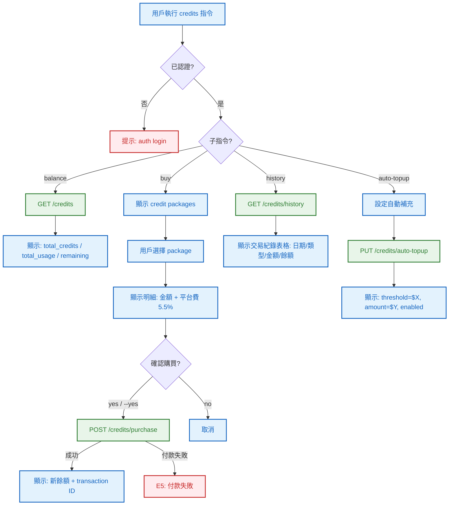

**技術細節補充**：
- Credits 以 USD 計價（如 OpenRouter），最小購買單位 $5
- 平台費：5.5%（最低 $0.80），參考 OpenRouter 定價模式
- Auto top-up：credits 低於 threshold 時自動購買指定金額（需預先綁定付款方式）
- 交易紀錄包含：購買（purchase）、消耗（usage）、退款（refund）

#### 4.3.2 購買確認子流程（局部）

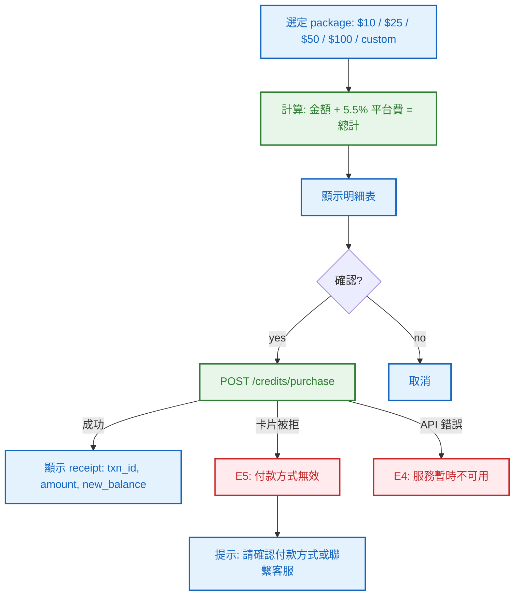

**Auto Top-up 設定**：
```
openclaw-token credits auto-topup --threshold 5 --amount 25 --enable
```
- `--threshold`：credits 低於此金額時觸發（USD）
- `--amount`：每次自動補充的金額（USD）
- `--enable` / `--disable`：啟用或停用

#### 4.3.N Happy Path 摘要

| 路徑 | 入口 | 結果 |
|------|------|------|
| **A：查餘額** | `credits balance` | 顯示 total / used / remaining（USD） |
| **B：購買 credits** | `credits buy --amount 25` → 確認 | 購買成功，credits +$25 |
| **C：交易紀錄** | `credits history` | 表格顯示所有交易 |
| **D：設定 auto top-up** | `credits auto-topup --threshold 5 --amount 25 --enable` | 自動補充已啟用 |

---

### 4.4 FA-C: API Key Provisioning

> 參考 OpenRouter Management API：programmatically 建立帶 credit limit 的 API key，供 OpenClaw agent 使用。

#### 4.4.1 全局流程圖

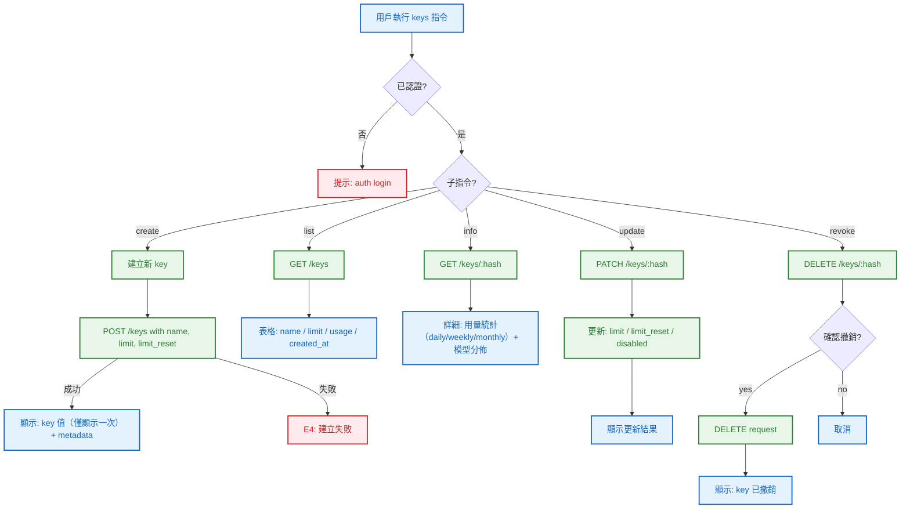

**技術細節補充**：
- Key 建立參數（參考 OpenRouter `/api/v1/keys`）：
  - `name`：識別名稱（必填）
  - `--limit`：credit 上限（USD，可選）
  - `--limit-reset`：重置頻率（daily / weekly / monthly，可選）
  - `--expires`：過期時間（ISO 8601，可選）
- Key 建立後 **僅顯示一次**，之後只能透過 hash 查看 metadata
- Provisioned key 可直接作為 OpenAI-compatible API key 使用（base URL 指向 proxy 服務）

#### 4.4.2 Key 用量查詢（局部）

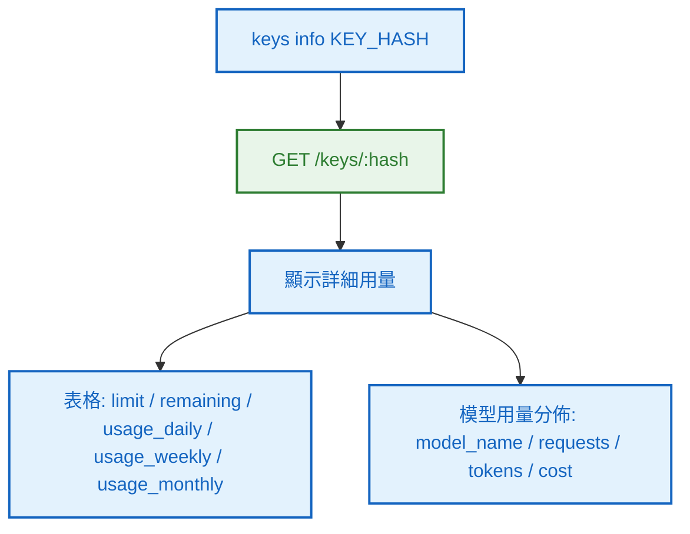

#### 4.4.N Happy Path 摘要

| 路徑 | 入口 | 結果 |
|------|------|------|
| **A：建立 key** | `keys create --name "my-agent" --limit 10 --limit-reset monthly` | 顯示 key 值 + metadata |
| **B：列出所有 key** | `keys list` | 表格顯示所有 key 的 name/limit/usage |
| **C：查看 key 詳情** | `keys info abc123` | 顯示用量統計 + 模型分佈 |
| **D：更新 key** | `keys update abc123 --limit 20` | limit 更新為 $20 |
| **E：撤銷 key** | `keys revoke abc123` → 確認 | key 已停用 |

---

### 4.5 FA-D: OpenClaw 整合

> 一鍵將 provisioned API key 注入 OpenClaw 的 model fallback chain，實現無感 fallback。

#### 4.5.1 全局流程圖

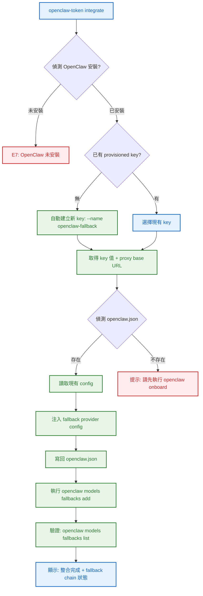

**技術細節補充**：
- 偵測 OpenClaw：檢查 `which openclaw` 和 `~/.openclaw/` 目錄
- 注入內容（寫入 `openclaw.json` 的 `models.providers`）：

```json5
{
  "openclaw-token-fallback": {
    "api": "openai-completions",
    "baseUrl": "https://proxy.openclaw-token.dev/v1",
    "authMode": "api-key"
    // key 存入 auth-profiles.json
  }
}
```

- 同時呼叫 `openclaw models fallbacks add openclaw-token-fallback/anthropic/claude-sonnet-4-5`
- 用戶可自選要 fallback 到哪些模型

#### 4.5.2 移除整合（局部）

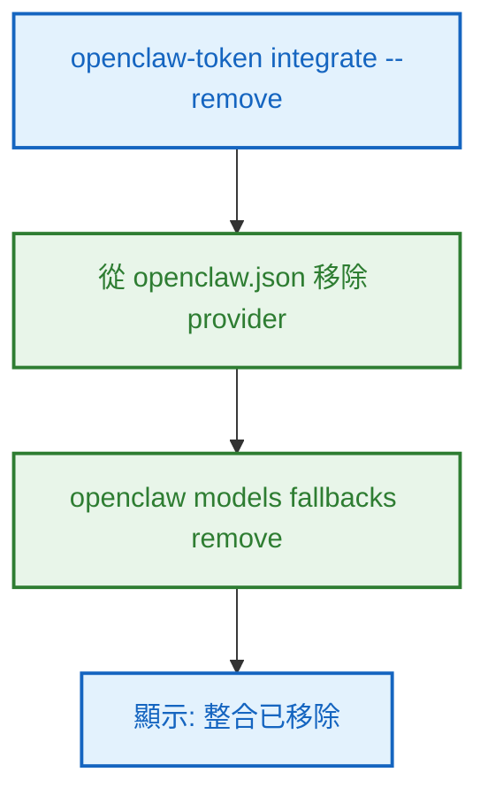

#### 4.5.N Happy Path 摘要

| 路徑 | 入口 | 結果 |
|------|------|------|
| **A：一鍵整合** | `integrate` | Provisioned key 已注入 OpenClaw fallback chain |
| **B：移除整合** | `integrate --remove` | 從 OpenClaw config 移除 fallback provider |
| **C：查看整合狀態** | `integrate --status` | 顯示目前整合狀態 + fallback chain |

---

### 4.6 例外流程圖

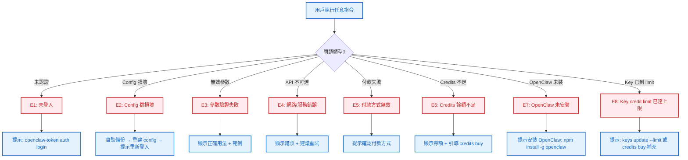

### 4.7 六維度例外清單

| 維度 | ID | FA | 情境 | 觸發條件 | 預期行為 | 嚴重度 |
|------|-----|-----|------|---------|---------|--------|
| 並行/競爭 | E1 | FA-B | 多 terminal 同時購買 credits | 兩個 session 同時 POST /credits/purchase | 後端冪等（transaction ID），CLI 端不需處理 | P2 |
| 並行/競爭 | E2 | FA-C | 同時建立同名 key | 兩個 session 同時 POST /keys with same name | 後端回傳 409 Conflict，CLI 顯示「名稱已存在」 | P2 |
| 狀態轉換 | E3 | FA-A | Management Key 在操作中被撤銷 | 其他 session 撤銷了正在使用的 key | API 回傳 401，CLI 提示重新登入 | P1 |
| 狀態轉換 | E4 | FA-D | 整合過程中 OpenClaw config 被外部修改 | 寫回 openclaw.json 時內容已變 | 讀取→修改→寫回使用 atomic write，衝突時提示手動處理 | P1 |
| 資料邊界 | E5 | 全域 | 無效參數：負數 limit、空 name、超長字串 | 用戶輸入不合法值 | CLI 端驗證，顯示明確錯誤 + 正確範例 | P1 |
| 網路/外部 | E6 | 全域 | API 不可達、超時、回傳非預期格式 | 網路斷線或後端維護 | 友善錯誤訊息 + 建議重試，timeout 10s | P1 |
| 業務邏輯 | E7 | FA-B | Credits 餘額不足 | 購買時帳戶餘額不夠 or key usage 超過 limit | 顯示當前餘額 + 購買引導 | P1 |
| 業務邏輯 | E8 | FA-C | Provisioned key credit limit 已用完 | Agent 請求被 proxy 拒絕（402） | Agent 端收到 402 → OpenClaw fallback 機制跳到下一個 provider | P0 |
| UI/體驗 | — | — | ➖ 不適用：CLI 工具無 Loading 狀態切頁問題 | — | — | — |

### 4.8 白話文摘要

這個 CLI 讓 OpenClaw 用戶可以提前購買一筆「備用額度」（credits），然後拿到一把專用的 API key。這把 key 設定在 OpenClaw 的 fallback chain 裡，當用戶原本的 API key（Anthropic、OpenAI 等）額度用完時，agent 會自動切換到這個備用 key 繼續運作，不會中斷任務。

如果備用額度也快用完了，可以設定自動補充（auto top-up），系統會在低於設定金額時自動購買。整個流程都在 terminal 完成，不需要切換到瀏覽器。

最壞情況是所有額度都用完且 auto top-up 未啟用，此時 agent 會收到 402 錯誤，OpenClaw 的 fallback 機制會嘗試下一個 provider；如果沒有更多 fallback，agent 才會停止。

## 5. 成功標準

| # | FA | 類別 | 標準 | 驗證方式 |
|---|-----|------|------|---------|
| 1 | FA-A | 功能 | 可註冊帳戶並取得 Management Key | `auth register` → `auth whoami` 顯示帳戶資訊 |
| 2 | FA-A | 功能 | 支援環境變數 `OPENCLAW_TOKEN_KEY` 覆蓋 config | 設定 env var 後操作成功 |
| 3 | FA-B | 功能 | 可查詢 credits 餘額 | `credits balance` 顯示 total/used/remaining |
| 4 | FA-B | 功能 | 可購買 credits（含平台費計算） | `credits buy --amount 25` → 確認 → 餘額增加 |
| 5 | FA-B | 功能 | 可設定 auto top-up | `credits auto-topup --threshold 5 --amount 25 --enable` 成功 |
| 6 | FA-B | 功能 | 可查看交易紀錄 | `credits history` 顯示表格 |
| 7 | FA-C | 功能 | 可建立帶 credit limit 的 provisioned key | `keys create --name test --limit 10` 回傳 key 值 |
| 8 | FA-C | 功能 | 可列出/查看/更新/撤銷 key | `keys list`, `keys info`, `keys update`, `keys revoke` 都能正確執行 |
| 9 | FA-D | 功能 | 可一鍵注入 OpenClaw fallback chain | `integrate` → `openclaw models fallbacks list` 顯示新 provider |
| 10 | FA-D | 功能 | 可移除整合 | `integrate --remove` → fallback chain 不再包含 provider |
| 11 | 全域 | 健壯性 | 所有 API 錯誤有友善錯誤訊息 | 模擬各種 API 失敗，CLI 不 crash 且顯示明確訊息 |
| 12 | 全域 | DX | `--help` 在每個指令層級完整 + `--json` 輸出 | 執行各指令 `--help` 和 `--json` 驗證 |

## 6. 範圍

### 範圍內
- **FA-A**: 帳戶註冊/登入、Management Key 管理、config 持久化、環境變數支援
- **FA-B**: Credits 購買（含平台費計算）、餘額查詢、auto top-up 設定、交易紀錄
- **FA-C**: Provisioned API key 的 CRUD（建立/列出/查看/更新/撤銷）、credit limit + reset
- **FA-D**: 自動偵測 OpenClaw → 注入 fallback provider → 驗證 fallback chain

### 範圍外
- **Proxy 服務本身**：本次只做 CLI 客戶端，後端 proxy 用 mock 模擬（未來另開 SOP）
- **真實付款整合**：Stripe/信用卡由後端處理，CLI 只送 purchase request
- **Web Dashboard**：本次只做 CLI
- **模型定價管理**：per-model pricing 由後端維護
- **Agent runtime**：不修改 OpenClaw 核心，只操作其 config 和 CLI

## 7. 已知限制與約束

- **Greenfield 專案**，無既有 codebase
- **MVP 用 mock backend**：所有 API 呼叫先用內建 mock 模擬（`--mock` flag 或 `OPENCLAW_TOKEN_MOCK=1`）
- **技術棧**：Node.js + TypeScript + Commander.js
- **Config 路徑**：`~/.openclaw-token/`（不污染 OpenClaw 的 `~/.openclaw/`）
- **API 設計參考 OpenRouter**：endpoint 命名、credit 系統、key provisioning 參數
- **Proxy base URL**：MVP 設為 `https://proxy.openclaw-token.dev/v1`（佔位，未來替換）
- **OpenClaw 整合依賴**：需要 `openclaw` CLI 已安裝且已執行 `onboard`

## 8. 前端 UI 畫面清單

> 本功能為純 CLI 工具，無前端 UI 畫面。省略此節。

## 9. 補充說明

### CLI 指令結構（完整）

```
openclaw-token
├── auth
│   ├── register       # 註冊新帳戶
│   ├── login          # 登入（email + password）
│   ├── logout         # 登出（清除本地 config）
│   └── whoami         # 查看當前帳戶資訊 + credits 摘要
├── credits
│   ├── balance        # 查詢 credits 餘額（total/used/remaining）
│   ├── buy            # 購買 credits（--amount, --yes）
│   ├── history        # 交易紀錄（--limit, --offset, --type）
│   └── auto-topup     # 設定自動補充（--threshold, --amount, --enable/--disable）
├── keys
│   ├── create         # 建立 provisioned API key（--name, --limit, --limit-reset, --expires）
│   ├── list           # 列出所有 key
│   ├── info           # 查看 key 詳情 + 用量統計（KEY_HASH）
│   ├── update         # 更新 key 設定（KEY_HASH, --limit, --limit-reset, --disabled）
│   └── revoke         # 撤銷 key（KEY_HASH, --yes）
└── integrate
    ├── (default)      # 一鍵注入 OpenClaw fallback chain
    ├── --remove       # 移除整合
    └── --status       # 查看整合狀態
```

### 全域 flags

| Flag | 說明 |
|------|------|
| `--json` | 所有指令支援 JSON 輸出 |
| `--mock` | 使用內建 mock backend（等同 `OPENCLAW_TOKEN_MOCK=1`） |
| `--no-color` | 關閉 ANSI 顏色（等同 `NO_COLOR=1`） |
| `--verbose` | 顯示 debug 資訊（request/response） |
| `--help` | 顯示用法說明 |
| `--version` | 顯示版本號 |

### Mock API 設計（參考 OpenRouter API）

| Method | Path | 說明 | 對應 FA |
|--------|------|------|---------|
| POST | `/auth/register` | 註冊帳戶 | FA-A |
| POST | `/auth/login` | 登入取得 Management Key | FA-A |
| GET | `/auth/me` | 查看帳戶資訊 | FA-A |
| GET | `/credits` | 查詢 credits（total_credits, total_usage） | FA-B |
| POST | `/credits/purchase` | 購買 credits | FA-B |
| GET | `/credits/history` | 交易紀錄 | FA-B |
| GET | `/credits/auto-topup` | 查詢 auto top-up 設定 | FA-B |
| PUT | `/credits/auto-topup` | 更新 auto top-up 設定 | FA-B |
| POST | `/keys` | 建立 provisioned API key | FA-C |
| GET | `/keys` | 列出所有 key | FA-C |
| GET | `/keys/:hash` | 查看 key 詳情 | FA-C |
| PATCH | `/keys/:hash` | 更新 key | FA-C |
| DELETE | `/keys/:hash` | 撤銷 key | FA-C |

### 與 OpenRouter 的模式對照

| 概念 | OpenRouter | 本 CLI |
|------|-----------|--------|
| 帳戶 | openrouter.ai 帳戶 | openclaw-token 帳戶 |
| Credits | 預付 USD 餘額 | 預付 USD 餘額 |
| 平台費 | 5.5%（min $0.80） | 5.5%（min $0.80），可調 |
| Management Key | 管理操作用 key | 管理操作用 key |
| Provisioned Key | 帶 limit 的 API key | 帶 limit 的 API key，注入 OpenClaw fallback |
| Auto top-up | 低於 threshold 自動補充 | 低於 threshold 自動補充 |
| Proxy | OpenRouter 轉發到 provider | Token proxy 轉發到 provider |
| 整合方式 | 改 base URL 即可 | 一鍵 `integrate` 注入 OpenClaw config |

---

## 10. SDD Context

```json
{
  "sdd_context": {
    "version": "2.2.1",
    "feature": "openclaw-token-cli",
    "spec_mode": "full_spec",
    "spec_folder": "dev/specs/2026-03-14_1_openclaw-token-cli",
    "work_type": "new_feature",
    "status": "in_progress",
    "execution_mode": "autopilot",
    "current_stage": "S0",
    "started_at": "2026-03-14T21:15:00+08:00",
    "last_updated": "2026-03-14T21:30:00+08:00",
    "last_updated_by": "claude",
    "failed_approaches": [],
    "stages": {
      "s0": {
        "status": "pending_confirmation",
        "agent": "requirement-analyst",
        "output": {
          "brief_spec_path": "dev/specs/2026-03-14_1_openclaw-token-cli/s0_brief_spec.md",
          "work_type": "new_feature",
          "requirement": "建立 credit-based API proxy CLI 客戶端，讓 OpenClaw 用戶預購 credits、取得 provisioned API key 作為 agent fallback token provider",
          "pain_points": [
            "Agent 所有 API key 額度用完時完全停擺",
            "缺乏統一的 credit pool 作為最後一道 fallback 防線",
            "補充 API credits 需分別到各 provider 平台操作"
          ],
          "goal": "提供 CLI 客戶端管理 credits、provisioning API keys，一鍵整合 OpenClaw fallback chain",
          "success_criteria": [
            "可註冊/登入帳戶並管理 Management Key",
            "可購買 credits 並設定 auto top-up",
            "可建立帶 credit limit 的 provisioned API key",
            "可一鍵注入 OpenClaw fallback chain",
            "所有 API 錯誤有友善訊息"
          ],
          "scope_in": [
            "FA-A: 帳戶註冊/登入、Management Key 管理",
            "FA-B: Credits 購買、餘額查詢、auto top-up、交易紀錄",
            "FA-C: Provisioned API key CRUD + credit limit",
            "FA-D: OpenClaw fallback chain 整合"
          ],
          "scope_out": [
            "Proxy 服務後端（用 mock）",
            "真實付款整合（Stripe）",
            "Web Dashboard",
            "模型定價管理",
            "Agent runtime 修改"
          ],
          "constraints": [
            "Greenfield 專案",
            "MVP 用 mock backend",
            "Node.js + TypeScript + Commander.js",
            "API 設計參考 OpenRouter"
          ],
          "functional_areas": [
            {
              "id": "FA-A",
              "name": "帳戶與認證",
              "description": "註冊/登入帳戶、Management Key 管理、config 持久化",
              "independence": "high"
            },
            {
              "id": "FA-B",
              "name": "Credits 管理",
              "description": "購買 credits、查餘額、auto top-up、交易紀錄",
              "independence": "medium"
            },
            {
              "id": "FA-C",
              "name": "API Key Provisioning",
              "description": "建立/列出/查看/更新/撤銷帶 credit limit 的 provisioned key",
              "independence": "medium"
            },
            {
              "id": "FA-D",
              "name": "OpenClaw 整合",
              "description": "一鍵注入 provisioned key 到 OpenClaw fallback chain",
              "independence": "medium"
            }
          ],
          "decomposition_strategy": "single_sop_fa_labeled",
          "child_sops": []
        }
      },
      "s1": { "status": "pending" },
      "s2": { "status": "pending" },
      "s3": { "status": "pending" },
      "s4": { "status": "pending" },
      "s5": { "status": "pending" },
      "s6": { "status": "pending" },
      "s7": { "status": "pending" }
    }
  }
}
```
