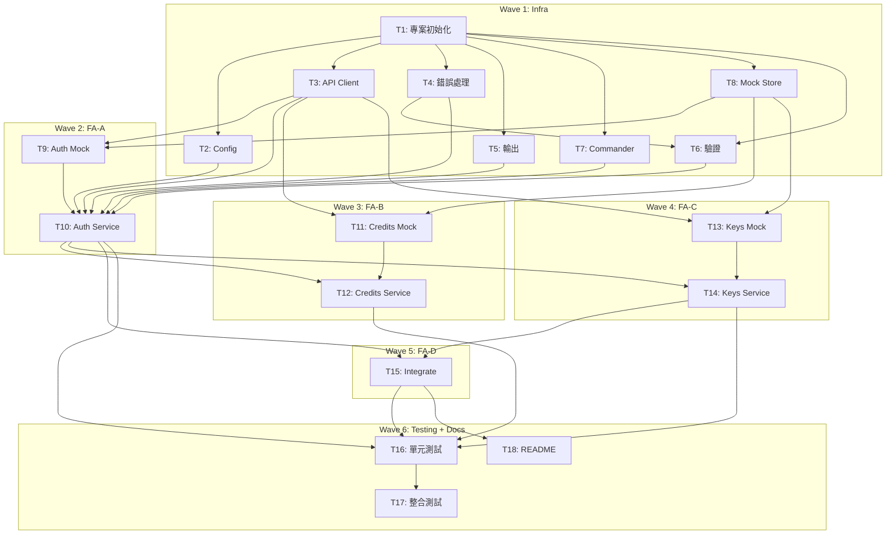

# S3 Implementation Plan: OpenClaw Token CLI

> **階段**: S3 執行計畫
> **建立時間**: 2026-03-14 22:30
> **Agent**: architect (orchestrator)
> **Spec Mode**: Full Spec

---

## 1. 概述

### 1.1 功能目標
CLI 客戶端管理 credits、provisioning API keys，一鍵整合 OpenClaw fallback chain。

### 1.2 實作範圍
- **範圍內**: FA-A 帳戶認證、FA-B Credits 管理、FA-C Key Provisioning、FA-D OpenClaw 整合
- **範圍外**: Proxy 後端、真實金流、Web Dashboard

### 1.3 關聯文件
| 文件 | 路徑 | 狀態 |
|------|------|------|
| Brief Spec | `./s0_brief_spec.md` | ✅ |
| Dev Spec | `./s1_dev_spec.md` | ✅ (S2 修正) |
| API Spec | `./s1_api_spec.md` | ✅ |
| Review Report | `./s2_review_report.md` | ✅ |
| Implementation Plan | `./s3_implementation_plan.md` | 📝 當前 |

---

## 2. 實作任務清單

### 2.1 任務總覽

| # | 任務 | FA | Agent | 依賴 | 複雜度 | TDD | 狀態 |
|---|------|----|-------|------|--------|-----|------|
| 1 | 專案初始化 | Infra | `frontend-developer` | - | S | ⛔ | ⬜ |
| 2 | Config 模組 | Infra | `frontend-developer` | #1 | M | ✅ | ⬜ |
| 3 | API Client | Infra | `frontend-developer` | #1 | M | ✅ | ⬜ |
| 4 | 錯誤處理模組 | Infra | `frontend-developer` | #1 | S | ✅ | ⬜ |
| 5 | 輸出模組 | Infra | `frontend-developer` | #1 | S | ✅ | ⬜ |
| 6 | 參數驗證模組 | Infra | `frontend-developer` | #1, #4 | S | ✅ | ⬜ |
| 7 | Commander 主程式 + 全域 flags | Infra | `frontend-developer` | #1 | S | ⛔ | ⬜ |
| 8 | Mock Store | Infra | `frontend-developer` | #1 | M | ✅ | ⬜ |
| 9 | Auth Mock Handlers | FA-A | `frontend-developer` | #3, #8 | M | ✅ | ⬜ |
| 10 | Auth Service + Commands | FA-A | `frontend-developer` | #2,#3,#4,#5,#6,#7,#9 | M | ✅ | ⬜ |
| 11 | Credits Mock Handlers | FA-B | `frontend-developer` | #3, #8 | M | ✅ | ⬜ |
| 12 | Credits Service + Commands | FA-B | `frontend-developer` | #10, #11 | L | ✅ | ⬜ |
| 13 | Keys Mock Handlers | FA-C | `frontend-developer` | #3, #8 | M | ✅ | ⬜ |
| 14 | Keys Service + Commands | FA-C | `frontend-developer` | #10, #13 | L | ✅ | ⬜ |
| 15 | Integrate Service + Command | FA-D | `frontend-developer` | #10, #14 | L | ✅ | ⬜ |
| 16 | 單元測試補齊 | 全域 | `test-engineer` | #10,#12,#14,#15 | M | ✅ | ⬜ |
| 17 | 整合測試 | 全域 | `test-engineer` | #16 | M | ✅ | ⬜ |
| 18 | README + Help 文案 | 全域 | `frontend-developer` | #15 | S | ⛔ | ⬜ |

---

## 3. 任務詳情

### Task #1: 專案初始化

**基本資訊**
| 項目 | 內容 |
|------|------|
| FA | Infra |
| Agent | `frontend-developer` |
| 複雜度 | S |
| 依賴 | - |
| 狀態 | ⬜ pending |

**描述**
初始化 Node.js + TypeScript 專案。設定 package.json（name: `openclaw-token`, bin entry）、tsconfig.json（strict mode, ES2022, NodeNext module）、vitest.config.ts、tsup.config.ts。建立 `bin/openclaw-token.ts` entry point with shebang。建立 `src/` 目錄結構。

**受影響檔案**
| 檔案 | 變更類型 | 說明 |
|------|---------|------|
| `package.json` | 新增 | 專案定義 + dependencies |
| `tsconfig.json` | 新增 | TypeScript 設定 |
| `vitest.config.ts` | 新增 | 測試框架設定 |
| `tsup.config.ts` | 新增 | 打包設定 |
| `bin/openclaw-token.ts` | 新增 | CLI entry point |
| `src/index.ts` | 新增 | 主程式骨架 |

**DoD**
- [ ] `npm install` 成功
- [ ] `npx tsc --noEmit` 無錯誤
- [ ] `npx vitest run` 可執行（0 test OK）
- [ ] `npx tsup` 可 build
- [ ] `bin/openclaw-token.ts` 可執行顯示 help

**TDD Plan**: N/A — 純 scaffolding，無可測邏輯

**驗證方式**
```bash
npm install && npx tsc --noEmit && npx vitest run && npx tsup
```

---

### Task #2: Config 模組

**基本資訊**
| 項目 | 內容 |
|------|------|
| FA | Infra |
| Agent | `frontend-developer` |
| 複雜度 | M |
| 依賴 | #1 |
| 狀態 | ⬜ pending |

**描述**
Config 讀寫 + atomic write + 環境變數優先序。`ConfigManager.resolve()` 合併 env vars + config.json。

**受影響檔案**
| 檔案 | 變更類型 | 說明 |
|------|---------|------|
| `src/config/paths.ts` | 新增 | CONFIG_DIR, CONFIG_FILE 常數 |
| `src/config/schema.ts` | 新增 | zod schema + TS 型別 |
| `src/config/manager.ts` | 新增 | read/write/delete/resolve + atomic write |
| `src/utils/fs.ts` | 新增 | Atomic write utility |

**DoD**
- [ ] `ConfigManager.read()` 可讀取 config，不存在時回傳 null
- [ ] `ConfigManager.write()` 使用 atomic write（先寫 temp 再 rename）
- [ ] `ConfigManager.delete()` 清除 config 檔案
- [ ] `ConfigManager.resolve()` 合併 env vars + config.json，按優先序回傳最終值
- [ ] `OPENCLAW_TOKEN_KEY` 環境變數覆蓋 management_key（無 config 也可用）
- [ ] `OPENCLAW_TOKEN_CONFIG_DIR` 支援
- [ ] Config schema 驗證無效格式時拋出明確錯誤

**TDD Plan**
| 項目 | 內容 |
|------|------|
| 測試檔案 | `tests/unit/config/manager.test.ts` |
| 測試指令 | `npx vitest run tests/unit/config` |
| 預期失敗測試 | read_returns_null_when_no_config, write_uses_atomic_write, delete_removes_config, resolve_env_overrides_config, env_key_works_without_config, schema_rejects_invalid |

**驗證方式**
```bash
npx vitest run tests/unit/config
```

---

### Task #3: API Client

**基本資訊**
| 項目 | 內容 |
|------|------|
| FA | Infra |
| Agent | `frontend-developer` |
| 複雜度 | M |
| 依賴 | #1 |
| 狀態 | ⬜ pending |

**描述**
Axios instance factory，支援 mock/real 切換。Request interceptor 附加 Authorization header。Response interceptor 統一錯誤轉換。

**受影響檔案**
| 檔案 | 變更類型 | 說明 |
|------|---------|------|
| `src/api/client.ts` | 新增 | createApiClient factory |
| `src/api/endpoints.ts` | 新增 | Endpoint path 常數 |
| `src/api/types.ts` | 新增 | Request/Response 型別 |

**DoD**
- [ ] `createApiClient({ mock: true })` 回傳 mock adapter client
- [ ] `createApiClient({ mock: false, baseURL, token })` 回傳 real client
- [ ] Request interceptor 自動加 Authorization header
- [ ] Response interceptor 將 4xx/5xx 轉為 `APIError`
- [ ] Timeout 設為 10 秒
- [ ] 所有 endpoint path 常數化
- [ ] Request/Response 型別完整定義（依 s1_api_spec.md）

**TDD Plan**
| 項目 | 內容 |
|------|------|
| 測試檔案 | `tests/unit/api/client.test.ts` |
| 測試指令 | `npx vitest run tests/unit/api` |
| 預期失敗測試 | mock_client_routes_to_handler, real_client_sets_base_url, auth_header_attached, error_interceptor_converts_4xx, timeout_is_10s |

**驗證方式**
```bash
npx vitest run tests/unit/api
```

---

### Task #4: 錯誤處理模組

**基本資訊**
| 項目 | 內容 |
|------|------|
| FA | Infra |
| Agent | `frontend-developer` |
| 複雜度 | S |
| 依賴 | #1 |
| 狀態 | ⬜ pending |

**描述**
CLIError base class + API error mapping + 錯誤訊息常數。

**受影響檔案**
| 檔案 | 變更類型 | 說明 |
|------|---------|------|
| `src/errors/base.ts` | 新增 | CLIError class |
| `src/errors/api.ts` | 新增 | HTTP status → CLIError mapping |
| `src/errors/messages.ts` | 新增 | 錯誤訊息常數 |

**DoD**
- [ ] `CLIError` 包含 message, exitCode, suggestion 欄位
- [ ] 401 → "Session expired" + 建議重新登入
- [ ] 402 → "Insufficient credits" + 建議購買
- [ ] 409 → "Resource conflict" + 具體描述
- [ ] 410 → "This key has already been revoked."
- [ ] Network error → "Cannot reach API" + 建議重試
- [ ] 所有錯誤訊息定義為常數

**TDD Plan**
| 項目 | 內容 |
|------|------|
| 測試檔案 | `tests/unit/errors/api.test.ts` |
| 測試指令 | `npx vitest run tests/unit/errors` |
| 預期失敗測試 | maps_401_to_session_expired, maps_402_to_insufficient_credits, maps_409_to_conflict, maps_410_to_already_revoked, maps_network_error |

**驗證方式**
```bash
npx vitest run tests/unit/errors
```

---

### Task #5: 輸出模組

**基本資訊**
| 項目 | 內容 |
|------|------|
| FA | Infra |
| Agent | `frontend-developer` |
| 複雜度 | S |
| 依賴 | #1 |
| 狀態 | ⬜ pending |

**描述**
統一 output 函式（json / human-readable 切換）、cli-table3 封裝、ora spinner 封裝。

**受影響檔案**
| 檔案 | 變更類型 | 說明 |
|------|---------|------|
| `src/output/formatter.ts` | 新增 | output() 函式 |
| `src/output/table.ts` | 新增 | createTable() 封裝 |
| `src/output/spinner.ts` | 新增 | withSpinner() 封裝 |

**DoD**
- [ ] `output(data, { json: true })` → JSON string
- [ ] `output(data, { json: false })` → 格式化文字
- [ ] `createTable(headers, rows)` → 對齊表格
- [ ] `withSpinner(text, asyncFn)` → 自動 start/stop/fail
- [ ] `--no-color` 和 `NO_COLOR=1` 正確停用顏色

**TDD Plan**
| 項目 | 內容 |
|------|------|
| 測試檔案 | `tests/unit/output/formatter.test.ts` |
| 測試指令 | `npx vitest run tests/unit/output` |
| 預期失敗測試 | json_mode_outputs_valid_json, human_mode_outputs_formatted, table_aligns_columns, no_color_disables_ansi |

**驗證方式**
```bash
npx vitest run tests/unit/output
```

---

### Task #6: 參數驗證模組

**基本資訊**
| 項目 | 內容 |
|------|------|
| FA | Infra |
| Agent | `frontend-developer` |
| 複雜度 | S |
| 依賴 | #1, #4 |
| 狀態 | ⬜ pending |

**描述**
Zod schemas for CLI params + auth-guard middleware。

**受影響檔案**
| 檔案 | 變更類型 | 說明 |
|------|---------|------|
| `src/utils/validation.ts` | 新增 | Zod schemas |
| `src/utils/auth-guard.ts` | 新增 | requireAuth() |

**DoD**
- [ ] Email 驗證（格式合法）
- [ ] Amount 驗證（>= 5, 數字）
- [ ] Key name 驗證（1-100 chars, alphanumeric + dash）
- [ ] Credit limit 驗證（>= 0 或 null）
- [ ] `requireAuth()` — 無 config 時拋出帶建議的 CLIError
- [ ] `requireAuth()` — 有 config 或 env var 時回傳 management_key

**TDD Plan**
| 項目 | 內容 |
|------|------|
| 測試檔案 | `tests/unit/utils/validation.test.ts` |
| 測試指令 | `npx vitest run tests/unit/utils` |
| 預期失敗測試 | valid_email_passes, invalid_email_fails, amount_below_5_fails, key_name_valid, key_name_too_long_fails, require_auth_throws_without_config, require_auth_returns_key_with_env |

**驗證方式**
```bash
npx vitest run tests/unit/utils
```

---

### Task #7: Commander 主程式 + 全域 flags

**基本資訊**
| 項目 | 內容 |
|------|------|
| FA | Infra |
| Agent | `frontend-developer` |
| 複雜度 | S |
| 依賴 | #1 |
| 狀態 | ⬜ pending |

**描述**
Commander program 定義 + 全域 flags（--json, --mock, --no-color, --verbose）+ 全域 error handler。Verbose 輸出 API call 摘要到 stderr，Authorization header 自動遮蔽。

**受影響檔案**
| 檔案 | 變更類型 | 說明 |
|------|---------|------|
| `src/index.ts` | 修改 | 完整 Commander program |
| `bin/openclaw-token.ts` | 修改 | import + run |

**DoD**
- [ ] `openclaw-token --version` 顯示版本
- [ ] `openclaw-token --help` 顯示所有子指令
- [ ] 全域 flags 可在任何子指令使用
- [ ] 未知指令顯示建議
- [ ] 全域 error handler 正確 catch 並格式化錯誤
- [ ] `--verbose` 輸出 API call 摘要到 stderr，Authorization 遮蔽

**TDD Plan**: N/A — CLI wiring，驗證靠手動 + 整合測試（Task #17）

**驗證方式**
```bash
npx tsx bin/openclaw-token.ts --version
npx tsx bin/openclaw-token.ts --help
```

---

### Task #8: Mock Store

**基本資訊**
| 項目 | 內容 |
|------|------|
| FA | Infra |
| Agent | `frontend-developer` |
| 複雜度 | M |
| 依賴 | #1 |
| 狀態 | ⬜ pending |

**描述**
In-memory mock data store + mock request router。Stateless demo account 策略：任何 `sk-mgmt-<uuid>` 格式 token 視為有效認證。

**受影響檔案**
| 檔案 | 變更類型 | 說明 |
|------|---------|------|
| `src/mock/store.ts` | 新增 | MockStore class |
| `src/mock/handler.ts` | 新增 | MockRouter |

**DoD**
- [ ] MockStore 包含 users / credits / transactions / keys 四個 Map
- [ ] 預設初始化含 demo 帳戶（email: demo@openclaw.dev, credits: $100.00）
- [ ] Mock 認證：任何 `sk-mgmt-<uuid>` 格式 token 視為有效
- [ ] MockRouter 根據 `{ method, path, body, headers }` 路由到 handler
- [ ] 不匹配的路由回傳 404
- [ ] Store 支援 reset（測試用）

**TDD Plan**
| 項目 | 內容 |
|------|------|
| 測試檔案 | `tests/unit/mock/store.test.ts` |
| 測試指令 | `npx vitest run tests/unit/mock` |
| 預期失敗測試 | store_has_demo_account, valid_token_format_accepted, invalid_token_rejected, router_dispatches_by_method_path, unknown_route_returns_404, store_reset_clears_data |

**驗證方式**
```bash
npx vitest run tests/unit/mock
```

---

### Task #9: Auth Mock Handlers

**基本資訊**
| 項目 | 內容 |
|------|------|
| FA | FA-A |
| Agent | `frontend-developer` |
| 複雜度 | M |
| 依賴 | #3, #8 |
| 狀態 | ⬜ pending |

**描述**
Mock handlers for POST /auth/register, POST /auth/login, GET /auth/me。按 s1_api_spec.md 實作。

**受影響檔案**
| 檔案 | 變更類型 | 說明 |
|------|---------|------|
| `src/mock/handlers/auth.mock.ts` | 新增 | Auth mock handlers |

**DoD**
- [ ] POST /auth/register — 201 + management_key（`sk-mgmt-<uuid>`）；重複 email：409
- [ ] POST /auth/login — 200 + management_key；密碼錯：401
- [ ] GET /auth/me — token 符合格式：200 + demo 帳戶資訊；格式不符：401
- [ ] Response 格式符合 api_spec（`{ data: {...} }`）

**TDD Plan**
| 項目 | 內容 |
|------|------|
| 測試檔案 | `tests/unit/mock/handlers/auth.mock.test.ts` |
| 測試指令 | `npx vitest run tests/unit/mock/handlers` |
| 預期失敗測試 | register_success_201, register_duplicate_409, login_success_200, login_wrong_password_401, me_valid_token_200, me_no_token_401 |

**驗證方式**
```bash
npx vitest run tests/unit/mock/handlers/auth
```

---

### Task #10: Auth Service + Commands

**基本資訊**
| 項目 | 內容 |
|------|------|
| FA | FA-A |
| Agent | `frontend-developer` |
| 複雜度 | M |
| 依賴 | #2, #3, #4, #5, #6, #7, #9 |
| 狀態 | ⬜ pending |

**描述**
Auth service（register, login, logout, whoami）+ Commander 子指令（含 inquirer 互動式 prompt）。

**受影響檔案**
| 檔案 | 變更類型 | 說明 |
|------|---------|------|
| `src/services/auth.service.ts` | 新增 | Auth 業務邏輯 |
| `src/commands/auth.ts` | 新增 | Commander 子指令 |

**DoD**
- [ ] `auth register` — 互動式 email/password → 註冊 → config 儲存
- [ ] `auth login` — 互動式 email/password → 登入 → config 儲存
- [ ] `auth logout` — 清除 config
- [ ] `auth whoami` — 顯示 email, plan, credits, keys count
- [ ] 支援 `OPENCLAW_TOKEN_KEY` 環境變數
- [ ] `--json` 模式輸出 JSON
- [ ] 錯誤訊息友善

**TDD Plan**
| 項目 | 內容 |
|------|------|
| 測試檔案 | `tests/unit/services/auth.service.test.ts` |
| 測試指令 | `npx vitest run tests/unit/services/auth` |
| 預期失敗測試 | register_saves_config, login_updates_config, logout_deletes_config, whoami_returns_account_info, env_var_overrides_config |

**驗證方式**
```bash
npx vitest run tests/unit/services/auth
```

---

### Task #11: Credits Mock Handlers

**基本資訊**
| 項目 | 內容 |
|------|------|
| FA | FA-B |
| Agent | `frontend-developer` |
| 複雜度 | M |
| 依賴 | #3, #8 |
| 狀態 | ⬜ pending |

**描述**
Mock handlers for credits endpoints。含平台費計算 + idempotency key 支援。

**受影響檔案**
| 檔案 | 變更類型 | 說明 |
|------|---------|------|
| `src/mock/handlers/credits.mock.ts` | 新增 | Credits mock handlers |

**DoD**
- [ ] GET /credits — 回傳 total_credits, total_usage, remaining
- [ ] POST /credits/purchase — 5.5% 平台費（min $0.80）+ idempotency key
- [ ] GET /credits/history — 分頁 + type 過濾
- [ ] GET/PUT /credits/auto-topup — 查詢/更新設定

**TDD Plan**
| 項目 | 內容 |
|------|------|
| 測試檔案 | `tests/unit/mock/handlers/credits.mock.test.ts` |
| 測試指令 | `npx vitest run tests/unit/mock/handlers/credits` |
| 預期失敗測試 | get_credits_returns_balance, purchase_calculates_fee, purchase_idempotency, history_pagination, auto_topup_crud |

---

### Task #12: Credits Service + Commands

**基本資訊**
| 項目 | 內容 |
|------|------|
| FA | FA-B |
| Agent | `frontend-developer` |
| 複雜度 | L |
| 依賴 | #10, #11 |
| 狀態 | ⬜ pending |

**描述**
Credits service + Commander 子指令。Buy 含確認流程。

**受影響檔案**
| 檔案 | 變更類型 | 說明 |
|------|---------|------|
| `src/services/credits.service.ts` | 新增 | Credits 業務邏輯 |
| `src/commands/credits.ts` | 新增 | Commander 子指令 |

**DoD**
- [ ] `credits balance` — 表格顯示 total / used / remaining
- [ ] `credits buy --amount 25` — 顯示明細 → 確認 → 購買
- [ ] `credits buy --amount 25 --yes` — 跳過確認
- [ ] `credits history` — 表格 + 分頁 + 類型過濾
- [ ] `credits auto-topup` — 查詢/設定/停用
- [ ] 金額驗證 >= $5
- [ ] 所有支援 `--json`

**TDD Plan**
| 項目 | 內容 |
|------|------|
| 測試檔案 | `tests/unit/services/credits.service.test.ts` |
| 測試指令 | `npx vitest run tests/unit/services/credits` |
| 預期失敗測試 | balance_returns_credits, buy_includes_platform_fee, buy_rejects_below_minimum, history_filters_by_type, auto_topup_enable_disable |

---

### Task #13: Keys Mock Handlers

**基本資訊**
| 項目 | 內容 |
|------|------|
| FA | FA-C |
| Agent | `frontend-developer` |
| 複雜度 | M |
| 依賴 | #3, #8 |
| 狀態 | ⬜ pending |

**描述**
Mock handlers for keys CRUD。key 建立生成 `sk-prov-` 開頭 + hash。支援 409 同名 + 410 已撤銷。

**受影響檔案**
| 檔案 | 變更類型 | 說明 |
|------|---------|------|
| `src/mock/handlers/keys.mock.ts` | 新增 | Keys mock handlers |

**DoD**
- [ ] POST /keys — 201 + key 值；同名：409
- [ ] GET /keys — 列出所有 key（不含 key 值）
- [ ] GET /keys/:hash — 詳情 + usage
- [ ] PATCH /keys/:hash — 更新 limit/disabled
- [ ] DELETE /keys/:hash — 200 revoked；已撤銷：410

**TDD Plan**
| 項目 | 內容 |
|------|------|
| 測試檔案 | `tests/unit/mock/handlers/keys.mock.test.ts` |
| 測試指令 | `npx vitest run tests/unit/mock/handlers/keys` |
| 預期失敗測試 | create_key_201, create_duplicate_name_409, list_keys, get_key_detail, update_key, revoke_key, revoke_already_revoked_410 |

---

### Task #14: Keys Service + Commands

**基本資訊**
| 項目 | 內容 |
|------|------|
| FA | FA-C |
| Agent | `frontend-developer` |
| 複雜度 | L |
| 依賴 | #10, #13 |
| 狀態 | ⬜ pending |

**描述**
Keys service + Commander 子指令。Create 強調 key 值僅顯示一次。Revoke 需確認。

**受影響檔案**
| 檔案 | 變更類型 | 說明 |
|------|---------|------|
| `src/services/keys.service.ts` | 新增 | Keys 業務邏輯 |
| `src/commands/keys.ts` | 新增 | Commander 子指令 |

**DoD**
- [ ] `keys create --name my-agent --limit 10` — 顯示 key + 警告
- [ ] `keys list` — 表格
- [ ] `keys info <hash>` — 詳情 + usage
- [ ] `keys update <hash> --limit 20` — 更新
- [ ] `keys revoke <hash>` — 確認 → 撤銷
- [ ] `keys revoke <hash> --yes` — 跳過確認
- [ ] 所有支援 `--json`

**TDD Plan**
| 項目 | 內容 |
|------|------|
| 測試檔案 | `tests/unit/services/keys.service.test.ts` |
| 測試指令 | `npx vitest run tests/unit/services/keys` |
| 預期失敗測試 | create_key_returns_full_value, list_keys_returns_array, get_key_info, update_key_limit, revoke_key |

---

### Task #15: Integrate Service + Command

**基本資訊**
| 項目 | 內容 |
|------|------|
| FA | FA-D |
| Agent | `frontend-developer` |
| 複雜度 | L |
| 依賴 | #10, #14 |
| 狀態 | ⬜ pending |

**描述**
偵測 OpenClaw 安裝 → 讀取/修改 openclaw.json → 注入 fallback provider → atomic write。

**受影響檔案**
| 檔案 | 變更類型 | 說明 |
|------|---------|------|
| `src/services/integrate.service.ts` | 新增 | 整合業務邏輯 |
| `src/commands/integrate.ts` | 新增 | Commander 子指令 |

**DoD**
- [ ] `integrate` — 偵測 OpenClaw → 選擇/建立 key → 注入 fallback → 驗證
- [ ] OpenClaw 未安裝時顯示安裝指引
- [ ] 無 provisioned key 時自動建立
- [ ] `integrate --remove` — 移除 fallback provider
- [ ] `integrate --status` — 顯示整合狀態
- [ ] Atomic write + 衝突偵測
- [ ] 支援 `--json`

**TDD Plan**
| 項目 | 內容 |
|------|------|
| 測試檔案 | `tests/unit/services/integrate.service.test.ts` |
| 測試指令 | `npx vitest run tests/unit/services/integrate` |
| 預期失敗測試 | detect_openclaw_installed, detect_openclaw_missing, inject_fallback_config, remove_fallback_config, status_shows_integration |

---

### Task #16: 單元測試補齊

**基本資訊**
| 項目 | 內容 |
|------|------|
| FA | 全域 |
| Agent | `test-engineer` |
| 複雜度 | M |
| 依賴 | #10, #12, #14, #15 |
| 狀態 | ⬜ pending |

**描述**
補齊各模組單元測試，確保覆蓋率 >= 80%。

**DoD**
- [ ] Services 單元測試覆蓋所有 public methods
- [ ] Config manager 測試覆蓋 read/write/delete + 邊界 case
- [ ] Mock handlers 覆蓋所有 endpoint + error case
- [ ] Validation 覆蓋正向 + 負向
- [ ] 行覆蓋率 >= 80%

**TDD Plan**
| 項目 | 內容 |
|------|------|
| 測試檔案 | `tests/unit/**/*.test.ts` |
| 測試指令 | `npx vitest run --coverage` |
| 預期失敗測試 | (gap analysis based on existing tests) |

---

### Task #17: 整合測試

**基本資訊**
| 項目 | 內容 |
|------|------|
| FA | 全域 |
| Agent | `test-engineer` |
| 複雜度 | M |
| 依賴 | #16 |
| 狀態 | ⬜ pending |

**描述**
CLI 端到端整合測試（mock 模式）。使用 execa 呼叫 CLI binary。

**受影響檔案**
| 檔案 | 變更類型 | 說明 |
|------|---------|------|
| `tests/integration/auth.test.ts` | 新增 | FA-A 整合測試 |
| `tests/integration/credits.test.ts` | 新增 | FA-B 整合測試 |
| `tests/integration/keys.test.ts` | 新增 | FA-C 整合測試 |
| `tests/integration/integrate.test.ts` | 新增 | FA-D 整合測試 |

**DoD**
- [ ] FA-A: register → whoami → logout → login 完整流程
- [ ] FA-B: balance → buy → history → auto-topup 完整流程
- [ ] FA-C: create → list → info → update → revoke 完整流程
- [ ] FA-D: integrate → --status → --remove 完整流程
- [ ] `--json` 輸出 valid JSON
- [ ] Error case（未認證、無效參數、API 錯誤）

**TDD Plan**
| 項目 | 內容 |
|------|------|
| 測試檔案 | `tests/integration/*.test.ts` |
| 測試指令 | `npx vitest run tests/integration` |
| 預期失敗測試 | auth_full_flow, credits_full_flow, keys_full_flow, integrate_full_flow, json_output_valid, unauthenticated_error |

---

### Task #18: README + Help 文案

**基本資訊**
| 項目 | 內容 |
|------|------|
| FA | 全域 |
| Agent | `frontend-developer` |
| 複雜度 | S |
| 依賴 | #15 |
| 狀態 | ⬜ pending |

**描述**
README.md（安裝、Quick Start、指令參考、環境變數）+ 每個 command 的 --help 文案。

**DoD**
- [ ] README 含：安裝步驟、Quick Start、完整指令參考、環境變數列表
- [ ] 每個 command --help 含 description + usage + examples
- [ ] 每個 option 含 description + default value

**TDD Plan**: N/A — 純文件，無可測邏輯

---

## 4. 依賴關係圖



---

## 5. 執行順序與 Agent 分配

### 5.1 執行波次

| 波次 | 任務 | Agent | 可並行 | 備註 |
|------|------|-------|--------|------|
| Wave 1 | #1 | `frontend-developer` | 否 | 必須先完成 |
| Wave 1b | #2, #3, #4, #5, #7, #8 | `frontend-developer` | 是（同波並行） | 全部只依賴 #1 |
| Wave 1c | #6 | `frontend-developer` | 否 | 依賴 #1 + #4 |
| Wave 2 | #9, #10 | `frontend-developer` | 串行 | #10 依賴 #9 |
| Wave 3 | #11, #12 | `frontend-developer` | 串行 | #12 依賴 #11 |
| Wave 4 | #13, #14 | `frontend-developer` | 串行 | #14 依賴 #13 |
| Wave 5 | #15 | `frontend-developer` | 否 | 依賴 #10 + #14 |
| Wave 6 | #16, #17, #18 | `test-engineer` / `frontend-developer` | #16→#17 串行，#18 並行 | |

### 5.2 並行優化

Wave 1b 的 6 個 infra 任務可透過多 Agent 並行加速：
- Agent A: #2 (Config) + #3 (API Client)
- Agent B: #4 (Errors) + #5 (Output) + #8 (Mock Store)
- Agent C: #7 (Commander)
- 完成後 Agent A: #6 (Validation，依賴 #4)

Wave 3 (#11, #12) 和 Wave 4 (#13, #14) 如果 FA-B 和 FA-C 的 mock handlers 先完成，可嘗試並行。

---

## 6. 驗證計畫

### 6.1 逐任務驗證

| 任務 | 驗證指令 | 預期結果 |
|------|---------|---------|
| #1 | `npm install && npx tsc --noEmit && npx vitest run` | 全部成功 |
| #2~#6, #8 | `npx vitest run tests/unit/{module}` | Tests passed |
| #7 | `npx tsx bin/openclaw-token.ts --help` | 顯示 help |
| #9~#15 | `npx vitest run tests/unit/{module}` | Tests passed |
| #16 | `npx vitest run --coverage` | Coverage >= 80% |
| #17 | `npx vitest run tests/integration` | All passed |

### 6.2 整體驗證

```bash
# TypeScript 型別檢查
npx tsc --noEmit

# 全部測試
npx vitest run

# 覆蓋率
npx vitest run --coverage

# CLI 冒煙測試
npx tsx bin/openclaw-token.ts --mock auth register
npx tsx bin/openclaw-token.ts --mock credits balance
npx tsx bin/openclaw-token.ts --mock keys list
```

---

## 7. 實作進度追蹤

### 7.1 進度總覽

| 指標 | 數值 |
|------|------|
| 總任務數 | 18 |
| 已完成 | 0 |
| 進行中 | 0 |
| 待處理 | 18 |
| 完成率 | 0% |

---

## 9. 風險與問題追蹤

### 9.1 已識別風險

| # | 風險 | 影響 | 緩解措施 | 狀態 |
|---|------|------|---------|------|
| 1 | chalk/ora ESM import 問題 | build 失敗 | 確保 ESNext target + tsup 設定 | 監控 |
| 2 | inquirer 在 CI 無 TTY | 測試卡住 | 整合測試用 --yes 跳過 prompt | 監控 |
| 3 | Mock 與真實 API 行為不一致 | 真實環境出錯 | 嚴格按 api_spec 實作 | 監控 |

---

## SDD Context

```json
{
  "sdd_context": {
    "stages": {
      "s3": {
        "status": "completed",
        "agent": "architect",
        "output": {
          "implementation_plan_path": "dev/specs/2026-03-14_1_openclaw-token-cli/s3_implementation_plan.md",
          "waves": [
            { "wave": 1, "name": "Infra", "tasks": [1, 2, 3, 4, 5, 6, 7, 8] },
            { "wave": 2, "name": "FA-A Auth", "tasks": [9, 10] },
            { "wave": 3, "name": "FA-B Credits", "tasks": [11, 12] },
            { "wave": 4, "name": "FA-C Keys", "tasks": [13, 14] },
            { "wave": 5, "name": "FA-D Integrate", "tasks": [15] },
            { "wave": 6, "name": "Testing + Docs", "tasks": [16, 17, 18] }
          ],
          "total_tasks": 18,
          "estimated_waves": 6,
          "verification": {
            "static_analysis": ["npx tsc --noEmit"],
            "unit_tests": ["npx vitest run"],
            "integration_tests": ["npx vitest run tests/integration"]
          }
        }
      }
    }
  }
}
```
