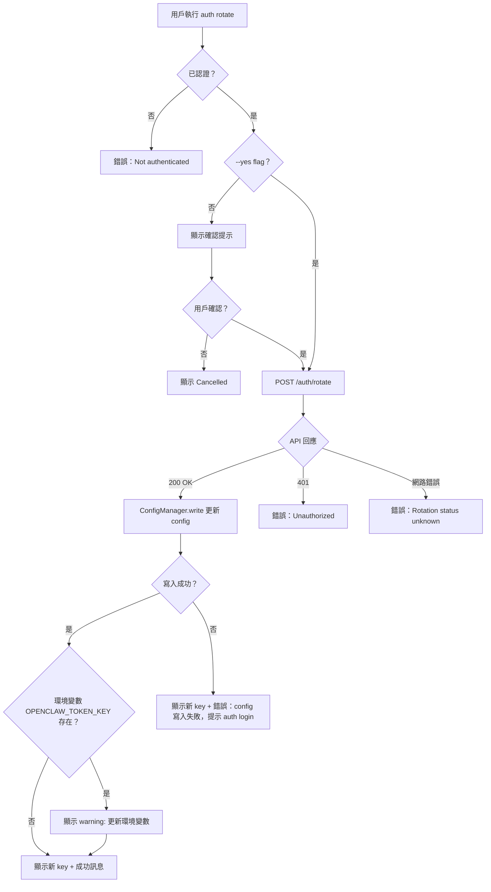
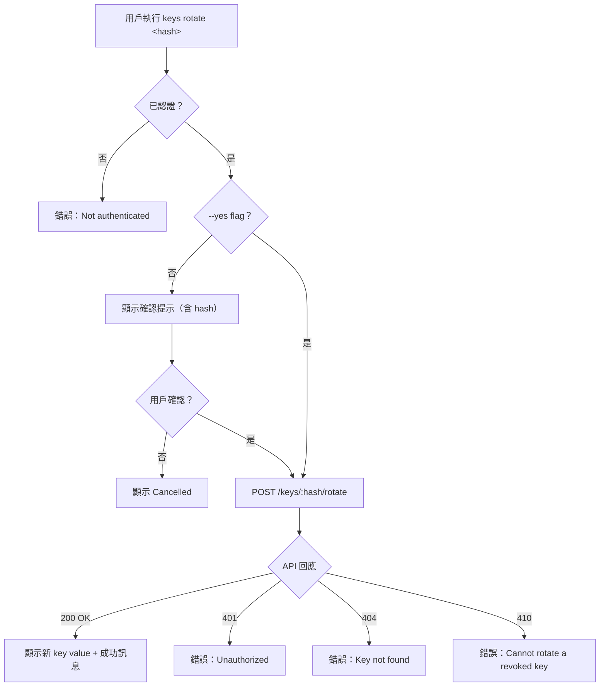
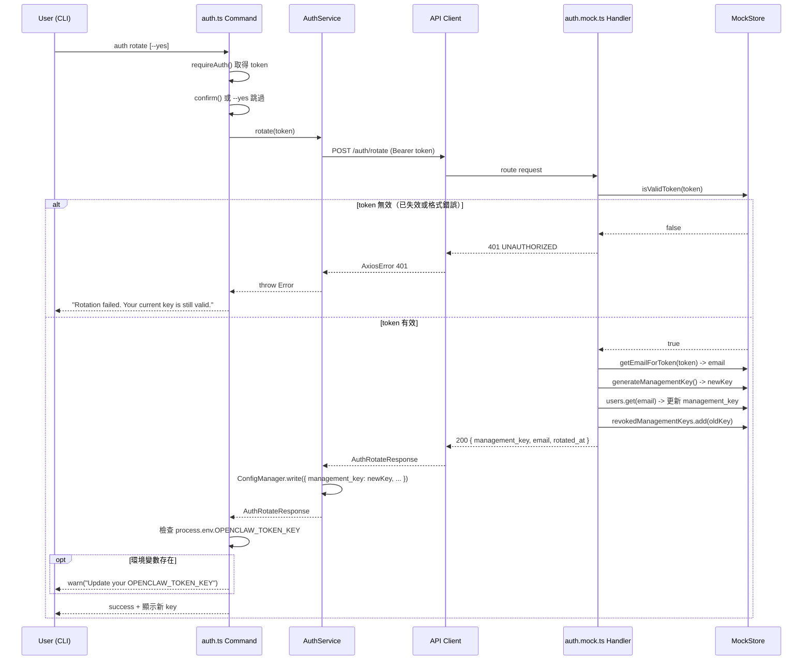
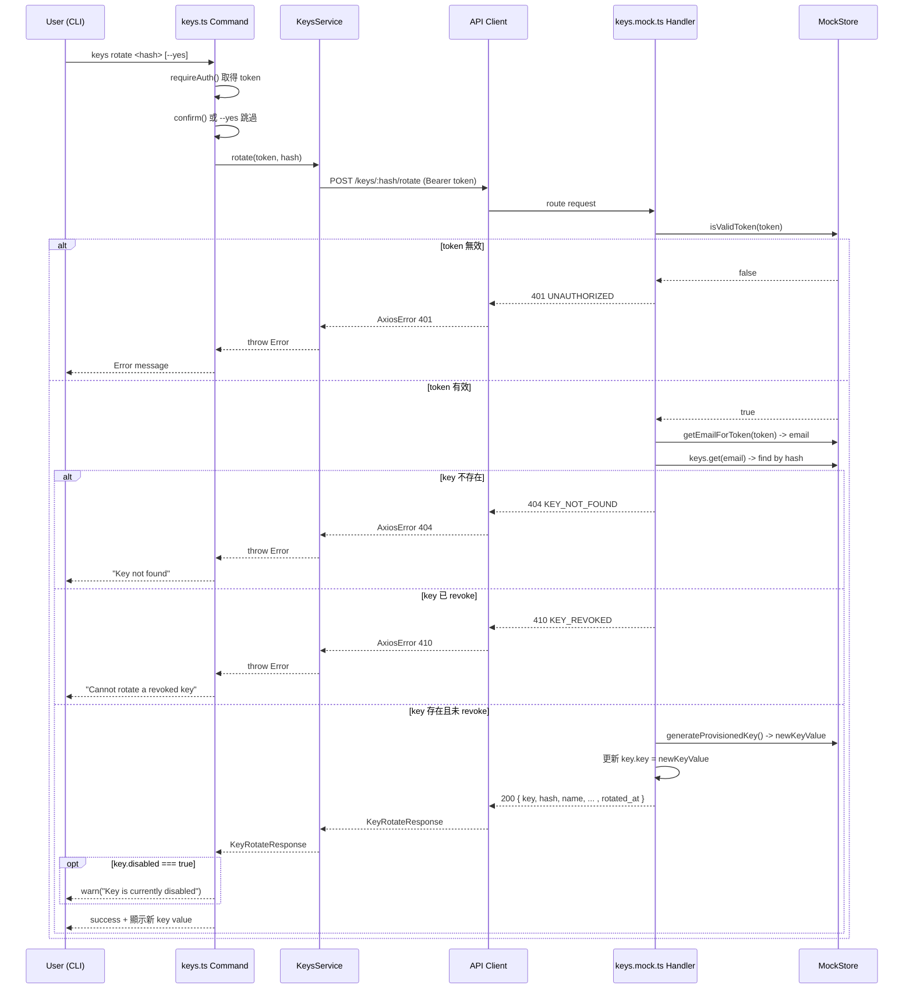

# S1 Dev Spec: Key Rotation 機制

> **階段**: S1 技術分析
> **建立時間**: 2026-03-15 02:00
> **Agent**: codebase-explorer (Phase 1) + architect (Phase 2)
> **工作類型**: new_feature
> **複雜度**: M

---

## 1. 概述

### 1.1 需求參照
> 完整需求見 `s0_brief_spec.md`，以下僅摘要。

為 Management Key 和 Provisioned Keys 加入 rotation 機制，讓用戶透過 `auth rotate` 和 `keys rotate <hash>` 指令主動輪換 key，舊 key 立即失效。

### 1.2 技術方案摘要

沿用現有分層架構（Commands -> Services -> API Client -> Mock Handlers -> MockStore），新增兩個 API 端點（`POST /auth/rotate`、`POST /keys/:hash/rotate`）及對應的 command、service、mock handler。核心技術挑戰在於 MockStore 的 `isValidToken()` 目前是純 regex 驗證，需引入黑名單機制（`revokedManagementKeys: Set<string>`）讓舊 management key 在 rotation 後回傳 401。Provisioned key 的 rotation 則直接更新 `MockProvisionedKey.key` 欄位（mock 層不驗 provisioned key auth，無需黑名單）。

---

## 2. 影響範圍（Phase 1：codebase-explorer）

### 2.1 受影響檔案

#### 基礎設施
| 檔案 | 變更類型 | 說明 |
|------|---------|------|
| `src/api/types.ts` | 修改 | 新增 `AuthRotateResponse`、`KeyRotateResponse` 型別 |
| `src/api/endpoints.ts` | 修改 | 新增 `AUTH_ROTATE`、`KEY_ROTATE` 端點常數 |
| `src/mock/store.ts` | 修改 | 新增 `revokedManagementKeys: Set<string>`，修改 `isValidToken()` 加黑名單檢查，`reset()` 清除黑名單 |

#### Auth Rotate（FA-A+）
| 檔案 | 變更類型 | 說明 |
|------|---------|------|
| `src/mock/handlers/auth.mock.ts` | 修改 | 新增 `POST /auth/rotate` handler |
| `src/services/auth.service.ts` | 修改 | 新增 `rotate(token)` 方法 |
| `src/commands/auth.ts` | 修改 | 新增 `auth rotate` 子命令 |

#### Keys Rotate（FA-C+）
| 檔案 | 變更類型 | 說明 |
|------|---------|------|
| `src/mock/handlers/keys.mock.ts` | 修改 | 新增 `POST /keys/:hash/rotate` handler |
| `src/services/keys.service.ts` | 修改 | 新增 `rotate(token, hash)` 方法 |
| `src/commands/keys.ts` | 修改 | 新增 `keys rotate` 子命令 |

#### 測試
| 檔案 | 變更類型 | 說明 |
|------|---------|------|
| `tests/unit/mock/handlers/auth.mock.test.ts` | 修改 | 新增 auth rotate handler 測試 |
| `tests/unit/mock/handlers/keys.mock.test.ts` | 修改 | 新增 keys rotate handler 測試 |
| `tests/unit/services/auth.service.test.ts` | 修改 | 新增 rotate() 方法測試 |
| `tests/integration/auth.test.ts` | 修改 | 新增 auth rotate 整合測試 |
| `tests/integration/keys.test.ts` | 修改 | 新增 keys rotate 整合測試 |

### 2.2 依賴關係

- **上游依賴**: `src/mock/store.ts`（isValidToken 擴充）、`src/api/types.ts`（新增型別）、`src/api/endpoints.ts`（新增端點）
- **下游影響**: 所有依賴 `isValidToken()` 的 mock handler 測試（auth、keys、credits、oauth）需確認黑名單機制不影響正常 flow

### 2.3 現有模式與技術考量

- **指令模式**: `getGlobalOptions()` -> `requireAuth()` -> `new Service({mock, verbose})` -> `withSpinner()` -> `output()`
- **確認模式**: revoke 指令的 `--yes` 跳過確認 pattern 可直接複用
- **Config 更新**: register/login 使用 `ConfigManager.write()` 寫入 config，rotate 沿用相同機制
- **Key 生成**: 必須使用 `store.generateManagementKey()` / `store.generateProvisionedKey()`，不得手動拼接（P-CLI-001）
- **API Client**: token 透過 `createApiClient({ token })` 傳入，Axios interceptor 會自動加 `Authorization` header（P-CLI-002）
- **MockStore 單例**: handler 必須使用 router 注入的 `store` 參數，reset() 必須清除所有新增狀態（P-CLI-003）

---

## 3. User Flow（Phase 2：architect）

### 3.1 auth rotate 流程



### 3.2 keys rotate 流程



### 3.3 主要流程步驟

#### auth rotate
| 步驟 | 用戶動作 | 系統回應 | 備註 |
|------|---------|---------|------|
| 1 | 執行 `auth rotate` | 檢查 auth-guard | 未認證則中斷 |
| 2 | 確認 rotation（或 `--yes`） | 發送 POST /auth/rotate | 帶當前 token |
| 3 | - | 產生新 key、失效舊 key | server-side |
| 4 | - | 更新本地 config | atomic write |
| 5 | 看到新 key | 顯示一次性新 key + warning | 環境變數場景加 warning |

#### keys rotate
| 步驟 | 用戶動作 | 系統回應 | 備註 |
|------|---------|---------|------|
| 1 | 執行 `keys rotate <hash>` | 檢查 auth-guard | 未認證則中斷 |
| 2 | 確認 rotation（或 `--yes`） | 發送 POST /keys/:hash/rotate | 帶 management key |
| 3 | - | 產生新 key value、保留設定 | hash 不變 |
| 4 | 看到新 key value | 顯示一次性新 key value + warning | disabled key 也顯示 warning |

### 3.4 異常流程

| S0 ID | 情境 | 觸發條件 | 系統處理 | 用戶看到 |
|-------|------|---------|---------|---------|
| E-R1 | 並行 rotate（auth） | 兩 terminal 同時 rotate | 後者的舊 key 已在第一次 rotate 後失效 | 401 Unauthorized |
| E-R2 | config 寫入失敗（auth） | API 成功但 fs 寫入失敗 | catch 寫入錯誤，仍輸出新 key | 新 key + 錯誤訊息 + 提示 auth login |
| E-R3 | 環境變數場景（auth） | `OPENCLAW_TOKEN_KEY` 存在 | rotation 正常執行，額外輸出 warning | warning: 更新環境變數 |
| E-R4 | 網路超時（auth） | rotate 請求超時或網路錯誤 | 無法確認 server 狀態 | "Rotation status unknown. Run auth whoami to check." |
| E-R6 | API 錯誤（auth） | 非 200 回應 | 保留當前 key 不變 | "Rotation failed. Your current key is still valid." |
| E-K1 | hash 不存在（keys） | 找不到對應 key | 404 | "Key not found" |
| E-K2 | key 已 revoke（keys） | key.revoked === true | 410 | "Cannot rotate a revoked key" |
| E-K3 | key 已 disabled（keys） | key.disabled === true | 允許 rotate，輸出 warning | warning: key is currently disabled |

### 3.5 S0->S1 例外追溯表

| S0 ID | 維度 | S0 描述 | S1 處理位置 | 覆蓋狀態 |
|-------|------|---------|-----------|---------|
| E-R1 | 並行 | 兩 terminal 同時 rotate | MockStore 黑名單 + isValidToken() | 覆蓋 |
| E-R2 | 狀態 | API 成功但 config 寫入失敗 | auth.ts command try/catch ConfigManager.write | 覆蓋 |
| E-R3 | 邊界 | 環境變數覆蓋 | auth.ts command 檢查 process.env.OPENCLAW_TOKEN_KEY | 覆蓋 |
| E-R4 | 網路 | rotate 請求超時 | auth.ts command catch block | 覆蓋 |
| E-R6 | 體驗 | rotation 失敗 | auth.ts command catch block | 覆蓋 |
| E-K1 | 業務 | hash 不存在 | keys.mock.ts 404 | 覆蓋 |
| E-K2 | 業務 | key 已 revoke | keys.mock.ts 410 | 覆蓋 |
| E-K3 | 業務 | key 已 disabled | keys.mock.ts 允許 + keys.ts command warning | 覆蓋 |
| E-K4 | 並行 | 同一 key 同時 rotate | Mock 層為同步操作，不會真正並行衝突；真實 API 應處理 409 | 部分（mock 限制） |

---

## 4. Data Flow

### 4.1 auth rotate



### 4.2 keys rotate



### 4.3 API 契約

> 完整 API 規格（Request/Response/Error Codes）見 [`s1_api_spec.md`](./s1_api_spec.md)。

**Endpoint 摘要**

| Method | Path | 說明 |
|--------|------|------|
| `POST` | `/auth/rotate` | 輪換 management key，舊 key 立即失效 |
| `POST` | `/keys/:hash/rotate` | 輪換 provisioned key，保留設定，舊 key value 立即失效 |

### 4.4 資料模型變更

#### MockStore 擴充

```typescript
// src/mock/store.ts 新增
revokedManagementKeys = new Set<string>();

isValidToken(token: string): boolean {
  if (this.revokedManagementKeys.has(token)) return false;  // 黑名單優先
  return /^sk-mgmt-[0-9a-f]{8}-...$/i.test(token);
}

reset(): void {
  // ... 現有清除邏輯 ...
  this.revokedManagementKeys.clear();  // 新增
  this.initDefaults();
}
```

#### 新增 TypeScript 型別

```typescript
// src/api/types.ts
export interface AuthRotateResponse {
  management_key: string;
  email: string;
  rotated_at: string;
}

export interface KeyRotateResponse {
  key: string;
  hash: string;
  name: string;
  credit_limit: number | null;
  limit_reset: 'daily' | 'weekly' | 'monthly' | null;
  usage: number;
  disabled: boolean;
  created_at: string;
  expires_at: string | null;
  rotated_at: string;
}
```

---

## 5. 任務清單

### 5.1 任務總覽

| # | 任務 | FA | 類型 | 複雜度 | Agent | 依賴 | Wave |
|---|------|----|------|--------|-------|------|------|
| 1 | API 型別定義 | 共用 | 後端 | S | backend-expert | - | 1 |
| 2 | Endpoint 常數 | 共用 | 後端 | S | backend-expert | - | 1 |
| 3 | MockStore 黑名單擴充 | 共用 | 後端 | S | backend-expert | - | 1 |
| 4 | auth rotate mock handler | FA-A+ | 後端 | M | backend-expert | #1, #2, #3 | 2 |
| 5 | AuthService.rotate() | FA-A+ | 後端 | M | backend-expert | #1, #2 | 2 |
| 6 | auth rotate command | FA-A+ | 後端 | M | backend-expert | #5 | 2 |
| 7 | keys rotate mock handler | FA-C+ | 後端 | M | backend-expert | #1, #2 | 3 |
| 8 | KeysService.rotate() | FA-C+ | 後端 | S | backend-expert | #1, #2 | 3 |
| 9 | keys rotate command | FA-C+ | 後端 | M | backend-expert | #8 | 3 |
| 10 | auth mock handler 測試 | FA-A+ | 測試 | M | backend-expert | #4 | 4 |
| 11 | keys mock handler 測試 | FA-C+ | 測試 | M | backend-expert | #7 | 4 |
| 12 | AuthService 測試 | FA-A+ | 測試 | S | backend-expert | #5 | 4 |
| 13 | auth 整合測試 | FA-A+ | 測試 | M | backend-expert | #6 | 4 |
| 14 | keys 整合測試 | FA-C+ | 測試 | M | backend-expert | #9 | 4 |

### 5.2 任務詳情

#### Task #1: API 型別定義
- **類型**: 後端
- **複雜度**: S
- **Agent**: backend-expert
- **Wave**: 1
- **描述**: 在 `src/api/types.ts` 新增 `AuthRotateResponse` 和 `KeyRotateResponse` 介面，並更新 import 列表。
- **DoD**:
  - [ ] `AuthRotateResponse` 包含 `management_key`, `email`, `rotated_at` 欄位
  - [ ] `KeyRotateResponse` 包含 `key`, `hash`, `name`, `credit_limit`, `limit_reset`, `usage`, `disabled`, `created_at`, `expires_at`, `rotated_at` 欄位
  - [ ] TypeScript 編譯通過
- **驗收方式**: `npx tsc --noEmit` 無錯誤

#### Task #2: Endpoint 常數
- **類型**: 後端
- **複雜度**: S
- **Agent**: backend-expert
- **Wave**: 1
- **描述**: 在 `src/api/endpoints.ts` 新增 `AUTH_ROTATE: '/auth/rotate'` 和 `KEY_ROTATE: (hash: string) => '/keys/${hash}/rotate'`。
- **DoD**:
  - [ ] `ENDPOINTS.AUTH_ROTATE` 為 `'/auth/rotate'`
  - [ ] `ENDPOINTS.KEY_ROTATE('abc')` 回傳 `'/keys/abc/rotate'`
  - [ ] TypeScript 編譯通過
- **驗收方式**: `npx tsc --noEmit` 無錯誤

#### Task #3: MockStore 黑名單擴充
- **類型**: 後端
- **複雜度**: S
- **Agent**: backend-expert
- **Wave**: 1
- **描述**: 在 `MockStore` 新增 `revokedManagementKeys: Set<string>` 屬性。修改 `isValidToken()` 在 regex 驗證前先檢查黑名單。修改 `reset()` 清除黑名單。
- **DoD**:
  - [ ] `revokedManagementKeys` 為 `Set<string>` 型別，初始為空
  - [ ] `isValidToken(token)` 在 regex 前先檢查 `revokedManagementKeys.has(token)`，若命中回傳 `false`
  - [ ] `reset()` 呼叫 `this.revokedManagementKeys.clear()`
  - [ ] 現有測試全部通過（黑名單為空時行為不變）
- **驗收方式**: `npm test` 完整套件（含 auth/keys/credits mock handler 測試）全部通過

#### Task #4: auth rotate mock handler
- **類型**: 後端
- **複雜度**: M
- **Agent**: backend-expert
- **依賴**: #1, #2, #3
- **Wave**: 2
- **描述**: 在 `src/mock/handlers/auth.mock.ts` 的 `registerAuthHandlers()` 中註冊 `POST /auth/rotate` handler。驗證 token -> 取得 email -> 取得舊 key -> 生成新 key -> 更新 user record -> 舊 key 加入黑名單 -> 回傳新 key。
- **DoD**:
  - [ ] 使用 `requireValidToken()` 驗證 token
  - [ ] 使用 `store.getEmailForToken(token)` 取得 email，再透過 `store.users.get(email).management_key` 取得當前的 oldKey
  - [ ] 使用 `store.generateManagementKey()` 生成新 key（P-CLI-001）
  - [ ] 將 oldKey 加入 `store.revokedManagementKeys`
  - [ ] 更新 `store.users.get(email).management_key` 為新 key
  - [ ] 回傳 `{ data: { management_key, email, rotated_at } }`，status 200
  - [ ] 無效 token 回傳 401
- **驗收方式**: mock handler 單元測試

#### Task #5: AuthService.rotate()
- **類型**: 後端
- **複雜度**: M
- **Agent**: backend-expert
- **依賴**: #1, #2
- **Wave**: 2
- **描述**: 在 `AuthService` 新增 `rotate(token: string): Promise<AuthRotateResponse>` 方法。呼叫 `POST /auth/rotate`，成功後使用 `ConfigManager.write()` 更新本地 config（讀取現有 config 後更新 `management_key`）。
- **DoD**:
  - [ ] 方法簽名 `async rotate(token: string): Promise<AuthRotateResponse>`
  - [ ] 使用 `createApiClient({ mock, baseURL, token, verbose })` 建立 client（參照 whoami 模式）
  - [ ] POST 到 `ENDPOINTS.AUTH_ROTATE`
  - [ ] 成功後先 `ConfigManager.read()` 取得現有 config，合併更新 `management_key`，保留 `api_base`、`email`、`created_at`、`last_login`
  - [ ] `ConfigManager.write()` 失敗時 throw 含 `newKey` 的 `ConfigWriteError`（讓 command 層可單獨處理 E-R2）
  - [ ] 回傳 `AuthRotateResponse`
- **驗收方式**: service 單元測試

#### Task #6: auth rotate command
- **類型**: 後端
- **複雜度**: M
- **Agent**: backend-expert
- **依賴**: #5
- **Wave**: 2
- **描述**: 在 `createAuthCommand()` 中新增 `auth rotate` 子命令。支援 `--yes` 和 `--json`。Rotation 成功後檢查 `process.env.OPENCLAW_TOKEN_KEY` 存在則輸出 warning。Config 寫入失敗時仍輸出新 key 並提示 `auth login` 恢復。
- **DoD**:
  - [ ] 子命令 `.command('rotate')` 含 `.option('--yes', 'Skip confirmation', false)`
  - [ ] 無 `--yes` 時使用 `confirm()` 提示，取消時輸出 'Cancelled.'
  - [ ] 呼叫 `service.rotate(token)` 並用 `withSpinner` 包裝
  - [ ] `--json` 模式輸出完整 response JSON
  - [ ] 非 JSON 模式：`warn('This key will only be shown ONCE. Save it now!')` + table 顯示新 key
  - [ ] 偵測 `process.env.OPENCLAW_TOKEN_KEY` 存在時輸出 `warn('Update your OPENCLAW_TOKEN_KEY environment variable.')`
  - [ ] 錯誤處理：catch `ConfigWriteError` 時仍輸出 `error.newKey` + 提示 `auth login`；區分網路錯誤（status unknown）vs API 錯誤（current key still valid）
- **驗收方式**: 整合測試 + 手動 `--mock` 測試

#### Task #7: keys rotate mock handler
- **類型**: 後端
- **複雜度**: M
- **Agent**: backend-expert
- **依賴**: #1, #2
- **Wave**: 3
- **描述**: 在 `src/mock/handlers/keys.mock.ts` 的 `registerKeysHandlers()` 中註冊 `POST /keys/:hash/rotate` handler。驗證 token -> 取得 email -> 透過 hash 找到 key -> 檢查未 revoke -> 生成新 key value -> 更新 MockProvisionedKey.key -> 回傳完整 key 資訊。
- **DoD**:
  - [ ] 使用 `requireValidToken()` 驗證 token
  - [ ] 透過 `req.query?.hash` 取得 hash 參數（mock router 將 URL path parameter `:hash` 解析注入到 `req.query.hash`，詳見現有 `GET /keys/:hash` handler 的實作模式）
  - [ ] key 不存在回傳 404 `KEY_NOT_FOUND`
  - [ ] key 已 revoke 回傳 410 `KEY_REVOKED`
  - [ ] 使用 `store.generateProvisionedKey()` 生成新 key value
  - [ ] 更新 `key.key` 為新值
  - [ ] 回傳完整 key 資訊 + `rotated_at`，status 200
- **驗收方式**: mock handler 單元測試

#### Task #8: KeysService.rotate()
- **類型**: 後端
- **複雜度**: S
- **Agent**: backend-expert
- **依賴**: #1, #2
- **Wave**: 3
- **描述**: 在 `KeysService` 新增 `rotate(token: string, hash: string): Promise<KeyRotateResponse>` 方法。呼叫 `POST /keys/:hash/rotate`。
- **DoD**:
  - [ ] 方法簽名 `async rotate(token: string, hash: string): Promise<KeyRotateResponse>`
  - [ ] 使用 `this.getClient(token)` 建立 client（沿用現有 pattern）
  - [ ] POST 到 `ENDPOINTS.KEY_ROTATE(hash)`
  - [ ] 回傳 `KeyRotateResponse`
- **驗收方式**: service 測試（可併入整合測試）

#### Task #9: keys rotate command
- **類型**: 後端
- **複雜度**: M
- **Agent**: backend-expert
- **依賴**: #8
- **Wave**: 3
- **描述**: 在 `createKeysCommand()` 中新增 `keys rotate` 子命令。接受 `<hash>` 引數和 `--yes` 選項。成功後顯示新 key value，disabled key 顯示 warning。
- **DoD**:
  - [ ] 子命令 `.command('rotate')` + `.argument('<hash>', 'Key hash')` + `.option('--yes', 'Skip confirmation', false)`
  - [ ] 無 `--yes` 時使用 `confirm()` 提示（含 hash），取消時輸出 'Cancelled.'
  - [ ] 呼叫 `service.rotate(token, hash)` 並用 `withSpinner` 包裝
  - [ ] `--json` 模式輸出完整 response JSON
  - [ ] 非 JSON 模式：`warn('This key will only be shown ONCE. Save it now!')` + table 顯示新 key value 和 hash
  - [ ] response 中 `disabled === true` 時輸出 `warn('Note: This key is currently disabled.')`
- **驗收方式**: 整合測試 + 手動 `--mock` 測試

#### Task #10: auth mock handler 測試
- **類型**: 測試
- **複雜度**: M
- **Agent**: backend-expert
- **依賴**: #4
- **Wave**: 4
- **描述**: 在 `tests/unit/mock/handlers/auth.mock.test.ts` 新增 `POST /auth/rotate` 測試群組。
- **DoD**:
  - [ ] 測試：有效 token rotate 成功，回傳新 key + 200
  - [ ] 測試：rotate 後舊 key 立即 401（呼叫 /auth/me 驗證）
  - [ ] 測試：rotate 後新 key 可正常使用
  - [ ] 測試：無效 token 回傳 401
  - [ ] 測試：連續 rotate 兩次，第一次的 key 也 401
  - [ ] `beforeEach` 呼叫 `mockStore.reset()`（P-CLI-003）
- **驗收方式**: `npm test` 全通過

#### Task #11: keys mock handler 測試
- **類型**: 測試
- **複雜度**: M
- **Agent**: backend-expert
- **依賴**: #7
- **Wave**: 4
- **描述**: 在 `tests/unit/mock/handlers/keys.mock.test.ts` 新增 `POST /keys/:hash/rotate` 測試群組。
- **DoD**:
  - [ ] 測試：有效 hash rotate 成功，回傳新 key value + 保留設定 + 200
  - [ ] 測試：rotate 後 key.key 已更新（再次 rotate 產生不同值）
  - [ ] 測試：hash 不存在回傳 404
  - [ ] 測試：已 revoke 的 key 回傳 410
  - [ ] 測試：disabled key 仍可 rotate（回傳 200，disabled 仍為 true）
  - [ ] 測試：rotate 保留 name, credit_limit, limit_reset, usage, hash
  - [ ] `beforeEach` 呼叫 `mockStore.reset()`
- **驗收方式**: `npm test` 全通過

#### Task #12: AuthService 測試
- **類型**: 測試
- **複雜度**: S
- **Agent**: backend-expert
- **依賴**: #5
- **Wave**: 4
- **描述**: 在 `tests/unit/services/auth.service.test.ts` 新增 `rotate()` 測試。
- **DoD**:
  - [ ] 測試：rotate 成功時回傳 AuthRotateResponse 結構
  - [ ] 測試：rotate 成功時呼叫 ConfigManager.write 更新 management_key
  - [ ] 測試：API 錯誤時 throw error
- **驗收方式**: `npm test` 全通過

#### Task #13: auth 整合測試
- **類型**: 測試
- **複雜度**: M
- **Agent**: backend-expert
- **依賴**: #6
- **Wave**: 4
- **描述**: 在 `tests/integration/auth.test.ts` 新增 auth rotate 整合測試。
- **DoD**:
  - [ ] 測試：`auth rotate --yes --mock` 成功執行
  - [ ] 測試：rotate 後 `auth whoami --mock` 仍正常（使用新 key）
  - [ ] 測試：`auth rotate --yes --mock --json` 輸出正確 JSON 格式
- **驗收方式**: `npm test` 全通過

#### Task #14: keys 整合測試
- **類型**: 測試
- **複雜度**: M
- **Agent**: backend-expert
- **依賴**: #9
- **Wave**: 4
- **描述**: 在 `tests/integration/keys.test.ts` 新增 keys rotate 整合測試。
- **DoD**:
  - [ ] 測試：`keys rotate <hash> --yes --mock` 成功執行
  - [ ] 測試：rotate 後 `keys info <hash> --mock` 仍正常（name/limit 保留）
  - [ ] 測試：`keys rotate <hash> --yes --mock --json` 輸出正確 JSON 格式
  - [ ] 測試：不存在的 hash rotate 回傳錯誤
- **驗收方式**: `npm test` 全通過

---

## 6. 技術決策

### 6.1 架構決策

| 決策點 | 選項 | 選擇 | 理由 |
|--------|------|------|------|
| keys rotate 後 hash 是否改變 | A: hash 改變 / B: hash 不變 | B: hash 不變 | hash 是 key 的穩定識別碼，下游（info、update、revoke）都用 hash 定位。改變 hash 會破壞引用鏈且增加複雜度。只換 key value 是語義正確的 rotation。 |
| auth rotate 是否支援 --yes | A: 強制互動確認 / B: 支援 --yes 跳過 | B: 支援 --yes | 與 `keys revoke` 的 `--yes` 模式一致，也方便 CI/script 場景使用。 |
| keys rotate response 結構 | A: 專屬 RotateResponse / B: 複用 ProvisionedKey + rotated_at | B: 專屬 KeyRotateResponse | 雖然結構與 ProvisionedKey 類似，但加了 `rotated_at` 且語義不同。獨立型別更清晰，避免 optional 欄位混淆。 |
| MockStore 是否需 revokedProvisionedKeys 黑名單 | A: 需要 / B: 不需要 | B: 不需要 | Mock 層不驗 provisioned key 的 auth（只驗 management key）。Provisioned key 的「舊 value 失效」語義透過直接更新 `MockProvisionedKey.key` 欄位即可表達——下次 rotate 或列出時顯示的就是新值。 |
| config 寫入失敗的處理 | A: 整體失敗 / B: 顯示新 key + 錯誤提示 | B: 顯示新 key + 錯誤提示 | API 已成功、舊 key 已失效。如果隱藏新 key，用戶就完全失去存取權。必須顯示新 key 並提示 `auth login` 作為 recovery path。 |

### 6.2 設計模式

- **Pattern**: 沿用現有 Command-Service-Client-MockHandler 分層
- **理由**: 現有架構已經清晰分離關注點，rotation 功能完全符合此模式，無需引入新 pattern

### 6.3 相容性考量

- **向後相容**: 不改變任何現有 API 端點行為或型別定義，只新增端點
- **Migration**: 無資料遷移需求

---

## 7. 驗收標準

### 7.1 功能驗收

| # | 場景 | Given | When | Then | 優先級 |
|---|------|-------|------|------|--------|
| AC-1 | auth rotate 成功 | 用戶已認證 | 執行 `auth rotate --yes --mock` | 回傳新 management key，config 已更新 | P0 |
| AC-2 | auth rotate 後舊 key 401 | AC-1 完成後 | 使用舊 key 呼叫 /auth/me | 回傳 401 Unauthorized | P0 |
| AC-3 | auth rotate 後新 key 可用 | AC-1 完成後 | 使用新 key 呼叫 /auth/me | 回傳 200 + 帳戶資訊 | P0 |
| AC-4 | keys rotate 成功 | 用戶已認證，已有 provisioned key | 執行 `keys rotate <hash> --yes --mock` | 回傳新 key value，hash/name/limit 不變 | P0 |
| AC-5 | keys rotate 保留設定 | key 有 credit_limit=50, limit_reset=monthly | 執行 keys rotate | response 中 credit_limit=50, limit_reset=monthly | P0 |
| AC-6 | keys rotate 不存在的 hash | 用戶已認證 | 執行 `keys rotate nonexistent --yes --mock` | 顯示 "Key not found" 錯誤 | P0 |
| AC-7 | keys rotate 已 revoke 的 key | key 已被 revoke | 執行 `keys rotate <hash> --yes --mock` | 顯示 "Cannot rotate a revoked key" 錯誤 | P1 |
| AC-8 | auth rotate JSON 輸出 | 用戶已認證 | 執行 `auth rotate --yes --mock --json` | 輸出 JSON 含 management_key, email, rotated_at | P1 |
| AC-9 | keys rotate JSON 輸出 | 已有 provisioned key | 執行 `keys rotate <hash> --yes --mock --json` | 輸出 JSON 含 key, hash, rotated_at | P1 |
| AC-10 | auth rotate 環境變數 warning | `OPENCLAW_TOKEN_KEY` 已設定 | 執行 auth rotate | 顯示 warning 提示更新環境變數 | P1 |
| AC-11 | keys rotate disabled key warning | key.disabled === true | 執行 keys rotate | 允許 rotate + 顯示 warning | P2 |
| AC-12 | auth rotate 取消 | 用戶已認證 | 執行 `auth rotate`，在確認時選 No | 顯示 'Cancelled.'，key 不變 | P1 |
| AC-13 | keys rotate 取消 | 用戶已認證 | 執行 `keys rotate <hash>`，在確認時選 No | 顯示 'Cancelled.'，key 不變 | P1 |
| AC-14 | provisioned key rotate 後舊 value 失效 | 已有 provisioned key | rotate 後查詢 store 中該 key 的 value | store 中 key.key 已更新為新值，舊 value 不存在 | P0 |

### 7.2 非功能驗收

| 項目 | 標準 |
|------|------|
| 效能 | rotation 操作在 mock 模式下 < 100ms |
| 安全 | 舊 key 在 rotation 成功後立即失效，無 grace period |
| 可維護性 | 新增程式碼風格與現有一致，通過 lint 檢查 |

### 7.3 測試計畫

- **單元測試**: MockStore 黑名單、auth rotate handler、keys rotate handler、AuthService.rotate()
- **整合測試**: auth rotate 端到端（含 config 更新）、keys rotate 端到端（含設定保留）、JSON 輸出格式
- **E2E 測試**: 手動 `--mock` 模式驗證 CLI 互動流程

---

## 8. 風險與緩解

| 風險 | 影響 | 機率 | 緩解措施 | 負責人 |
|------|------|------|---------|--------|
| MockStore.isValidToken() 黑名單影響現有測試 | 高 | 低 | 黑名單為空時行為完全不變（先檢查 Set.has，空 Set 永遠 false）。Task #3 完成後立即跑完整測試確認。 | backend-expert |
| auth rotate 後 config 寫入失敗導致 key 遺失 | 高 | 低 | Command 層 try/catch ConfigManager.write，失敗時仍輸出新 key + 提示 `auth login` 作為 recovery。 | backend-expert |
| 環境變數覆蓋 config 造成 rotate 後靜默失效 | 中 | 中 | rotate command 偵測 `process.env.OPENCLAW_TOKEN_KEY` 存在時輸出 warning。 | backend-expert |
| E-K4 並行 rotate 同一 key | 低 | 低 | Mock 層為同步操作，不會真正並行。真實 API 設計應使用 optimistic locking 或回傳 409。Mock 不模擬此場景。 | N/A（真實後端範圍） |

### 回歸風險

- MockStore.isValidToken() 修改後，所有依賴此方法的 mock handler（auth、keys、credits、oauth）的現有測試必須全部通過。緩解：黑名單為空集合時，`Set.has()` 回傳 false，不影響 regex 檢查路徑。
- ConfigManager.write() 在 auth rotate 後的呼叫路徑與 register/login 相同，不引入新行為。現有 register/login 測試應不受影響。

---

## SDD Context

```json
{
  "sdd_context": {
    "stages": {
      "s1": {
        "status": "completed",
        "agents": ["codebase-explorer", "architect"],
        "output": {
          "completed_phases": [1, 2],
          "dev_spec_path": "dev/specs/2026-03-15_1_key-rotation/s1_dev_spec.md",
          "api_spec_path": "dev/specs/2026-03-15_1_key-rotation/s1_api_spec.md",
          "tasks": [
            { "id": 1, "name": "API 型別定義", "wave": 1, "complexity": "S" },
            { "id": 2, "name": "Endpoint 常數", "wave": 1, "complexity": "S" },
            { "id": 3, "name": "MockStore 黑名單擴充", "wave": 1, "complexity": "S" },
            { "id": 4, "name": "auth rotate mock handler", "wave": 2, "complexity": "M" },
            { "id": 5, "name": "AuthService.rotate()", "wave": 2, "complexity": "M" },
            { "id": 6, "name": "auth rotate command", "wave": 2, "complexity": "M" },
            { "id": 7, "name": "keys rotate mock handler", "wave": 3, "complexity": "M" },
            { "id": 8, "name": "KeysService.rotate()", "wave": 3, "complexity": "S" },
            { "id": 9, "name": "keys rotate command", "wave": 3, "complexity": "M" },
            { "id": 10, "name": "auth mock handler 測試", "wave": 4, "complexity": "M" },
            { "id": 11, "name": "keys mock handler 測試", "wave": 4, "complexity": "M" },
            { "id": 12, "name": "AuthService 測試", "wave": 4, "complexity": "S" },
            { "id": 13, "name": "auth 整合測試", "wave": 4, "complexity": "M" },
            { "id": 14, "name": "keys 整合測試", "wave": 4, "complexity": "M" }
          ],
          "acceptance_criteria": 13,
          "solution_summary": "沿用 Command-Service-Client-MockHandler 分層，新增 POST /auth/rotate 和 POST /keys/:hash/rotate 端點。MockStore 引入 revokedManagementKeys 黑名單讓舊 management key 401。Provisioned key rotation 直接更新 MockProvisionedKey.key 欄位。",
          "assumptions": [
            "keys rotate 後 hash 不變，只換 key value",
            "MockStore 不需 provisioned key 黑名單",
            "auth rotate 支援 --yes 跳過確認"
          ],
          "tech_debt": [
            "MockStore.getEmailForToken() 靜態映射所有 token 到 demo@openclaw.dev",
            "extractToken()/requireValidToken() 在 auth.mock.ts 和 keys.mock.ts 各自複製"
          ],
          "regression_risks": [
            "isValidToken() 黑名單修改影響現有 handler 測試",
            "ConfigManager.write() 路徑影響 register/login 測試"
          ]
        }
      }
    }
  }
}
```
