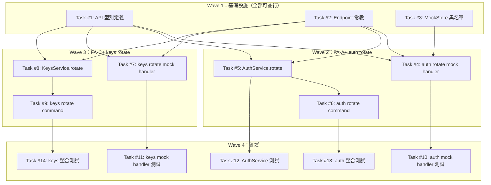

# S3 Implementation Plan: Key Rotation 機制

> **階段**: S3 實作
> **建立時間**: 2026-03-15 02:45
> **Agents**: backend-expert

---

## 1. 概述

### 1.1 功能目標

為 Management Key 和 Provisioned Keys 加入 rotation 機制，讓用戶透過 `auth rotate` 和 `keys rotate <hash>` 指令主動輪換 key，舊 key 立即失效。

### 1.2 實作範圍

- **範圍內**: `auth rotate` 指令（FA-A+）、`keys rotate <hash>` 指令（FA-C+）、對應 mock handlers、API types/endpoints、單元測試 + 整合測試
- **範圍外**: Grace period、自動定期輪換排程、`auth show-key` 指令、真實後端 API 實作

### 1.3 關聯文件

| 文件 | 路徑 | 狀態 |
|------|------|------|
| Brief Spec | `./s0_brief_spec.md` | 完成 |
| Dev Spec | `./s1_dev_spec.md` | 完成 |
| API Spec | `./s1_api_spec.md` | 完成 |
| Implementation Plan | `./s3_implementation_plan.md` | 當前 |

---

## 2. 波次總覽

| Wave | 任務 | 可並行 | 說明 |
|------|------|--------|------|
| 1 | #1, #2, #3 | 全部可並行 | 基礎設施：型別、常數、MockStore 擴充 |
| 2 | #4, #5, #6 | #4 與 #5 可並行；#6 需 #5 | FA-A+ auth rotate 核心實作 |
| 3 | #7, #8, #9 | #7 與 #8 可並行；#9 需 #8 | FA-C+ keys rotate 核心實作 |
| 4 | #10, #11, #12, #13, #14 | #10, #11, #12 可並行；#13 需 #6, #14 需 #9 | 所有測試 |

---

## 3. 任務總覽

| # | 任務 | 類型 | Agent | 依賴 | 複雜度 | source_ref | TDD | 狀態 |
|---|------|------|-------|------|--------|------------|-----|------|
| 1 | API 型別定義 | 後端 | `backend-expert` | - | S | dev_spec §5.2 T1 | 完成 | ⬜ |
| 2 | Endpoint 常數 | 後端 | `backend-expert` | - | S | dev_spec §5.2 T2 | 完成 | ⬜ |
| 3 | MockStore 黑名單擴充 | 後端 | `backend-expert` | - | S | dev_spec §5.2 T3 | 完成 | ⬜ |
| 4 | auth rotate mock handler | 後端 | `backend-expert` | #1, #2, #3 | M | dev_spec §5.2 T4 | 完成 | ⬜ |
| 5 | AuthService.rotate() | 後端 | `backend-expert` | #1, #2 | M | dev_spec §5.2 T5 | 完成 | ⬜ |
| 6 | auth rotate command | 後端 | `backend-expert` | #5 | M | dev_spec §5.2 T6 | 完成 | ⬜ |
| 7 | keys rotate mock handler | 後端 | `backend-expert` | #1, #2 | M | dev_spec §5.2 T7 | 完成 | ⬜ |
| 8 | KeysService.rotate() | 後端 | `backend-expert` | #1, #2 | S | dev_spec §5.2 T8 | 完成 | ⬜ |
| 9 | keys rotate command | 後端 | `backend-expert` | #8 | M | dev_spec §5.2 T9 | 完成 | ⬜ |
| 10 | auth mock handler 測試 | 測試 | `backend-expert` | #4 | M | dev_spec §5.2 T10 | 完成 | ⬜ |
| 11 | keys mock handler 測試 | 測試 | `backend-expert` | #7 | M | dev_spec §5.2 T11 | 完成 | ⬜ |
| 12 | AuthService 測試 | 測試 | `backend-expert` | #5 | S | dev_spec §5.2 T12 | 完成 | ⬜ |
| 13 | auth 整合測試 | 測試 | `backend-expert` | #6 | M | dev_spec §5.2 T13 | 完成 | ⬜ |
| 14 | keys 整合測試 | 測試 | `backend-expert` | #9 | M | dev_spec §5.2 T14 | 完成 | ⬜ |

**狀態圖例**：⬜ pending / 🔄 in_progress / 完成 completed / ❌ blocked / ⏭️ skipped

---

## 4. 任務詳情

### Task #1: API 型別定義

**基本資訊**

| 項目 | 內容 |
|------|------|
| 類型 | 後端 |
| Agent | `backend-expert` |
| 複雜度 | S |
| 依賴 | - |
| source_ref | dev_spec §5.2 T1 |
| 狀態 | ⬜ pending |

**描述**

在 `src/api/types.ts` 新增 `AuthRotateResponse` 和 `KeyRotateResponse` 介面。

**受影響檔案**

| 檔案 | 變更類型 | 說明 |
|------|---------|------|
| `src/api/types.ts` | 修改 | 新增兩個 response 介面 |

**DoD**

- [ ] `AuthRotateResponse` 包含 `management_key: string`, `email: string`, `rotated_at: string`
- [ ] `KeyRotateResponse` 包含 `key`, `hash`, `name`, `credit_limit`, `limit_reset`, `usage`, `disabled`, `created_at`, `expires_at`, `rotated_at` 欄位，型別與 api_spec §3 一致
- [ ] TypeScript 編譯通過

**TDD Plan**

| 項目 | 內容 |
|------|------|
| 測試檔案 | N/A — 純型別定義，無執行邏輯；以 `npx tsc --noEmit` 做靜態驗證 |
| 測試指令 | `npx tsc --noEmit` |
| 預期失敗測試 | N/A |

**驗證方式**

```bash
npx tsc --noEmit
```

**實作備註**

- `limit_reset` 型別為 `'daily' | 'weekly' | 'monthly' | null`，不得用 `string`
- `credit_limit` 型別為 `number | null`

---

### Task #2: Endpoint 常數

**基本資訊**

| 項目 | 內容 |
|------|------|
| 類型 | 後端 |
| Agent | `backend-expert` |
| 複雜度 | S |
| 依賴 | - |
| source_ref | dev_spec §5.2 T2 |
| 狀態 | ⬜ pending |

**描述**

在 `src/api/endpoints.ts` 新增 `AUTH_ROTATE` 字串常數和 `KEY_ROTATE` 工廠函數。

**受影響檔案**

| 檔案 | 變更類型 | 說明 |
|------|---------|------|
| `src/api/endpoints.ts` | 修改 | 新增 2 個 endpoint 常數 |

**DoD**

- [ ] `ENDPOINTS.AUTH_ROTATE` 為字串 `'/auth/rotate'`
- [ ] `ENDPOINTS.KEY_ROTATE` 為函數 `(hash: string) => \`/keys/${hash}/rotate\``
- [ ] `ENDPOINTS.KEY_ROTATE('abc')` 回傳 `'/keys/abc/rotate'`
- [ ] TypeScript 編譯通過

**TDD Plan**

| 項目 | 內容 |
|------|------|
| 測試檔案 | N/A — 純常數定義；以 `npx tsc --noEmit` 做靜態驗證 |
| 測試指令 | `npx tsc --noEmit` |
| 預期失敗測試 | N/A |

**驗證方式**

```bash
npx tsc --noEmit
```

---

### Task #3: MockStore 黑名單擴充

**基本資訊**

| 項目 | 內容 |
|------|------|
| 類型 | 後端 |
| Agent | `backend-expert` |
| 複雜度 | S |
| 依賴 | - |
| source_ref | dev_spec §5.2 T3 |
| 狀態 | ⬜ pending |

**描述**

在 `MockStore` 新增 `revokedManagementKeys: Set<string>` 屬性。修改 `isValidToken()` 在 regex 驗證前先檢查黑名單。修改 `reset()` 清除黑名單。

**受影響檔案**

| 檔案 | 變更類型 | 說明 |
|------|---------|------|
| `src/mock/store.ts` | 修改 | 新增黑名單屬性，修改 isValidToken 與 reset |

**DoD**

- [ ] `revokedManagementKeys` 為 `Set<string>` 型別，初始為空
- [ ] `isValidToken(token)` 在 regex 前先檢查 `revokedManagementKeys.has(token)`，命中則回傳 `false`
- [ ] `reset()` 呼叫 `this.revokedManagementKeys.clear()`
- [ ] 現有測試全部通過（黑名單為空時行為不變）

**TDD Plan**

| 項目 | 內容 |
|------|------|
| 測試檔案 | `tests/unit/mock/handlers/auth.mock.test.ts`（現有 isValidToken 相關測試） |
| 測試指令 | `npm test` |
| 預期失敗測試 | 黑名單為空時所有現有 isValidToken 測試應全部通過（不得引入 regression） |

**驗證方式**

```bash
npm test
```

**實作備註**

- 黑名單優先於 regex，`Set.has()` 時間複雜度 O(1)，不影響效能
- `reset()` 必須清除 `revokedManagementKeys`，否則測試間污染（P-CLI-003）

---

### Task #4: auth rotate mock handler

**基本資訊**

| 項目 | 內容 |
|------|------|
| 類型 | 後端 |
| Agent | `backend-expert` |
| 複雜度 | M |
| 依賴 | #1, #2, #3 |
| source_ref | dev_spec §5.2 T4 |
| 狀態 | ⬜ pending |

**描述**

在 `src/mock/handlers/auth.mock.ts` 的 `registerAuthHandlers()` 中新增 `POST /auth/rotate` handler。流程：驗證 token -> 取得 email -> 取得舊 key -> 生成新 key -> 更新 user record -> 舊 key 加入黑名單 -> 回傳。

**受影響檔案**

| 檔案 | 變更類型 | 說明 |
|------|---------|------|
| `src/mock/handlers/auth.mock.ts` | 修改 | 新增 POST /auth/rotate handler |

**DoD**

- [ ] 使用 `requireValidToken()` 驗證 token，無效回傳 401
- [ ] 使用 `store.getEmailForToken(token)` 取得 email，透過 `store.users.get(email).management_key` 取得 oldKey
- [ ] 使用 `store.generateManagementKey()` 生成新 key（P-CLI-001）
- [ ] 將 oldKey 加入 `store.revokedManagementKeys`
- [ ] 更新 `store.users.get(email).management_key` 為新 key
- [ ] 回傳 `{ data: { management_key, email, rotated_at } }`，status 200
- [ ] `rotated_at` 為 ISO 8601 格式

**TDD Plan**

| 項目 | 內容 |
|------|------|
| 測試檔案 | `tests/unit/mock/handlers/auth.mock.test.ts` |
| 測試指令 | `npm test -- --testPathPattern="auth.mock"` |
| 預期失敗測試（先寫測試） | `POST /auth/rotate returns 200 with new key`, `POST /auth/rotate invalidates old key`, `POST /auth/rotate with invalid token returns 401` |

**驗證方式**

```bash
npm test -- --testPathPattern="auth.mock"
```

**實作備註**

- 參考 auth.mock.ts 現有 `POST /auth/login` handler 的 `requireValidToken()` 呼叫模式
- `rotated_at` 用 `new Date().toISOString()`

---

### Task #5: AuthService.rotate()

**基本資訊**

| 項目 | 內容 |
|------|------|
| 類型 | 後端 |
| Agent | `backend-expert` |
| 複雜度 | M |
| 依賴 | #1, #2 |
| source_ref | dev_spec §5.2 T5 |
| 狀態 | ⬜ pending |

**描述**

在 `AuthService` 新增 `rotate(token: string): Promise<AuthRotateResponse>` 方法。呼叫 `POST /auth/rotate`，成功後用 `ConfigManager.write()` 更新本地 config。

**受影響檔案**

| 檔案 | 變更類型 | 說明 |
|------|---------|------|
| `src/services/auth.service.ts` | 修改 | 新增 rotate() 方法 |

**DoD**

- [ ] 方法簽名 `async rotate(token: string): Promise<AuthRotateResponse>`
- [ ] 使用 `createApiClient({ mock, baseURL, token, verbose })` 建立 client（參照 `whoami` 模式）
- [ ] POST 到 `ENDPOINTS.AUTH_ROTATE`
- [ ] 成功後先 `ConfigManager.read()` 取得現有 config，合併更新 `management_key`，保留 `api_base`、`email`、`created_at`、`last_login`
- [ ] `ConfigManager.write()` 失敗時 throw 含 `newKey` 屬性的 `ConfigWriteError`
- [ ] 回傳 `AuthRotateResponse`

**TDD Plan**

| 項目 | 內容 |
|------|------|
| 測試檔案 | `tests/unit/services/auth.service.test.ts` |
| 測試指令 | `npm test -- --testPathPattern="auth.service"` |
| 預期失敗測試（先寫測試） | `rotate() returns AuthRotateResponse on success`, `rotate() calls ConfigManager.write with new key`, `rotate() throws ConfigWriteError with newKey when write fails`, `rotate() throws on API 401` |

**驗證方式**

```bash
npm test -- --testPathPattern="auth.service"
```

**實作備註**

- `ConfigWriteError` 需為自訂 Error 子類別（或含 `newKey` 欄位的 Error），讓 command 層可透過 `instanceof` 判斷
- 參考 `whoami()` 方法的 `createApiClient` 呼叫模式

---

### Task #6: auth rotate command

**基本資訊**

| 項目 | 內容 |
|------|------|
| 類型 | 後端 |
| Agent | `backend-expert` |
| 複雜度 | M |
| 依賴 | #5 |
| source_ref | dev_spec §5.2 T6 |
| 狀態 | ⬜ pending |

**描述**

在 `createAuthCommand()` 中新增 `auth rotate` 子命令。支援 `--yes`（跳過確認）和 `--json`（JSON 輸出）。處理環境變數 warning、config 寫入失敗、網路錯誤等邊界場景。

**受影響檔案**

| 檔案 | 變更類型 | 說明 |
|------|---------|------|
| `src/commands/auth.ts` | 修改 | 新增 rotate 子命令 |

**DoD**

- [ ] 子命令 `.command('rotate')` 含 `.option('--yes', 'Skip confirmation', false)`
- [ ] 無 `--yes` 時使用 `confirm()` 提示，取消時輸出 'Cancelled.' 並正常退出
- [ ] 呼叫 `service.rotate(token)` 並用 `withSpinner` 包裝
- [ ] `--json` 模式輸出完整 response JSON
- [ ] 非 JSON 模式：`warn('This key will only be shown ONCE. Save it now!')` + table 顯示新 key
- [ ] 偵測 `process.env.OPENCLAW_TOKEN_KEY` 存在時輸出 `warn('Update your OPENCLAW_TOKEN_KEY environment variable.')`
- [ ] catch `ConfigWriteError` 時仍輸出 `error.newKey` + 提示 `auth login`
- [ ] 網路錯誤（無 response）：輸出 "Rotation status unknown. Run auth whoami to check."
- [ ] API 錯誤（有 response 但非 200）：輸出 "Rotation failed. Your current key is still valid."

**TDD Plan**

| 項目 | 內容 |
|------|------|
| 測試檔案 | `tests/integration/auth.test.ts` |
| 測試指令 | `npm test -- --testPathPattern="integration/auth"` |
| 預期失敗測試（先寫測試） | `auth rotate --yes --mock exits 0`, `auth rotate --yes --mock --json outputs JSON`, `auth rotate --mock prompts confirmation`, `auth rotate cancelled outputs Cancelled.` |

**驗證方式**

```bash
npm test -- --testPathPattern="integration/auth"
# 手動驗證
node dist/index.js auth rotate --yes --mock
node dist/index.js auth rotate --yes --mock --json
```

**實作備註**

- 參考 `keys revoke` 的 `--yes` / `confirm()` 模式
- 參考 `auth login` 的 `ConfigManager.write()` 模式
- 網路錯誤判斷：`error.response` 為 undefined 則為網路錯誤

---

### Task #7: keys rotate mock handler

**基本資訊**

| 項目 | 內容 |
|------|------|
| 類型 | 後端 |
| Agent | `backend-expert` |
| 複雜度 | M |
| 依賴 | #1, #2 |
| source_ref | dev_spec §5.2 T7 |
| 狀態 | ⬜ pending |

**描述**

在 `src/mock/handlers/keys.mock.ts` 的 `registerKeysHandlers()` 中新增 `POST /keys/:hash/rotate` handler。流程：驗證 token -> 取得 email -> 透過 hash 找 key -> 檢查 revoke 狀態 -> 生成新 key value -> 更新 key record -> 回傳完整資訊。

**受影響檔案**

| 檔案 | 變更類型 | 說明 |
|------|---------|------|
| `src/mock/handlers/keys.mock.ts` | 修改 | 新增 POST /keys/:hash/rotate handler |

**DoD**

- [ ] 使用 `requireValidToken()` 驗證 token，無效回傳 401
- [ ] 透過 `req.query?.hash` 取得 hash 參數（與現有 `GET /keys/:hash` 相同模式）
- [ ] key 不存在回傳 404 `KEY_NOT_FOUND`
- [ ] key 已 revoke（`key.revoked === true`）回傳 410 `KEY_REVOKED`
- [ ] disabled key（`key.disabled === true`）允許 rotate，回傳 200
- [ ] 使用 `store.generateProvisionedKey()` 生成新 key value（P-CLI-001）
- [ ] 更新 `key.key` 為新值
- [ ] 回傳完整 key 資訊 + `rotated_at`，status 200

**TDD Plan**

| 項目 | 內容 |
|------|------|
| 測試檔案 | `tests/unit/mock/handlers/keys.mock.test.ts` |
| 測試指令 | `npm test -- --testPathPattern="keys.mock"` |
| 預期失敗測試（先寫測試） | `POST /keys/:hash/rotate returns 200 with new key value`, `POST /keys/:hash/rotate preserves name and credit_limit`, `POST /keys/:hash/rotate returns 404 for unknown hash`, `POST /keys/:hash/rotate returns 410 for revoked key`, `POST /keys/:hash/rotate allows rotate of disabled key` |

**驗證方式**

```bash
npm test -- --testPathPattern="keys.mock"
```

**實作備註**

- 參考現有 `GET /keys/:hash` 的 hash 取得方式
- `rotated_at` 用 `new Date().toISOString()`
- 回傳時展開所有 `MockProvisionedKey` 欄位（key, hash, name, credit_limit, limit_reset, usage, disabled, created_at, expires_at）加上 rotated_at

---

### Task #8: KeysService.rotate()

**基本資訊**

| 項目 | 內容 |
|------|------|
| 類型 | 後端 |
| Agent | `backend-expert` |
| 複雜度 | S |
| 依賴 | #1, #2 |
| source_ref | dev_spec §5.2 T8 |
| 狀態 | ⬜ pending |

**描述**

在 `KeysService` 新增 `rotate(token: string, hash: string): Promise<KeyRotateResponse>` 方法。呼叫 `POST /keys/:hash/rotate`，直接回傳 response data。

**受影響檔案**

| 檔案 | 變更類型 | 說明 |
|------|---------|------|
| `src/services/keys.service.ts` | 修改 | 新增 rotate() 方法 |

**DoD**

- [ ] 方法簽名 `async rotate(token: string, hash: string): Promise<KeyRotateResponse>`
- [ ] 使用 `this.getClient(token)` 建立 client（沿用現有 pattern）
- [ ] POST 到 `ENDPOINTS.KEY_ROTATE(hash)`
- [ ] 回傳 `KeyRotateResponse`

**TDD Plan**

| 項目 | 內容 |
|------|------|
| 測試檔案 | `tests/integration/keys.test.ts`（與整合測試合併覆蓋） |
| 測試指令 | `npm test -- --testPathPattern="integration/keys"` |
| 預期失敗測試 | `KeysService.rotate() returns KeyRotateResponse` |

**驗證方式**

```bash
npx tsc --noEmit
npm test -- --testPathPattern="integration/keys"
```

**實作備註**

- 參考 `list()`、`info()` 等現有方法的 `getClient` 使用模式
- 不需要額外的 ConfigManager 操作（provisioned key 不存在 local config）

---

### Task #9: keys rotate command

**基本資訊**

| 項目 | 內容 |
|------|------|
| 類型 | 後端 |
| Agent | `backend-expert` |
| 複雜度 | M |
| 依賴 | #8 |
| source_ref | dev_spec §5.2 T9 |
| 狀態 | ⬜ pending |

**描述**

在 `createKeysCommand()` 中新增 `keys rotate` 子命令。接受 `<hash>` 引數和 `--yes`、`--json` 選項。成功顯示新 key value；disabled key 顯示 warning。

**受影響檔案**

| 檔案 | 變更類型 | 說明 |
|------|---------|------|
| `src/commands/keys.ts` | 修改 | 新增 rotate 子命令 |

**DoD**

- [ ] 子命令 `.command('rotate')` + `.argument('<hash>', 'Key hash')` + `.option('--yes', 'Skip confirmation', false)`
- [ ] 無 `--yes` 時使用 `confirm()` 提示（含 hash），取消時輸出 'Cancelled.'
- [ ] 呼叫 `service.rotate(token, hash)` 並用 `withSpinner` 包裝
- [ ] `--json` 模式輸出完整 response JSON
- [ ] 非 JSON 模式：`warn('This key will only be shown ONCE. Save it now!')` + table 顯示新 key value 和 hash
- [ ] response 中 `disabled === true` 時輸出 `warn('Note: This key is currently disabled.')`

**TDD Plan**

| 項目 | 內容 |
|------|------|
| 測試檔案 | `tests/integration/keys.test.ts` |
| 測試指令 | `npm test -- --testPathPattern="integration/keys"` |
| 預期失敗測試（先寫測試） | `keys rotate <hash> --yes --mock exits 0`, `keys rotate <hash> --yes --mock --json outputs JSON`, `keys rotate nonexistent --yes --mock shows Key not found`, `keys rotate revoked_hash --yes --mock shows Cannot rotate a revoked key` |

**驗證方式**

```bash
npm test -- --testPathPattern="integration/keys"
# 手動驗證
node dist/index.js keys rotate <hash> --yes --mock
node dist/index.js keys rotate <hash> --yes --mock --json
```

**實作備註**

- 參考 `keys revoke` 的 `--yes` / `confirm()` 模式
- 確認提示文字應含 hash，讓用戶清楚知道要 rotate 哪個 key

---

### Task #10: auth mock handler 測試

**基本資訊**

| 項目 | 內容 |
|------|------|
| 類型 | 測試 |
| Agent | `backend-expert` |
| 複雜度 | M |
| 依賴 | #4 |
| source_ref | dev_spec §5.2 T10 |
| 狀態 | ⬜ pending |

**描述**

在 `tests/unit/mock/handlers/auth.mock.test.ts` 新增 `POST /auth/rotate` 測試群組，驗證 rotation 語義（新 key 有效、舊 key 立即 401）。

**受影響檔案**

| 檔案 | 變更類型 | 說明 |
|------|---------|------|
| `tests/unit/mock/handlers/auth.mock.test.ts` | 修改 | 新增 rotate 測試群組 |

**DoD**

- [ ] 測試：有效 token rotate 成功，回傳新 key + 200
- [ ] 測試：rotate 後舊 key 呼叫 `/auth/me` 回傳 401（驗證黑名單生效）
- [ ] 測試：rotate 後新 key 呼叫 `/auth/me` 回傳 200
- [ ] 測試：無效 token 回傳 401
- [ ] 測試：連續 rotate 兩次，第一次取得的 key 呼叫 `/auth/me` 也回傳 401
- [ ] `beforeEach` 呼叫 `mockStore.reset()`（P-CLI-003）

**TDD Plan**

| 項目 | 內容 |
|------|------|
| 測試檔案 | `tests/unit/mock/handlers/auth.mock.test.ts` |
| 測試指令 | `npm test -- --testPathPattern="auth.mock"` |
| 測試案例 | `rotate returns 200 with new management_key`, `rotate invalidates old key (401 on /auth/me)`, `rotate new key works on /auth/me`, `rotate with invalid token returns 401`, `consecutive rotate — first key also 401` |

**驗證方式**

```bash
npm test -- --testPathPattern="auth.mock"
```

---

### Task #11: keys mock handler 測試

**基本資訊**

| 項目 | 內容 |
|------|------|
| 類型 | 測試 |
| Agent | `backend-expert` |
| 複雜度 | M |
| 依賴 | #7 |
| source_ref | dev_spec §5.2 T11 |
| 狀態 | ⬜ pending |

**描述**

在 `tests/unit/mock/handlers/keys.mock.test.ts` 新增 `POST /keys/:hash/rotate` 測試群組，驗證所有業務規則（404、410、disabled 允許、設定保留）。

**受影響檔案**

| 檔案 | 變更類型 | 說明 |
|------|---------|------|
| `tests/unit/mock/handlers/keys.mock.test.ts` | 修改 | 新增 rotate 測試群組 |

**DoD**

- [ ] 測試：有效 hash rotate 成功，回傳新 key value + status 200
- [ ] 測試：rotate 後 store 中 `key.key` 已更新（再次 rotate 產生不同值）
- [ ] 測試：hash 不存在回傳 404
- [ ] 測試：已 revoke 的 key 回傳 410
- [ ] 測試：disabled key 仍可 rotate（回傳 200，`disabled` 仍為 true）
- [ ] 測試：rotate 保留 `name`, `credit_limit`, `limit_reset`, `usage`, `hash`
- [ ] `beforeEach` 呼叫 `mockStore.reset()`

**TDD Plan**

| 項目 | 內容 |
|------|------|
| 測試檔案 | `tests/unit/mock/handlers/keys.mock.test.ts` |
| 測試指令 | `npm test -- --testPathPattern="keys.mock"` |
| 測試案例 | `rotate returns 200 with new key value`, `rotate updates key in store`, `rotate unknown hash returns 404`, `rotate revoked key returns 410`, `rotate disabled key returns 200 with disabled=true`, `rotate preserves name/credit_limit/limit_reset/usage/hash` |

**驗證方式**

```bash
npm test -- --testPathPattern="keys.mock"
```

---

### Task #12: AuthService 測試

**基本資訊**

| 項目 | 內容 |
|------|------|
| 類型 | 測試 |
| Agent | `backend-expert` |
| 複雜度 | S |
| 依賴 | #5 |
| source_ref | dev_spec §5.2 T12 |
| 狀態 | ⬜ pending |

**描述**

在 `tests/unit/services/auth.service.test.ts` 新增 `rotate()` 方法測試，驗證 service 層 API 呼叫、config 更新、錯誤處理。

**受影響檔案**

| 檔案 | 變更類型 | 說明 |
|------|---------|------|
| `tests/unit/services/auth.service.test.ts` | 修改 | 新增 rotate() 測試 |

**DoD**

- [ ] 測試：rotate 成功時回傳符合 `AuthRotateResponse` 結構的物件
- [ ] 測試：rotate 成功時 `ConfigManager.write` 被呼叫，且傳入含新 `management_key` 的 config
- [ ] 測試：API 回傳 401 時 throw error

**TDD Plan**

| 項目 | 內容 |
|------|------|
| 測試檔案 | `tests/unit/services/auth.service.test.ts` |
| 測試指令 | `npm test -- --testPathPattern="auth.service"` |
| 測試案例 | `rotate() returns AuthRotateResponse on success`, `rotate() calls ConfigManager.write with updated management_key`, `rotate() throws on 401` |

**驗證方式**

```bash
npm test -- --testPathPattern="auth.service"
```

---

### Task #13: auth 整合測試

**基本資訊**

| 項目 | 內容 |
|------|------|
| 類型 | 測試 |
| Agent | `backend-expert` |
| 複雜度 | M |
| 依賴 | #6 |
| source_ref | dev_spec §5.2 T13 |
| 狀態 | ⬜ pending |

**描述**

在 `tests/integration/auth.test.ts` 新增 auth rotate 整合測試，驗證從 CLI 指令到 mock handler 的完整鏈路。

**受影響檔案**

| 檔案 | 變更類型 | 說明 |
|------|---------|------|
| `tests/integration/auth.test.ts` | 修改 | 新增 auth rotate 整合測試 |

**DoD**

- [ ] 測試：`auth rotate --yes --mock` 成功執行（exit code 0）
- [ ] 測試：rotate 後 `auth whoami --mock` 仍正常（使用新 key — 驗證 config 已更新）
- [ ] 測試：`auth rotate --yes --mock --json` 輸出含 `management_key`, `email`, `rotated_at` 的合法 JSON

**TDD Plan**

| 項目 | 內容 |
|------|------|
| 測試檔案 | `tests/integration/auth.test.ts` |
| 測試指令 | `npm test -- --testPathPattern="integration/auth"` |
| 測試案例 | `auth rotate --yes --mock exits 0 and shows new key`, `auth whoami --mock works after rotate`, `auth rotate --yes --mock --json outputs valid JSON with management_key` |

**驗證方式**

```bash
npm test -- --testPathPattern="integration/auth"
```

**實作備註**

- 整合測試依賴 mock server 啟動，確認測試 setup/teardown 與現有模式一致
- `auth whoami` 驗證需能取得 rotate 後寫入的新 key

---

### Task #14: keys 整合測試

**基本資訊**

| 項目 | 內容 |
|------|------|
| 類型 | 測試 |
| Agent | `backend-expert` |
| 複雜度 | M |
| 依賴 | #9 |
| source_ref | dev_spec §5.2 T14 |
| 狀態 | ⬜ pending |

**描述**

在 `tests/integration/keys.test.ts` 新增 keys rotate 整合測試，驗證 CLI 指令完整流程、設定保留、錯誤處理。

**受影響檔案**

| 檔案 | 變更類型 | 說明 |
|------|---------|------|
| `tests/integration/keys.test.ts` | 修改 | 新增 keys rotate 整合測試 |

**DoD**

- [ ] 測試：`keys rotate <hash> --yes --mock` 成功執行（exit code 0）
- [ ] 測試：rotate 後 `keys info <hash> --mock` 仍正常（name/limit 保留，key value 已更新）
- [ ] 測試：`keys rotate <hash> --yes --mock --json` 輸出含 `key`, `hash`, `rotated_at` 的合法 JSON
- [ ] 測試：不存在的 hash rotate 顯示 "Key not found" 錯誤

**TDD Plan**

| 項目 | 內容 |
|------|------|
| 測試檔案 | `tests/integration/keys.test.ts` |
| 測試指令 | `npm test -- --testPathPattern="integration/keys"` |
| 測試案例 | `keys rotate <hash> --yes --mock exits 0 and shows new key`, `keys info after rotate shows preserved settings`, `keys rotate --yes --mock --json outputs valid JSON`, `keys rotate nonexistent-hash shows Key not found` |

**驗證方式**

```bash
npm test -- --testPathPattern="integration/keys"
```

---

## 5. 依賴關係圖



---

## 6. 執行順序與 Agent 分配

### 6.1 執行波次

| 波次 | 任務 | Agent | 可並行 | 備註 |
|------|------|-------|--------|------|
| Wave 1 | #1 API 型別定義 | `backend-expert` | 是 | Wave 1 三個任務全部可並行 |
| Wave 1 | #2 Endpoint 常數 | `backend-expert` | 是 | |
| Wave 1 | #3 MockStore 黑名單 | `backend-expert` | 是 | 完成後立即跑 npm test 確認 regression |
| Wave 2 | #4 auth rotate mock handler | `backend-expert` | 是（與 #5） | 依賴 #1, #2, #3 |
| Wave 2 | #5 AuthService.rotate() | `backend-expert` | 是（與 #4） | 依賴 #1, #2 |
| Wave 2 | #6 auth rotate command | `backend-expert` | 否 | 必須等 #5 完成 |
| Wave 3 | #7 keys rotate mock handler | `backend-expert` | 是（與 #8） | Wave 2 完成後開始 |
| Wave 3 | #8 KeysService.rotate() | `backend-expert` | 是（與 #7） | |
| Wave 3 | #9 keys rotate command | `backend-expert` | 否 | 必須等 #8 完成 |
| Wave 4 | #10 auth mock handler 測試 | `backend-expert` | 是 | Wave 3 完成後全部可並行（#10, #11, #12） |
| Wave 4 | #11 keys mock handler 測試 | `backend-expert` | 是 | |
| Wave 4 | #12 AuthService 測試 | `backend-expert` | 是 | |
| Wave 4 | #13 auth 整合測試 | `backend-expert` | 否 | 依賴 #6（需 Wave 2 完成） |
| Wave 4 | #14 keys 整合測試 | `backend-expert` | 否 | 依賴 #9（需 Wave 3 完成） |

### 6.2 Agent 調度指令（Autopilot 模式）

```
# Wave 1 — 並行執行
Task(
  subagent_type: "backend-expert",
  prompt: "實作 Task #1: API 型別定義\n\n參照 s3_implementation_plan.md Task #1 的 DoD 與實作備註。\n\n受影響檔案：src/api/types.ts\n\nDoD:\n- AuthRotateResponse 包含 management_key/email/rotated_at\n- KeyRotateResponse 包含 key/hash/name/credit_limit/limit_reset/usage/disabled/created_at/expires_at/rotated_at\n- npx tsc --noEmit 通過",
  description: "S3-T1 API 型別定義"
)

Task(
  subagent_type: "backend-expert",
  prompt: "實作 Task #2: Endpoint 常數\n\n參照 s3_implementation_plan.md Task #2 的 DoD 與實作備註。\n\n受影響檔案：src/api/endpoints.ts\n\nDoD:\n- ENDPOINTS.AUTH_ROTATE = '/auth/rotate'\n- ENDPOINTS.KEY_ROTATE(hash) 回傳 /keys/${hash}/rotate\n- npx tsc --noEmit 通過",
  description: "S3-T2 Endpoint 常數"
)

Task(
  subagent_type: "backend-expert",
  prompt: "實作 Task #3: MockStore 黑名單擴充\n\n參照 s3_implementation_plan.md Task #3 的 DoD 與實作備註。\n\n受影響檔案：src/mock/store.ts\n\nDoD:\n- revokedManagementKeys: Set<string> 初始為空\n- isValidToken() 優先檢查黑名單\n- reset() 清除 revokedManagementKeys\n- npm test 全通過",
  description: "S3-T3 MockStore 黑名單"
)

# Wave 2 — #4 與 #5 並行，#6 等 #5
Task(
  subagent_type: "backend-expert",
  prompt: "實作 Task #4: auth rotate mock handler\n\n參照 s3_implementation_plan.md Task #4 的 DoD 與實作備註。\n\n受影響檔案：src/mock/handlers/auth.mock.ts\n\nDoD 詳見計畫文件。",
  description: "S3-T4 auth rotate mock handler"
)

Task(
  subagent_type: "backend-expert",
  prompt: "實作 Task #5: AuthService.rotate()\n\n參照 s3_implementation_plan.md Task #5 的 DoD 與實作備註。\n\n受影響檔案：src/services/auth.service.ts\n\nDoD 詳見計畫文件。",
  description: "S3-T5 AuthService.rotate()"
)

# Wave 3 — #7 與 #8 並行，#9 等 #8
Task(
  subagent_type: "backend-expert",
  prompt: "實作 Task #7: keys rotate mock handler\n\n參照 s3_implementation_plan.md Task #7 的 DoD 與實作備註。\n\n受影響檔案：src/mock/handlers/keys.mock.ts\n\nDoD 詳見計畫文件。",
  description: "S3-T7 keys rotate mock handler"
)
```

---

## 7. AC 覆蓋矩陣

| AC | 描述 | 優先級 | 覆蓋 Task |
|----|------|--------|-----------|
| AC-1 | auth rotate 成功，回傳新 key，config 更新 | P0 | #4, #5, #6, #13 |
| AC-2 | auth rotate 後舊 key 401 | P0 | #3, #4, #10 |
| AC-3 | auth rotate 後新 key 可用 | P0 | #4, #10, #13 |
| AC-4 | keys rotate 成功，回傳新 key value，hash/name/limit 不變 | P0 | #7, #8, #9, #14 |
| AC-5 | keys rotate 保留 credit_limit/limit_reset | P0 | #7, #11 |
| AC-6 | keys rotate 不存在的 hash 顯示 Key not found | P0 | #7, #9, #11, #14 |
| AC-7 | keys rotate 已 revoke 的 key 顯示錯誤 | P1 | #7, #9, #11 |
| AC-8 | auth rotate JSON 輸出含 management_key/email/rotated_at | P1 | #6, #13 |
| AC-9 | keys rotate JSON 輸出含 key/hash/rotated_at | P1 | #9, #14 |
| AC-10 | auth rotate 時 OPENCLAW_TOKEN_KEY 存在顯示 warning | P1 | #6 |
| AC-11 | keys rotate disabled key 允許 + 顯示 warning | P2 | #7, #9, #11 |
| AC-12 | auth rotate 取消顯示 Cancelled. | P1 | #6, #13 |
| AC-13 | keys rotate 取消顯示 Cancelled. | P1 | #9, #14 |
| AC-14 | provisioned key rotate 後 store 中舊 value 失效 | P0 | #7, #11 |

**覆蓋率**：14/14 AC 全部有對應 Task。

---

## 8. 並行策略

### Wave 1（全部並行）

Task #1、#2、#3 無相互依賴，可同時派發給三個 agent 實例。但在 single-agent 模式下，建議順序為 #1 → #2 → #3（#3 完成後立即跑 `npm test` 確認無 regression）。

### Wave 2（部分並行）

- #4（auth rotate mock handler）與 #5（AuthService.rotate()）可並行，均只依賴 Wave 1
- #6（auth rotate command）必須等 #5 完成

### Wave 3（部分並行）

- #7（keys rotate mock handler）與 #8（KeysService.rotate()）可並行，均只依賴 Wave 1
- #9（keys rotate command）必須等 #8 完成
- Wave 3 可在 Wave 2 完成後立即開始（FA-C+ 與 FA-A+ 是獨立功能區）

### Wave 4（部分並行）

- #10（auth mock handler 測試）、#11（keys mock handler 測試）、#12（AuthService 測試）三者互相獨立，可並行
- #13（auth 整合測試）依賴 #6，必須等 Wave 2 全部完成
- #14（keys 整合測試）依賴 #9，必須等 Wave 3 全部完成

---

## 9. 驗證計畫

### 9.1 逐波次驗證

| 波次 | 驗證指令 | 預期結果 |
|------|---------|---------|
| Wave 1 完成後 | `npx tsc --noEmit` | 0 errors |
| Wave 1 完成後 | `npm test` | 所有現有測試通過（regression check） |
| Wave 2 完成後 | `npm test -- --testPathPattern="auth"` | auth 相關測試通過 |
| Wave 3 完成後 | `npm test -- --testPathPattern="keys"` | keys 相關測試通過 |
| Wave 4 完成後 | `npm test` | 全部 14 個新增測試 + 所有現有測試通過 |

### 9.2 整體驗證

```bash
# TypeScript 靜態分析
npx tsc --noEmit

# 完整測試套件
npm test

# 手動端到端驗證（--mock 模式）
node dist/index.js auth rotate --yes --mock
node dist/index.js auth rotate --yes --mock --json
node dist/index.js keys rotate <hash> --yes --mock
node dist/index.js keys rotate <hash> --yes --mock --json
node dist/index.js keys rotate nonexistent-hash --yes --mock
```

---

## 10. 實作進度追蹤

### 10.1 進度總覽

| 指標 | 數值 |
|------|------|
| 總任務數 | 14 |
| 已完成 | 0 |
| 進行中 | 0 |
| 待處理 | 14 |
| 完成率 | 0% |

### 10.2 時間軸

| 時間 | 事件 | 備註 |
|------|------|------|
| 2026-03-15 02:45 | S3 計畫完成 | |
| | Wave 1 開始 | |
| | Wave 1 完成 | |
| | Wave 2 開始 | |
| | Wave 2 完成 | |
| | Wave 3 開始 | |
| | Wave 3 完成 | |
| | Wave 4 開始 | |
| | Wave 4 完成 | |

---

## 11. 風險與問題追蹤

### 11.1 已識別風險

| # | 風險 | 影響 | 緩解措施 | 狀態 |
|---|------|------|---------|------|
| 1 | MockStore.isValidToken() 黑名單影響現有測試 | 高 | 黑名單為空時行為不變（Set.has 回傳 false）；Task #3 完成後立即跑完整測試 | 監控中 |
| 2 | auth rotate 後 config 寫入失敗導致 key 遺失 | 高 | Command 層 try/catch ConfigWriteError，失敗時仍輸出新 key + 提示 auth login | 監控中 |
| 3 | 環境變數覆蓋 config 造成 rotate 後靜默失效 | 中 | rotate command 偵測 OPENCLAW_TOKEN_KEY 存在時輸出 warning（AC-10） | 監控中 |

### 11.2 問題記錄

| # | 問題 | 發現時間 | 狀態 | 解決方案 |
|---|------|---------|------|---------|
| | | | | |

---

## SDD Context

```json
{
  "sdd_context": {
    "stages": {
      "s3": {
        "status": "completed",
        "agent": "architect",
        "completed_at": "2026-03-15T02:45:00+08:00",
        "output": {
          "implementation_plan_path": "dev/specs/2026-03-15_1_key-rotation/s3_implementation_plan.md",
          "waves": [
            {
              "wave": 1,
              "name": "基礎設施",
              "tasks": [
                {
                  "id": 1,
                  "name": "API 型別定義",
                  "agent": "backend-expert",
                  "dependencies": [],
                  "complexity": "S",
                  "parallel": true,
                  "affected_files": ["src/api/types.ts"],
                  "tdd_plan": {
                    "test_file": "N/A",
                    "test_cases": ["npx tsc --noEmit"],
                    "test_command": "npx tsc --noEmit"
                  }
                },
                {
                  "id": 2,
                  "name": "Endpoint 常數",
                  "agent": "backend-expert",
                  "dependencies": [],
                  "complexity": "S",
                  "parallel": true,
                  "affected_files": ["src/api/endpoints.ts"],
                  "tdd_plan": {
                    "test_file": "N/A",
                    "test_cases": ["npx tsc --noEmit"],
                    "test_command": "npx tsc --noEmit"
                  }
                },
                {
                  "id": 3,
                  "name": "MockStore 黑名單擴充",
                  "agent": "backend-expert",
                  "dependencies": [],
                  "complexity": "S",
                  "parallel": true,
                  "affected_files": ["src/mock/store.ts"],
                  "tdd_plan": {
                    "test_file": "tests/unit/mock/handlers/auth.mock.test.ts",
                    "test_cases": ["existing isValidToken tests pass", "revokedManagementKeys cleared on reset"],
                    "test_command": "npm test"
                  }
                }
              ],
              "parallel": true
            },
            {
              "wave": 2,
              "name": "FA-A+ auth rotate 核心",
              "tasks": [
                {
                  "id": 4,
                  "name": "auth rotate mock handler",
                  "agent": "backend-expert",
                  "dependencies": [1, 2, 3],
                  "complexity": "M",
                  "parallel": true,
                  "affected_files": ["src/mock/handlers/auth.mock.ts"],
                  "tdd_plan": {
                    "test_file": "tests/unit/mock/handlers/auth.mock.test.ts",
                    "test_cases": [
                      "rotate returns 200 with new management_key",
                      "rotate invalidates old key (401 on /auth/me)",
                      "rotate new key works on /auth/me",
                      "rotate with invalid token returns 401",
                      "consecutive rotate — first key also 401"
                    ],
                    "test_command": "npm test -- --testPathPattern=\"auth.mock\""
                  }
                },
                {
                  "id": 5,
                  "name": "AuthService.rotate()",
                  "agent": "backend-expert",
                  "dependencies": [1, 2],
                  "complexity": "M",
                  "parallel": true,
                  "affected_files": ["src/services/auth.service.ts"],
                  "tdd_plan": {
                    "test_file": "tests/unit/services/auth.service.test.ts",
                    "test_cases": [
                      "rotate() returns AuthRotateResponse on success",
                      "rotate() calls ConfigManager.write with updated management_key",
                      "rotate() throws ConfigWriteError with newKey when write fails",
                      "rotate() throws on API 401"
                    ],
                    "test_command": "npm test -- --testPathPattern=\"auth.service\""
                  }
                },
                {
                  "id": 6,
                  "name": "auth rotate command",
                  "agent": "backend-expert",
                  "dependencies": [5],
                  "complexity": "M",
                  "parallel": false,
                  "affected_files": ["src/commands/auth.ts"],
                  "tdd_plan": {
                    "test_file": "tests/integration/auth.test.ts",
                    "test_cases": [
                      "auth rotate --yes --mock exits 0",
                      "auth rotate --yes --mock --json outputs JSON",
                      "auth rotate --mock prompts confirmation",
                      "auth rotate cancelled outputs Cancelled."
                    ],
                    "test_command": "npm test -- --testPathPattern=\"integration/auth\""
                  }
                }
              ],
              "parallel": "partial (#4 和 #5 並行，#6 需等 #5)"
            },
            {
              "wave": 3,
              "name": "FA-C+ keys rotate 核心",
              "tasks": [
                {
                  "id": 7,
                  "name": "keys rotate mock handler",
                  "agent": "backend-expert",
                  "dependencies": [1, 2],
                  "complexity": "M",
                  "parallel": true,
                  "affected_files": ["src/mock/handlers/keys.mock.ts"],
                  "tdd_plan": {
                    "test_file": "tests/unit/mock/handlers/keys.mock.test.ts",
                    "test_cases": [
                      "rotate returns 200 with new key value",
                      "rotate updates key in store",
                      "rotate unknown hash returns 404",
                      "rotate revoked key returns 410",
                      "rotate disabled key returns 200 with disabled=true",
                      "rotate preserves name/credit_limit/limit_reset/usage/hash"
                    ],
                    "test_command": "npm test -- --testPathPattern=\"keys.mock\""
                  }
                },
                {
                  "id": 8,
                  "name": "KeysService.rotate()",
                  "agent": "backend-expert",
                  "dependencies": [1, 2],
                  "complexity": "S",
                  "parallel": true,
                  "affected_files": ["src/services/keys.service.ts"],
                  "tdd_plan": {
                    "test_file": "tests/integration/keys.test.ts",
                    "test_cases": ["KeysService.rotate() returns KeyRotateResponse"],
                    "test_command": "npm test -- --testPathPattern=\"integration/keys\""
                  }
                },
                {
                  "id": 9,
                  "name": "keys rotate command",
                  "agent": "backend-expert",
                  "dependencies": [8],
                  "complexity": "M",
                  "parallel": false,
                  "affected_files": ["src/commands/keys.ts"],
                  "tdd_plan": {
                    "test_file": "tests/integration/keys.test.ts",
                    "test_cases": [
                      "keys rotate <hash> --yes --mock exits 0",
                      "keys rotate <hash> --yes --mock --json outputs JSON",
                      "keys rotate nonexistent --yes --mock shows Key not found",
                      "keys rotate revoked_hash --yes --mock shows Cannot rotate a revoked key"
                    ],
                    "test_command": "npm test -- --testPathPattern=\"integration/keys\""
                  }
                }
              ],
              "parallel": "partial (#7 和 #8 並行，#9 需等 #8)"
            },
            {
              "wave": 4,
              "name": "測試補全",
              "tasks": [
                {
                  "id": 10,
                  "name": "auth mock handler 測試",
                  "agent": "backend-expert",
                  "dependencies": [4],
                  "complexity": "M",
                  "parallel": true,
                  "affected_files": ["tests/unit/mock/handlers/auth.mock.test.ts"],
                  "tdd_plan": {
                    "test_file": "tests/unit/mock/handlers/auth.mock.test.ts",
                    "test_cases": [
                      "rotate returns 200 with new management_key",
                      "rotate invalidates old key (401 on /auth/me)",
                      "rotate new key works on /auth/me",
                      "rotate with invalid token returns 401",
                      "consecutive rotate — first key also 401"
                    ],
                    "test_command": "npm test -- --testPathPattern=\"auth.mock\""
                  }
                },
                {
                  "id": 11,
                  "name": "keys mock handler 測試",
                  "agent": "backend-expert",
                  "dependencies": [7],
                  "complexity": "M",
                  "parallel": true,
                  "affected_files": ["tests/unit/mock/handlers/keys.mock.test.ts"],
                  "tdd_plan": {
                    "test_file": "tests/unit/mock/handlers/keys.mock.test.ts",
                    "test_cases": [
                      "rotate returns 200 with new key value",
                      "rotate updates key in store",
                      "rotate unknown hash returns 404",
                      "rotate revoked key returns 410",
                      "rotate disabled key returns 200 with disabled=true",
                      "rotate preserves name/credit_limit/limit_reset/usage/hash"
                    ],
                    "test_command": "npm test -- --testPathPattern=\"keys.mock\""
                  }
                },
                {
                  "id": 12,
                  "name": "AuthService 測試",
                  "agent": "backend-expert",
                  "dependencies": [5],
                  "complexity": "S",
                  "parallel": true,
                  "affected_files": ["tests/unit/services/auth.service.test.ts"],
                  "tdd_plan": {
                    "test_file": "tests/unit/services/auth.service.test.ts",
                    "test_cases": [
                      "rotate() returns AuthRotateResponse on success",
                      "rotate() calls ConfigManager.write with updated management_key",
                      "rotate() throws on 401"
                    ],
                    "test_command": "npm test -- --testPathPattern=\"auth.service\""
                  }
                },
                {
                  "id": 13,
                  "name": "auth 整合測試",
                  "agent": "backend-expert",
                  "dependencies": [6],
                  "complexity": "M",
                  "parallel": false,
                  "affected_files": ["tests/integration/auth.test.ts"],
                  "tdd_plan": {
                    "test_file": "tests/integration/auth.test.ts",
                    "test_cases": [
                      "auth rotate --yes --mock exits 0 and shows new key",
                      "auth whoami --mock works after rotate",
                      "auth rotate --yes --mock --json outputs valid JSON with management_key"
                    ],
                    "test_command": "npm test -- --testPathPattern=\"integration/auth\""
                  }
                },
                {
                  "id": 14,
                  "name": "keys 整合測試",
                  "agent": "backend-expert",
                  "dependencies": [9],
                  "complexity": "M",
                  "parallel": false,
                  "affected_files": ["tests/integration/keys.test.ts"],
                  "tdd_plan": {
                    "test_file": "tests/integration/keys.test.ts",
                    "test_cases": [
                      "keys rotate <hash> --yes --mock exits 0 and shows new key",
                      "keys info after rotate shows preserved settings",
                      "keys rotate --yes --mock --json outputs valid JSON",
                      "keys rotate nonexistent-hash shows Key not found"
                    ],
                    "test_command": "npm test -- --testPathPattern=\"integration/keys\""
                  }
                }
              ],
              "parallel": "partial (#10, #11, #12 並行；#13 依賴 #6；#14 依賴 #9)"
            }
          ],
          "total_tasks": 14,
          "estimated_waves": 4,
          "ac_coverage": {
            "total_ac": 14,
            "covered_ac": 14,
            "coverage_rate": "100%"
          },
          "verification": {
            "static_analysis": ["npx tsc --noEmit"],
            "unit_tests": ["npm test"],
            "integration_tests": ["npm test -- --testPathPattern=\"integration\""]
          }
        }
      }
    }
  }
}
```
