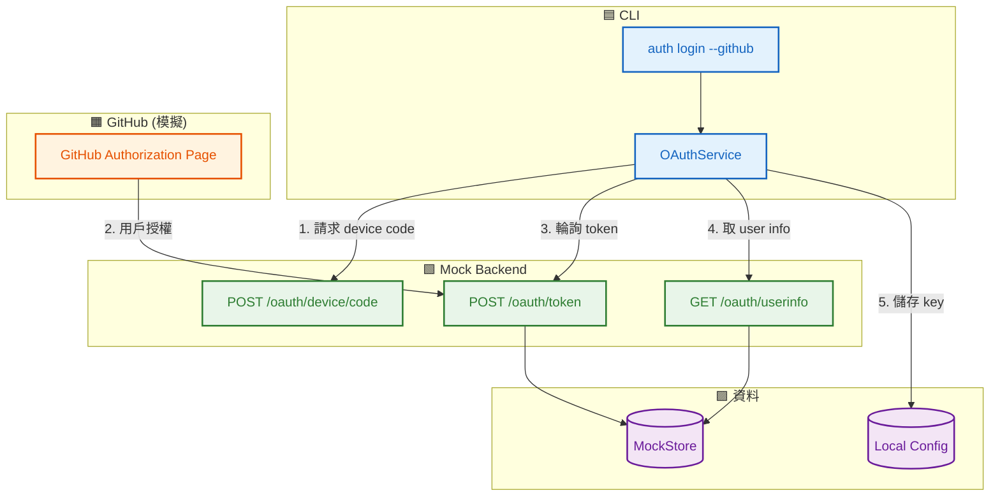
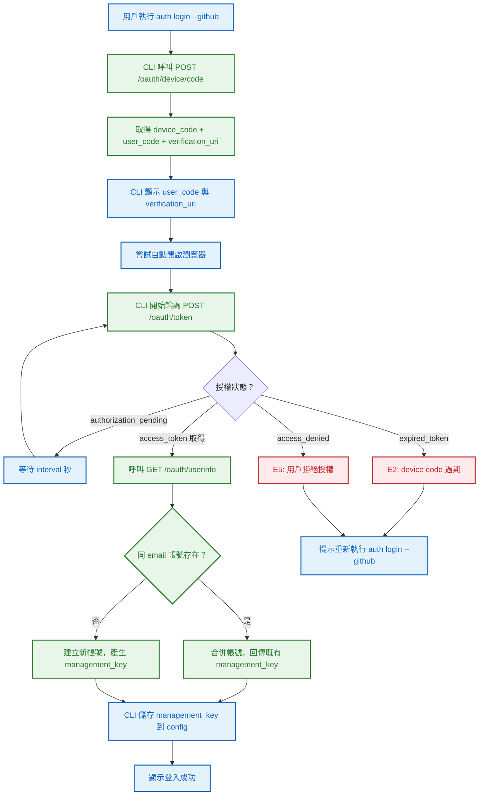
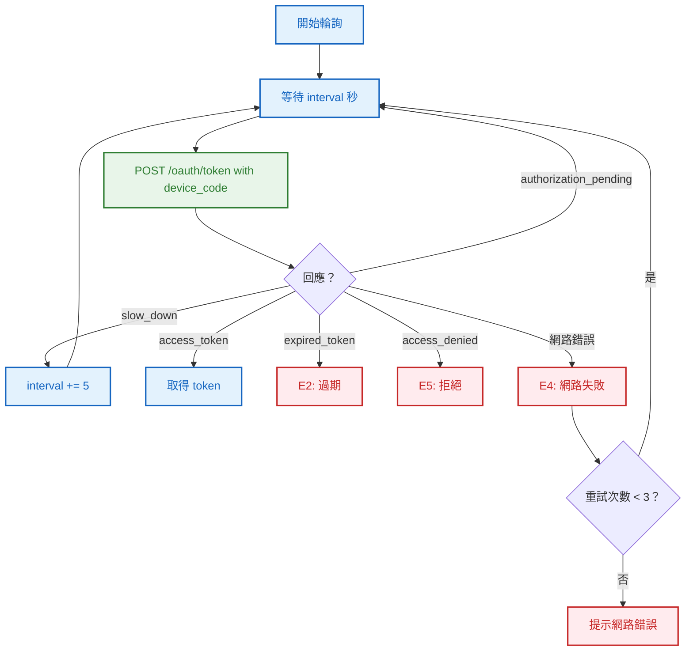
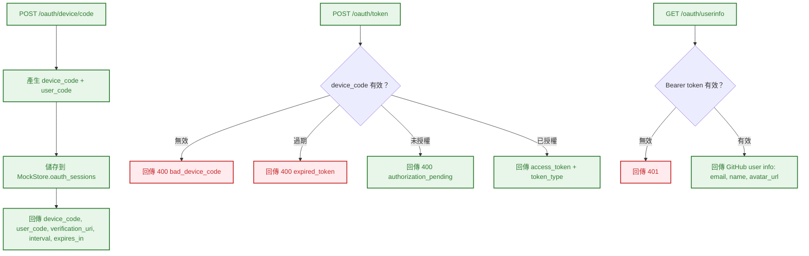
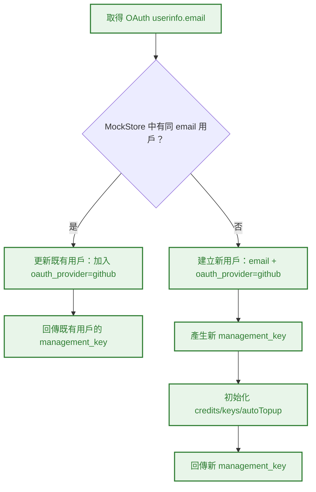
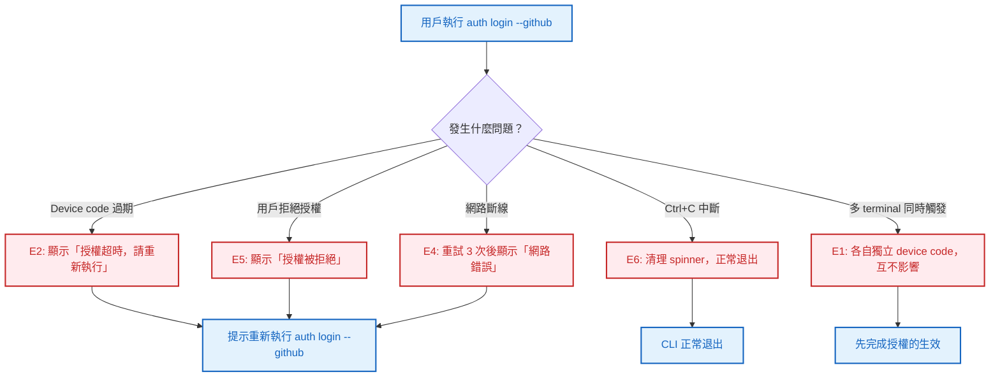

# S0 Brief Spec: OAuth Device Flow 社群登入

> **階段**: S0 需求討論
> **建立時間**: 2026-03-15 10:00
> **Agent**: requirement-analyst
> **Spec Mode**: Full Spec
> **工作類型**: new_feature

---

## 0. 工作類型

**本次工作類型**：`new_feature`

## 1. 一句話描述

在現有 email/password 登入之外，加入 GitHub OAuth Device Flow 作為替代認證方式，讓開發者可以用 `auth login --github` 一鍵登入。

## 2. 為什麼要做

### 2.1 痛點

- **開發者不想再記一組密碼**：目標用戶（agent/API 開發者）已有 GitHub 帳號，額外註冊/記密碼增加摩擦
- **CLI 登入體驗不夠現代**：業界 CLI 工具（gh、docker、stripe）都支援 OAuth，純 email/password 顯得落後

### 2.2 目標

- 提供 `auth login --github` 命令，走 Device Flow 完成 GitHub 授權
- OAuth 登入成功後換發 management_key，與現有架構無縫整合
- 同 email 帳號自動合併，不產生重複帳戶

## 3. 使用者

| 角色 | 說明 |
|------|------|
| CLI 用戶（開發者） | 使用 `auth login --github` 登入，在瀏覽器完成 GitHub 授權 |

## 4. 核心流程

### 4.0 功能區拆解（Functional Area Decomposition）

#### 功能區識別表

| FA ID | 功能區名稱 | 一句話描述 | 入口 | 獨立性 |
|-------|-----------|-----------|------|--------|
| FA-A | OAuth Device Flow | CLI 觸發 device flow、顯示 code、輪詢授權、換發 management_key | `auth login --github` | 中 |
| FA-B | Mock OAuth Backend | 模擬 GitHub device flow 端點、帳號合併邏輯 | FA-A 的 API 呼叫 | 中 |

**本次策略**：`single_sop`

#### 跨功能區依賴

| 來源 FA | 目標 FA | 依賴類型 | 說明 |
|---------|---------|---------|------|
| FA-A | FA-B | API 呼叫 | CLI device flow 呼叫 mock OAuth 端點 |
| FA-B | 既有 Auth | 資料共用 | OAuth 登入後複用既有 MockStore 的 user/config 結構 |

---

### 4.1 系統架構總覽



**架構重點**：

| 層級 | 組件 | 職責 |
|------|------|------|
| **CLI** | OAuthService | 驅動 device flow：請求 code → 顯示 → 輪詢 → 儲存 |
| **Mock Backend** | 3 個 OAuth 端點 | 模擬 GitHub device flow 回應 |
| **資料** | MockStore + Config | 帳號合併 + 本地 key 持久化 |

---

### 4.2 FA-A: OAuth Device Flow

#### 4.2.1 全局流程圖



**技術細節補充**：
- Device Flow 遵循 RFC 8628 語義（device_code, user_code, verification_uri, interval, expires_in）
- 輪詢間隔由 server 回傳的 `interval` 決定（mock 預設 5 秒）
- 自動開啟瀏覽器使用 `open`（macOS）/ `xdg-open`（Linux），失敗時不阻塞

---

#### 4.2.2 CLI 輪詢子流程（局部）



**輪詢特殊注意事項**：收到 `slow_down` 時必須增加 interval，避免被 rate limit。

---

#### 4.2.3 Happy Path 摘要

| 路徑 | 入口 | 結果 |
|------|------|------|
| **A: 新用戶 GitHub 登入** | `auth login --github` → 顯示 code → 用戶授權 → 建立帳號 | management_key 儲存，顯示「登入成功」 |
| **B: 既有用戶 GitHub 登入** | `auth login --github` → 顯示 code → 用戶授權 → 合併帳號 | 既有 management_key 儲存，顯示「登入成功（帳號已合併）」 |

---

### 4.3 FA-B: Mock OAuth Backend

#### 4.3.1 全局流程圖



**技術細節補充**：
- Mock 模式下，device code 建立後自動在 3 秒後標記為「已授權」（模擬用戶在瀏覽器完成授權）
- user_code 格式：`XXXX-XXXX`（8 字元，含中間連字號）
- verification_uri 固定為 `https://github.com/login/device`（mock 不實際開啟）

---

#### 4.3.2 帳號合併子流程（局部）



---

#### 4.3.3 Happy Path 摘要

| 路徑 | 入口 | 結果 |
|------|------|------|
| **A: 完整 device flow** | device/code → token（pending → authorized） → userinfo | 新帳號建立或既有帳號合併 |

---

### 4.4 例外流程圖



### 4.5 六維度例外清單

| 維度 | ID | FA | 情境 | 觸發條件 | 預期行為 | 嚴重度 |
|------|-----|-----|------|---------|---------|--------|
| 並行/競爭 | E1 | FA-A | 多 terminal 同時觸發 `auth login --github` | 同一用戶開多個 terminal | 各自獨立 device code，先完成授權的生效，後者覆寫 config | P2 |
| 狀態轉換 | E2 | FA-A | Device code 過期 | 用戶超過 expires_in（預設 900 秒）未完成授權 | 顯示「授權超時」，提示重新執行 | P1 |
| 資料邊界 | E3 | FA-B | OAuth email 為空 | GitHub 帳號未設定公開 email | 回傳錯誤，提示用戶在 GitHub 設定公開 email | P1 |
| 網路/外部 | E4 | FA-A | 輪詢期間網路斷線 | 網路不穩 | 重試 3 次，都失敗則顯示網路錯誤 | P1 |
| 業務邏輯 | E5 | FA-A | 用戶在 GitHub 頁面拒絕授權 | 點選「Deny」 | 顯示「授權被拒絕」，正常退出 | P1 |
| UI/體驗 | E6 | FA-A | 用戶在輪詢等待時按 Ctrl+C | 不想等了 | 清理 spinner，正常退出（不殘留 process） | P1 |

### 4.6 白話文摘要

這次改造讓用戶可以用 GitHub 帳號直接登入 CLI，不需要額外註冊密碼。執行 `auth login --github` 後，CLI 會顯示一組驗證碼和網址，用戶去瀏覽器輸入驗證碼就完成登入。

當用戶等太久沒完成授權（15 分鐘），系統會提示重來。如果用戶的 GitHub email 跟已有帳號一樣，會自動合併，不會產生重複帳號。最壞情況下（網路斷線），系統會重試幾次再提示。

## 5. 成功標準

| # | FA | 類別 | 標準 | 驗證方式 |
|---|-----|------|------|---------|
| 1 | FA-A | 功能 | `auth login --github` 觸發 device flow，顯示 user_code 和 verification_uri | 執行命令觀察輸出 |
| 2 | FA-A | 功能 | 輪詢成功後儲存 management_key 到 config | 檢查 config 檔案 |
| 3 | FA-A | 功能 | 登入後 `auth whoami` 顯示 GitHub email | 執行 whoami 驗證 |
| 4 | FA-A | UX | 自動嘗試開啟瀏覽器（失敗不阻塞） | 手動測試 |
| 5 | FA-A | UX | 輪詢期間顯示 spinner + 倒數提示 | 觀察 CLI 輸出 |
| 6 | FA-A | 錯誤處理 | device code 過期顯示友善提示 | mock 設短過期時間測試 |
| 7 | FA-A | 錯誤處理 | 用戶拒絕授權顯示友善提示 | mock 模擬 access_denied |
| 8 | FA-A | 錯誤處理 | Ctrl+C 正常退出，無殘留 process | 手動測試 |
| 9 | FA-B | 功能 | POST /oauth/device/code 回傳 device_code, user_code, verification_uri, interval, expires_in | 單元測試 |
| 10 | FA-B | 功能 | POST /oauth/token 支援 authorization_pending → access_token 狀態轉換 | 單元測試 |
| 11 | FA-B | 功能 | GET /oauth/userinfo 回傳 email, name, avatar_url | 單元測試 |
| 12 | FA-B | 功能 | 同 email 帳號自動合併，回傳既有 management_key | 整合測試 |
| 13 | FA-B | 功能 | 新 email 建立新帳號 | 整合測試 |
| 14 | 全域 | 相容性 | 現有 `auth login`（email/password）不受影響 | 執行既有測試 |
| 15 | 全域 | 相容性 | `--json` flag 輸出 valid JSON | 整合測試 |
| 16 | 全域 | 相容性 | `--mock` flag 正常運作 | 整合測試 |

## 6. 範圍

### 範圍內
- **FA-A**: `auth login --github` 命令 + OAuthService + device flow 輪詢邏輯
- **FA-A**: 自動開啟瀏覽器（best effort）
- **FA-A**: spinner + 倒數顯示
- **FA-B**: Mock OAuth 三端點（device/code、token、userinfo）
- **FA-B**: 帳號合併邏輯（同 email）
- **全域**: 單元測試 + 整合測試

### 範圍外
- 真實 GitHub OAuth App 註冊/設定
- Google / Apple / 其他 OAuth provider
- Token refresh / rotation
- Web-based 授權回調頁面
- 帳號解綁功能

## 7. 已知限制與約束

- Mock backend：device code 建立後自動 3 秒標記為已授權（簡化測試）
- 僅支援 GitHub，其他 provider 未來擴展
- 依賴現有 MockStore 結構，需新增 `oauth_sessions` 欄位
- Device Flow 依賴用戶有瀏覽器可用

## 8. 前端 UI 畫面清單

> 本功能為純 CLI，無前端畫面。省略此節。

## 9. 補充說明

### RFC 8628 Device Authorization Grant

Device Flow 核心概念：
1. CLI 向 server 請求 device_code + user_code
2. 用戶去瀏覽器輸入 user_code 授權
3. CLI 輪詢 server 直到取得 access_token
4. 用 access_token 換取 user info + management_key

### Mock 行為

為了自動化測試，mock 模式下 device code 建立 3 秒後自動標記為已授權。這讓整合測試可以直接輪詢取得 token，不需要模擬瀏覽器操作。

---

## 10. SDD Context

```json
{
  "sdd_context": {
    "version": "2.2.1",
    "feature": "oauth-device-flow",
    "spec_mode": "full_spec",
    "spec_folder": "dev/specs/2026-03-15_1_oauth-device-flow",
    "work_type": "new_feature",
    "status": "in_progress",
    "execution_mode": "autopilot",
    "current_stage": "S0",
    "started_at": "2026-03-15T10:00:00+08:00",
    "stages": {
      "s0": {
        "status": "completed",
        "agent": "requirement-analyst",
        "completed_at": "2026-03-15T10:00:00+08:00",
        "output": {
          "brief_spec_path": "dev/specs/2026-03-15_1_oauth-device-flow/s0_brief_spec.md",
          "work_type": "new_feature",
          "requirement": "加入 GitHub OAuth Device Flow 作為替代認證方式",
          "pain_points": [
            "開發者不想再記一組密碼",
            "CLI 登入體驗不夠現代"
          ],
          "goal": "提供 auth login --github 命令，走 Device Flow 完成 GitHub 授權，換發 management_key",
          "success_criteria": [
            "auth login --github 觸發 device flow",
            "輪詢成功後儲存 management_key",
            "同 email 帳號自動合併",
            "現有 auth login 不受影響",
            "--json 和 --mock flag 正常運作"
          ],
          "scope_in": [
            "FA-A: auth login --github + OAuthService + device flow",
            "FA-B: Mock OAuth 三端點 + 帳號合併",
            "全域: 單元測試 + 整合測試"
          ],
          "scope_out": [
            "真實 GitHub OAuth App",
            "其他 OAuth provider",
            "Token refresh/rotation",
            "Web 授權回調頁面",
            "帳號解綁"
          ],
          "constraints": [
            "Mock backend",
            "僅 GitHub",
            "依賴現有 MockStore",
            "Device Flow 需瀏覽器"
          ],
          "functional_areas": [
            {
              "id": "FA-A",
              "name": "OAuth Device Flow",
              "description": "CLI 觸發 device flow、顯示 code、輪詢授權、換發 management_key",
              "independence": "medium"
            },
            {
              "id": "FA-B",
              "name": "Mock OAuth Backend",
              "description": "模擬 GitHub device flow 端點、帳號合併邏輯",
              "independence": "medium"
            }
          ],
          "decomposition_strategy": "single_sop",
          "child_sops": []
        }
      }
    }
  }
}
```
