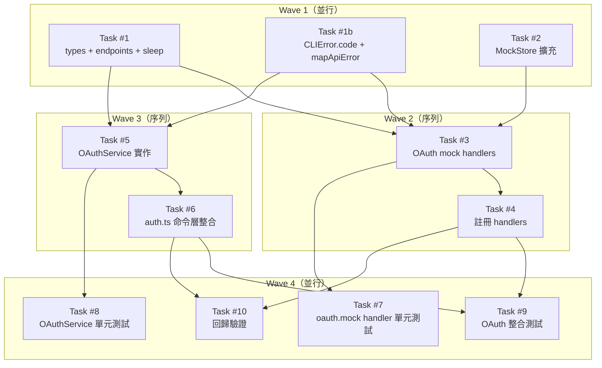

# S3 Implementation Plan: OAuth Device Flow 社群登入

> **階段**: S3 實作計畫
> **建立時間**: 2026-03-15 13:00
> **Agent**: architect
> **工作類型**: new_feature

---

## 1. 概述

### 1.1 功能目標

在現有 email/password 登入之外，加入 GitHub OAuth Device Flow（RFC 8628）作為替代認證方式。用戶執行 `auth login --github` 後，CLI 顯示 user_code 與 verification_uri，輪詢 mock backend 直到授權完成，換發 management_key 儲存至本地 config。同 email 帳號自動合併。

### 1.2 實作範圍

- **範圍內**:
  - FA-A: `auth login --github` 命令 + OAuthService + device flow 輪詢邏輯
  - FA-A: 自動開啟瀏覽器（best effort，失敗靜默忽略）
  - FA-A: spinner + 倒數顯示 + Ctrl+C 清理
  - FA-B: Mock OAuth 三端點（device/code、device/token、userinfo）
  - FA-B: 帳號合併邏輯（同 email）
  - 全域: 單元測試 + 整合測試 + 回歸驗證
- **範圍外**:
  - 真實 GitHub OAuth App 註冊/設定
  - Google / Apple / 其他 OAuth provider
  - Token refresh / rotation
  - Web-based 授權回調頁面
  - 帳號解綁功能

### 1.3 關聯文件

| 文件 | 路徑 | 狀態 |
|------|------|------|
| Brief Spec | `./s0_brief_spec.md` | ✅ |
| Dev Spec | `./s1_dev_spec.md` | ✅ |
| Review Report | `./s2_review_report.md` | ✅ conditional_pass（4 項修正已套用） |
| Implementation Plan | `./s3_implementation_plan.md` | 📝 當前 |

---

## 2. 實作任務清單

### 2.1 任務總覽

| # | 任務 | 類型 | Agent | 依賴 | 複雜度 | TDD | 狀態 |
|---|------|------|-------|------|--------|-----|------|
| 1 | 基礎設施：types + endpoints + sleep | 基礎 | `backend-expert` | — | S | ⛔ | ⬜ |
| 1b | 錯誤處理擴充：CLIError.code + mapApiError | 基礎 | `backend-expert` | — | S | ⛔ | ⬜ |
| 2 | MockStore 擴充 oauthSessions + MockUser.password 可選 | 資料層 | `backend-expert` | — | S | ✅ | ⬜ |
| 3 | OAuth mock handlers + auth.mock login password 檢查 | Mock | `backend-expert` | #1, #1b, #2 | M | ✅ | ⬜ |
| 4 | 註冊 OAuth handlers 到 router | Mock | `backend-expert` | #3 | S | ⛔ | ⬜ |
| 5 | OAuthService 實作 | 服務層 | `backend-expert` | #1, #1b | L | ✅ | ⬜ |
| 6 | auth.ts 命令層整合 | CLI | `backend-expert` | #5 | M | ✅ | ⬜ |
| 7 | OAuth mock handler 單元測試 | 測試 | `backend-expert` | #3 | M | ✅ | ⬜ |
| 8 | OAuthService 單元測試 | 測試 | `backend-expert` | #5 | M | ✅ | ⬜ |
| 9 | OAuth 整合測試 | 測試 | `backend-expert` | #4, #6 | M | ✅ | ⬜ |
| 10 | 既有測試回歸驗證 | 測試 | `backend-expert` | #4, #6 | S | ✅ | ⬜ |

**狀態圖例**：
- ⬜ pending（待處理）
- 🔄 in_progress（進行中）
- ✅ completed（已完成）
- ❌ blocked（被阻擋）
- ⏭️ skipped（跳過）

**複雜度**：S（<30min）/ M（30min-2hr）/ L（>2hr）

**TDD**: ✅ = 有 tdd_plan / ⛔ = N/A（附 skip_justification）

---

## 3. 任務詳情

### Task #1: 基礎設施 — types + endpoints + sleep

**基本資訊**
| 項目 | 內容 |
|------|------|
| 類型 | 基礎 |
| Agent | `backend-expert` |
| 複雜度 | S |
| 依賴 | — |
| 狀態 | ⬜ pending |

**描述**

新增 OAuth 相關型別定義、端點常數、以及 sleep 工具函式：

1. `src/api/types.ts`：新增 `OAuthDeviceCodeRequest`、`OAuthDeviceCodeResponse`、`OAuthDeviceTokenRequest`、`OAuthDeviceTokenResponse`、`OAuthUserInfoResponse` 共 5 個 interfaces
2. `src/api/endpoints.ts`：新增 `OAUTH_DEVICE_CODE: '/oauth/device/code'`、`OAUTH_DEVICE_TOKEN: '/oauth/device/token'`、`OAUTH_USERINFO: '/oauth/userinfo'` 共 3 個常數
3. `src/utils/sleep.ts`：新增檔案，匯出 `sleep(ms: number): Promise<void>` 與 `SleepFn = (ms: number) => Promise<void>` type

**輸入**
- 無前置依賴

**輸出**
- `src/api/types.ts`（修改）
- `src/api/endpoints.ts`（修改）
- `src/utils/sleep.ts`（新增）

**受影響檔案**
| 檔案 | 變更類型 | 說明 |
|------|---------|------|
| `src/api/types.ts` | 修改 | 新增 5 個 OAuth interfaces |
| `src/api/endpoints.ts` | 修改 | 新增 3 個 OAuth 端點常數 |
| `src/utils/sleep.ts` | 新增 | sleep 工具函式（唯一定義點） |

**DoD（完成定義）**
- [ ] `types.ts` 新增 5 個 OAuth interfaces，TypeScript 編譯通過
- [ ] `endpoints.ts` 新增 3 個 OAuth 端點常數（路徑字串完全匹配）
- [ ] `src/utils/sleep.ts` 存在，匯出 `sleep` 函式與 `SleepFn` type
- [ ] 既有 types/endpoints 不受影響（型別檢查通過）

**TDD Plan**: N/A — 純型別定義與常數新增，無可測邏輯；`sleep` 函式為單行 `Promise` 包裝，由 Task #8 的 sleepFn 注入測試覆蓋

**驗證方式**
```bash
npx tsc --noEmit
```

**實作備註**
- 所有新 interface 以 `OAuth` 前綴，避免命名衝突（見 §9.1 RR-4）
- `SleepFn` type 是依賴注入的型別簽名，Task #5 的 OAuthService 建構子使用

---

### Task #1b: 錯誤處理擴充 — CLIError.code + mapApiError 修正（SR-P0-003）

**基本資訊**
| 項目 | 內容 |
|------|------|
| 類型 | 基礎 |
| Agent | `backend-expert` |
| 複雜度 | S |
| 依賴 | — |
| 狀態 | ⬜ pending |

**描述**

修正 S2 審查發現 SR-P0-003：`mapApiError()` 吞掉 error code，導致 `pollForToken()` 無法透過 `CLIError` 區分 OAuth 錯誤類型。

1. `src/errors/base.ts`：在 `CLIError` class 新增 `code?: string` 屬性，constructor 第三個參數接受可選的 `code?: string`
2. `src/errors/api.ts`：`mapApiError()` 的 default case 改為 `return new CLIError(message ?? 'Unknown error', 1, errorCode)`，保留 errorCode

**輸入**
- 無前置依賴（可與 Task #1、#2 並行）

**輸出**
- `src/errors/base.ts`（修改）
- `src/errors/api.ts`（修改）

**受影響檔案**
| 檔案 | 變更類型 | 說明 |
|------|---------|------|
| `src/errors/base.ts` | 修改 | `CLIError` 新增 `code?: string` 屬性 |
| `src/errors/api.ts` | 修改 | `mapApiError()` default case 保留 errorCode |

**DoD（完成定義）**
- [ ] `CLIError` 有 `code?: string` 屬性，constructor 第三參數可選
- [ ] `mapApiError()` default case 將 `errorCode` 傳入 `CLIError` 第三參數
- [ ] 既有 `CLIError` 使用處不受影響（code 為可選，TypeScript 編譯通過）
- [ ] `catch (e) { if (e instanceof CLIError && e.code === 'authorization_pending') }` 能正確區分錯誤

**TDD Plan**: N/A — 純型別定義/常數新增，無可測邏輯；正確性由 Task #8 pollForToken 測試中的錯誤區分邏輯覆蓋

**驗證方式**
```bash
npx tsc --noEmit
```

**實作備註**
- `code` 為可選屬性，不破壞任何既有 `new CLIError(message, exitCode)` 呼叫
- `mapApiError()` 中 `errorCode` 變數已存在於現有程式碼，只需確認 default case 有傳入

---

### Task #2: MockStore 擴充 oauthSessions + MockUser.password 可選

**基本資訊**
| 項目 | 內容 |
|------|------|
| 類型 | 資料層 |
| Agent | `backend-expert` |
| 複雜度 | S |
| 依賴 | — |
| 狀態 | ⬜ pending |

**描述**

擴充 `src/mock/store.ts`，支援 OAuth session 追蹤與 OAuth 用戶建立：

1. 新增 `MockOAuthSession` interface（8 個欄位，詳見 dev_spec §4.2）
2. `MockStore` class 新增 `oauthSessions = new Map<string, MockOAuthSession>()`
3. `reset()` 中加入 `this.oauthSessions.clear()`（測試隔離）
4. `MockStoreState` interface 加入 `oauthSessions?: Map<string, MockOAuthSession>`
5. `MockUser` interface 新增 `oauth_provider?: string`
6. `MockUser.password` 從必填改為可選（`password?: string`）
7. 新增 helper methods：
   - `generateDeviceCode(): string` → `dc_` + 16 hex
   - `generateUserCode(): string` → `XXXX-XXXX`（隨機大寫字母）
   - `generateAccessToken(): string` → `gho_` + 20 hex

**輸入**
- 無前置依賴（可與 Task #1、#1b 並行）

**輸出**
- `src/mock/store.ts`（修改）

**受影響檔案**
| 檔案 | 變更類型 | 說明 |
|------|---------|------|
| `src/mock/store.ts` | 修改 | 新增 MockOAuthSession interface + oauthSessions Map + helper methods + password 可選 |

**DoD（完成定義）**
- [ ] `MockOAuthSession` interface 定義完整（device_code, user_code, client_id, access_token, authorized, auto_authorize_at, expires_at, email, created_at）
- [ ] `MockStore.oauthSessions` 初始化為空 Map
- [ ] `reset()` 清除 `oauthSessions`
- [ ] `MockUser.password` 為 `password?: string`（可選）
- [ ] `MockUser.oauth_provider` 為可選 string
- [ ] 三個 generate helper methods 產出正確格式
- [ ] 既有 `MockStore` 測試通過（password 可選不影響已有 `{ password: "xxx" }` 寫入）

**TDD Plan**
| 項目 | 內容 |
|------|------|
| 測試檔案 | `tests/unit/mock/store.test.ts`（既有，補充驗證） |
| 測試指令 | `npm test -- --testPathPattern="store.test"` |
| 測試案例 | `generateDeviceCode 格式正確（dc_ + 16 hex）`、`generateUserCode 格式正確（XXXX-XXXX）`、`generateAccessToken 格式正確（gho_ + 20 hex）`、`reset() 清除 oauthSessions` |

**驗證方式**
```bash
npm test -- --testPathPattern="store.test"
```

**實作備註**
- `password` 改為可選後，既有 register handler 傳入 `password` 仍正常；auth.mock 的 login handler 需在 Task #3 中同步加入 `if (!user.password)` 防禦（SR-P1-003）
- `auto_authorize_at = Date.now() + 3000`，單位是 milliseconds（mock 自動 3 秒後授權）

---

### Task #3: OAuth mock handlers + auth.mock login password 檢查

**基本資訊**
| 項目 | 內容 |
|------|------|
| 類型 | Mock |
| Agent | `backend-expert` |
| 複雜度 | M |
| 依賴 | Task #1, #1b, #2 |
| 狀態 | ⬜ pending |

**描述**

新增 `src/mock/handlers/oauth.mock.ts`，匯出 `registerOAuthHandlers(router: MockRouter): void`，實作三個端點；同時修正 `src/mock/handlers/auth.mock.ts`：

**oauth.mock.ts 三端點：**

1. **POST /oauth/device/code**：
   - 驗證 `req.body.client_id` 存在，否則回 400
   - 呼叫 `store.generateDeviceCode()`、`store.generateUserCode()`
   - 建立 `MockOAuthSession`，`auto_authorize_at = Date.now() + 3000`，`expires_at = Date.now() + 900000`
   - `store.oauthSessions.set(device_code, session)`
   - 回傳 `{ data: { device_code, user_code, verification_uri: 'https://github.com/login/device', interval: 5, expires_in: 900 } }`

2. **POST /oauth/device/token**：
   - 查 `store.oauthSessions.get(device_code)`，不存在 → 400 `bad_device_code`
   - 若 `Date.now() >= session.expires_at` → 400 `expired_token`
   - 若 `Date.now() >= session.auto_authorize_at`（且尚未授權）→ 標記 `session.authorized = true`，產生 `session.access_token = store.generateAccessToken()` → 200 `{ data: { access_token, token_type: 'bearer' } }`
   - 否則 → 400 `authorization_pending`

3. **GET /oauth/userinfo**：
   - 解析 `Authorization: Bearer {token}`，找對應的 session
   - 找不到或未授權 → 401 `UNAUTHORIZED`
   - 取 `session.email`，若為空 → 400 `EMAIL_REQUIRED`
   - 查 `store.users.get(email)`：
     - 存在：更新 `user.oauth_provider = 'github'`，回傳既有 `management_key` + `merged: true`
     - 不存在：呼叫 `store.generateManagementKey()`，建立完整新用戶（含 credits/keys/autoTopup 初始化），回傳新 `management_key` + `merged: false`

**auth.mock.ts 修正（SR-P1-003）**：
- login handler 中，查到 user 後加入 `if (!user.password) { return 400 OAUTH_ONLY_ACCOUNT }`

**輸入**
- Task #1 輸出的 OAuth types 與端點常數
- Task #1b 輸出的 CLIError.code 支援
- Task #2 輸出的 MockStore 擴充

**輸出**
- `src/mock/handlers/oauth.mock.ts`（新增）
- `src/mock/handlers/auth.mock.ts`（修改）

**受影響檔案**
| 檔案 | 變更類型 | 說明 |
|------|---------|------|
| `src/mock/handlers/oauth.mock.ts` | 新增 | OAuth 三端點 mock handler |
| `src/mock/handlers/auth.mock.ts` | 修改 | login 加 password undefined 防禦 |

**DoD（完成定義）**
- [ ] `registerOAuthHandlers` 匯出，接收 MockRouter（factory pattern，遵循 P-CLI-003）
- [ ] POST /oauth/device/code 回傳正確結構（5 欄位）
- [ ] POST /oauth/device/token 支援 `authorization_pending` → `access_token` 轉換（基於 auto_authorize_at）
- [ ] POST /oauth/device/token 處理 `expired_token`（基於 expires_at）、`bad_device_code`
- [ ] GET /oauth/userinfo 支援帳號合併（同 email，merged: true）
- [ ] GET /oauth/userinfo 支援新帳號建立（新 email，merged: false，完整初始化）
- [ ] GET /oauth/userinfo 處理 email 為空（400 EMAIL_REQUIRED）、token 無效（401）
- [ ] `management_key` 使用 `store.generateManagementKey()` 產生（P-CLI-001）
- [ ] auth.mock login handler 拒絕 password 為 undefined 的用戶

**TDD Plan**
| 項目 | 內容 |
|------|------|
| 測試檔案 | `tests/unit/mock/handlers/oauth.mock.test.ts`（新增，Task #7 實作） |
| 測試指令 | `npm test -- --testPathPattern="oauth.mock.test"` |
| 測試案例 | 見 Task #7 詳情（10 個 test case） |

**驗證方式**
```bash
npx tsc --noEmit
```

**實作備註**
- 遵循 factory pattern：`registerOAuthHandlers(router: MockRouter): void`，store 由 router 注入（P-CLI-003）
- `auto_authorize_at` 是 mock 機制，讓測試不需等待實際計時器
- 帳號合併時，不修改 user.password（TD-4：合併後 password login 仍有效）

---

### Task #4: 註冊 OAuth handlers 到 router

**基本資訊**
| 項目 | 內容 |
|------|------|
| 類型 | Mock |
| Agent | `backend-expert` |
| 複雜度 | S |
| 依賴 | Task #3 |
| 狀態 | ⬜ pending |

**描述**

在 `src/mock/index.ts` 中 import 並呼叫 `registerOAuthHandlers(defaultRouter)`，讓 mock 模式能 dispatch 到 OAuth 端點。

**輸入**
- Task #3 的 `registerOAuthHandlers` 函式

**輸出**
- `src/mock/index.ts`（修改）

**受影響檔案**
| 檔案 | 變更類型 | 說明 |
|------|---------|------|
| `src/mock/index.ts` | 修改 | 新增 import + 呼叫 registerOAuthHandlers |

**DoD（完成定義）**
- [ ] `mock/index.ts` import `registerOAuthHandlers` 並呼叫
- [ ] 既有 handler 註冊不受影響
- [ ] mock 模式可正常 dispatch 到 OAuth 端點

**TDD Plan**: N/A — 一行 import + 一行函式呼叫，無可測邏輯；由 Task #9 整合測試覆蓋端對端行為

**驗證方式**
```bash
npx tsc --noEmit
```

**實作備註**
- MockRouter 是順序匹配，新增路徑（`/oauth/*`）不與既有路徑（`/auth/*`）衝突（見 §9.1 RR-2）

---

### Task #5: OAuthService 實作

**基本資訊**
| 項目 | 內容 |
|------|------|
| 類型 | 服務層 |
| Agent | `backend-expert` |
| 複雜度 | L |
| 依賴 | Task #1, #1b |
| 狀態 | ⬜ pending |

**描述**

新增 `src/services/oauth.service.ts`，實作 `OAuthService` class，驅動 Device Flow 三階段：

**constructor**：接收 `{ mock: boolean, verbose: boolean, sleepFn?: SleepFn }` options，建立 ApiClient

**requestDeviceCode()**：
- POST `ENDPOINTS.OAUTH_DEVICE_CODE`（不帶 token，避免 P-CLI-002）
- 回傳 `OAuthDeviceCodeResponse`

**pollForToken(deviceCode: string, interval: number, expiresIn: number, signal?: AbortSignal): Promise<string>**：
- 輪詢迴圈，使用注入的 `sleepFn`（或預設 `sleep`）等待 interval 秒
- catch CLIError 後用 `error.code` 區分：
  - `authorization_pending`：繼續輪詢
  - `slow_down`：interval += 5，繼續輪詢
  - `expired_token`：拋出 `DeviceCodeExpiredError`
  - `access_denied`：拋出 `AccessDeniedError`
  - 網路錯誤：重試計數器 +1，超過 3 次則拋出 `NetworkError`
- 支援 `AbortSignal`：每次迴圈開頭檢查 `signal?.aborted`，若中止則 return

**fetchUserInfo(accessToken: string): Promise<OAuthUserInfoResponse>**：
- GET `ENDPOINTS.OAUTH_USERINFO`，帶 `Authorization: Bearer {accessToken}` header
- 不帶 token option（不走 auth interceptor）

**loginWithGitHub(): Promise<{ email: string, management_key: string, merged: boolean }>**：
- 呼叫 `requestDeviceCode()` → 顯示 user_code + verification_uri
- 嘗試開啟瀏覽器（`child_process.exec` + 平台偵測，失敗靜默忽略）
- 建立 `AbortController`，監聽 `SIGINT` 清理 spinner 後 `process.exit(0)`
- 啟動 spinner + 倒數文字更新
- 呼叫 `pollForToken()` → 取得 access_token
- 呼叫 `fetchUserInfo()` → 取得用戶資訊
- 呼叫 `ConfigManager.write({ management_key, api_base: DEFAULT_API_BASE, email, created_at: new Date().toISOString(), last_login: new Date().toISOString() })`（SR-P0-001 修正，5 個必填欄位）
- 清理 SIGINT 監聽器，停止 spinner
- 回傳 `{ email, management_key, merged }`

**輸入**
- Task #1 輸出的 OAuth types、端點常數、SleepFn type
- Task #1b 輸出的 CLIError.code（pollForToken 依賴）

**輸出**
- `src/services/oauth.service.ts`（新增）

**受影響檔案**
| 檔案 | 變更類型 | 說明 |
|------|---------|------|
| `src/services/oauth.service.ts` | 新增 | OAuthService 完整實作 |

**DoD（完成定義）**
- [ ] `OAuthService` class 匯出
- [ ] `requestDeviceCode()` 正確呼叫 API（不帶 token）
- [ ] `pollForToken()` 處理 5 種回應狀態（透過 `CLIError.code` 區分）
- [ ] `pollForToken()` 支援 `sleepFn` 注入
- [ ] `pollForToken()` 網路錯誤重試 3 次後拋錯
- [ ] `pollForToken()` 支援 AbortSignal 中止
- [ ] `fetchUserInfo()` 正確呼叫 API（Bearer token）
- [ ] `loginWithGitHub()` 整合完整流程
- [ ] Config 寫入帶齊 5 個必填欄位（management_key, api_base, email, created_at, last_login）
- [ ] Ctrl+C 清理 spinner，process.exit(0)

**TDD Plan**
| 項目 | 內容 |
|------|------|
| 測試檔案 | `tests/unit/services/oauth.service.test.ts`（新增，Task #8 實作） |
| 測試指令 | `npm test -- --testPathPattern="oauth.service.test"` |
| 測試案例 | 見 Task #8 詳情（8 個 test case） |

**驗證方式**
```bash
npx tsc --noEmit
```

**實作備註**
- `sleepFn` 預設值：`sleepFn = sleep`（import from `src/utils/sleep.ts`），測試時注入 `() => Promise.resolve()`
- 瀏覽器開啟：`switch (process.platform) { case 'darwin': exec('open ...'); case 'linux': exec('xdg-open ...'); default: exec('start ...') }`，try/catch 靜默忽略
- `DEFAULT_API_BASE` 從 `src/config/paths.ts`（或對應常數檔）import

---

### Task #6: auth.ts 命令層整合

**基本資訊**
| 項目 | 內容 |
|------|------|
| 類型 | CLI |
| Agent | `backend-expert` |
| 複雜度 | M |
| 依賴 | Task #5 |
| 狀態 | ⬜ pending |

**描述**

修改 `src/commands/auth.ts`，在 login subcommand 加入 `--github` option：

1. `.option('--github', 'Login with GitHub (OAuth Device Flow)')`
2. action handler 中讀 `opts.github`：
   - `true` → 建立 `new OAuthService({ mock: opts.mock, verbose: opts.verbose })`，呼叫 `loginWithGitHub()`
   - `false`/`undefined` → 走現有 email/password 流程（不改任何既有邏輯）
3. `--json` 支援：OAuth 結果也 output JSON（`{ management_key, email, merged }`）
4. import OAuthService from `../services/oauth.service`

**輸入**
- Task #5 的 OAuthService

**輸出**
- `src/commands/auth.ts`（修改）

**受影響檔案**
| 檔案 | 變更類型 | 說明 |
|------|---------|------|
| `src/commands/auth.ts` | 修改 | login 加 --github option + OAuthService 呼叫 |

**DoD（完成定義）**
- [ ] `auth login --github` 觸發 OAuth flow
- [ ] `auth login`（無 flag）行為完全不變
- [ ] `--json` 搭配 `--github` 輸出 valid JSON（含 management_key 和 email）
- [ ] TypeScript 編譯通過

**TDD Plan**
| 項目 | 內容 |
|------|------|
| 測試檔案 | `tests/integration/oauth.test.ts`（Task #9 實作） |
| 測試指令 | `npm test -- --testPathPattern="oauth.test"` |
| 測試案例 | `--json 輸出 valid JSON`（AC-15）、`auth login 不帶 --github 行為不變`（AC-14） |

**驗證方式**
```bash
npx tsc --noEmit
```

**實作備註**
- Commander.js boolean option 不帶值時為 `undefined`，action 內以 `if (opts.github)` 判斷即可（見 §9.1 RR-1）
- 既有 login 邏輯放在 `else` 分支，不改任何現有程式碼

---

### Task #7: OAuth mock handler 單元測試

**基本資訊**
| 項目 | 內容 |
|------|------|
| 類型 | 測試 |
| Agent | `backend-expert` |
| 複雜度 | M |
| 依賴 | Task #3 |
| 狀態 | ⬜ pending |

**描述**

新增 `tests/unit/mock/handlers/oauth.mock.test.ts`，直接測試 mock handler 端點行為，使用獨立 MockRouter + MockStore：

| # | 測試案例 | 覆蓋 AC |
|---|---------|--------|
| 1 | POST /oauth/device/code — 成功回傳 device_code + user_code + verification_uri + interval + expires_in | AC-9 |
| 2 | POST /oauth/device/code — 無 client_id 回 400 | — |
| 3 | POST /oauth/device/token — authorization_pending（auto_authorize_at 尚未到達） | AC-10 |
| 4 | POST /oauth/device/token — access_token（直接操作 session.auto_authorize_at = Date.now() - 1） | AC-10 |
| 5 | POST /oauth/device/token — expired_token（session.expires_at < Date.now()） | — |
| 6 | POST /oauth/device/token — bad_device_code（device_code 不存在） | — |
| 7 | GET /oauth/userinfo — 新用戶建立（回傳 management_key + merged: false） | AC-11, AC-13 |
| 8 | GET /oauth/userinfo — 既有用戶合併（同 email，回傳既有 key + merged: true） | AC-11, AC-12 |
| 9 | GET /oauth/userinfo — email 為空 → 400 EMAIL_REQUIRED | — |
| 10 | GET /oauth/userinfo — token 無效 → 401 | — |

**輸入**
- Task #3 的 `registerOAuthHandlers`

**輸出**
- `tests/unit/mock/handlers/oauth.mock.test.ts`（新增）

**受影響檔案**
| 檔案 | 變更類型 | 說明 |
|------|---------|------|
| `tests/unit/mock/handlers/oauth.mock.test.ts` | 新增 | 10 個 test case |

**DoD（完成定義）**
- [ ] 10 個 test case 全部通過
- [ ] 使用獨立 MockRouter + MockStore（不共用全局 instance，P-CLI-003）
- [ ] 每個 test case 有 `beforeEach` 呼叫 `store.reset()` 確保隔離
- [ ] test case #4 直接操作 `session.auto_authorize_at = Date.now() - 1` 控制時間（不使用 fake timer）

**TDD Plan**
| 項目 | 內容 |
|------|------|
| 測試檔案 | `tests/unit/mock/handlers/oauth.mock.test.ts` |
| 測試指令 | `npm test -- --testPathPattern="oauth.mock.test"` |
| 預期失敗測試（TDD 先寫） | 全部 10 個（Task #3 完成後才會通過） |

**驗證方式**
```bash
npm test -- --testPathPattern="oauth.mock.test"
```

**實作備註**
- 測試可直接操作 `store.oauthSessions.get(device_code)` 修改 `auto_authorize_at`，避免等待計時器
- 測試 #7（新用戶建立）需驗證 management_key 格式（`/^sk-mgmt-[0-9a-f-]{36}$/`）

---

### Task #8: OAuthService 單元測試

**基本資訊**
| 項目 | 內容 |
|------|------|
| 類型 | 測試 |
| Agent | `backend-expert` |
| 複雜度 | M |
| 依賴 | Task #5 |
| 狀態 | ⬜ pending |

**描述**

新增 `tests/unit/services/oauth.service.test.ts`，測試 OAuthService 各方法的行為，使用 mock 模式 + sleepFn 注入：

| # | 測試案例 | 覆蓋 AC |
|---|---------|--------|
| 1 | requestDeviceCode() — 成功回傳 DeviceCodeResponse | AC-9 |
| 2 | pollForToken() — authorization_pending → access_token（sleepFn mock） | AC-10 |
| 3 | pollForToken() — slow_down 增加 interval（sleepFn mock） | — |
| 4 | pollForToken() — expired_token 拋出適當錯誤 | AC-6 |
| 5 | pollForToken() — access_denied 拋出適當錯誤 | AC-7 |
| 6 | pollForToken() — 網路錯誤重試 3 次後拋錯 | — |
| 7 | fetchUserInfo() — 成功回傳 UserInfoResponse | AC-11 |
| 8 | fetchUserInfo() — email 為空（400 EMAIL_REQUIRED）拋錯 | — |

**輸入**
- Task #5 的 `OAuthService`

**輸出**
- `tests/unit/services/oauth.service.test.ts`（新增）

**受影響檔案**
| 檔案 | 變更類型 | 說明 |
|------|---------|------|
| `tests/unit/services/oauth.service.test.ts` | 新增 | 8 個 test case |

**DoD（完成定義）**
- [ ] 8 個 test case 全部通過
- [ ] `sleepFn` 注入為 `() => Promise.resolve()`，測試毫秒級完成
- [ ] mock 模式測試，不依賴外部服務
- [ ] test case #6 驗證「第 4 次網路錯誤才拋錯」（前 3 次繼續）

**TDD Plan**
| 項目 | 內容 |
|------|------|
| 測試檔案 | `tests/unit/services/oauth.service.test.ts` |
| 測試指令 | `npm test -- --testPathPattern="oauth.service.test"` |
| 預期失敗測試（TDD 先寫） | 全部 8 個（Task #5 完成後才會通過） |

**驗證方式**
```bash
npm test -- --testPathPattern="oauth.service.test"
```

**實作備註**
- 建立 OAuthService 時傳入 `{ mock: true, verbose: false, sleepFn: () => Promise.resolve() }`
- 使用 mock 模式讓 axios 請求走 MockRouter

---

### Task #9: OAuth 整合測試

**基本資訊**
| 項目 | 內容 |
|------|------|
| 類型 | 測試 |
| Agent | `backend-expert` |
| 複雜度 | M |
| 依賴 | Task #4, #6 |
| 狀態 | ⬜ pending |

**描述**

新增 `tests/integration/oauth.test.ts`，測試完整端對端流程（CLI → OAuthService → MockHandler → MockStore → ConfigManager）：

| # | 測試案例 | 覆蓋 AC |
|---|---------|--------|
| 1 | GitHub 登入完整流程（新用戶）：loginWithGitHub() → config 寫入 → management_key 格式正確 | AC-1, AC-2, AC-16 |
| 2 | GitHub 登入帳號合併：先 register email/password → loginWithGitHub 同 email → 回傳既有 key + merged: true | AC-12 |
| 3 | GitHub 登入後 whoami 正常 | AC-3 |
| 4 | `--json` 輸出 valid JSON | AC-15 |
| 5 | 合併後 password login 仍有效 | AC-14（間接） |

**輸入**
- Task #4 的完整 mock handler 路由
- Task #6 的 auth.ts CLI 整合

**輸出**
- `tests/integration/oauth.test.ts`（新增）

**受影響檔案**
| 檔案 | 變更類型 | 說明 |
|------|---------|------|
| `tests/integration/oauth.test.ts` | 新增 | 5 個整合測試 |

**DoD（完成定義）**
- [ ] 5 個整合測試通過
- [ ] 使用 temp config dir 隔離（每個 test 獨立目錄）
- [ ] `sleepFn` 注入加速輪詢（不需真實等待）
- [ ] `beforeEach` 呼叫 `mockStore.reset()`

**TDD Plan**
| 項目 | 內容 |
|------|------|
| 測試檔案 | `tests/integration/oauth.test.ts` |
| 測試指令 | `npm test -- --testPathPattern="oauth.test"` |
| 預期失敗測試（TDD 先寫） | 全部 5 個（Task #4 + #6 完成後才會通過） |

**驗證方式**
```bash
npm test -- --testPathPattern="oauth.test"
```

**實作備註**
- 整合測試中，`loginWithGitHub()` 的 sleepFn 注入需透過 OAuthService constructor 傳入
- management_key 格式驗證：`/^sk-mgmt-[0-9a-f]{8}-[0-9a-f]{4}-[0-9a-f]{4}-[0-9a-f]{4}-[0-9a-f]{12}$/`

---

### Task #10: 既有測試回歸驗證

**基本資訊**
| 項目 | 內容 |
|------|------|
| 類型 | 測試 |
| Agent | `backend-expert` |
| 複雜度 | S |
| 依賴 | Task #4, #6 |
| 狀態 | ⬜ pending |

**描述**

執行全量測試，驗證本次變更不引入回歸。重點關注：
1. `tests/integration/auth.test.ts`：`auth login`（不帶 `--github`）行為不變（AC-14）
2. `tests/unit/mock/handlers/auth.mock.test.ts`：mock router 不受 OAuth handler 影響
3. `tests/unit/mock/store.test.ts`：`reset()` 行為不受 oauthSessions 影響

**輸入**
- 全部實作任務（#1 ~ #9）完成

**輸出**
- 測試報告（通過/失敗摘要）

**受影響檔案**
| 檔案 | 變更類型 | 說明 |
|------|---------|------|
| （無新增檔案） | — | 執行既有測試 |

**DoD（完成定義）**
- [ ] 全量測試通過，零失敗
- [ ] 無新增 TypeScript warning
- [ ] `tests/integration/auth.test.ts` 特別確認通過

**TDD Plan**
| 項目 | 內容 |
|------|------|
| 測試檔案 | 全量（既有 + 新增） |
| 測試指令 | `npm test` |
| 重點驗證 | auth.test.ts（email/password login 回歸）、auth.mock.test.ts（handler 路由不衝突） |

**驗證方式**
```bash
npm test
npx tsc --noEmit
```

---

## 4. 依賴關係圖



---

## 5. 執行順序與 Agent 分配

### 5.1 執行波次

| 波次 | 任務 | Agent | 可並行 | 備註 |
|------|------|-------|--------|------|
| Wave 1 | #1 | `backend-expert` | 是 | types + endpoints + sleep |
| Wave 1 | #1b | `backend-expert` | 是（與 #1、#2 並行） | CLIError.code（SR-P0-003 修正） |
| Wave 1 | #2 | `backend-expert` | 是（與 #1、#1b 並行） | MockStore 擴充 |
| Wave 2 | #3 | `backend-expert` | 否 | 依賴 #1, #1b, #2 |
| Wave 2 | #4 | `backend-expert` | 否（依賴 #3） | 一行 import + 呼叫 |
| Wave 3 | #5 | `backend-expert` | 否（依賴 #1, #1b） | OAuthService 核心實作 |
| Wave 3 | #6 | `backend-expert` | 否（依賴 #5） | auth.ts 整合 |
| Wave 4 | #7 | `backend-expert` | 是 | 依賴 #3 |
| Wave 4 | #8 | `backend-expert` | 是（與 #7、#9、#10 並行） | 依賴 #5 |
| Wave 4 | #9 | `backend-expert` | 是（與 #7、#8、#10 並行） | 依賴 #4、#6 |
| Wave 4 | #10 | `backend-expert` | 是（與 #7、#8、#9 並行） | 依賴 #4、#6 |

> Wave 4 中 #7、#8、#9、#10 技術上可並行，但若前序 task 尚未完成則各自等待各自的依賴。

### 5.2 Agent 調度指令

```
# Wave 1（三個任務可並行）

Task(
  subagent_type: "backend-expert",
  prompt: "實作 Task #1: 基礎設施 — types + endpoints + sleep\n\n詳見 dev/specs/2026-03-15_1_oauth-device-flow/s3_implementation_plan.md §3 Task #1\n\nDoD:\n- src/api/types.ts 新增 5 個 OAuth interfaces\n- src/api/endpoints.ts 新增 3 個 OAuth 端點常數\n- src/utils/sleep.ts 新增，匯出 sleep + SleepFn\n- npx tsc --noEmit 通過",
  description: "S4-T1 基礎設施"
)

Task(
  subagent_type: "backend-expert",
  prompt: "實作 Task #1b: 錯誤處理擴充 — CLIError.code + mapApiError 修正\n\n詳見 dev/specs/2026-03-15_1_oauth-device-flow/s3_implementation_plan.md §3 Task #1b\n\nDoD:\n- CLIError 新增 code?: string 屬性\n- mapApiError() default case 保留 errorCode 參數\n- npx tsc --noEmit 通過",
  description: "S4-T1b 錯誤處理擴充"
)

Task(
  subagent_type: "backend-expert",
  prompt: "實作 Task #2: MockStore 擴充 oauthSessions + MockUser.password 可選\n\n詳見 dev/specs/2026-03-15_1_oauth-device-flow/s3_implementation_plan.md §3 Task #2\n\nDoD:\n- MockOAuthSession interface 定義完整\n- MockStore.oauthSessions Map + reset() 清除\n- MockUser.password 改為可選\n- 三個 generate helper methods\n- npm test -- --testPathPattern=\"store.test\" 通過",
  description: "S4-T2 MockStore 擴充"
)

# Wave 2（序列）

Task(
  subagent_type: "backend-expert",
  prompt: "實作 Task #3: OAuth mock handlers + auth.mock login password 檢查\n\n詳見 dev/specs/2026-03-15_1_oauth-device-flow/s3_implementation_plan.md §3 Task #3\n\nDoD:\n- src/mock/handlers/oauth.mock.ts 新增（factory pattern）\n- 三端點完整實作（device/code, device/token, userinfo）\n- auth.mock.ts login 加 password undefined 防禦\n- npx tsc --noEmit 通過",
  description: "S4-T3 OAuth mock handlers"
)

Task(
  subagent_type: "backend-expert",
  prompt: "實作 Task #4: 註冊 OAuth handlers 到 router\n\n詳見 dev/specs/2026-03-15_1_oauth-device-flow/s3_implementation_plan.md §3 Task #4\n\nDoD:\n- mock/index.ts import + 呼叫 registerOAuthHandlers\n- npx tsc --noEmit 通過",
  description: "S4-T4 註冊 OAuth handlers"
)

# Wave 3（序列）

Task(
  subagent_type: "backend-expert",
  prompt: "實作 Task #5: OAuthService 實作\n\n詳見 dev/specs/2026-03-15_1_oauth-device-flow/s3_implementation_plan.md §3 Task #5\n\nDoD:\n- src/services/oauth.service.ts 新增\n- requestDeviceCode / pollForToken / fetchUserInfo / loginWithGitHub 完整實作\n- Config 寫入 5 個必填欄位\n- sleepFn 依賴注入\n- npx tsc --noEmit 通過",
  description: "S4-T5 OAuthService 實作"
)

Task(
  subagent_type: "backend-expert",
  prompt: "實作 Task #6: auth.ts 命令層整合\n\n詳見 dev/specs/2026-03-15_1_oauth-device-flow/s3_implementation_plan.md §3 Task #6\n\nDoD:\n- login subcommand 加 --github option\n- --github → OAuthService.loginWithGitHub()\n- 無 --github → 既有流程不變\n- --json 支援\n- npx tsc --noEmit 通過",
  description: "S4-T6 auth.ts 整合"
)

# Wave 4（四個任務可並行）

Task(
  subagent_type: "backend-expert",
  prompt: "實作 Task #7: OAuth mock handler 單元測試\n\n詳見 dev/specs/2026-03-15_1_oauth-device-flow/s3_implementation_plan.md §3 Task #7\n\nDoD:\n- tests/unit/mock/handlers/oauth.mock.test.ts 新增\n- 10 個 test case 全部通過\n- npm test -- --testPathPattern=\"oauth.mock.test\" 通過",
  description: "S4-T7 oauth.mock handler 單元測試"
)

Task(
  subagent_type: "backend-expert",
  prompt: "實作 Task #8: OAuthService 單元測試\n\n詳見 dev/specs/2026-03-15_1_oauth-device-flow/s3_implementation_plan.md §3 Task #8\n\nDoD:\n- tests/unit/services/oauth.service.test.ts 新增\n- 8 個 test case 全部通過（sleepFn mock）\n- npm test -- --testPathPattern=\"oauth.service.test\" 通過",
  description: "S4-T8 OAuthService 單元測試"
)

Task(
  subagent_type: "backend-expert",
  prompt: "實作 Task #9: OAuth 整合測試\n\n詳見 dev/specs/2026-03-15_1_oauth-device-flow/s3_implementation_plan.md §3 Task #9\n\nDoD:\n- tests/integration/oauth.test.ts 新增\n- 5 個整合測試通過\n- npm test -- --testPathPattern=\"oauth.test\" 通過",
  description: "S4-T9 OAuth 整合測試"
)

Task(
  subagent_type: "backend-expert",
  prompt: "執行 Task #10: 既有測試回歸驗證\n\n詳見 dev/specs/2026-03-15_1_oauth-device-flow/s3_implementation_plan.md §3 Task #10\n\nDoD:\n- npm test 全量通過，零失敗\n- 無新增 TypeScript warning\n- tests/integration/auth.test.ts 特別確認通過",
  description: "S4-T10 回歸驗證"
)
```

---

## 6. AC 覆蓋對照表

| AC# | 描述 | 覆蓋任務 | 測試層級 |
|-----|------|---------|---------|
| AC-1 | auth login --github 顯示 user_code + verification_uri | #5, #6, #9 | 整合 |
| AC-2 | 登入成功儲存 management_key | #5, #9 | 整合 |
| AC-3 | whoami 顯示 GitHub email | #5, #9 | 整合 |
| AC-4 | 自動開啟瀏覽器（best effort） | #5 | 手動 |
| AC-5 | spinner + 倒數 | #5 | 手動 |
| AC-6 | device code 過期提示 | #5, #8 | 單元 |
| AC-7 | 用戶拒絕授權提示 | #5, #8 | 單元 |
| AC-8 | Ctrl+C 正常退出 | #5 | 手動 |
| AC-9 | device/code 回傳完整結構 | #3, #7, #8 | 單元 |
| AC-10 | device/token 狀態轉換 | #3, #7, #8 | 單元 |
| AC-11 | userinfo 回傳用戶資訊 | #3, #7, #8 | 單元 |
| AC-12 | 同 email 帳號合併 | #3, #7, #9 | 單元+整合 |
| AC-13 | 新 email 建立新帳號 | #3, #7, #9 | 單元+整合 |
| AC-14 | 現有 auth login 不受影響 | #6, #10 | 回歸 |
| AC-15 | --json 輸出 valid JSON | #6, #9 | 整合 |
| AC-16 | --mock 正常運作 | #4, #9 | 整合 |

**覆蓋率**：16/16 AC（100%）。AC-4、AC-5、AC-8 為 UX 行為，無法自動化，需手動驗證。

---

## 7. 驗證計畫

### 7.1 逐任務驗證

| 任務 | 驗證指令 | 預期結果 |
|------|---------|---------|
| #1, #1b | `npx tsc --noEmit` | 零 TypeScript 錯誤 |
| #2 | `npm test -- --testPathPattern="store.test"` | 全部通過 |
| #3, #4 | `npx tsc --noEmit` | 零 TypeScript 錯誤 |
| #5, #6 | `npx tsc --noEmit` | 零 TypeScript 錯誤 |
| #7 | `npm test -- --testPathPattern="oauth.mock.test"` | 10/10 通過 |
| #8 | `npm test -- --testPathPattern="oauth.service.test"` | 8/8 通過 |
| #9 | `npm test -- --testPathPattern="oauth.test"` | 5/5 通過 |
| #10 | `npm test` | 全量通過，零失敗 |

### 7.2 整體驗證

```bash
# TypeScript 型別檢查
npx tsc --noEmit

# 全量測試
npm test

# 新增測試確認
npm test -- --testPathPattern="(oauth|store)"
```

---

## 8. 實作進度追蹤

### 8.1 進度總覽

| 指標 | 數值 |
|------|------|
| 總任務數 | 11 |
| 已完成 | 0 |
| 進行中 | 0 |
| 待處理 | 11 |
| 完成率 | 0% |

### 8.2 時間軸

| 時間 | 事件 | 備註 |
|------|------|------|
| 2026-03-15 13:00 | S3 計畫產出 | |
| | | |

---

## 9. 風險與問題追蹤

### 9.1 已識別風險（繼承自 dev_spec）

| # | 風險 | 影響 | 緩解措施 | 狀態 |
|---|------|------|---------|------|
| R1 | MockStore stateless 策略與帳號合併衝突 | 高 | 合併邏輯在 userinfo handler 中直接操作 `store.users` Map，不改 `getEmailForToken()` | 監控中 |
| R2 | 輪詢測試穩定性 | 高 | sleep 依賴注入，測試注入 `() => Promise.resolve()` | 監控中 |
| R3 | Axios LIFO interceptor | 中 | OAuth 呼叫不帶 token option，不觸發 auth interceptor（P-CLI-002） | 監控中 |
| R4 | management_key 格式不符 | 高 | 統一使用 `store.generateManagementKey()` | 監控中 |
| R5 | mock handler 未用 factory pattern | 中 | 嚴格遵循 `registerXxxHandlers(router)` 模式（P-CLI-003） | 監控中 |

### 9.2 回歸風險矩陣

| # | 風險描述 | 受影響測試 | 驗證方式 |
|---|---------|-----------|---------|
| RR-1 | `auth login` 加 `--github` option 後不帶 flag 的行為改變 | `tests/integration/auth.test.ts` | Task #10 全量測試 |
| RR-2 | `mock/index.ts` 新增 handler 影響路由匹配順序 | 所有 mock handler 測試 | Task #10 + 路徑不重疊確認 |
| RR-3 | `MockStore.reset()` 改動影響既有測試 | `tests/unit/mock/store.test.ts` | Task #2 驗證後 Task #10 確認 |
| RR-4 | `types.ts` 新增 interface 造成命名衝突 | 編譯時期 | `npx tsc --noEmit` |
| RR-5 | `CLIError` 新增 `code` 屬性影響既有 error handling | 所有 CLIError 使用處 | Task #1b 後 `npx tsc --noEmit` |

### 9.3 問題記錄

| # | 問題 | 發現時間 | 狀態 | 解決方案 |
|---|------|---------|------|---------|
| — | — | — | — | — |

---

## 10. 變更記錄

### 10.1 檔案變更清單

```
新增（6 個）:
  src/services/oauth.service.ts
  src/mock/handlers/oauth.mock.ts
  src/utils/sleep.ts
  tests/unit/mock/handlers/oauth.mock.test.ts
  tests/unit/services/oauth.service.test.ts
  tests/integration/oauth.test.ts

修改（8 個）:
  src/commands/auth.ts
  src/mock/index.ts
  src/api/endpoints.ts
  src/api/types.ts
  src/mock/store.ts
  src/errors/base.ts
  src/errors/api.ts
  src/mock/handlers/auth.mock.ts
```

### 10.2 Commit 記錄

| Commit | 訊息 | 關聯任務 |
|--------|------|---------|
| （待實作後填寫） | | |

---

## 附錄

### A. 相關文件
- S0 Brief Spec: `./s0_brief_spec.md`
- S1 Dev Spec: `./s1_dev_spec.md`
- S2 Review Report: `./s2_review_report.md`

### B. 關鍵設計守則提醒

| 守則 | 說明 | 適用任務 |
|------|------|---------|
| P-CLI-001 | management_key 必須用 `store.generateManagementKey()` 產生 | #3 |
| P-CLI-002 | 不需認證的 API 呼叫不帶 token option，避免 auth interceptor | #5 |
| P-CLI-003 | mock handler 必須用 `registerXxxHandlers(router)` factory pattern | #3 |
| P-CLI-004 | sleep/delay 函式必須可注入，不在 service 內硬定義 | #1, #5 |
| SR-P0-001 | ConfigManager.write() 必須帶齊 5 個必填欄位 | #5 |
| SR-P0-003 | CLIError.code 擴充，pollForToken 用 code 區分 OAuth 錯誤 | #1b, #5 |
| SR-P1-003 | MockUser.password 可選，login handler 加 undefined 防禦 | #2, #3 |

### C. 技術決策快速參照

| TD | 決定 | 理由 |
|----|------|------|
| TD-1 | OAuth 端點用自訂路徑 `/oauth/*` | mock 不等於 GitHub API，語義清楚 |
| TD-2 | 帳號合併在 userinfo handler 中直接操作 `store.users` | 最小變更，不改既有 `getEmailForToken()` |
| TD-3 | 瀏覽器開啟用 `child_process.exec` + 平台偵測 | MVP 不需額外依賴 |
| TD-4 | 合併後 password login 仍有效 | 合併是「加入 oauth_provider」，不取代既有認證 |
| TD-5 | `reset()` 清除 oauthSessions | 測試隔離需求 |
| TD-6 | sleep 定義在 `src/utils/sleep.ts`，OAuthService 建構子注入 | 避免重複定義，測試可控 |

---

## SDD Context

```json
{
  "sdd_context": {
    "stages": {
      "s3": {
        "status": "pending_confirmation",
        "agent": "architect",
        "completed_at": "2026-03-15T13:00:00+08:00",
        "output": {
          "implementation_plan_path": "dev/specs/2026-03-15_1_oauth-device-flow/s3_implementation_plan.md",
          "waves": [
            {
              "wave": 1,
              "name": "基礎設施（並行）",
              "parallel": true,
              "tasks": [
                {
                  "id": 1, "name": "基礎設施：types + endpoints + sleep",
                  "agent": "backend-expert", "dependencies": [], "complexity": "S",
                  "dod": ["5 個 OAuth interfaces", "3 個端點常數", "sleep.ts 存在"],
                  "parallel": true,
                  "affected_files": ["src/api/types.ts", "src/api/endpoints.ts", "src/utils/sleep.ts"],
                  "tdd_plan": null,
                  "skip_justification": "純型別定義/常數新增，無可測邏輯"
                },
                {
                  "id": "1b", "name": "錯誤處理擴充：CLIError.code + mapApiError",
                  "agent": "backend-expert", "dependencies": [], "complexity": "S",
                  "dod": ["CLIError.code?: string", "mapApiError default case 保留 errorCode"],
                  "parallel": true,
                  "affected_files": ["src/errors/base.ts", "src/errors/api.ts"],
                  "tdd_plan": null,
                  "skip_justification": "純型別定義/常數新增，無可測邏輯"
                },
                {
                  "id": 2, "name": "MockStore 擴充 oauthSessions + MockUser.password 可選",
                  "agent": "backend-expert", "dependencies": [], "complexity": "S",
                  "dod": ["MockOAuthSession interface", "oauthSessions Map", "reset() 清除", "三個 generate helpers"],
                  "parallel": true,
                  "affected_files": ["src/mock/store.ts"],
                  "tdd_plan": {
                    "test_file": "tests/unit/mock/store.test.ts",
                    "test_cases": ["generateDeviceCode 格式", "generateUserCode 格式", "generateAccessToken 格式", "reset 清除 oauthSessions"],
                    "test_command": "npm test -- --testPathPattern=\"store.test\""
                  }
                }
              ]
            },
            {
              "wave": 2,
              "name": "Mock Backend",
              "parallel": false,
              "tasks": [
                {
                  "id": 3, "name": "OAuth mock handlers + auth.mock login password 檢查",
                  "agent": "backend-expert", "dependencies": [1, "1b", 2], "complexity": "M",
                  "dod": ["registerOAuthHandlers factory pattern", "三端點完整實作", "auth.mock password 防禦"],
                  "parallel": false,
                  "affected_files": ["src/mock/handlers/oauth.mock.ts", "src/mock/handlers/auth.mock.ts"],
                  "tdd_plan": {
                    "test_file": "tests/unit/mock/handlers/oauth.mock.test.ts",
                    "test_cases": ["10 個 test case（Task #7 實作）"],
                    "test_command": "npm test -- --testPathPattern=\"oauth.mock.test\""
                  }
                },
                {
                  "id": 4, "name": "註冊 OAuth handlers 到 router",
                  "agent": "backend-expert", "dependencies": [3], "complexity": "S",
                  "dod": ["mock/index.ts import + 呼叫"],
                  "parallel": false,
                  "affected_files": ["src/mock/index.ts"],
                  "tdd_plan": null,
                  "skip_justification": "一行 import + 呼叫，由 Task #9 整合測試覆蓋"
                }
              ]
            },
            {
              "wave": 3,
              "name": "服務層 + CLI",
              "parallel": false,
              "tasks": [
                {
                  "id": 5, "name": "OAuthService 實作",
                  "agent": "backend-expert", "dependencies": [1, "1b"], "complexity": "L",
                  "dod": ["requestDeviceCode/pollForToken/fetchUserInfo/loginWithGitHub", "Config 5 欄位", "sleepFn 注入"],
                  "parallel": false,
                  "affected_files": ["src/services/oauth.service.ts"],
                  "tdd_plan": {
                    "test_file": "tests/unit/services/oauth.service.test.ts",
                    "test_cases": ["8 個 test case（Task #8 實作）"],
                    "test_command": "npm test -- --testPathPattern=\"oauth.service.test\""
                  }
                },
                {
                  "id": 6, "name": "auth.ts 命令層整合",
                  "agent": "backend-expert", "dependencies": [5], "complexity": "M",
                  "dod": ["--github option", "OAuthService 呼叫", "既有流程不變", "--json 支援"],
                  "parallel": false,
                  "affected_files": ["src/commands/auth.ts"],
                  "tdd_plan": {
                    "test_file": "tests/integration/oauth.test.ts",
                    "test_cases": ["--json 輸出 valid JSON", "auth login 不帶 --github 行為不變"],
                    "test_command": "npm test -- --testPathPattern=\"oauth.test\""
                  }
                }
              ]
            },
            {
              "wave": 4,
              "name": "測試（並行）",
              "parallel": true,
              "tasks": [
                {
                  "id": 7, "name": "OAuth mock handler 單元測試",
                  "agent": "backend-expert", "dependencies": [3], "complexity": "M",
                  "dod": ["10 test case 通過", "MockStore 隔離"],
                  "parallel": true,
                  "affected_files": ["tests/unit/mock/handlers/oauth.mock.test.ts"],
                  "tdd_plan": {
                    "test_file": "tests/unit/mock/handlers/oauth.mock.test.ts",
                    "test_cases": ["device/code 成功", "無 client_id 400", "authorization_pending", "access_token（auto_authorize_at）", "expired_token", "bad_device_code", "新用戶建立", "既有用戶合併", "email 為空 400", "token 無效 401"],
                    "test_command": "npm test -- --testPathPattern=\"oauth.mock.test\""
                  }
                },
                {
                  "id": 8, "name": "OAuthService 單元測試",
                  "agent": "backend-expert", "dependencies": [5], "complexity": "M",
                  "dod": ["8 test case 通過", "sleepFn mock"],
                  "parallel": true,
                  "affected_files": ["tests/unit/services/oauth.service.test.ts"],
                  "tdd_plan": {
                    "test_file": "tests/unit/services/oauth.service.test.ts",
                    "test_cases": ["requestDeviceCode 成功", "pollForToken pending→token", "slow_down interval+5", "expired_token 拋錯", "access_denied 拋錯", "網路錯誤重試 3 次", "fetchUserInfo 成功", "fetchUserInfo email 為空"],
                    "test_command": "npm test -- --testPathPattern=\"oauth.service.test\""
                  }
                },
                {
                  "id": 9, "name": "OAuth 整合測試",
                  "agent": "backend-expert", "dependencies": [4, 6], "complexity": "M",
                  "dod": ["5 整合測試通過", "temp config dir 隔離"],
                  "parallel": true,
                  "affected_files": ["tests/integration/oauth.test.ts"],
                  "tdd_plan": {
                    "test_file": "tests/integration/oauth.test.ts",
                    "test_cases": ["新用戶完整流程", "帳號合併", "whoami 正常", "--json 輸出", "合併後 password login 有效"],
                    "test_command": "npm test -- --testPathPattern=\"oauth.test\""
                  }
                },
                {
                  "id": 10, "name": "既有測試回歸驗證",
                  "agent": "backend-expert", "dependencies": [4, 6], "complexity": "S",
                  "dod": ["npm test 全量通過", "零失敗"],
                  "parallel": true,
                  "affected_files": [],
                  "tdd_plan": {
                    "test_file": "tests/integration/auth.test.ts（重點）",
                    "test_cases": ["email/password login 回歸", "mock handler 路由不衝突"],
                    "test_command": "npm test"
                  }
                }
              ]
            }
          ],
          "total_tasks": 11,
          "estimated_waves": 4,
          "ac_coverage": "16/16 (100%)",
          "verification": {
            "static_analysis": ["npx tsc --noEmit"],
            "unit_tests": ["npm test -- --testPathPattern=\"(oauth|store)\""],
            "integration_tests": ["npm test -- --testPathPattern=\"oauth.test\""],
            "regression": ["npm test"]
          }
        }
      }
    }
  }
}
```
