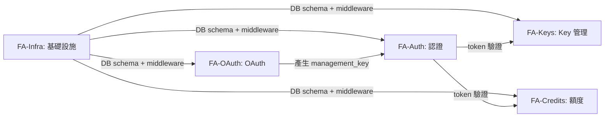
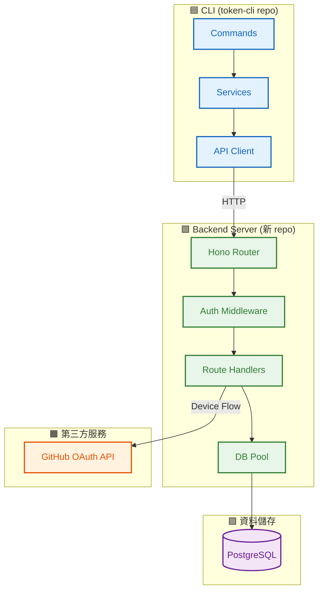
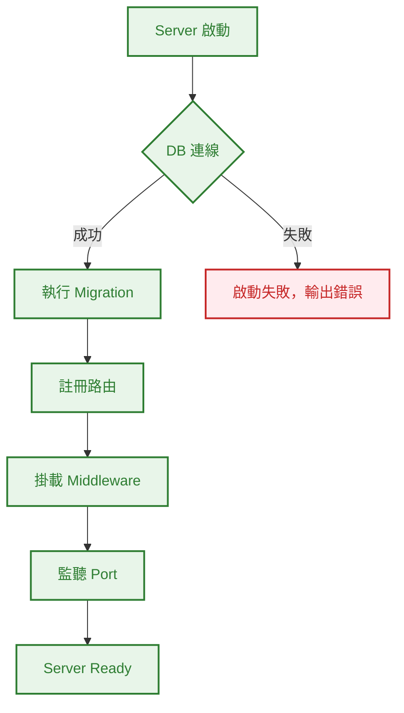
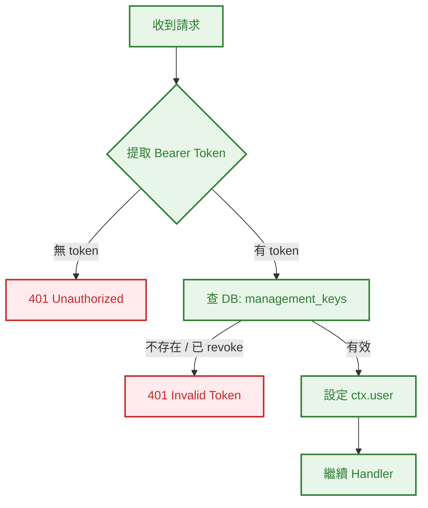
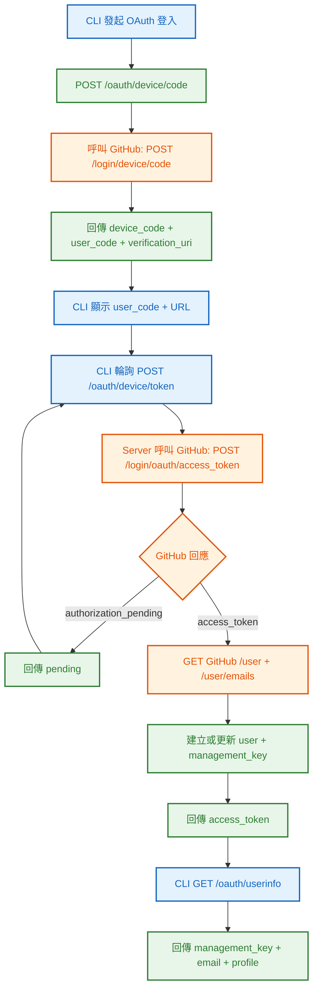
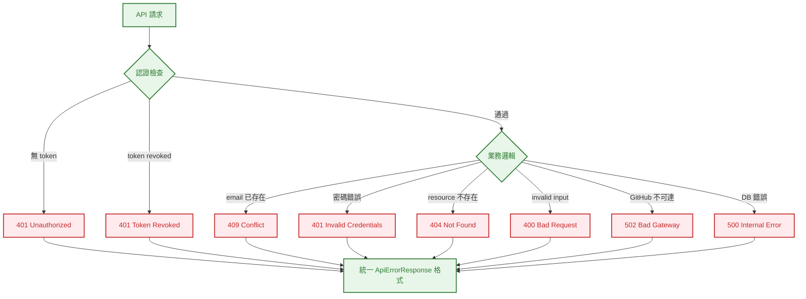

# S0 Brief Spec: Real Backend Server

> **階段**: S0 需求討論
> **建立時間**: 2026-03-15 14:30
> **Agent**: requirement-analyst
> **Spec Mode**: Full Spec
> **工作類型**: new_feature

---

## 0. 工作類型

**本次工作類型**：`new_feature`

## 1. 一句話描述

建立真實的 Hono + Bun + PostgreSQL 後端伺服器（獨立 repo），實作所有目前 mock backend 對應的 17 個 API 端點（含 OAuth Device Flow 接真實 GitHub），讓 CLI 可以不帶 `--mock` 直接使用。

## 2. 為什麼要做

### 2.1 痛點

- **Real mode 不可用**：CLI 的 real mode 打向 `https://proxy.openclaw-token.dev/v1`，但該 server 不存在
- **Mock 行為與真實有落差**：MockStore 用 regex 驗 token、靜態映射 email、無持久化，無法驗證真實場景的正確性
- **無法驗證端到端流程**：缺乏真實 DB + 真實 OAuth 的環境，無法確認 CLI 在真實環境下的行為
- **跨 CLI 執行不共享狀態**：每次重啟 mock store 重置，無法測試持久化場景

### 2.2 目標

- 建立可本地運行的 Hono + Bun 後端伺服器，實作全部 17 個 API 端點
- 使用 PostgreSQL 做持久化儲存，支援真實的 token 驗證、密碼雜湊、交易記錄
- 整合真實 GitHub OAuth Device Flow
- CLI 不帶 `--mock` 時可直接連接本地 server 進行完整操作

## 3. 使用者

| 角色 | 說明 |
|------|------|
| CLI 開發者 | 在本地啟動 server，用 CLI 進行端到端測試與開發 |
| API 消費者 | 未來其他客戶端（Web Dashboard 等）可直接使用同一組 API |

## 4. 核心流程

> **閱讀順序**：功能區拆解 → 系統架構 → 各 FA 流程 → 例外處理

### 4.0 功能區拆解（Functional Area Decomposition）

#### 功能區識別表

| FA ID | 功能區名稱 | 一句話描述 | 入口 | 獨立性 |
|-------|-----------|-----------|------|--------|
| FA-Infra | 伺服器基礎設施 | Hono app、PostgreSQL schema + migration、auth middleware、error handling | 專案初始化 | 高（前置基礎） |
| FA-Auth | 帳號認證 API | register, login, me, rotate 四個端點 | POST /auth/* | 高 |
| FA-Keys | Key 管理 API | create, list, info, update, revoke, rotate 六個端點 | /keys/* | 高 |
| FA-Credits | 額度管理 API | balance, purchase, history, auto-topup 四個端點 | /credits/* | 高 |
| FA-OAuth | GitHub OAuth Device Flow | device/code, device/token, userinfo 三個端點 + GitHub 整合 | POST /oauth/* | 中（依賴 GitHub API） |

#### 拆解策略

**本次策略**：`single_sop_fa_labeled`

5 個 FA，除 FA-Infra 為共用基礎外均高度獨立。一份 spec 統一管理，S3 波次按 FA 分組，S4 可按 FA 並行實作。

#### 跨功能區依賴



| 來源 FA | 目標 FA | 依賴類型 | 說明 |
|---------|---------|---------|------|
| FA-Infra | 全部 | 基礎設施 | DB connection pool, auth middleware, error handler |
| FA-Auth | FA-Keys, FA-Credits | token 驗證 | Keys 和 Credits 端點需要 management_key 認證 |
| FA-OAuth | FA-Auth | 資料寫入 | OAuth 登入成功後建立/更新 user 並產生 management_key |

---

### 4.1 系統架構總覽



**架構重點**：

| 層級 | 組件 | 職責 |
|------|------|------|
| **CLI** | token-cli（既有，不動） | 發送 HTTP 請求，已支援 real mode |
| **Server** | Hono + Bun（新建，獨立 repo） | 路由、認證 middleware、業務邏輯 |
| **第三方** | GitHub OAuth API | Device Flow 授權 |
| **資料** | PostgreSQL | 用戶、keys、credits、OAuth sessions 持久化 |

---

### 4.2 FA-Infra: 伺服器基礎設施

#### 4.2.1 全局流程圖



**技術細節**：
- Hono app factory pattern，支援依賴注入（DB pool）
- Auth middleware：從 `Authorization: Bearer <token>` 提取 token，查 DB 驗證有效性
- 統一 error handler：回傳 `{ error: { code, message } }` 格式
- Migration：SQL 檔案式遷移（初始 schema + seed data）
- 使用 `postgres` (porsager/postgres) 作為 PostgreSQL driver

#### 4.2.2 Auth Middleware 流程（局部）



#### 4.2.N Happy Path 摘要

| 路徑 | 入口 | 結果 |
|------|------|------|
| **Server 啟動** | `bun run src/index.ts` | DB 連線 → Migration → 監聽 port |
| **認證通過** | Authorization header | 驗證 token → 設定 user context → handler 執行 |

---

### 4.3 FA-Auth: 帳號認證 API

#### 4.3.1 全局流程圖

```mermaid
flowchart TD
    subgraph Register["POST /auth/register"]
        R1[收到 email + password]:::be --> R2{email 已存在?}:::be
        R2 -->|是| R3[409 Conflict]:::ex
        R2 -->|否| R4[bcrypt hash password]:::be
        R4 --> R5[INSERT user + management_key]:::be
        R5 --> R6[初始化 credits 餘額]:::be
        R6 --> R7[回傳 management_key]:::be
    end

    subgraph Login["POST /auth/login"]
        L1[收到 email + password]:::be --> L2{email 存在?}:::be
        L2 -->|否| L3[401 Invalid credentials]:::ex
        L2 -->|是| L4{bcrypt verify}:::be
        L4 -->|不符| L3
        L4 -->|符合| L5[產生新 management_key, revoke 舊 key]:::be
        L5 --> L6[回傳 management_key]:::be
    end

    subgraph Me["GET /auth/me"]
        M1[Auth middleware 通過]:::be --> M2[查用戶 + 統計]:::be
        M2 --> M3[回傳 AuthMeResponse]:::be
    end

    subgraph Rotate["POST /auth/rotate"]
        T1[Auth middleware 通過]:::be --> T2[Revoke 舊 key]:::be
        T2 --> T3[產生新 management_key]:::be
        T3 --> T4[回傳新 key + rotated_at]:::be
    end

    classDef be fill:#e8f5e9,color:#2e7d32,stroke:#2e7d32,stroke-width:2px
    classDef ex fill:#ffebee,color:#c62828,stroke:#c62828,stroke-width:2px
```



#### 4.3.N Happy Path 摘要

| 路徑 | 入口 | 結果 |
|------|------|------|
| **註冊** | POST /auth/register {email, password} | 建立用戶 + 初始 credits → 回傳 management_key |
| **登入** | POST /auth/login {email, password} | 驗密碼 → 產新 key → 回傳 management_key |
| **查身分** | GET /auth/me (Bearer token) | 回傳 email, plan, credits, keys_count |
| **輪換 Key** | POST /auth/rotate (Bearer token) | 舊 key 立即 revoke → 回傳新 key |

---

### 4.4 FA-Keys: Key 管理 API

#### 4.4.1 全局流程圖

```mermaid
flowchart TD
    subgraph Create["POST /keys"]
        K1[收到 name + options]:::be --> K2[產生 sk-prov- key + hash]:::be
        K2 --> K3[INSERT provisioned_key]:::be
        K3 --> K4[回傳 key + hash]:::be
    end

    subgraph List["GET /keys"]
        KL1[Auth middleware]:::be --> KL2[SELECT WHERE user_id AND NOT revoked]:::be
        KL2 --> KL3[回傳 items + total]:::be
    end

    subgraph Info["GET /keys/:hash"]
        KI1[Auth middleware]:::be --> KI2{hash 存在?}:::be
        KI2 -->|否| KI3[404]:::ex
        KI2 -->|是| KI4[查 detail + usage stats]:::be
        KI4 --> KI5[回傳 KeyDetailResponse]:::be
    end

    subgraph Update["PATCH /keys/:hash"]
        KU1[Auth middleware]:::be --> KU2[UPDATE fields]:::be
        KU2 --> KU3[回傳更新後 key]:::be
    end

    subgraph Revoke["DELETE /keys/:hash"]
        KR1[Auth middleware]:::be --> KR2[設定 revoked=true]:::be
        KR2 --> KR3[回傳 KeyRevokeResponse]:::be
    end

    subgraph KeyRotate["POST /keys/:hash/rotate"]
        KT1[Auth middleware]:::be --> KT2[產生新 key value]:::be
        KT2 --> KT3[UPDATE key column, hash 不變]:::be
        KT3 --> KT4[回傳 KeyRotateResponse]:::be
    end

    classDef be fill:#e8f5e9,color:#2e7d32,stroke:#2e7d32,stroke-width:2px
    classDef ex fill:#ffebee,color:#c62828,stroke:#c62828,stroke-width:2px
```



#### 4.4.N Happy Path 摘要

| 路徑 | 入口 | 結果 |
|------|------|------|
| **建立** | POST /keys {name, ...} | 產生 provisioned key → 回傳 key + hash |
| **列表** | GET /keys | 回傳該用戶所有未 revoke 的 keys |
| **詳情** | GET /keys/:hash | 回傳 key 詳情 + usage 統計 |
| **更新** | PATCH /keys/:hash | 更新設定 → 回傳更新後資料 |
| **撤銷** | DELETE /keys/:hash | 設定 revoked → 回傳確認 |
| **輪換** | POST /keys/:hash/rotate | 產生新 key value, hash 不變 |

---

### 4.5 FA-Credits: 額度管理 API

#### 4.5.1 全局流程圖

```mermaid
flowchart TD
    subgraph Balance["GET /credits"]
        C1[Auth middleware]:::be --> C2[查 credits 餘額]:::be
        C2 --> C3[回傳 total/usage/remaining]:::be
    end

    subgraph Purchase["POST /credits/purchase"]
        CP1[收到 amount]:::be --> CP2{amount > 0?}:::be
        CP2 -->|否| CP3[400 Invalid]:::ex
        CP2 -->|是| CP4[計算 platform_fee 5.5%]:::be
        CP4 --> CP5[INSERT transaction + UPDATE balance]:::be
        CP5 --> CP6[回傳 CreditsPurchaseResponse]:::be
    end

    subgraph History["GET /credits/history"]
        CH1[Auth middleware]:::be --> CH2[SELECT transactions, paginated]:::be
        CH2 --> CH3[回傳 items + pagination]:::be
    end

    subgraph AutoTopup["PUT /credits/auto-topup"]
        CA1[收到 config]:::be --> CA2[UPSERT auto_topup 設定]:::be
        CA2 --> CA3[回傳 updated config]:::be
    end

    classDef be fill:#e8f5e9,color:#2e7d32,stroke:#2e7d32,stroke-width:2px
    classDef ex fill:#ffebee,color:#c62828,stroke:#c62828,stroke-width:2px
```



#### 4.5.N Happy Path 摘要

| 路徑 | 入口 | 結果 |
|------|------|------|
| **查餘額** | GET /credits | 回傳 total/usage/remaining |
| **購買** | POST /credits/purchase {amount} | 建立交易記錄 → 更新餘額 → 回傳明細 |
| **歷史** | GET /credits/history | 回傳分頁交易記錄 |
| **自動加值** | PUT /credits/auto-topup | 更新/建立設定 → 回傳確認 |

---

### 4.6 FA-OAuth: GitHub OAuth Device Flow

#### 4.6.1 全局流程圖



**技術細節**：
- Server 作為 GitHub OAuth App 的中繼，CLI 不直接與 GitHub 通訊
- Device code session 存入 DB（有 expires_at TTL）
- GitHub access_token 取得後查 `/user` + `/user/emails` 獲取 primary email
- 若 email 已有用戶 → merge（更新 profile）；否則建立新用戶
- 需要在 GitHub Settings > Developer settings > OAuth Apps 建立 App

#### 4.6.N Happy Path 摘要

| 路徑 | 入口 | 結果 |
|------|------|------|
| **Device Flow 登入** | POST /oauth/device/code → poll /device/token → GET /userinfo | GitHub 授權 → server 取得 profile → 回傳 management_key |

---

### 4.7 例外流程圖



### 4.8 六維度例外清單

| 維度 | ID | FA | 情境 | 觸發條件 | 預期行為 | 嚴重度 |
|------|-----|-----|------|---------|---------|--------|
| 並行/競爭 | E1 | FA-Auth | 同 email 同時註冊 | 兩個 register 請求並發 | DB unique constraint → 第二個 409 | P1 |
| 並行/競爭 | E2 | FA-Keys | 同 key 同時 rotate | 兩個 rotate 請求並發 | DB transaction 保證只一個成功 | P1 |
| 狀態轉換 | E3 | FA-Auth | rotate 期間 token 失效 | 舊 key 在 rotate handler 執行中被另一個 rotate revoke | Transaction isolation，失敗返回 401 | P1 |
| 資料邊界 | E4 | 全域 | 空字串/超長字串輸入 | email=""、name > 255 chars | 400 + 明確驗證錯誤 | P2 |
| 資料邊界 | E5 | FA-Credits | 購買金額邊界 | amount = 0, 負數, 超大數 | 400 + 驗證錯誤 | P2 |
| 網路/外部 | E6 | FA-OAuth | GitHub API 不可達 | GitHub 維護或網路斷線 | 502 Bad Gateway + 重試提示 | P0 |
| 網路/外部 | E7 | 全域 | PostgreSQL 連線中斷 | DB crash 或連線池耗盡 | 500 + 自動重連 | P0 |
| 業務邏輯 | E8 | FA-Auth | 密碼錯誤 | bcrypt verify 失敗 | 401，不洩漏是 email 不存在還是密碼錯 | P1 |
| 業務邏輯 | E9 | FA-Keys | 操作已 revoke 的 key | revoke 後再 rotate/update | 404（不暴露 revoke 狀態） | P2 |

### 4.9 白話文摘要

這次改造是建立一個真實的後端伺服器，讓 OpenClaw Token CLI 可以連到真正的資料庫做帳號管理、金鑰管理和額度管理，取代目前只存在於記憶體中的模擬環境。用戶可以透過 GitHub 帳號登入，所有操作都會真實寫入資料庫。最壞的情況是 GitHub OAuth 或資料庫暫時不可用，伺服器會回傳明確錯誤碼，CLI 已有既有的錯誤處理機制來顯示。

## 5. 成功標準

| # | FA | 類別 | 標準 | 驗證方式 |
|---|-----|------|------|---------|
| 1 | FA-Infra | 啟動 | `bun run src/index.ts` 成功啟動，連接 PostgreSQL | 手動啟動觀察 log |
| 2 | FA-Infra | Migration | 首次啟動自動建立 schema | 檢查 DB tables |
| 3 | FA-Auth | 註冊 | POST /auth/register 建立用戶，回傳 management_key | 整合測試 |
| 4 | FA-Auth | 登入 | POST /auth/login 驗密碼，回傳新 management_key | 整合測試 |
| 5 | FA-Auth | 身分 | GET /auth/me 回傳正確的用戶資訊 | 整合測試 |
| 6 | FA-Auth | 輪換 | POST /auth/rotate 舊 key 立即 401 | 整合測試 |
| 7 | FA-Keys | CRUD | POST/GET/PATCH/DELETE /keys 全流程正常 | 整合測試 |
| 8 | FA-Keys | 輪換 | POST /keys/:hash/rotate 保留設定換 key value | 整合測試 |
| 9 | FA-Credits | 餘額 | GET /credits 回傳正確餘額 | 整合測試 |
| 10 | FA-Credits | 購買 | POST /credits/purchase 建立交易 + 更新餘額 | 整合測試 |
| 11 | FA-Credits | 歷史 | GET /credits/history 分頁正確 | 整合測試 |
| 12 | FA-OAuth | Device Flow | 完整 device code → poll → userinfo 流程 | 手動 + 整合測試 |
| 13 | FA-OAuth | GitHub 整合 | 真實 GitHub OAuth App 授權成功 | 手動測試 |
| 14 | 全域 | CLI 相容 | CLI 不帶 --mock 可正常操作本地 server | 手動端到端測試 |
| 15 | 全域 | API 相容 | 所有 response 格式與 token-cli/src/api/types.ts 一致 | TypeScript 型別共享 + 測試 |
| 16 | 全域 | 既有測試 | token-cli 既有 134 個測試全部通過 | npm test |

## 6. 範圍

### 範圍內
- **FA-Infra**: Hono + Bun 專案骨架、PostgreSQL schema + migration、auth middleware、error handling、config 管理
- **FA-Auth**: register, login, me, rotate 四個端點
- **FA-Keys**: create, list, info, update, revoke, rotate 六個端點
- **FA-Credits**: balance, purchase, history, auto-topup 四個端點
- **FA-OAuth**: device/code, device/token, userinfo 三個端點 + GitHub OAuth App 整合
- **全域**: GitHub OAuth App 建立指引
- **全域**: 整合測試覆蓋所有 17 個端點

### 範圍外
- 雲端部署（Cloudflare Workers / AWS / etc）
- Rate limiting / API throttling
- 多用戶權限系統（admin / team）
- 帳單/支付整合（credits purchase 是模擬計費）
- WebSocket / real-time 通知
- Docker compose 封裝
- CLI 端程式碼修改（CLI 已支援 real mode，僅需調整 baseURL 配置）
- 前端 Dashboard

## 7. 已知限制與約束

- **獨立 repo**：backend server 在新的 repo 中，與 token-cli 分開管理
- **API 合約**：必須 100% 符合 `token-cli/src/api/types.ts` 定義的 request/response 格式（`{ data: T }` 或 `{ error: { code, message } }`）
- **PostgreSQL 前置**：開發者需自行安裝 PostgreSQL（`brew install postgresql@17`）
- **GitHub OAuth App 前置**：需在 GitHub Settings > Developer settings > OAuth Apps 建立 App
- **Bun Runtime**：需安裝 Bun（`curl -fsSL https://bun.sh/install | bash`）
- **密碼雜湊**：bcrypt，work factor ≥ 10
- **Token 格式**：management key `sk-mgmt-{random}`，provisioned key `sk-prov-{random}`，hash = SHA-256 前 16 hex

## 8. 前端 UI 畫面清單

> 純後端功能，省略此節。

## 9. 補充說明

### 9.1 PostgreSQL Schema 概要

| Table | 說明 | 關鍵欄位 |
|-------|------|---------|
| `users` | 用戶帳號 | email (unique), password_hash, plan, github_id, avatar_url, created_at |
| `management_keys` | management key | user_id (FK), key_value, key_hash, revoked, created_at |
| `provisioned_keys` | provisioned key | user_id (FK), hash (unique), key_value, name, credit_limit, limit_reset, disabled, revoked, created_at, expires_at |
| `credit_balances` | 用戶額度 | user_id (FK, unique), total, usage, auto_topup_enabled, auto_topup_threshold, auto_topup_amount |
| `credit_transactions` | 交易記錄 | user_id (FK), type, amount, balance_after, description, created_at |
| `oauth_sessions` | OAuth device flow | device_code, user_code, github_access_token, user_id (FK), status, expires_at |

### 9.2 專案結構（新 repo: openclaw-token-server）

```
openclaw-token-server/
├── src/
│   ├── index.ts          # Hono app entry
│   ├── config.ts         # 環境變數 + 設定
│   ├── db/
│   │   ├── client.ts     # PostgreSQL 連線池 (postgres.js)
│   │   └── migrations/   # SQL migration 檔案
│   ├── middleware/
│   │   ├── auth.ts       # Bearer token 驗證
│   │   └── error.ts      # 統一錯誤處理
│   ├── routes/
│   │   ├── auth.ts       # /auth/* 路由
│   │   ├── keys.ts       # /keys/* 路由
│   │   ├── credits.ts    # /credits/* 路由
│   │   └── oauth.ts      # /oauth/* 路由
│   ├── services/         # 業務邏輯層
│   └── utils/            # token 產生、hash、驗證
├── tests/
│   ├── setup.ts          # 測試 DB 設定
│   └── integration/      # 整合測試（per route）
├── package.json
├── tsconfig.json
├── .env.example
└── CLAUDE.md
```

### 9.3 GitHub OAuth App 建立指引

1. 前往 https://github.com/settings/developers
2. 點擊「New OAuth App」
3. 填寫：
   - Application name: `OpenClaw Token Dev`
   - Homepage URL: `http://localhost:3000`
   - Authorization callback URL: `http://localhost:3000/oauth/callback`
4. 記下 Client ID
5. 產生 Client Secret
6. 寫入 server 的 `.env`：
   ```
   GITHUB_CLIENT_ID=xxx
   GITHUB_CLIENT_SECRET=xxx
   ```

### 9.4 CLI 端 baseURL 配置

CLI 的 `createApiClient()` 已有 `baseURL` 參數（預設 `https://proxy.openclaw-token.dev/v1`）。
開發時可透過環境變數覆蓋：`OPENCLAW_TOKEN_API_BASE=http://localhost:3000/v1`

---

## 10. SDD Context

```json
{
  "sdd_context": {
    "stages": {
      "s0": {
        "status": "pending_confirmation",
        "agent": "requirement-analyst",
        "output": {
          "brief_spec_path": "dev/specs/2026-03-15_2_real-backend/s0_brief_spec.md",
          "work_type": "new_feature",
          "requirement": "建立 Hono + Bun + PostgreSQL 後端伺服器（獨立 repo），實作所有 17 個 API 端點含 GitHub OAuth",
          "pain_points": [
            "CLI real mode 打向不存在的 server",
            "Mock 行為與真實有落差",
            "無法驗證端到端流程",
            "跨 CLI 執行不共享狀態"
          ],
          "goal": "建立可本地運行的真實後端伺服器，讓 CLI 不帶 --mock 即可完整操作",
          "success_criteria": [
            "Server 啟動並連接 PostgreSQL",
            "全部 17 個 API 端點實作完成",
            "Response 格式與 types.ts 100% 一致",
            "GitHub OAuth Device Flow 完整可用",
            "CLI 不帶 --mock 可端到端操作",
            "整合測試覆蓋所有端點",
            "token-cli 既有 134 測試全過"
          ],
          "scope_in": [
            "Hono + Bun 專案骨架（獨立 repo）",
            "PostgreSQL schema + migration",
            "Auth/Keys/Credits/OAuth 全部 17 端點",
            "Auth middleware + error handling",
            "GitHub OAuth App 整合",
            "整合測試"
          ],
          "scope_out": [
            "雲端部署",
            "Rate limiting",
            "多用戶權限",
            "Docker compose",
            "帳單/支付整合",
            "CLI 端程式碼修改"
          ],
          "constraints": [
            "獨立 repo",
            "API 合約 100% 符合 types.ts",
            "Bun runtime",
            "PostgreSQL 前置",
            "GitHub OAuth App 前置"
          ],
          "functional_areas": [
            { "id": "FA-Infra", "name": "伺服器基礎設施", "description": "Hono app, PostgreSQL schema + migration, auth middleware, error handling", "independence": "high" },
            { "id": "FA-Auth", "name": "帳號認證 API", "description": "register, login, me, rotate 4 endpoints", "independence": "high" },
            { "id": "FA-Keys", "name": "Key 管理 API", "description": "CRUD + rotate 6 endpoints", "independence": "high" },
            { "id": "FA-Credits", "name": "額度管理 API", "description": "balance, purchase, history, auto-topup 4 endpoints", "independence": "high" },
            { "id": "FA-OAuth", "name": "GitHub OAuth Device Flow", "description": "device/code, device/token, userinfo + GitHub 整合", "independence": "medium" }
          ],
          "decomposition_strategy": "single_sop_fa_labeled",
          "child_sops": []
        }
      }
    }
  }
}
```
