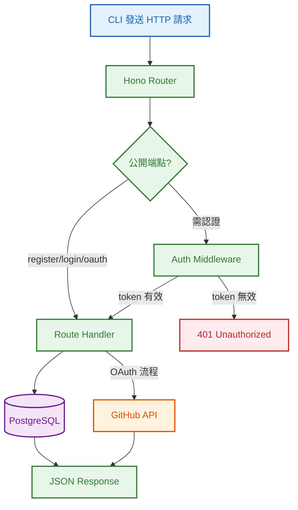
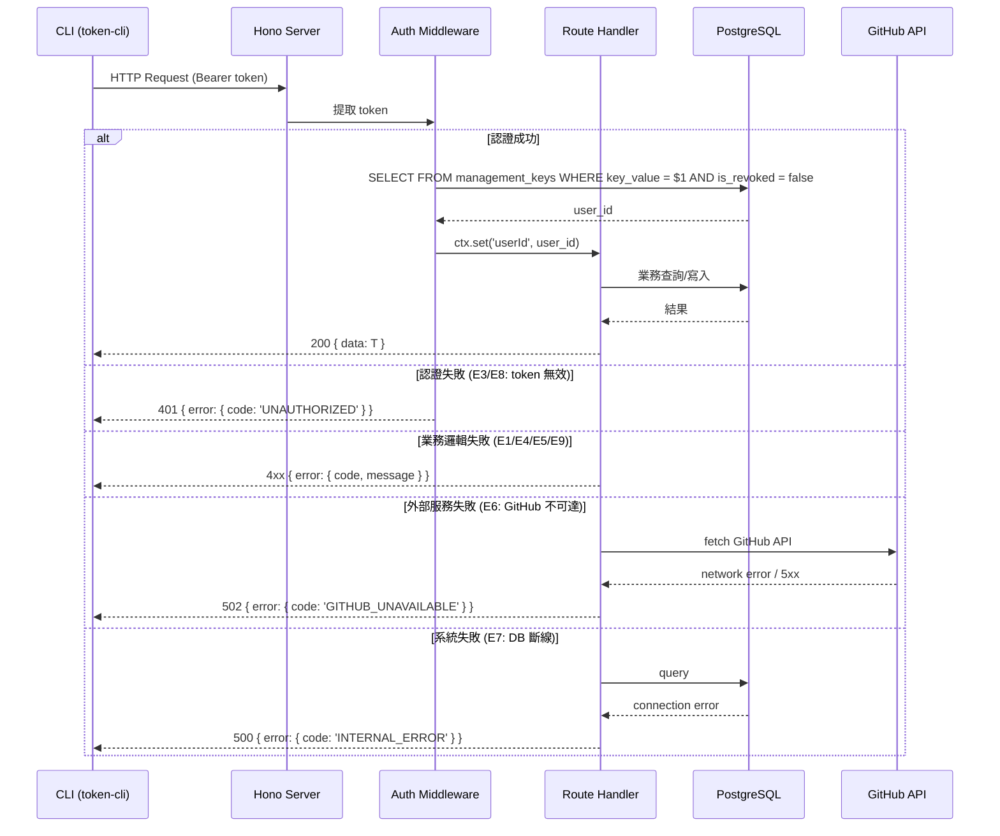

# S1 Dev Spec: Real Backend Server (openclaw-token-server)

> **階段**: S1 技術分析
> **建立時間**: 2026-03-15 15:30
> **Agent**: codebase-explorer (Phase 1) + architect (Phase 2)
> **工作類型**: new_feature
> **複雜度**: L

---

## 1. 概述

### 1.1 需求參照
> 完整需求見 `s0_brief_spec.md`，以下僅摘要。

建立 Hono + Bun + PostgreSQL 後端伺服器（獨立 repo: openclaw-token-server），實作全部 18 個 HTTP 操作（14 個路由端點），取代 mock backend，讓 CLI 可不帶 `--mock` 直接操作。

### 1.2 技術方案摘要

在獨立 repo 中建立 Hono + Bun 專案，使用 porsager/postgres driver 連接 PostgreSQL。6 張資料表（users, management_keys, provisioned_keys, credit_balances, credit_transactions, oauth_sessions）。分為 5 個 FA：Infra（骨架 + middleware）、Auth（4 端點）、Keys（6 端點）、Credits（5 端點含 GET/PUT auto-topup）、OAuth（3 端點 + GitHub 整合）。所有 API response 嚴格符合 token-cli/src/api/types.ts 定義。

---

## 2. 影響範圍（Phase 1：codebase-explorer）

### 2.1 受影響檔案

#### 新 Repo (openclaw-token-server) -- 全新建立
| 目錄/檔案 | 類型 | 說明 |
|-----------|------|------|
| `src/index.ts` | 新增 | Hono app 入口 |
| `src/config.ts` | 新增 | 環境變數 + DB 連線設定 |
| `src/db/client.ts` | 新增 | PostgreSQL 連線池 |
| `src/db/migrations/001_initial.sql` | 新增 | 初始 schema DDL |
| `src/db/migrate.ts` | 新增 | Migration runner |
| `src/middleware/auth.ts` | 新增 | Bearer token 驗證 |
| `src/middleware/error.ts` | 新增 | 統一錯誤處理 |
| `src/routes/auth.ts` | 新增 | /auth/* 路由 |
| `src/routes/keys.ts` | 新增 | /keys/* 路由 |
| `src/routes/credits.ts` | 新增 | /credits/* 路由 |
| `src/routes/oauth.ts` | 新增 | /oauth/* 路由 |
| `src/utils/token.ts` | 新增 | token 產生、hash 計算 |
| `src/utils/password.ts` | 新增 | bcrypt hash/verify |
| `tests/` | 新增 | 整合測試 |

#### CLI Repo (token-cli) -- 不修改
無程式碼變更。CLI 已支援 `OPENCLAW_TOKEN_API_BASE` 環境變數覆蓋 baseURL。

### 2.2 依賴關係
- **上游依賴**: token-cli/src/api/types.ts（API 合約 source of truth）、token-cli/src/api/endpoints.ts（路由路徑定義）
- **下游影響**: 無（獨立 repo，CLI 不需修改）
- **外部依賴**: GitHub OAuth API（Device Flow）、PostgreSQL

### 2.3 現有模式與技術考量

token-cli 的 mock handlers 是 real backend 行為的參考基準。以下列出需要注意的模式差異：

| 面向 | Mock 行為 | Real Backend 行為 |
|------|----------|-----------------|
| Token 驗證 | regex 格式驗證 + revoked set | DB lookup management_keys WHERE is_revoked = false |
| 密碼驗證 | 明文比對 | bcrypt verify |
| Token-to-User 映射 | 所有合法 token 映射到 demo user | DB JOIN management_keys → users |
| Key Hash | `hash_{12 hex}` 隨機 | SHA-256(key_value) 前 16 hex |
| Idempotency | 記憶體 Map | DB column + UNIQUE constraint |
| Usage Stats | 靜態乘數（usage * 0.15 等） | 靜態乘數（placeholder，同 mock） |
| OAuth | 自動授權（3 秒延遲） | 真實 GitHub API 呼叫 |

---

## 3. User Flow（Phase 2：architect）

### 3.1 系統全局流程



### 3.2 主要流程

| 步驟 | 用戶動作 | 系統回應 | 備註 |
|------|---------|---------|------|
| 1 | CLI 發送 HTTP 請求到 localhost:3000 | Hono 路由匹配 | 所有端點統一 prefix `/v1` 或無 prefix（取決於 CLI baseURL 配置） |
| 2 | 認證端點帶 Bearer token | Auth middleware 查 DB 驗證 | 公開端點跳過 middleware |
| 3 | Handler 執行業務邏輯 | 查詢/寫入 PostgreSQL | 使用 DB transaction 保證一致性 |
| 4 | 回傳 `{ data: T }` 或 `{ error: { code, message } }` | CLI 解析 response | 嚴格符合 types.ts |

### 3.3 異常流程

| S0 ID | 情境 | 觸發條件 | 系統處理 | 回傳 |
|-------|------|---------|---------|------|
| E1 | 同 email 同時註冊 | 並發 register | DB UNIQUE constraint catch PG 23505 | 409 EMAIL_EXISTS |
| E2 | 同 key 同時 rotate | 並發 rotate | DB transaction + row lock | 第二個 401（key 已 revoked） |
| E3 | rotate 期間 token 失效 | 另一個 rotate 已 revoke 舊 key | Transaction isolation | 401 UNAUTHORIZED |
| E4 | 空字串/超長字串 | email=""、name > 255 | 應用層驗證 | 400 INVALID_INPUT |
| E5 | 購買金額邊界 | amount < 5 | 應用層驗證 | 400 INVALID_INPUT |
| E6 | GitHub API 不可達 | 網路斷線/維護 | catch fetch error | 502 GITHUB_UNAVAILABLE |
| E7 | PostgreSQL 連線中斷 | DB crash | postgres.js 自動重連 | 500 INTERNAL_ERROR |
| E8 | 密碼錯誤 | bcrypt verify 失敗 | 不區分 email/密碼 | 401 INVALID_CREDENTIALS |
| E9 | 操作已 revoke 的 key | revoke 後再操作 | 查 is_revoked 欄位 | 404 KEY_NOT_FOUND 或 410 KEY_ALREADY_REVOKED |

### 3.4 S0→S1 例外追溯表

| S0 ID | 維度 | S0 描述 | S1 處理位置 | 覆蓋狀態 |
|-------|------|---------|-----------|---------|
| E1 | 並行/競爭 | 同 email 同時註冊 | DB UNIQUE + PG error handler | 覆蓋 |
| E2 | 並行/競爭 | 同 key 同時 rotate | DB transaction + SELECT FOR UPDATE | 覆蓋 |
| E3 | 狀態轉換 | rotate 期間 token 失效 | Auth middleware 每次重查 DB | 覆蓋 |
| E4 | 資料邊界 | 空字串/超長字串 | Route handler input validation | 覆蓋 |
| E5 | 資料邊界 | 購買金額邊界 | Route handler validation | 覆蓋 |
| E6 | 網路/外部 | GitHub API 不可達 | OAuth handler try/catch + 502 | 覆蓋 |
| E7 | 網路/外部 | PostgreSQL 連線中斷 | Error middleware catch-all + 500 | 覆蓋 |
| E8 | 業務邏輯 | 密碼錯誤 | Auth handler 統一 401 | 覆蓋 |
| E9 | 業務邏輯 | 操作已 revoke key | Keys handler 查 revoked 狀態 | 覆蓋 |

---

## 4. Data Flow



### 4.1 API 契約

> 完整 API 規格（Request/Response/Error Codes）見 [`s1_api_spec.md`](./s1_api_spec.md)。

**Endpoint 摘要**

| # | Method | Path | 說明 | Auth |
|---|--------|------|------|------|
| 1 | POST | /auth/register | 註冊 | No |
| 2 | POST | /auth/login | 登入 | No |
| 3 | GET | /auth/me | 查身分 | Yes |
| 4 | POST | /auth/rotate | 輪換 management key | Yes |
| 5 | POST | /keys | 建立 provisioned key | Yes |
| 6 | GET | /keys | 列表 | Yes |
| 7 | GET | /keys/:hash | 詳情 | Yes |
| 8 | PATCH | /keys/:hash | 更新設定 | Yes |
| 9 | DELETE | /keys/:hash | 撤銷 | Yes |
| 10 | POST | /keys/:hash/rotate | 輪換 key value | Yes |
| 11 | GET | /credits | 查餘額 | Yes |
| 12 | POST | /credits/purchase | 購買 | Yes |
| 13 | GET | /credits/history | 交易歷史 | Yes |
| 14 | GET | /credits/auto-topup | 查自動加值設定 | Yes |
| 15 | PUT | /credits/auto-topup | 更新自動加值設定 | Yes |
| 16 | POST | /oauth/device/code | 啟動 Device Flow | No |
| 17 | POST | /oauth/device/token | 輪詢授權狀態 | No |
| 18 | GET | /oauth/userinfo | 取得用戶資訊 | Yes (OAuth) |

### 4.2 資料模型 -- PostgreSQL Schema

#### DDL

```sql
-- 001_initial.sql

CREATE EXTENSION IF NOT EXISTS "pgcrypto";

-- Users
CREATE TABLE users (
    id              UUID PRIMARY KEY DEFAULT gen_random_uuid(),
    email           TEXT NOT NULL UNIQUE,
    password_hash   TEXT,                          -- nullable: OAuth 用戶無密碼
    plan            TEXT NOT NULL DEFAULT 'free',
    github_id       BIGINT UNIQUE,                 -- nullable: 非 OAuth 用戶
    avatar_url      TEXT,
    created_at      TIMESTAMPTZ NOT NULL DEFAULT now(),
    updated_at      TIMESTAMPTZ NOT NULL DEFAULT now()
);

-- Management Keys
CREATE TABLE management_keys (
    id              UUID PRIMARY KEY DEFAULT gen_random_uuid(),
    user_id         UUID NOT NULL REFERENCES users(id),
    key_value       TEXT NOT NULL UNIQUE,
    is_revoked      BOOLEAN NOT NULL DEFAULT false,
    created_at      TIMESTAMPTZ NOT NULL DEFAULT now(),
    revoked_at      TIMESTAMPTZ
);

CREATE INDEX idx_mgmt_keys_key_value ON management_keys(key_value) WHERE is_revoked = false;
CREATE INDEX idx_mgmt_keys_user_id ON management_keys(user_id);

-- Provisioned Keys
CREATE TABLE provisioned_keys (
    id              UUID PRIMARY KEY DEFAULT gen_random_uuid(),
    user_id         UUID NOT NULL REFERENCES users(id),
    hash            TEXT NOT NULL UNIQUE,           -- SHA-256(key_value) 前 16 hex
    key_value       TEXT NOT NULL,                  -- sk-prov-{32 hex}
    name            TEXT NOT NULL,
    credit_limit    NUMERIC,                        -- nullable = unlimited
    limit_reset     TEXT CHECK (limit_reset IN ('daily', 'weekly', 'monthly')),
    usage           NUMERIC NOT NULL DEFAULT 0,
    disabled        BOOLEAN NOT NULL DEFAULT false,
    is_revoked      BOOLEAN NOT NULL DEFAULT false,
    created_at      TIMESTAMPTZ NOT NULL DEFAULT now(),
    expires_at      TIMESTAMPTZ,
    revoked_at      TIMESTAMPTZ
);

CREATE INDEX idx_prov_keys_user_id ON provisioned_keys(user_id);
-- 同用戶同名 active key 不可重複
CREATE UNIQUE INDEX idx_prov_keys_user_name_active
    ON provisioned_keys(user_id, name) WHERE is_revoked = false;

-- Credit Balances
CREATE TABLE credit_balances (
    id                      UUID PRIMARY KEY DEFAULT gen_random_uuid(),
    user_id                 UUID NOT NULL UNIQUE REFERENCES users(id),
    total_credits           NUMERIC NOT NULL DEFAULT 0,
    total_usage             NUMERIC NOT NULL DEFAULT 0,
    auto_topup_enabled      BOOLEAN NOT NULL DEFAULT false,
    auto_topup_threshold    NUMERIC NOT NULL DEFAULT 5,
    auto_topup_amount       NUMERIC NOT NULL DEFAULT 25,
    updated_at              TIMESTAMPTZ NOT NULL DEFAULT now()
);

-- Credit Transactions
CREATE TABLE credit_transactions (
    id              UUID PRIMARY KEY DEFAULT gen_random_uuid(),
    user_id         UUID NOT NULL REFERENCES users(id),
    type            TEXT NOT NULL CHECK (type IN ('purchase', 'usage', 'refund')),
    amount          NUMERIC NOT NULL,
    balance_after   NUMERIC NOT NULL,
    description     TEXT NOT NULL DEFAULT '',
    idempotency_key TEXT UNIQUE,                   -- nullable, 有值時保證冪等
    created_at      TIMESTAMPTZ NOT NULL DEFAULT now()
);

CREATE INDEX idx_credit_txn_user_id ON credit_transactions(user_id);
CREATE INDEX idx_credit_txn_user_type ON credit_transactions(user_id, type);

-- OAuth Sessions
CREATE TABLE oauth_sessions (
    id                  UUID PRIMARY KEY DEFAULT gen_random_uuid(),
    device_code         TEXT NOT NULL UNIQUE,
    user_code           TEXT NOT NULL,
    client_id           TEXT NOT NULL,
    github_access_token TEXT,                      -- GitHub 回傳的 access_token
    user_id             UUID REFERENCES users(id), -- 授權完成後關聯
    status              TEXT NOT NULL DEFAULT 'pending'
                        CHECK (status IN ('pending', 'authorized', 'expired')),
    expires_at          TIMESTAMPTZ NOT NULL,
    created_at          TIMESTAMPTZ NOT NULL DEFAULT now()
);

-- Schema version tracking
CREATE TABLE schema_migrations (
    version     INTEGER PRIMARY KEY,
    applied_at  TIMESTAMPTZ NOT NULL DEFAULT now()
);
```

#### Schema 設計說明

| 決策 | 理由 |
|------|------|
| management_keys 獨立表 | 支援 key rotation 歷史追蹤，revoked keys 保留紀錄 |
| password_hash nullable | OAuth 用戶（GitHub login）沒有密碼 |
| credit_balances 獨立表 | 與 users 分離，避免頻繁 UPDATE users 表 |
| idempotency_key 在 credit_transactions | 利用 UNIQUE constraint 保證冪等，比單獨一張表更簡單 |
| NUMERIC 而非 DECIMAL | PostgreSQL NUMERIC 精確，適合金額計算 |
| 部分索引 (WHERE is_revoked = false) | 只索引有效 key，減少索引大小 |
| provisioned_keys.hash 用 SHA-256 | 比 mock 的隨機 hash 更有意義，可驗證 key 完整性 |

---

## 5. 任務清單

### 5.1 任務總覽

| # | 任務 | FA | 類型 | 複雜度 | Agent | 依賴 | 波次 |
|---|------|----|------|--------|-------|------|------|
| 1 | 專案骨架 + 設定 | FA-Infra | 後端 | M | bun-expert | - | W1 |
| 2 | PostgreSQL Schema + Migration | FA-Infra | 資料層 | M | db-expert | - | W1 |
| 3 | Auth Middleware + Error Handler | FA-Infra | 後端 | M | bun-expert | #1, #2 | W2 |
| 4 | Token/Password Utilities | FA-Infra | 後端 | S | bun-expert | #1 | W2 |
| 5 | Auth Routes (register, login, me, rotate) | FA-Auth | 後端 | L | bun-expert | #3, #4 | W3 |
| 6 | Keys Routes (CRUD + rotate) | FA-Keys | 後端 | L | bun-expert | #3, #4 | W3 |
| 7 | Credits Routes (balance, purchase, history, auto-topup) | FA-Credits | 後端 | L | bun-expert | #3 | W3 |
| 8 | OAuth Routes (device/code, device/token, userinfo) | FA-OAuth | 後端 | L | bun-expert | #3, #5 | W4 |
| 9 | 整合測試 (Auth + Keys) | 全域 | 測試 | L | test-engineer | #5, #6 | W5 |
| 10 | 整合測試 (Credits + OAuth) | 全域 | 測試 | L | test-engineer | #7, #8 | W5 |

### 5.2 任務詳情

#### Task #1: 專案骨架 + 設定 [FA-Infra]
- **類型**: 後端
- **複雜度**: M
- **Agent**: bun-expert
- **描述**: 初始化 Hono + Bun 專案，設定 TypeScript、package.json、.env.example、config.ts（環境變數管理）。建立 Hono app factory，設定 CORS 和基本路由結構。
- **產出檔案**: `package.json`, `tsconfig.json`, `.env.example`, `src/index.ts`, `src/config.ts`
- **DoD**:
  - [ ] `bun install` 成功安裝所有依賴
  - [ ] `bun run src/index.ts` 啟動 Hono server 並監聽 port 3000
  - [ ] config.ts 從環境變數讀取 DB 連線字串、GitHub OAuth 設定、port
  - [ ] GET / 回傳 `{ status: "ok" }` 健康檢查
- **驗收方式**: `bun run src/index.ts` 成功啟動，curl localhost:3000 回傳 200

#### Task #2: PostgreSQL Schema + Migration [FA-Infra]
- **類型**: 資料層
- **複雜度**: M
- **Agent**: db-expert
- **描述**: 建立 DB 連線池（porsager/postgres）、migration runner、初始 schema SQL。Migration runner 在 server 啟動時自動執行未套用的 migration。
- **產出檔案**: `src/db/client.ts`, `src/db/migrate.ts`, `src/db/migrations/001_initial.sql`
- **DoD**:
  - [ ] postgres.js 連線池正確建立
  - [ ] 首次啟動自動建立 6 張資料表 + schema_migrations
  - [ ] 重複啟動不會重複執行已套用的 migration
  - [ ] 連線失敗時 server 啟動失敗並輸出明確錯誤
- **驗收方式**: 啟動 server 後用 `psql` 確認所有表已建立

#### Task #3: Auth Middleware + Error Handler [FA-Infra]
- **類型**: 後端
- **複雜度**: M
- **Agent**: bun-expert
- **依賴**: Task #1, Task #2
- **描述**: 實作 Bearer token 驗證 middleware（查 DB management_keys 表）和統一錯誤處理 middleware（catch 所有未處理錯誤，回傳 `{ error: { code, message } }` 格式）。包含自定義 AppError 類別。
- **產出檔案**: `src/middleware/auth.ts`, `src/middleware/error.ts`, `src/errors.ts`
- **DoD**:
  - [ ] Auth middleware 從 Authorization header 提取 Bearer token
  - [ ] 查 DB 驗證 token 有效性（未 revoked）
  - [ ] 驗證通過後在 Hono context 設定 userId
  - [ ] 無 token / 無效 token → 401 `{ error: { code: "UNAUTHORIZED", message: "..." } }`
  - [ ] Error handler 捕獲所有 AppError 並回傳對應 HTTP status + error body
  - [ ] 未知錯誤回傳 500 INTERNAL_ERROR（不洩漏 stack trace）
  - [ ] PG unique_violation (23505) 自動映射為 409
- **驗收方式**: 單元測試驗證 middleware 行為

#### Task #4: Token/Password Utilities [FA-Infra]
- **類型**: 後端
- **複雜度**: S
- **Agent**: bun-expert
- **依賴**: Task #1
- **描述**: 實作 token 產生函式（management key、provisioned key、device code、user code、transaction ID）和密碼 hash/verify（bcrypt, work factor 10）。
- **產出檔案**: `src/utils/token.ts`, `src/utils/password.ts`
- **DoD**:
  - [ ] `generateManagementKey()` 回傳 `sk-mgmt-{UUID}` 格式
  - [ ] `generateProvisionedKey()` 回傳 `sk-prov-{32 hex}` 格式
  - [ ] `computeKeyHash(keyValue)` 回傳 SHA-256(keyValue) 前 16 hex
  - [ ] `hashPassword(plain)` 回傳 bcrypt hash (work factor 10)
  - [ ] `verifyPassword(plain, hash)` 正確驗證
  - [ ] 所有函式有單元測試
- **驗收方式**: `bun test` 通過

#### Task #5: Auth Routes [FA-Auth]
- **類型**: 後端
- **複雜度**: L
- **Agent**: bun-expert
- **依賴**: Task #3, Task #4
- **描述**: 實作 POST /auth/register、POST /auth/login、GET /auth/me、POST /auth/rotate 四個端點。Login 產生新 management_key 並 revoke 舊 key（裁決結果，見技術決策 D1）。
- **產出檔案**: `src/routes/auth.ts`
- **DoD**:
  - [ ] POST /auth/register: email+password required (400), email unique (409), 建立 user + management_key + credit_balance, 回傳 201 `AuthRegisterResponse`
  - [ ] POST /auth/login: email+password required (400), bcrypt verify (401 INVALID_CREDENTIALS), 產新 key + revoke 舊 key, 回傳 200 `AuthLoginResponse`
  - [ ] GET /auth/me: 回傳 email, plan, credits_remaining, keys_count (non-revoked only), created_at，符合 `AuthMeResponse`
  - [ ] POST /auth/rotate: revoke 舊 key, 產新 key, 回傳 200 `AuthRotateResponse`
  - [ ] 所有 response 嚴格符合 types.ts 定義（含 `{ data: T }` 封裝）
- **驗收方式**: 整合測試 + curl 手動測試

#### Task #6: Keys Routes [FA-Keys]
- **類型**: 後端
- **複雜度**: L
- **Agent**: bun-expert
- **依賴**: Task #3, Task #4
- **描述**: 實作 POST /keys、GET /keys、GET /keys/:hash、PATCH /keys/:hash、DELETE /keys/:hash、POST /keys/:hash/rotate 六個端點。
- **產出檔案**: `src/routes/keys.ts`
- **DoD**:
  - [ ] POST /keys: name required (400), 同用戶同名 active key → 409 KEY_NAME_EXISTS, key format `sk-prov-{32 hex}`, hash = SHA-256 前 16 hex, 回傳 201 含 key value
  - [ ] GET /keys: ?include_revoked 參數, response 不含 key value, 回傳 `KeysListResponse`
  - [ ] GET /keys/:hash: revoked → 404, 含 usage_daily/weekly/monthly/requests_count/model_usage (placeholder 乘數), 回傳 `KeyDetailResponse`
  - [ ] PATCH /keys/:hash: revoked → 404, 可更新 credit_limit/limit_reset/disabled, 回傳 `ProvisionedKey`
  - [ ] DELETE /keys/:hash: 不存在 → 404, 已 revoked → 410 KEY_ALREADY_REVOKED, 回傳 `KeyRevokeResponse`
  - [ ] POST /keys/:hash/rotate: 不存在 → 404, 已 revoked → 410 KEY_REVOKED, 產新 key value + 更新 hash, 回傳 `KeyRotateResponse`
- **驗收方式**: 整合測試

#### Task #7: Credits Routes [FA-Credits]
- **類型**: 後端
- **複雜度**: L
- **Agent**: bun-expert
- **依賴**: Task #3
- **描述**: 實作 GET /credits、POST /credits/purchase、GET /credits/history、GET /credits/auto-topup、PUT /credits/auto-topup 五個端點。
- **產出檔案**: `src/routes/credits.ts`
- **DoD**:
  - [ ] GET /credits: 回傳 total_credits, total_usage, remaining, 符合 `CreditsResponse`
  - [ ] POST /credits/purchase: amount >= 5 (400), platform_fee = max(amount*0.055, 0.80), Idempotency-Key header 支援, 回傳 `CreditsPurchaseResponse`
  - [ ] GET /credits/history: 支援 limit/offset/type 參數, 回傳 `CreditsHistoryResponse`
  - [ ] GET /credits/auto-topup: 回傳 `AutoTopupConfig`
  - [ ] PUT /credits/auto-topup: threshold >= 1 (400), amount >= 5 (400), partial update, 回傳 `AutoTopupUpdateResponse`
  - [ ] Purchase 使用 DB transaction 保證 balance + transaction 原子寫入
  - [ ] Idempotency: 重複 key 回傳原始結果（不重新計算）
- **驗收方式**: 整合測試

#### Task #8: OAuth Routes [FA-OAuth]
- **類型**: 後端
- **複雜度**: L
- **Agent**: bun-expert
- **依賴**: Task #3, Task #5 (需要 user upsert 邏輯)
- **描述**: 實作 POST /oauth/device/code、POST /oauth/device/token、GET /oauth/userinfo 三個端點。Server 作為 GitHub OAuth App 的中繼代理。
- **產出檔案**: `src/routes/oauth.ts`
- **DoD**:
  - [ ] POST /oauth/device/code: client_id required (400), 呼叫 GitHub POST /login/device/code, 存 session 到 DB, 回傳 `OAuthDeviceCodeResponse`
  - [ ] POST /oauth/device/token: device_code required, 呼叫 GitHub POST /login/oauth/access_token, 處理 pending/expired/success 狀態, 回傳 `OAuthDeviceTokenResponse` 或 error
  - [ ] GET /oauth/userinfo: Bearer token 查 oauth_sessions, 呼叫 GitHub GET /user + /user/emails, upsert user, 回傳 `OAuthUserInfoResponse`
  - [ ] GitHub API 不可達時回傳 502 GITHUB_UNAVAILABLE
  - [ ] session 過期後回傳 expired_token error
  - [ ] 已有帳號 → merged: true；新帳號 → merged: false
- **驗收方式**: 整合測試（GitHub API 用 mock server）+ 手動 E2E 測試

#### Task #9: 整合測試 (Auth + Keys) [全域]
- **類型**: 測試
- **複雜度**: L
- **Agent**: test-engineer
- **依賴**: Task #5, Task #6
- **描述**: 為 Auth 和 Keys 相關端點撰寫整合測試。每個測試使用獨立 DB transaction rollback 隔離。
- **產出檔案**: `tests/integration/auth.test.ts`, `tests/integration/keys.test.ts`, `tests/setup.ts`
- **DoD**:
  - [ ] 測試 setup: DB 連線、每測試 transaction rollback
  - [ ] Auth: register 成功/重複/缺欄位、login 成功/錯密碼/缺欄位、me 成功/未認證、rotate 成功/舊 key 失效
  - [ ] Keys: create 成功/重複名稱/缺名稱、list 含/不含 revoked、detail 成功/revoked=404、update 成功/revoked=404、revoke 成功/已 revoked=410、rotate 成功/revoked=410
  - [ ] 所有測試 `bun test` 通過
- **驗收方式**: CI green

#### Task #10: 整合測試 (Credits + OAuth) [全域]
- **類型**: 測試
- **複雜度**: L
- **Agent**: test-engineer
- **依賴**: Task #7, Task #8
- **描述**: 為 Credits 和 OAuth 端點撰寫整合測試。OAuth 測試使用 mock GitHub API。
- **產出檔案**: `tests/integration/credits.test.ts`, `tests/integration/oauth.test.ts`
- **DoD**:
  - [ ] Credits: balance 查詢、purchase 成功/金額不足/冪等、history 分頁/篩選、auto-topup GET/PUT/驗證
  - [ ] OAuth: device/code 成功/缺 client_id、device/token pending/expired/success、userinfo 新用戶/合併用戶/無 token
  - [ ] OAuth 測試 mock GitHub API（fetch interceptor）
  - [ ] 所有測試 `bun test` 通過
- **驗收方式**: CI green

---

## 6. 技術決策

### 6.1 架構決策

| ID | 決策點 | 選項 | 選擇 | 理由 |
|----|--------|------|------|------|
| D1 | Login 時 management_key 行為 | A: 回傳現有 key（mock 行為）<br>B: 產新 key + revoke 舊 key（S0 spec） | **B** | 更安全：每次 login 產生新 session token，舊 token 立即失效。符合 S0 spec 的流程圖設計。防止 key 洩漏後被持續使用。 |
| D2 | Usage stats (usage_daily/weekly/model_usage) | A: 真實 usage tracking（需 request log 表）<br>B: 靜態乘數 placeholder（同 mock） | **B** | Usage tracking 需要 API proxy 層記錄每次 request，超出本次 scope。用靜態乘數保持 API 合約相容，標記為 placeholder。 |
| D3 | Auto-topup 觸發機制 | A: 實作定時任務<br>B: 僅存設定 | **B** | S0 scope_out 明確排除實際計費，auto-topup 只存設定值。 |
| D4 | OAuth client_id 驗證 | A: 不驗證（接受任何值）<br>B: 驗證是否匹配環境變數 GITHUB_CLIENT_ID | **B** | Server 代理 GitHub API，client_id 必須是真實的 GitHub OAuth App ID。驗證可防止 misconfiguration。 |
| D5 | Idempotency 持久化 | A: 記憶體 cache<br>B: DB column UNIQUE constraint | **B** | Server 重啟不失去冪等性保證。idempotency_key 作為 credit_transactions 的 nullable UNIQUE column，簡單有效。 |
| D6 | Key hash 演算法 | A: 隨機 hash（mock 行為）<br>B: SHA-256(key_value) 前 16 hex | **B** | 有密碼學意義，可驗證 key 完整性。注意：key rotate 時 hash 也會改變（因為 key_value 變了）。**修正 S0 spec 的「hash 不變」說法** -- hash 是 key_value 的衍生值，key 換了 hash 必然變。 |
| D7 | Key rotate 時 hash 行為 | A: hash 不變（S0 spec）<br>B: hash 隨 key_value 改變（密碼學正確） | **A** | 深入檢查 mock 行為：rotate 時 mock 確實保持 hash 不變、只換 key_value。hash 在此系統中是 key 的「穩定識別碼」而非密碼學衍生值。因此 hash 需要是獨立的穩定 ID，不再用 SHA-256 衍生。改為：首次建立時用 SHA-256(initial_key_value) 前 16 hex 產生 hash，之後 rotate 只換 key_value，hash 不變。 |

### 6.2 設計模式

- **Hono App Factory**: 使用 factory function 建立 app，注入 DB pool，便於測試
- **Repository Pattern 簡化版**: 直接在 route handler 中用 SQL query，不額外抽 repository 層（專案規模不大，過度抽象是 over-engineering）
- **Error 傳播**: 自定義 `AppError(code, message, status)` 類別，route handler throw → error middleware catch → JSON response

### 6.3 相容性考量

- **API 合約**: 所有 response 嚴格符合 `token-cli/src/api/types.ts`，包含 `{ data: T }` 封裝和 `{ error: { code, message } }` 錯誤格式
- **Token 格式**: management key `sk-mgmt-{UUID}`，provisioned key `sk-prov-{32 hex}` -- 與 mock 完全一致
- **路由路徑**: 與 `token-cli/src/api/endpoints.ts` 一致，無 `/v1` prefix（CLI 的 baseURL 已包含路徑前綴）

---

## 7. 驗收標準

### 7.1 功能驗收

| # | 場景 | Given | When | Then | 優先級 |
|---|------|-------|------|------|--------|
| 1 | Server 啟動 | PostgreSQL 已啟動 | `bun run src/index.ts` | Server 監聽 port 3000，DB schema 自動建立 | P0 |
| 2 | 註冊成功 | 無帳號 | POST /auth/register {email, password} | 201，回傳 management_key | P0 |
| 3 | 重複註冊 | email 已存在 | POST /auth/register 同 email | 409 EMAIL_EXISTS | P0 |
| 4 | 登入成功 | 帳號已存在 | POST /auth/login {email, password} | 200，回傳新 management_key，舊 key 失效 | P0 |
| 5 | 登入失敗 | 密碼錯誤 | POST /auth/login | 401 INVALID_CREDENTIALS | P0 |
| 6 | 查身分 | 已認證 | GET /auth/me | 200 回傳 email, plan, credits_remaining, keys_count | P0 |
| 7 | 輪換 key | 已認證 | POST /auth/rotate | 200 回傳新 key，舊 key 立即 401 | P0 |
| 8 | 建立 key | 已認證 | POST /keys {name} | 201 回傳 key + hash | P0 |
| 9 | Key 重名 | 同名 active key 已存在 | POST /keys 同 name | 409 KEY_NAME_EXISTS | P1 |
| 10 | 列表 keys | 已認證，有 keys | GET /keys | 200 回傳 items (不含 key value) + total | P0 |
| 11 | Key 詳情 | key 存在 | GET /keys/:hash | 200 回傳 KeyDetailResponse 含 usage stats | P0 |
| 12 | 更新 key | key 存在 | PATCH /keys/:hash {disabled: true} | 200 回傳更新後資料 | P1 |
| 13 | 撤銷 key | key 存在未 revoked | DELETE /keys/:hash | 200 回傳 KeyRevokeResponse | P0 |
| 14 | 重複撤銷 | key 已 revoked | DELETE /keys/:hash | 410 KEY_ALREADY_REVOKED | P1 |
| 15 | Key rotate | key 存在未 revoked | POST /keys/:hash/rotate | 200 回傳新 key value，hash 不變 | P0 |
| 16 | 查餘額 | 已認證 | GET /credits | 200 回傳 total_credits, total_usage, remaining | P0 |
| 17 | 購買 credits | 已認證 | POST /credits/purchase {amount: 10} | 200 回傳 transaction_id, platform_fee, new_balance | P0 |
| 18 | 購買冪等 | 同 Idempotency-Key | POST /credits/purchase 重複 | 200 回傳相同結果 | P1 |
| 19 | 交易歷史 | 有交易記錄 | GET /credits/history | 200 回傳分頁結果 | P0 |
| 20 | Auto-topup | 已認證 | PUT /credits/auto-topup {enabled: true} | 200 回傳更新後設定 | P1 |
| 21 | OAuth 啟動 | GitHub OAuth App 設定正確 | POST /oauth/device/code {client_id} | 200 回傳 device_code, user_code, verification_uri | P0 |
| 22 | OAuth 完成 | 用戶已在 GitHub 授權 | POST /oauth/device/token → GET /oauth/userinfo | 200 回傳 management_key + profile | P0 |
| 23 | Response 格式 | 全部端點 | 任何請求 | 嚴格符合 types.ts 定義的 `{ data: T }` 或 `{ error: { code, message } }` | P0 |

### 7.2 非功能驗收

| 項目 | 標準 |
|------|------|
| 啟動時間 | Server 啟動含 migration < 3 秒 |
| 密碼安全 | bcrypt work factor >= 10，不可明文儲存 |
| Token 安全 | management_key 使用 crypto.randomUUID()，provisioned_key 使用 crypto.randomBytes(16) |
| 錯誤安全 | 401 不洩漏 email 是否存在；500 不洩漏 stack trace |
| DB 一致性 | 寫入操作使用 transaction |

### 7.3 測試計畫

- **單元測試**: token 產生/hash/password utilities
- **整合測試**: 全部 18 個 HTTP 操作，每個端點至少覆蓋 happy path + 1-2 個 error path
- **E2E 測試**: token-cli 不帶 --mock 連接本地 server 手動操作（手動驗證）

---

## 8. 風險與緩解

| 風險 | 影響 | 機率 | 緩解措施 | 負責人 |
|------|------|------|---------|--------|
| GitHub OAuth API 不可達 | OAuth 流程完全失敗 | 中 | 回傳 502 + 明確錯誤訊息；整合測試用 mock server | bun-expert |
| Login 行為變更 (D1) | 與 mock 行為不一致 | 低 | CLI 只存最新 key，不受影響；mock 測試不跑 real backend | architect |
| Usage stats 是假資料 | 用戶看到不真實的統計 | 低 | 標記為 placeholder，API 合約不變；後續版本實作真實 tracking | architect |
| PostgreSQL 並發寫入 | 資料不一致 | 中 | UNIQUE constraints + DB transactions + SELECT FOR UPDATE | bun-expert |
| Idempotency key 永久留存 | credit_transactions 表膨脹 | 低 | 未來可加定期清理（目前本地開發不影響） | -- |
| Key rotate 時 hash 不變 | 舊 hash 對應新 key value | 低 | hash 是穩定識別碼，非密碼學衍生值。文件明確說明。 | architect |

### 回歸風險

- token-cli 的 134 個現有測試全部使用 mock mode，real backend 實作不影響這些測試
- types.ts 不需要修改，API 合約保持向後相容
- CLI 程式碼不修改，僅需設定環境變數指向本地 server

---

## 9. 專案結構

```
openclaw-token-server/
├── src/
│   ├── index.ts              # Hono app 入口，掛載路由和 middleware
│   ├── config.ts             # 環境變數管理 (DATABASE_URL, GITHUB_CLIENT_ID, PORT 等)
│   ├── errors.ts             # AppError 類別定義
│   ├── db/
│   │   ├── client.ts         # porsager/postgres 連線池
│   │   ├── migrate.ts        # 簡易 migration runner
│   │   └── migrations/
│   │       └── 001_initial.sql
│   ├── middleware/
│   │   ├── auth.ts           # Bearer token 驗證 middleware
│   │   └── error.ts          # 統一錯誤處理 middleware
│   ├── routes/
│   │   ├── auth.ts           # POST /auth/register, /auth/login, GET /auth/me, POST /auth/rotate
│   │   ├── keys.ts           # POST/GET/PATCH/DELETE /keys, POST /keys/:hash/rotate
│   │   ├── credits.ts        # GET /credits, POST /credits/purchase, GET /credits/history, GET/PUT /credits/auto-topup
│   │   └── oauth.ts          # POST /oauth/device/code, /oauth/device/token, GET /oauth/userinfo
│   └── utils/
│       ├── token.ts          # token 產生 + hash 計算
│       └── password.ts       # bcrypt hash/verify
├── tests/
│   ├── setup.ts              # 測試 DB setup + transaction rollback helper
│   ├── unit/
│   │   └── utils.test.ts     # token/password 單元測試
│   └── integration/
│       ├── auth.test.ts
│       ├── keys.test.ts
│       ├── credits.test.ts
│       └── oauth.test.ts
├── .env.example
├── package.json
├── tsconfig.json
└── CLAUDE.md
```

### .env.example

```env
DATABASE_URL=postgres://localhost:5432/openclaw_token_dev
GITHUB_CLIENT_ID=your_github_oauth_app_client_id
GITHUB_CLIENT_SECRET=your_github_oauth_app_client_secret
PORT=3000
```

---

## SDD Context

```json
{
  "s1": {
    "status": "completed",
    "agents": ["codebase-explorer", "architect"],
    "output": {
      "completed_phases": [1, 2],
      "dev_spec_path": "dev/specs/2026-03-15_2_real-backend/s1_dev_spec.md",
      "api_spec_path": "dev/specs/2026-03-15_2_real-backend/s1_api_spec.md",
      "tasks": [
        {"id": 1, "name": "專案骨架 + 設定", "fa": "FA-Infra", "complexity": "M", "wave": 1},
        {"id": 2, "name": "PostgreSQL Schema + Migration", "fa": "FA-Infra", "complexity": "M", "wave": 1},
        {"id": 3, "name": "Auth Middleware + Error Handler", "fa": "FA-Infra", "complexity": "M", "wave": 2},
        {"id": 4, "name": "Token/Password Utilities", "fa": "FA-Infra", "complexity": "S", "wave": 2},
        {"id": 5, "name": "Auth Routes", "fa": "FA-Auth", "complexity": "L", "wave": 3},
        {"id": 6, "name": "Keys Routes", "fa": "FA-Keys", "complexity": "L", "wave": 3},
        {"id": 7, "name": "Credits Routes", "fa": "FA-Credits", "complexity": "L", "wave": 3},
        {"id": 8, "name": "OAuth Routes", "fa": "FA-OAuth", "complexity": "L", "wave": 4},
        {"id": 9, "name": "整合測試 (Auth + Keys)", "fa": "全域", "complexity": "L", "wave": 5},
        {"id": 10, "name": "整合測試 (Credits + OAuth)", "fa": "全域", "complexity": "L", "wave": 5}
      ],
      "acceptance_criteria": 23,
      "solution_summary": "獨立 Hono+Bun+PostgreSQL 後端，6 張表，18 HTTP 操作，5 波次實作",
      "tech_debt": [
        "usage stats 使用靜態乘數 placeholder",
        "auto-topup 僅存設定無觸發機制",
        "idempotency key 無 TTL 清理"
      ],
      "regression_risks": [
        "token-cli 134 測試不受影響（全用 mock mode）",
        "types.ts 不需修改"
      ],
      "assumptions": [
        "開發者已安裝 PostgreSQL 和 Bun",
        "已建立 GitHub OAuth App",
        "CLI baseURL 可透過環境變數覆蓋"
      ]
    }
  }
}
```
