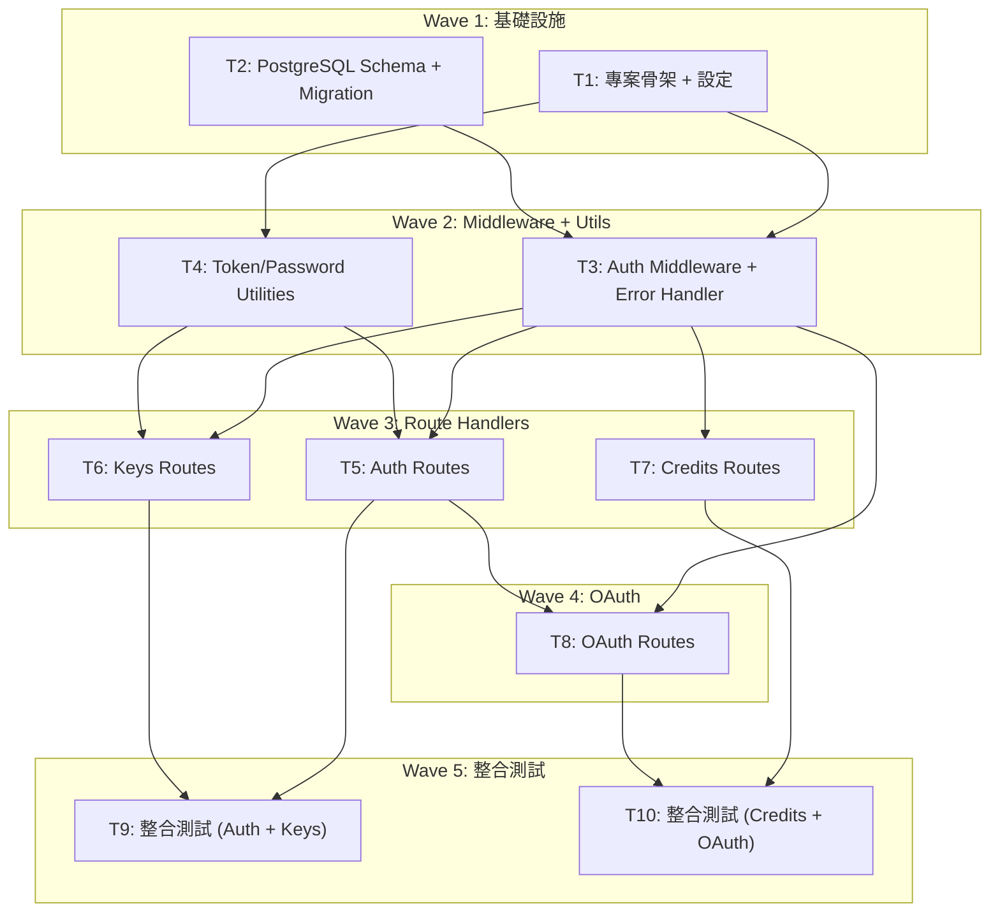

# S3 Implementation Plan: Real Backend Server (openclaw-token-server)

> **階段**: S3 實作計畫
> **建立時間**: 2026-03-15 16:00
> **Agents**: `frontend-developer` (後端 TypeScript 實作), `test-engineer` (整合測試)
> **Target Repo**: openclaw-token-server (獨立 repo，全新建立)
> **Runtime**: Bun + Hono + PostgreSQL

---

## 1. 概述

### 1.1 功能目標

建立獨立 repo `openclaw-token-server`（Hono + Bun + PostgreSQL），實作全部 18 個 HTTP 操作（14 個路由端點），取代 mock backend，讓 CLI 可不帶 `--mock` 直接操作真實 DB 和 GitHub OAuth。

### 1.2 實作範圍
- **範圍內**: Hono + Bun 專案骨架、PostgreSQL schema + migration、Auth/Keys/Credits/OAuth 全部 18 HTTP 操作、Auth middleware + error handling、整合測試
- **範圍外**: 雲端部署、Rate limiting、多用戶權限、Docker compose、帳單/支付整合、CLI 端程式碼修改

### 1.3 關聯文件
| 文件 | 路徑 | 狀態 |
|------|------|------|
| Brief Spec | `./s0_brief_spec.md` | ✅ |
| Dev Spec | `./s1_dev_spec.md` | ✅ |
| API Spec | `./s1_api_spec.md` | ✅ |
| Implementation Plan | `./s3_implementation_plan.md` | 📝 當前 |

---

## 2. 實作任務清單

### 2.1 任務總覽

| # | 任務 | 類型 | Agent | 依賴 | 複雜度 | FA | TDD | 狀態 |
|---|------|------|-------|------|--------|-----|-----|------|
| 1 | 專案骨架 + 設定 | 後端 | `frontend-developer` | - | M | FA-Infra | ⛔ | ⬜ |
| 2 | PostgreSQL Schema + Migration | 資料層 | `frontend-developer` | - | M | FA-Infra | ⛔ | ⬜ |
| 3 | Auth Middleware + Error Handler | 後端 | `frontend-developer` | #1, #2 | M | FA-Infra | ✅ | ⬜ |
| 4 | Token/Password Utilities | 後端 | `frontend-developer` | #1 | S | FA-Infra | ✅ | ⬜ |
| 5 | Auth Routes | 後端 | `frontend-developer` | #3, #4 | L | FA-Auth | ✅ | ⬜ |
| 6 | Keys Routes | 後端 | `frontend-developer` | #3, #4 | L | FA-Keys | ✅ | ⬜ |
| 7 | Credits Routes | 後端 | `frontend-developer` | #3 | L | FA-Credits | ✅ | ⬜ |
| 8 | OAuth Routes | 後端 | `frontend-developer` | #3, #5 | L | FA-OAuth | ✅ | ⬜ |
| 9 | 整合測試 (Auth + Keys) | 測試 | `test-engineer` | #5, #6 | L | 全域 | ✅ | ⬜ |
| 10 | 整合測試 (Credits + OAuth) | 測試 | `test-engineer` | #7, #8 | L | 全域 | ✅ | ⬜ |

**狀態圖例**：
- ⬜ pending（待處理）
- 🔄 in_progress（進行中）
- ✅ completed（已完成）
- ❌ blocked（被阻擋）
- ⏭️ skipped（跳過）

**複雜度**：S（小，<30min）、M（中，30min-2hr）、L（大，>2hr）

**TDD**: ✅ = has tdd_plan, ⛔ = N/A (skip_justification provided)

---

## 3. 任務詳情

### Task #1: 專案骨架 + 設定

**基本資訊**
| 項目 | 內容 |
|------|------|
| 類型 | 後端 |
| Agent | `frontend-developer` |
| 複雜度 | M |
| 依賴 | - |
| FA | FA-Infra |
| 狀態 | ⬜ pending |

**描述**

初始化 Hono + Bun 專案。建立 `package.json`（含 hono、postgres 依賴）、`tsconfig.json`、`.env.example`、`src/config.ts`（環境變數統一管理）、`src/index.ts`（Hono app factory + 健康檢查端點）、`src/errors.ts`（AppError 類別）。設定 CORS，預留路由掛載點。

**輸入**
- 無前置條件（全新 repo）

**輸出**
- 可用 `bun install` 安裝依賴
- 可用 `bun run src/index.ts` 啟動 server
- 健康檢查端點 `GET /` 回傳 `{ status: "ok" }`

**受影響檔案**
| 檔案 | 變更類型 | 說明 |
|------|---------|------|
| `package.json` | 新增 | 專案設定 + 依賴（hono, postgres） |
| `tsconfig.json` | 新增 | TypeScript 設定 |
| `.env.example` | 新增 | 環境變數範例 |
| `src/index.ts` | 新增 | Hono app 入口 |
| `src/config.ts` | 新增 | 環境變數管理 |
| `src/errors.ts` | 新增 | AppError 類別定義 |
| `CLAUDE.md` | 新增 | 專案開發指引 |

**DoD（完成定義）**
- [ ] `bun install` 成功安裝所有依賴
- [ ] `bun run src/index.ts` 啟動 Hono server 並監聽 port 3000
- [ ] `config.ts` 從環境變數讀取 DATABASE_URL、GITHUB_CLIENT_ID、GITHUB_CLIENT_SECRET、PORT
- [ ] `GET /` 回傳 200 `{ status: "ok" }`
- [ ] `AppError` 類別包含 code、message、status 三個屬性
- [ ] `.env.example` 包含所有必要環境變數
- [ ] `package.json` scripts 含 `dev`（bun --watch src/index.ts）

**TDD Plan**: N/A -- 純設定/骨架檔案，無可測邏輯。健康檢查端點在 Task #3 的 middleware 測試中一併覆蓋。

**驗證方式**
```bash
cd openclaw-token-server
bun install
bun run src/index.ts &
curl http://localhost:3000/
# 預期回傳: { "status": "ok" }
kill %1
```

**實作備註**
- Hono app 使用 factory function `createApp(sql)`，接受 DB pool 參數，方便測試注入
- `config.ts` 使用 `process.env` + fallback 預設值，不用額外設定管理套件
- 優先使用 Bun 內建 API（`Bun.password` for bcrypt, `crypto` for hash）
- `package.json` scripts: `"dev": "bun --watch src/index.ts"`, `"start": "bun src/index.ts"`, `"test": "bun test"`

---

### Task #2: PostgreSQL Schema + Migration

**基本資訊**
| 項目 | 內容 |
|------|------|
| 類型 | 資料層 |
| Agent | `frontend-developer` |
| 複雜度 | M |
| 依賴 | - |
| FA | FA-Infra |
| 狀態 | ⬜ pending |

**描述**

建立 PostgreSQL 連線池（porsager/postgres）、migration runner（讀取 SQL 檔案依序套用）、初始 schema SQL（6 張業務表 + 1 張 schema_migrations 表）。Migration runner 在 server 啟動時自動執行未套用的 migration。

**輸入**
- PostgreSQL 資料庫已可用
- DATABASE_URL 環境變數

**輸出**
- DB 連線池可用
- 7 張表自動建立（6 業務 + 1 migration tracking）
- 重複啟動不重複執行 migration

**受影響檔案**
| 檔案 | 變更類型 | 說明 |
|------|---------|------|
| `src/db/client.ts` | 新增 | PostgreSQL 連線池（porsager/postgres） |
| `src/db/migrate.ts` | 新增 | Migration runner |
| `src/db/migrations/001_initial.sql` | 新增 | 初始 schema DDL（6 表 + 索引） |

**DoD（完成定義）**
- [ ] `postgres()` 連線池正確建立，連線字串從 config 讀取
- [ ] 首次啟動自動建立 7 張表（users, management_keys, provisioned_keys, credit_balances, credit_transactions, oauth_sessions, schema_migrations）
- [ ] 重複執行 migration 不會報錯（透過 schema_migrations 版本追蹤）
- [ ] 所有索引正確建立（含部分索引 `WHERE is_revoked = false`、unique partial index `idx_prov_keys_user_name_active`）
- [ ] 連線失敗時拋出明確錯誤訊息，server 啟動失敗

**TDD Plan**: N/A -- 純 DDL schema + migration runner，驗證方式為啟動 server 後用 psql 檢查表結構。整合測試（Task #9, #10）會全面驗證 schema 的正確性。

**驗證方式**
```bash
# 啟動 server（觸發 migration）
DATABASE_URL=postgres://localhost:5432/openclaw_token_dev bun run src/index.ts

# 用 psql 檢查
psql openclaw_token_dev -c "\dt"
# 預期看到 7 張表
psql openclaw_token_dev -c "\di"
# 預期看到所有索引
```

**實作備註**
- DDL 直接使用 dev_spec 第 4.2 節的完整 SQL
- migration runner 邏輯：讀取 `migrations/` 目錄下的 `.sql` 檔案 → 檢查 `schema_migrations` 表 → 執行未套用的 → 記錄版本
- `client.ts` 匯出 `sql` instance（porsager/postgres 的命名慣例）
- 連線池大小預設 10，可透過環境變數調整

---

### Task #3: Auth Middleware + Error Handler

**基本資訊**
| 項目 | 內容 |
|------|------|
| 類型 | 後端 |
| Agent | `frontend-developer` |
| 複雜度 | M |
| 依賴 | Task #1, Task #2 |
| FA | FA-Infra |
| 狀態 | ⬜ pending |

**描述**

實作 Bearer token 驗證 middleware（查 DB management_keys 表，未 revoked 的有效 key → 設定 ctx userId）和統一錯誤處理 middleware（catch AppError → JSON error response；PG 23505 → 409；未知錯誤 → 500 不洩漏 stack trace）。整合到 Hono app。

**輸入**
- Task #1 的 Hono app + AppError 類別
- Task #2 的 DB 連線池 + schema

**輸出**
- `authMiddleware` 可掛載到需認證的路由
- `errorMiddleware` 掛載為全域 middleware（Hono `onError` hook）
- 認證成功的請求可透過 `c.get('userId')` 取得 userId

**受影響檔案**
| 檔案 | 變更類型 | 說明 |
|------|---------|------|
| `src/middleware/auth.ts` | 新增 | Bearer token 驗證 middleware |
| `src/middleware/error.ts` | 新增 | 統一錯誤處理 middleware |
| `src/index.ts` | 修改 | 掛載 error middleware |
| `tests/unit/middleware.test.ts` | 新增 | Middleware 單元測試 |

**DoD（完成定義）**
- [ ] Auth middleware 從 `Authorization: Bearer <token>` 提取 token
- [ ] 查 DB `management_keys WHERE key_value = $1 AND is_revoked = false`
- [ ] 驗證通過：設定 `c.set('userId', user_id)`，呼叫 `next()`
- [ ] 無 token / 無效 token / 已 revoked → 401 `{ error: { code: "UNAUTHORIZED", message: "Invalid or missing token" } }`
- [ ] Error handler 捕獲 AppError → 對應 HTTP status + `{ error: { code, message } }`
- [ ] PG unique_violation (23505) → 409 自動映射
- [ ] 未知錯誤 → 500 `{ error: { code: "INTERNAL_ERROR", message: "Internal server error" } }`（不洩漏 stack trace）
- [ ] 單元測試覆蓋 middleware 行為

**TDD Plan**
| 項目 | 內容 |
|------|------|
| 測試檔案 | `tests/unit/middleware.test.ts` |
| 測試指令 | `bun test tests/unit/middleware.test.ts` |
| 預期測試案例 | `auth: should reject missing token`, `auth: should reject invalid token`, `auth: should reject revoked token`, `auth: should set userId for valid token`, `error: should format AppError as JSON`, `error: should handle PG 23505 as 409`, `error: should hide stack trace for unknown errors` |

**驗證方式**
```bash
bun test tests/unit/middleware.test.ts
```

**實作備註**
- Auth middleware 需要 DB pool 注入，使用 Hono 的 `Variables` 型別系統設定 `userId: string`
- Error middleware 使用 Hono `onError` hook
- PG error code 23505 判斷：`error.code === '23505'`（postgres.js 的 error 物件）
- 測試可使用 test DB + transaction rollback 隔離

---

### Task #4: Token/Password Utilities

**基本資訊**
| 項目 | 內容 |
|------|------|
| 類型 | 後端 |
| Agent | `frontend-developer` |
| 複雜度 | S |
| 依賴 | Task #1 |
| FA | FA-Infra |
| 狀態 | ⬜ pending |

**描述**

實作 token 產生函式（management key、provisioned key、device code、user code、transaction ID）和密碼 hash/verify。所有函式為純函式或接近純函式，高度可測試。

**輸入**
- Task #1 的專案骨架（Bun 環境 + crypto API）

**輸出**
- `token.ts`：generateManagementKey, generateProvisionedKey, computeKeyHash, generateDeviceCode, generateUserCode, generateTransactionId
- `password.ts`：hashPassword, verifyPassword

**受影響檔案**
| 檔案 | 變更類型 | 說明 |
|------|---------|------|
| `src/utils/token.ts` | 新增 | Token 產生 + hash 計算 |
| `src/utils/password.ts` | 新增 | 密碼 bcrypt hash/verify |
| `tests/unit/utils.test.ts` | 新增 | 單元測試 |

**DoD（完成定義）**
- [ ] `generateManagementKey()` 回傳 `sk-mgmt-{UUID}` 格式
- [ ] `generateProvisionedKey()` 回傳 `sk-prov-{32 hex chars}` 格式
- [ ] `computeKeyHash(keyValue)` 回傳 SHA-256(keyValue) 前 16 hex chars
- [ ] `generateDeviceCode()` 回傳唯一隨機字串
- [ ] `generateUserCode()` 回傳 `XXXX-XXXX` 格式（8 字元大寫英數含連字號）
- [ ] `generateTransactionId()` 回傳 `txn-{UUID}` 格式
- [ ] `hashPassword(plain)` 回傳 bcrypt hash（work factor 10）
- [ ] `verifyPassword(plain, hash)` 正確驗證密碼
- [ ] 所有函式有單元測試

**TDD Plan**
| 項目 | 內容 |
|------|------|
| 測試檔案 | `tests/unit/utils.test.ts` |
| 測試指令 | `bun test tests/unit/utils.test.ts` |
| 預期測試案例 | `generateManagementKey: should match sk-mgmt-UUID format`, `generateProvisionedKey: should match sk-prov-32hex format`, `computeKeyHash: should return first 16 hex of SHA-256`, `computeKeyHash: same input same output (deterministic)`, `hashPassword + verifyPassword: should verify correct password`, `verifyPassword: should reject wrong password`, `generateDeviceCode: should be unique across calls`, `generateUserCode: should match XXXX-XXXX format` |

**驗證方式**
```bash
bun test tests/unit/utils.test.ts
```

**實作備註**
- 優先使用 Bun 內建 API：`Bun.password.hash(plain, { algorithm: "bcrypt", cost: 10 })` 和 `Bun.password.verify(plain, hash)`
- SHA-256 使用 `new Bun.CryptoHasher("sha256")` 或 Node.js `crypto.createHash('sha256')`
- `crypto.randomUUID()` 用於 UUID 產生
- `crypto.randomBytes(16).toString('hex')` 用於 32 hex chars

---

### Task #5: Auth Routes (register, login, me, rotate)

**基本資訊**
| 項目 | 內容 |
|------|------|
| 類型 | 後端 |
| Agent | `frontend-developer` |
| 複雜度 | L |
| 依賴 | Task #3, Task #4 |
| FA | FA-Auth |
| 狀態 | ⬜ pending |

**描述**

實作 4 個 Auth 端點。register 建立用戶 + management key + credit balance 初始化（DB transaction）。login 驗證密碼、revoke 所有舊 key、產新 key（技術決策 D1）。me 查詢用戶資訊 + credits remaining + keys count。rotate revoke 當前 key 產新 key。

**輸入**
- Task #3：Auth middleware + Error handler
- Task #4：Token 產生 + Password hash/verify
- API Spec：s1_api_spec.md FA-Auth 章節

**輸出**
- `POST /auth/register` (201)
- `POST /auth/login` (200)
- `GET /auth/me` (200, 需認證)
- `POST /auth/rotate` (200, 需認證)

**受影響檔案**
| 檔案 | 變更類型 | 說明 |
|------|---------|------|
| `src/routes/auth.ts` | 新增 | Auth 路由 4 個端點 |
| `src/index.ts` | 修改 | 掛載 auth 路由 |

**DoD（完成定義）**
- [ ] POST /auth/register: email+password required → 400; email unique → 409 EMAIL_EXISTS; bcrypt hash 密碼; DB transaction 建立 user + management_key + credit_balance; 回傳 201 `{ data: AuthRegisterResponse }`
- [ ] POST /auth/login: email+password required → 400; bcrypt verify → 401 INVALID_CREDENTIALS（不區分 email 不存在或密碼錯）; revoke 所有該用戶 active management_keys; 產生新 key; 回傳 200 `{ data: AuthLoginResponse }`
- [ ] GET /auth/me: 需認證; 回傳 email, plan, credits_remaining (total_credits - total_usage), keys_count (non-revoked provisioned keys count), created_at; 符合 `{ data: AuthMeResponse }`
- [ ] POST /auth/rotate: 需認證; revoke 當前 token 對應的 key; 產新 key; 回傳 200 `{ data: AuthRotateResponse }`
- [ ] 所有 response 嚴格符合 API Spec 定義的欄位和格式（含 `{ data: T }` 封裝）
- [ ] 寫入操作使用 DB transaction

**TDD Plan**
| 項目 | 內容 |
|------|------|
| 測試檔案 | `tests/integration/auth.test.ts` |
| 測試指令 | `bun test tests/integration/auth.test.ts` |
| 預期測試案例 | `register: should create user and return 201 with management_key`, `register: should reject duplicate email with 409`, `register: should reject missing fields with 400`, `login: should return new key and revoke old`, `login: should reject wrong password with 401`, `login: should reject missing fields with 400`, `me: should return user info with credits and keys_count`, `me: should reject unauthenticated with 401`, `rotate: should return new key and revoke old`, `rotate: old key should immediately return 401` |

**驗證方式**
```bash
bun test tests/integration/auth.test.ts
```

**實作備註**
- Register 的 DB transaction：INSERT users → INSERT management_keys → INSERT credit_balances（三步原子操作）
- Login 的 revoke：`UPDATE management_keys SET is_revoked = true, revoked_at = now() WHERE user_id = $1 AND is_revoked = false`
- 密碼錯誤和 email 不存在統一回傳 `INVALID_CREDENTIALS`，不洩漏 email 存在與否
- `credits_remaining`：JOIN credit_balances 計算 `total_credits - total_usage`
- `keys_count`：`COUNT(*) FROM provisioned_keys WHERE user_id = $1 AND is_revoked = false`

---

### Task #6: Keys Routes (CRUD + rotate)

**基本資訊**
| 項目 | 內容 |
|------|------|
| 類型 | 後端 |
| Agent | `frontend-developer` |
| 複雜度 | L |
| 依賴 | Task #3, Task #4 |
| FA | FA-Keys |
| 狀態 | ⬜ pending |

**描述**

實作 6 個 Keys 端點。create 產生 provisioned key + 計算 hash。list 支援 `include_revoked` 參數。detail 包含 usage stats placeholder（技術決策 D2）。update 支援 partial update。revoke 區分 404/410。rotate 換 key value 保持 hash 不變（技術決策 D7）。

**輸入**
- Task #3：Auth middleware + Error handler
- Task #4：Token 產生 + Hash 計算
- API Spec：s1_api_spec.md FA-Keys 章節

**輸出**
- `POST /keys` (201)
- `GET /keys` (200)
- `GET /keys/:hash` (200)
- `PATCH /keys/:hash` (200)
- `DELETE /keys/:hash` (200)
- `POST /keys/:hash/rotate` (200)

**受影響檔案**
| 檔案 | 變更類型 | 說明 |
|------|---------|------|
| `src/routes/keys.ts` | 新增 | Keys 路由 6 個端點 |
| `src/index.ts` | 修改 | 掛載 keys 路由 |

**DoD（完成定義）**
- [ ] POST /keys: name required → 400; 同用戶同名 active key → 409 KEY_NAME_EXISTS; key format `sk-prov-{32 hex}`; hash = SHA-256(key_value) 前 16 hex; 回傳 201 `{ data: ProvisionedKey }` 含 key value
- [ ] GET /keys: `?include_revoked=true` 參數支援; response items 不含 key value 欄位; 回傳 `{ data: KeysListResponse }`
- [ ] GET /keys/:hash: 不存在或已 revoked → 404 KEY_NOT_FOUND; 含 usage_daily/weekly/monthly/requests_count/model_usage（placeholder 靜態乘數）; response 不含 key value; 回傳 `{ data: KeyDetailResponse }`
- [ ] PATCH /keys/:hash: 不存在或已 revoked → 404 KEY_NOT_FOUND; 可更新 credit_limit/limit_reset/disabled; 回傳 `{ data: ProvisionedKey }`（不含 key value）
- [ ] DELETE /keys/:hash: 不存在 → 404 KEY_NOT_FOUND; 已 revoked → 410 KEY_ALREADY_REVOKED; 成功 → 200 `{ data: KeyRevokeResponse }`
- [ ] POST /keys/:hash/rotate: 不存在 → 404 KEY_NOT_FOUND; 已 revoked → 410 KEY_REVOKED; 產新 key value + hash 不變; 回傳 200 `{ data: KeyRotateResponse }`

**TDD Plan**
| 項目 | 內容 |
|------|------|
| 測試檔案 | `tests/integration/keys.test.ts` |
| 測試指令 | `bun test tests/integration/keys.test.ts` |
| 預期測試案例 | `create: should create key with hash`, `create: should reject duplicate name with 409`, `create: should reject missing name with 400`, `list: should return active keys without key value`, `list: should include revoked when param set`, `detail: should return usage stats`, `detail: should 404 for revoked key`, `update: should partial update fields`, `revoke: should set revoked and return response`, `revoke: should 410 for already revoked`, `rotate: should change key value and keep hash`, `rotate: should 410 for revoked key` |

**驗證方式**
```bash
bun test tests/integration/keys.test.ts
```

**實作備註**
- Usage stats placeholder 乘數：`usage_daily = usage * 0.15`, `usage_weekly = usage * 0.6`, `usage_monthly = usage`, `requests_count = Math.floor(usage * 40)`
- model_usage 固定回傳兩個模型：`[{ model: "gpt-4", requests: Math.floor(rc * 0.3), tokens: Math.floor(rc * 1500), cost: Number((usage * 0.7).toFixed(2)) }, { model: "gpt-3.5-turbo", ... }]`
- Key rotate：只 UPDATE key_value 欄位，hash 保持原值（D7）
- 同用戶同名衝突靠 DB partial unique index `idx_prov_keys_user_name_active` 自動防護 → catch PG 23505 映射為 409 KEY_NAME_EXISTS

---

### Task #7: Credits Routes (balance, purchase, history, auto-topup)

**基本資訊**
| 項目 | 內容 |
|------|------|
| 類型 | 後端 |
| Agent | `frontend-developer` |
| 複雜度 | L |
| 依賴 | Task #3 |
| FA | FA-Credits |
| 狀態 | ⬜ pending |

**描述**

實作 5 個 Credits 端點。balance 查詢 remaining。purchase 含 platform_fee 計算 + Idempotency-Key header 支援 + DB transaction 原子寫入（技術決策 D5）。history 支援分頁 + type 篩選。auto-topup GET/PUT 讀寫設定（技術決策 D3：僅存設定不觸發）。

**輸入**
- Task #3：Auth middleware + Error handler
- API Spec：s1_api_spec.md FA-Credits 章節

**輸出**
- `GET /credits` (200)
- `POST /credits/purchase` (200)
- `GET /credits/history` (200)
- `GET /credits/auto-topup` (200)
- `PUT /credits/auto-topup` (200)

**受影響檔案**
| 檔案 | 變更類型 | 說明 |
|------|---------|------|
| `src/routes/credits.ts` | 新增 | Credits 路由 5 個端點 |
| `src/index.ts` | 修改 | 掛載 credits 路由 |

**DoD（完成定義）**
- [ ] GET /credits: 回傳 total_credits, total_usage, remaining (= total_credits - total_usage); 符合 `{ data: CreditsResponse }`
- [ ] POST /credits/purchase: amount required + >= 5 → 否則 400 INVALID_INPUT; platform_fee = `Math.round(Math.max(amount * 0.055, 0.80) * 100) / 100`; DB transaction: UPDATE credit_balances.total_credits += amount + INSERT credit_transactions; 回傳 `{ data: CreditsPurchaseResponse }`
- [ ] POST /credits/purchase: 支援 `Idempotency-Key` header; 重複 key 回傳原始 transaction 結果（不重新扣款）
- [ ] GET /credits/history: 支援 limit (default 20) / offset (default 0) / type 篩選; 回傳 `{ data: CreditsHistoryResponse }` 含 has_more
- [ ] GET /credits/auto-topup: 回傳 `{ data: AutoTopupConfig }`
- [ ] PUT /credits/auto-topup: partial update; threshold >= 1, amount >= 5（有提供時驗證）→ 否則 400; 回傳 `{ data: AutoTopupUpdateResponse }`

**TDD Plan**
| 項目 | 內容 |
|------|------|
| 測試檔案 | `tests/integration/credits.test.ts` |
| 測試指令 | `bun test tests/integration/credits.test.ts` |
| 預期測試案例 | `balance: should return zero for new user`, `purchase: should add credits and return response`, `purchase: should calculate platform_fee correctly`, `purchase: should reject amount < 5`, `purchase: should be idempotent with same Idempotency-Key`, `history: should paginate with limit/offset`, `history: should filter by type`, `auto-topup: GET should return defaults`, `auto-topup: PUT should update config`, `auto-topup: PUT should reject threshold < 1` |

**驗證方式**
```bash
bun test tests/integration/credits.test.ts
```

**實作備註**
- Purchase 的 DB transaction：`BEGIN → SELECT credit_balances FOR UPDATE → UPDATE total_credits += amount → INSERT credit_transactions → COMMIT`
- Idempotency 實作：先 `SELECT credit_transactions WHERE idempotency_key = $1`；存在則直接回傳原始結果；不存在則正常執行（INSERT 時 UNIQUE constraint 做最後防線）
- `new_balance` = total_credits + amount - total_usage（購買後的 remaining）
- `has_more` = offset + limit < total
- history 預設 limit=20, offset=0

---

### Task #8: OAuth Routes (device/code, device/token, userinfo)

**基本資訊**
| 項目 | 內容 |
|------|------|
| 類型 | 後端 |
| Agent | `frontend-developer` |
| 複雜度 | L |
| 依賴 | Task #3, Task #5 |
| FA | FA-OAuth |
| 狀態 | ⬜ pending |

**描述**

實作 3 個 OAuth 端點。Server 作為 GitHub OAuth App 的中繼代理。device/code 呼叫 GitHub API 啟動 Device Flow + 存 session 到 DB。device/token 輪詢 GitHub + 處理 pending/expired/success 狀態。userinfo 用 GitHub access_token 查 /user + /user/emails → upsert 用戶 → 回傳 management_key。

**輸入**
- Task #3：Auth middleware + Error handler
- Task #5：User 建立邏輯參考
- API Spec：s1_api_spec.md FA-OAuth 章節
- 環境變數：GITHUB_CLIENT_ID, GITHUB_CLIENT_SECRET

**輸出**
- `POST /oauth/device/code` (200, 無需認證)
- `POST /oauth/device/token` (200, 無需認證)
- `GET /oauth/userinfo` (200, 需 OAuth session token 認證)

**受影響檔案**
| 檔案 | 變更類型 | 說明 |
|------|---------|------|
| `src/routes/oauth.ts` | 新增 | OAuth 路由 3 個端點 |
| `src/index.ts` | 修改 | 掛載 oauth 路由 |

**DoD（完成定義）**
- [ ] POST /oauth/device/code: client_id required → 400 INVALID_INPUT; client_id 不匹配 GITHUB_CLIENT_ID → 400 INVALID_CLIENT_ID; 呼叫 GitHub `POST /login/device/code`; 存 session 到 oauth_sessions; 回傳 `{ data: OAuthDeviceCodeResponse }`
- [ ] POST /oauth/device/token: device_code required; 查 DB session → 不存在 → `{ error: "bad_device_code" }` / 過期 → `{ error: "expired_token" }`; 呼叫 GitHub `POST /login/oauth/access_token`; pending → `{ error: "authorization_pending" }`; success → 存 github_access_token + 產 server session token → 回傳 `{ data: OAuthDeviceTokenResponse }`
- [ ] GET /oauth/userinfo: Bearer token 查 oauth_sessions; 用 github_access_token 呼叫 GitHub `GET /user` + `GET /user/emails`; 取 primary verified email; email 已存在 → merge (更新 github_id/avatar_url, merged: true); 不存在 → 建立新用戶 + management_key + credit_balance (merged: false); 回傳 `{ data: OAuthUserInfoResponse }`
- [ ] GitHub API 不可達 → 502 `{ error: { code: "GITHUB_UNAVAILABLE", message: "..." } }`
- [ ] OAuth error responses 使用 `{ error: "error_code" }` 格式（OAuth 標準）
- [ ] 新用戶 password_hash 為 null（OAuth 帳號）

**TDD Plan**
| 項目 | 內容 |
|------|------|
| 測試檔案 | `tests/integration/oauth.test.ts` |
| 測試指令 | `bun test tests/integration/oauth.test.ts` |
| 預期測試案例 | `device/code: should proxy to GitHub and store session`, `device/code: should reject missing client_id`, `device/code: should reject mismatched client_id`, `device/token: should return authorization_pending`, `device/token: should return access_token on success`, `device/token: should return expired_token for expired session`, `device/token: should reject bad_device_code`, `userinfo: should create new user (merged: false)`, `userinfo: should merge existing user (merged: true)`, `oauth: should return 502 when GitHub unavailable` |

**驗證方式**
```bash
bun test tests/integration/oauth.test.ts
```

**實作備註**
- GitHub API 呼叫使用 `fetch`（Bun 內建）
- GitHub API endpoints:
  - `POST https://github.com/login/device/code` (Accept: application/json)
  - `POST https://github.com/login/oauth/access_token` (Accept: application/json)
  - `GET https://api.github.com/user` (Authorization: Bearer {github_access_token})
  - `GET https://api.github.com/user/emails`
- device/token 回傳的 `access_token` 是 server 產生的 session token（UUID），非 GitHub token
- 整合測試需 mock GitHub API（全域 fetch interceptor 或 `Bun.mock`）
- Upsert 邏輯：email match 且無 github_id → UPDATE 合併；email match 且有 github_id → 回傳既有 key；email 不存在 → INSERT 新用戶

---

### Task #9: 整合測試 (Auth + Keys)

**基本資訊**
| 項目 | 內容 |
|------|------|
| 類型 | 測試 |
| Agent | `test-engineer` |
| 複雜度 | L |
| 依賴 | Task #5, Task #6 |
| FA | 全域 |
| 狀態 | ⬜ pending |

**描述**

為 Auth 和 Keys 端點撰寫完整整合測試。建立測試 setup infrastructure（DB 連線、每測試隔離、test helper 函式）。覆蓋全部 happy path + error path。驗證 response 格式嚴格符合 API Spec。

**輸入**
- Task #5：Auth Routes 實作完成
- Task #6：Keys Routes 實作完成
- API Spec 作為驗證基準

**輸出**
- 測試 setup infrastructure（可被 Task #10 復用）
- Auth 端點完整測試
- Keys 端點完整測試

**受影響檔案**
| 檔案 | 變更類型 | 說明 |
|------|---------|------|
| `tests/setup.ts` | 新增 | 測試 DB 連線、隔離 helper、test user helper |
| `tests/integration/auth.test.ts` | 新增 | Auth 4 端點整合測試 |
| `tests/integration/keys.test.ts` | 新增 | Keys 6 端點整合測試 |

**DoD（完成定義）**
- [ ] 測試 setup：DB 連線到測試資料庫、每個測試案例使用隔離機制（transaction rollback 或 cleanup）、helper 函式（createTestUser, getAuthToken）
- [ ] Auth 測試覆蓋：register 成功 / 重複 email 409 / 缺欄位 400; login 成功 / 錯密碼 401 / 缺欄位 400 / 舊 key 失效; me 成功 / 未認證 401; rotate 成功 / 舊 key 驗證 401
- [ ] Keys 測試覆蓋：create 成功 / 重複名稱 409 / 缺名稱 400; list 含/不含 revoked; detail 成功含 usage stats / revoked=404; update 成功 / revoked=404; revoke 成功 / 已 revoked=410 / 不存在=404; rotate 成功含 hash 不變驗證 / revoked=410
- [ ] 所有測試 `bun test` 通過
- [ ] Response 格式驗證：檢查 `{ data: T }` 封裝和必要欄位存在

**TDD Plan**
| 項目 | 內容 |
|------|------|
| 測試檔案 | `tests/integration/auth.test.ts`, `tests/integration/keys.test.ts` |
| 測試指令 | `bun test tests/integration/auth.test.ts tests/integration/keys.test.ts` |
| 預期測試案例 | Auth ~10 cases, Keys ~12 cases（見 DoD） |

**驗證方式**
```bash
bun test tests/integration/auth.test.ts tests/integration/keys.test.ts
```

**實作備註**
- 建議使用 Hono 的 `app.request()` 方法直接呼叫 handler（不需啟動 HTTP server，更快且不需 port 管理）
- 測試資料庫命名：`openclaw_token_test`（與 dev 分開）
- `createTestUser` helper：呼叫 register endpoint 或直接 DB insert，回傳 `{ userId, managementKey }`
- 每個 describe block 前後執行 setup / cleanup

---

### Task #10: 整合測試 (Credits + OAuth)

**基本資訊**
| 項目 | 內容 |
|------|------|
| 類型 | 測試 |
| Agent | `test-engineer` |
| 複雜度 | L |
| 依賴 | Task #7, Task #8 |
| FA | 全域 |
| 狀態 | ⬜ pending |

**描述**

為 Credits 和 OAuth 端點撰寫完整整合測試。Credits 測試覆蓋 balance/purchase/history/auto-topup 含 idempotency 驗證。OAuth 測試使用 mock GitHub API（fetch interceptor）覆蓋 device flow 全流程。

**輸入**
- Task #7：Credits Routes 實作完成
- Task #8：OAuth Routes 實作完成
- Task #9：測試 setup infrastructure（復用 `tests/setup.ts`）

**輸出**
- Credits 端點完整測試
- OAuth 端點完整測試（含 GitHub API mock）

**受影響檔案**
| 檔案 | 變更類型 | 說明 |
|------|---------|------|
| `tests/integration/credits.test.ts` | 新增 | Credits 5 端點整合測試 |
| `tests/integration/oauth.test.ts` | 新增 | OAuth 3 端點整合測試（含 GitHub mock） |

**DoD（完成定義）**
- [ ] Credits 測試覆蓋：balance 初始為零; purchase 成功 + platform_fee 計算正確 + new_balance 正確; purchase amount < 5 → 400; purchase idempotency（同 Idempotency-Key 回傳相同 transaction_id，balance 只增加一次）; history 分頁 + has_more 正確; history type 篩選; auto-topup GET 預設值; PUT 更新成功; PUT threshold < 1 → 400
- [ ] OAuth 測試覆蓋：device/code 成功（mock GitHub response）; device/code 缺 client_id → 400; device/code client_id 不匹配 → 400; device/token pending → 透傳; device/token success → 回傳 access_token; device/token expired → expired_token error; device/token bad_device_code → error; userinfo 新用戶 (merged: false); userinfo 合併用戶 (merged: true); GitHub 不可達 → 502
- [ ] OAuth 測試使用 mock GitHub API（不依賴真實 GitHub）
- [ ] 所有測試 `bun test` 通過

**TDD Plan**
| 項目 | 內容 |
|------|------|
| 測試檔案 | `tests/integration/credits.test.ts`, `tests/integration/oauth.test.ts` |
| 測試指令 | `bun test tests/integration/credits.test.ts tests/integration/oauth.test.ts` |
| 預期測試案例 | Credits ~10 cases, OAuth ~10 cases（見 DoD） |

**驗證方式**
```bash
bun test tests/integration/credits.test.ts tests/integration/oauth.test.ts
```

**實作備註**
- GitHub API mock：使用全域 fetch interceptor 攔截 `github.com` 和 `api.github.com` 請求，或使用 `Bun.mock`
- OAuth test helpers：`mockGitHubDeviceCode()`, `mockGitHubAccessToken()`, `mockGitHubUser()`, `mockGitHubEmails()`
- Idempotency 測試：發送兩次相同 Idempotency-Key 的 purchase，驗證 `transaction_id` 相同、balance 只增加一次
- Credits purchase 的 platform_fee 精確度驗證：例如 `amount=10` → `Math.round(Math.max(10 * 0.055, 0.80) * 100) / 100 === 0.80`

---

## 4. 依賴關係圖



---

## 5. 執行順序與 Agent 分配

### 5.1 執行波次

| 波次 | 任務 | Agent | 可並行 | 備註 |
|------|------|-------|--------|------|
| Wave 1 | #1 專案骨架 + 設定 | `frontend-developer` | 是（與 #2 並行） | 全新 repo 初始化 |
| Wave 1 | #2 PostgreSQL Schema + Migration | `frontend-developer` | 是（與 #1 並行） | 可獨立撰寫 SQL + runner |
| Wave 2 | #3 Auth Middleware + Error Handler | `frontend-developer` | 是（與 #4 部分並行） | 需等 #1 + #2 完成 |
| Wave 2 | #4 Token/Password Utilities | `frontend-developer` | 是（與 #3 部分並行） | 只需等 #1 完成 |
| Wave 3 | #5 Auth Routes | `frontend-developer` | 是（與 #6, #7 並行） | 需等 #3 + #4 |
| Wave 3 | #6 Keys Routes | `frontend-developer` | 是（與 #5, #7 並行） | 需等 #3 + #4 |
| Wave 3 | #7 Credits Routes | `frontend-developer` | 是（與 #5, #6 並行） | 只需等 #3 |
| Wave 4 | #8 OAuth Routes | `frontend-developer` | 否 | 需等 #3 + #5 |
| Wave 5 | #9 整合測試 (Auth + Keys) | `test-engineer` | 是（與 #10 並行） | 需等 #5 + #6 |
| Wave 5 | #10 整合測試 (Credits + OAuth) | `test-engineer` | 是（與 #9 並行） | 需等 #7 + #8 |

### 5.2 並行策略摘要

- **Wave 1**: T1 和 T2 完全獨立，可並行執行
- **Wave 2**: T3 需等 T1+T2，T4 只需等 T1。兩者操作不同模組，可部分並行
- **Wave 3**: T5, T6, T7 操作不同 DB 表和路由檔案，可三路並行
- **Wave 4**: T8 單獨執行（依賴 T5 的 user upsert 邏輯參考 + T3 的 middleware）
- **Wave 5**: T9 和 T10 測試不同模組，可並行

### 5.3 Agent 調度指令

```
# Wave 1 - 並行
Task(
  subagent_type: "frontend-developer",
  prompt: "實作 Task #1: 專案骨架 + 設定\n\n在全新目錄 openclaw-token-server 中初始化 Hono + Bun 專案。\n建立 package.json (hono, postgres 依賴), tsconfig.json, .env.example, src/index.ts (Hono app factory + GET / health check), src/config.ts (環境變數管理), src/errors.ts (AppError class), CLAUDE.md。\n\nDoD:\n- bun install 成功\n- bun run src/index.ts 啟動 port 3000\n- GET / 回傳 { status: 'ok' }\n- config.ts 讀取 DATABASE_URL, GITHUB_CLIENT_ID, GITHUB_CLIENT_SECRET, PORT\n- AppError(code, message, status) 類別可用\n\n參考：s1_dev_spec.md 第 9 節專案結構",
  description: "S4-T1 專案骨架 + 設定"
)

Task(
  subagent_type: "frontend-developer",
  prompt: "實作 Task #2: PostgreSQL Schema + Migration\n\n建立 src/db/client.ts (porsager/postgres 連線池), src/db/migrate.ts (migration runner), src/db/migrations/001_initial.sql。\n\nDDL 見 s1_dev_spec.md 第 4.2 節。7 張表：users, management_keys, provisioned_keys, credit_balances, credit_transactions, oauth_sessions, schema_migrations。\n\nDoD:\n- 連線池正確建立\n- 首次啟動自動建立全部表和索引\n- 重複執行不報錯\n- 連線失敗拋明確錯誤\n\n參考：s1_dev_spec.md 第 4.2 節完整 DDL",
  description: "S4-T2 PostgreSQL Schema + Migration"
)

# Wave 2 - 可部分並行（T4 不需等 T2）
Task(
  subagent_type: "frontend-developer",
  prompt: "實作 Task #3: Auth Middleware + Error Handler\n\n建立 src/middleware/auth.ts (Bearer token 驗證) 和 src/middleware/error.ts (統一錯誤處理)。\n\nAuth: 提取 Bearer token → 查 DB management_keys → 設定 ctx userId\nError: AppError → JSON response, PG 23505 → 409, 未知 → 500\n\n建立測試 tests/unit/middleware.test.ts\n\nDoD 和完整規格見 s3_implementation_plan.md Task #3",
  description: "S4-T3 Auth Middleware + Error Handler"
)

Task(
  subagent_type: "frontend-developer",
  prompt: "實作 Task #4: Token/Password Utilities\n\n建立 src/utils/token.ts 和 src/utils/password.ts。\n\n函式：generateManagementKey (sk-mgmt-UUID), generateProvisionedKey (sk-prov-32hex), computeKeyHash (SHA-256 前 16 hex), generateDeviceCode, generateUserCode (XXXX-XXXX), generateTransactionId (txn-UUID), hashPassword (bcrypt wf10), verifyPassword。\n\n建立測試 tests/unit/utils.test.ts\n\nDoD 和完整規格見 s3_implementation_plan.md Task #4",
  description: "S4-T4 Token/Password Utilities"
)

# Wave 3 - 三個路由並行
Task(
  subagent_type: "frontend-developer",
  prompt: "實作 Task #5: Auth Routes\n\n建立 src/routes/auth.ts，實作 POST /auth/register, POST /auth/login, GET /auth/me, POST /auth/rotate。\n\n關鍵決策 D1：Login 產新 key + revoke 所有舊 key。\n\n完整 API 規格見 s1_api_spec.md FA-Auth 章節。\nDoD 見 s3_implementation_plan.md Task #5",
  description: "S4-T5 Auth Routes"
)

Task(
  subagent_type: "frontend-developer",
  prompt: "實作 Task #6: Keys Routes\n\n建立 src/routes/keys.ts，實作 POST /keys, GET /keys, GET /keys/:hash, PATCH /keys/:hash, DELETE /keys/:hash, POST /keys/:hash/rotate。\n\n關鍵決策 D6/D7：hash = SHA-256(initial_key_value) 前 16 hex，rotate 時 hash 不變。\nUsage stats 使用靜態乘數 placeholder。\n\n完整 API 規格見 s1_api_spec.md FA-Keys 章節。\nDoD 見 s3_implementation_plan.md Task #6",
  description: "S4-T6 Keys Routes"
)

Task(
  subagent_type: "frontend-developer",
  prompt: "實作 Task #7: Credits Routes\n\n建立 src/routes/credits.ts，實作 GET /credits, POST /credits/purchase, GET /credits/history, GET /credits/auto-topup, PUT /credits/auto-topup。\n\nIdempotency-Key header 支援。platform_fee 計算。DB transaction 保證原子性。\n\n完整 API 規格見 s1_api_spec.md FA-Credits 章節。\nDoD 見 s3_implementation_plan.md Task #7",
  description: "S4-T7 Credits Routes"
)

# Wave 4
Task(
  subagent_type: "frontend-developer",
  prompt: "實作 Task #8: OAuth Routes\n\n建立 src/routes/oauth.ts，實作 POST /oauth/device/code, POST /oauth/device/token, GET /oauth/userinfo。\n\nServer 代理 GitHub API。client_id 驗證。session 管理。user upsert (merge/create)。\n\n完整 API 規格見 s1_api_spec.md FA-OAuth 章節。\nDoD 見 s3_implementation_plan.md Task #8",
  description: "S4-T8 OAuth Routes"
)

# Wave 5 - 兩個測試並行
Task(
  subagent_type: "test-engineer",
  prompt: "實作 Task #9: 整合測試 (Auth + Keys)\n\n建立 tests/setup.ts (DB 連線 + 測試隔離 + test helpers)、tests/integration/auth.test.ts、tests/integration/keys.test.ts。\n\n覆蓋全部 happy path + error path。驗證 response 格式符合 API Spec。\n\nDoD 見 s3_implementation_plan.md Task #9",
  description: "S4-T9 整合測試 (Auth + Keys)"
)

Task(
  subagent_type: "test-engineer",
  prompt: "實作 Task #10: 整合測試 (Credits + OAuth)\n\n建立 tests/integration/credits.test.ts、tests/integration/oauth.test.ts。\n\nOAuth 測試需 mock GitHub API。Credits 測試需驗證 idempotency。\n復用 tests/setup.ts。\n\nDoD 見 s3_implementation_plan.md Task #10",
  description: "S4-T10 整合測試 (Credits + OAuth)"
)
```

---

## 6. 驗證計畫

### 6.1 逐任務驗證

| 任務 | 驗證指令 | 預期結果 |
|------|---------|---------|
| #1 | `cd openclaw-token-server && bun install && bun run src/index.ts` | Server 啟動 port 3000 |
| #1 | `curl http://localhost:3000/` | `{ "status": "ok" }` |
| #2 | `psql openclaw_token_dev -c "\dt"` | 7 張表存在 |
| #3 | `bun test tests/unit/middleware.test.ts` | All tests passed |
| #4 | `bun test tests/unit/utils.test.ts` | All tests passed |
| #5 | `bun test tests/integration/auth.test.ts` | All tests passed |
| #6 | `bun test tests/integration/keys.test.ts` | All tests passed |
| #7 | `bun test tests/integration/credits.test.ts` | All tests passed |
| #8 | `bun test tests/integration/oauth.test.ts` | All tests passed |
| #9 | `bun test tests/integration/auth.test.ts tests/integration/keys.test.ts` | All tests passed |
| #10 | `bun test tests/integration/credits.test.ts tests/integration/oauth.test.ts` | All tests passed |

### 6.2 整體驗證

```bash
# 全部測試
cd openclaw-token-server
bun test

# 手動 E2E 驗證（server 需啟動 + PostgreSQL）
DATABASE_URL=postgres://localhost:5432/openclaw_token_dev bun run src/index.ts &

# 註冊
curl -X POST http://localhost:3000/auth/register \
  -H "Content-Type: application/json" \
  -d '{"email":"test@example.com","password":"password123"}'
# 預期 201 回傳 { data: { management_key, email, created_at } }

# token-cli 端驗證（不帶 --mock）
cd ../token-cli
OPENCLAW_TOKEN_API_BASE=http://localhost:3000 npx tsx src/index.ts auth me
```

---

## 7. 實作進度追蹤

### 7.1 進度總覽

| 指標 | 數值 |
|------|------|
| 總任務數 | 10 |
| 已完成 | 0 |
| 進行中 | 0 |
| 待處理 | 10 |
| 完成率 | 0% |

### 7.2 時間軸

| 時間 | 事件 | 備註 |
|------|------|------|
| 2026-03-15 16:00 | S3 計畫完成 | |
| | | |

---

## 8. 變更記錄

### 8.1 檔案變更清單

```
新增（openclaw-token-server repo）：
  package.json
  tsconfig.json
  .env.example
  CLAUDE.md
  src/index.ts
  src/config.ts
  src/errors.ts
  src/db/client.ts
  src/db/migrate.ts
  src/db/migrations/001_initial.sql
  src/middleware/auth.ts
  src/middleware/error.ts
  src/routes/auth.ts
  src/routes/keys.ts
  src/routes/credits.ts
  src/routes/oauth.ts
  src/utils/token.ts
  src/utils/password.ts
  tests/setup.ts
  tests/unit/utils.test.ts
  tests/unit/middleware.test.ts
  tests/integration/auth.test.ts
  tests/integration/keys.test.ts
  tests/integration/credits.test.ts
  tests/integration/oauth.test.ts

修改：
  (無 — token-cli repo 不修改)

刪除：
  (無)
```

### 8.2 Commit 記錄

| Commit | 訊息 | 關聯任務 |
|--------|------|---------|
| | | |

---

## 9. 風險與問題追蹤

### 9.1 已識別風險

| # | 風險 | 影響 | 緩解措施 | 狀態 |
|---|------|------|---------|------|
| 1 | OAuth Device Flow 依賴外部 GitHub API | 高 | 502 fallback + 整合測試用 mock server + 手動 E2E 補充 | 監控中 |
| 2 | PostgreSQL 並發寫入導致資料不一致 | 中 | UNIQUE constraints + DB transactions + SELECT FOR UPDATE | 監控中 |
| 3 | Usage stats 使用假資料（placeholder） | 低 | 標記 placeholder，API 合約不變，後續版本實作真實 tracking | 已接受 |
| 4 | Login 行為與 mock 不一致（D1: 產新 key + revoke 舊） | 低 | CLI 只存最新 key，不受影響。mock 測試不跑 real backend | 已接受 |
| 5 | Idempotency key 永久留存導致表膨脹 | 低 | 本地開發不影響，未來可加 TTL 清理 | 已接受 |
| 6 | Bun.password API 行為差異 | 低 | 若 Bun.password 不穩定可 fallback 到 bcryptjs npm 套件 | 監控中 |
| 7 | 測試 DB 隔離不完全 | 中 | Transaction rollback + 獨立 test DB (`openclaw_token_test`) | 監控中 |

### 9.2 問題記錄

| # | 問題 | 發現時間 | 狀態 | 解決方案 |
|---|------|---------|------|---------|
| | | | | |

---

## SDD Context

```json
{
  "sdd_context": {
    "stages": {
      "s3": {
        "status": "pending_confirmation",
        "agent": "architect",
        "completed_at": "2026-03-15T16:00:00+08:00",
        "output": {
          "implementation_plan_path": "dev/specs/2026-03-15_2_real-backend/s3_implementation_plan.md",
          "waves": [
            {
              "wave": 1,
              "name": "基礎設施",
              "tasks": [
                { "id": 1, "name": "專案骨架 + 設定", "agent": "frontend-developer", "dependencies": [], "complexity": "M", "dod": ["bun install 成功", "server 啟動 port 3000", "GET / 回傳 200", "config.ts 讀取環境變數", "AppError 類別定義"], "parallel": true, "affected_files": ["package.json", "tsconfig.json", ".env.example", "src/index.ts", "src/config.ts", "src/errors.ts", "CLAUDE.md"], "tdd_plan": null, "skip_justification": "純設定/骨架檔案，無可測邏輯" },
                { "id": 2, "name": "PostgreSQL Schema + Migration", "agent": "frontend-developer", "dependencies": [], "complexity": "M", "dod": ["連線池建立", "7 張表自動建立", "重複執行不報錯", "索引正確建立"], "parallel": true, "affected_files": ["src/db/client.ts", "src/db/migrate.ts", "src/db/migrations/001_initial.sql"], "tdd_plan": null, "skip_justification": "純 DDL schema + migration runner，由整合測試驗證" }
              ],
              "parallel": true
            },
            {
              "wave": 2,
              "name": "Middleware + Utils",
              "tasks": [
                { "id": 3, "name": "Auth Middleware + Error Handler", "agent": "frontend-developer", "dependencies": [1, 2], "complexity": "M", "dod": ["Bearer token 提取驗證", "設定 ctx userId", "AppError → JSON", "PG 23505 → 409", "500 不洩漏 stack trace"], "parallel": true, "affected_files": ["src/middleware/auth.ts", "src/middleware/error.ts", "src/index.ts", "tests/unit/middleware.test.ts"], "tdd_plan": { "test_file": "tests/unit/middleware.test.ts", "test_cases": ["reject missing token", "reject invalid token", "set userId for valid token", "format AppError", "handle PG 23505", "hide stack trace"], "test_command": "bun test tests/unit/middleware.test.ts" } },
                { "id": 4, "name": "Token/Password Utilities", "agent": "frontend-developer", "dependencies": [1], "complexity": "S", "dod": ["generateManagementKey sk-mgmt-UUID", "generateProvisionedKey sk-prov-32hex", "computeKeyHash SHA-256 前 16 hex", "hashPassword bcrypt wf10", "verifyPassword 正確驗證"], "parallel": true, "affected_files": ["src/utils/token.ts", "src/utils/password.ts", "tests/unit/utils.test.ts"], "tdd_plan": { "test_file": "tests/unit/utils.test.ts", "test_cases": ["managementKey format", "provisionedKey format", "keyHash deterministic", "password hash+verify", "verify reject wrong"], "test_command": "bun test tests/unit/utils.test.ts" } }
              ],
              "parallel": "T3 需等 T1+T2，T4 只需等 T1。兩者可部分並行。"
            },
            {
              "wave": 3,
              "name": "Route Handlers",
              "tasks": [
                { "id": 5, "name": "Auth Routes", "agent": "frontend-developer", "dependencies": [3, 4], "complexity": "L", "dod": ["register 201", "login 200 + revoke old", "me 200", "rotate 200"], "parallel": true, "affected_files": ["src/routes/auth.ts", "src/index.ts"], "tdd_plan": { "test_file": "tests/integration/auth.test.ts", "test_cases": ["register success", "register duplicate 409", "register missing 400", "login success", "login wrong pw 401", "me success", "me unauth 401", "rotate success", "rotate old key 401"], "test_command": "bun test tests/integration/auth.test.ts" } },
                { "id": 6, "name": "Keys Routes", "agent": "frontend-developer", "dependencies": [3, 4], "complexity": "L", "dod": ["create 201", "list 200", "detail 200 + stats", "update 200", "revoke 200/410", "rotate 200 hash unchanged"], "parallel": true, "affected_files": ["src/routes/keys.ts", "src/index.ts"], "tdd_plan": { "test_file": "tests/integration/keys.test.ts", "test_cases": ["create success", "create dup name 409", "list active", "list include revoked", "detail with stats", "detail revoked 404", "update fields", "revoke success", "revoke already 410", "rotate keep hash"], "test_command": "bun test tests/integration/keys.test.ts" } },
                { "id": 7, "name": "Credits Routes", "agent": "frontend-developer", "dependencies": [3], "complexity": "L", "dod": ["balance 200", "purchase 200 + fee", "purchase idempotent", "history paginate", "auto-topup GET/PUT"], "parallel": true, "affected_files": ["src/routes/credits.ts", "src/index.ts"], "tdd_plan": { "test_file": "tests/integration/credits.test.ts", "test_cases": ["balance zero", "purchase success", "purchase fee calc", "purchase idempotent", "purchase < 5 rejected", "history paginate", "history filter type", "auto-topup get", "auto-topup put"], "test_command": "bun test tests/integration/credits.test.ts" } }
              ],
              "parallel": true
            },
            {
              "wave": 4,
              "name": "OAuth",
              "tasks": [
                { "id": 8, "name": "OAuth Routes", "agent": "frontend-developer", "dependencies": [3, 5], "complexity": "L", "dod": ["device/code 代理 GitHub", "device/token 狀態處理", "userinfo upsert", "502 fallback"], "parallel": false, "affected_files": ["src/routes/oauth.ts", "src/index.ts"], "tdd_plan": { "test_file": "tests/integration/oauth.test.ts", "test_cases": ["device/code success", "device/code invalid client_id", "device/token pending", "device/token success", "device/token expired", "userinfo new user", "userinfo merge", "github unavailable 502"], "test_command": "bun test tests/integration/oauth.test.ts" } }
              ],
              "parallel": false
            },
            {
              "wave": 5,
              "name": "整合測試",
              "tasks": [
                { "id": 9, "name": "整合測試 (Auth + Keys)", "agent": "test-engineer", "dependencies": [5, 6], "complexity": "L", "dod": ["測試 setup + 隔離", "Auth 10+ cases", "Keys 12+ cases", "所有測試通過"], "parallel": true, "affected_files": ["tests/setup.ts", "tests/integration/auth.test.ts", "tests/integration/keys.test.ts"], "tdd_plan": { "test_file": "tests/integration/auth.test.ts", "test_cases": ["register success/duplicate/missing", "login success/wrong/revoked", "me success/unauth", "rotate success/old-invalid", "keys create/dup/list/detail/update/revoke/rotate"], "test_command": "bun test tests/integration/auth.test.ts tests/integration/keys.test.ts" } },
                { "id": 10, "name": "整合測試 (Credits + OAuth)", "agent": "test-engineer", "dependencies": [7, 8], "complexity": "L", "dod": ["Credits 10+ cases 含 idempotency", "OAuth 10+ cases 含 mock GitHub", "所有測試通過"], "parallel": true, "affected_files": ["tests/integration/credits.test.ts", "tests/integration/oauth.test.ts"], "tdd_plan": { "test_file": "tests/integration/credits.test.ts", "test_cases": ["balance/purchase/idempotent/history/auto-topup", "oauth device-code/token/userinfo/merge/github-error"], "test_command": "bun test tests/integration/credits.test.ts tests/integration/oauth.test.ts" } }
              ],
              "parallel": true
            }
          ],
          "total_tasks": 10,
          "estimated_waves": 5,
          "verification": {
            "unit_tests": ["bun test tests/unit/"],
            "integration_tests": ["bun test tests/integration/"],
            "full_suite": ["bun test"]
          }
        }
      }
    }
  }
}
```

---

## 附錄

### A. 相關文件
- S0 Brief Spec: `./s0_brief_spec.md`
- S1 Dev Spec: `./s1_dev_spec.md`
- S1 API Spec: `./s1_api_spec.md`
- CLI API Types: `token-cli/src/api/types.ts`
- CLI API Endpoints: `token-cli/src/api/endpoints.ts`

### B. 技術決策速查

| ID | 決策 | 影響任務 |
|----|------|---------|
| D1 | Login 產新 key + revoke 舊 key | T5 |
| D2 | Usage stats 靜態乘數 placeholder | T6 |
| D3 | Auto-topup 僅存設定 | T7 |
| D4 | OAuth client_id 驗證匹配環境變數 | T8 |
| D5 | Idempotency 用 DB UNIQUE constraint | T7 |
| D6 | Key hash = SHA-256(initial_key_value) 前 16 hex | T4, T6 |
| D7 | Key rotate 時 hash 不變 | T6 |

### C. 參考資料
- [Hono 文件](https://hono.dev/)
- [porsager/postgres](https://github.com/porsager/postgres)
- [GitHub Device Flow](https://docs.github.com/en/apps/oauth-apps/building-oauth-apps/authorizing-oauth-apps#device-flow)
- [Bun.password API](https://bun.sh/docs/api/hashing)
- [Bun Test Runner](https://bun.sh/docs/cli/test)

### D. 專案規範提醒

#### Bun + Hono 後端
- 使用 `porsager/postgres` 作為 PostgreSQL driver，不用 ORM
- 密碼用 `Bun.password.hash()` / `Bun.password.verify()`（優先），否則 `bcryptjs`
- 測試用 Bun 內建 test runner：`bun test`
- 所有 response 嚴格符合 `{ data: T }` 或 `{ error: { code, message } }`
- 路由無 `/v1` prefix（CLI baseURL 已包含路徑前綴）
- Hono app 使用 factory function `createApp(sql)` 方便測試注入
