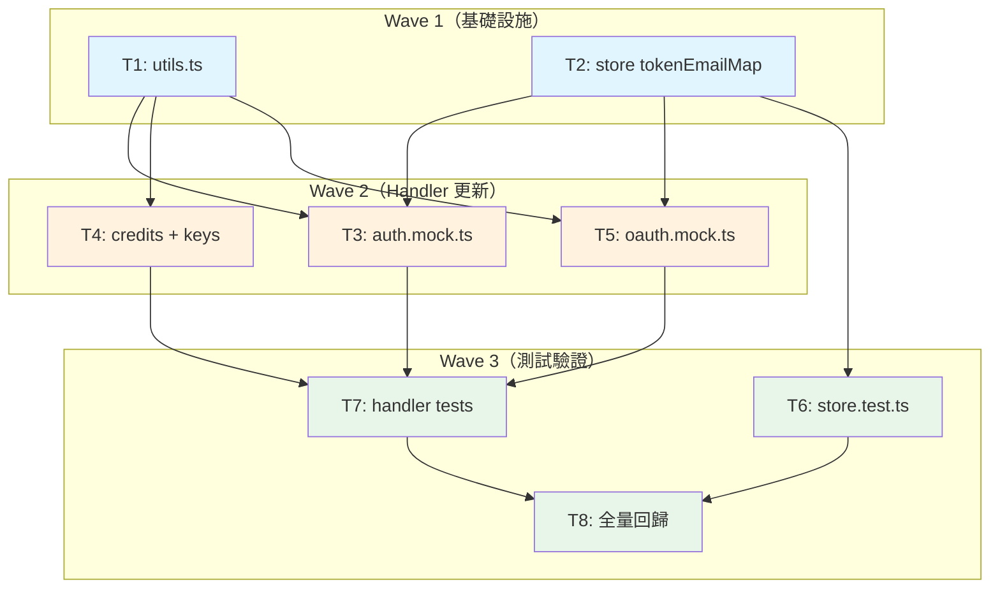

# S3 Implementation Plan: Mock Handler 重構

> **階段**: S3 實作計畫
> **建立時間**: 2026-03-15 20:30
> **Agent**: architect
> **工作類型**: refactor

---

## 1. 概述

### 1.1 功能目標

消除 mock handler 中 `extractToken`/`requireValidToken` 的跨檔重複定義（3 檔各 13 行 + oauth 5 行），並將 `MockStore.getEmailForToken` 從靜態回傳 `DEMO_EMAIL` 重構為基於 `tokenEmailMap` 的真實 token-to-email 映射。

### 1.2 實作範圍
- **範圍內**: FA-U（Mock Utils 抽取）、FA-S（MockStore Token 映射）、FA-H（Handler 更新）、FA-T（測試修復）
- **範圍外**: CLI 業務邏輯、API Client、MockRouter、Mock bootstrap、Handler HTTP 回應規格

### 1.3 關聯文件
| 文件 | 路徑 | 狀態 |
|------|------|------|
| Brief Spec | `./s0_brief_spec.md` | ✅ |
| Dev Spec | `./s1_dev_spec.md` | ✅ |
| Review Report | `./s2_review_report.md` | ✅ |
| Implementation Plan | `./s3_implementation_plan.md` | 📝 當前 |

---

## 2. 實作任務清單

### 2.1 任務總覽

| # | 任務 | 類型 | Agent | 依賴 | 複雜度 | TDD | 狀態 |
|---|------|------|-------|------|--------|-----|------|
| T1 | 建立 src/mock/utils.ts | 後端 | `backend-expert` | - | S | ⛔ | ⬜ |
| T2 | MockStore tokenEmailMap 重構 | 後端 | `backend-expert` | - | M | ✅ | ⬜ |
| T3 | auth.mock.ts 更新 | 後端 | `backend-expert` | T1, T2 | M | ✅ | ⬜ |
| T4 | credits.mock.ts + keys.mock.ts 更新 | 後端 | `backend-expert` | T1 | S | ✅ | ⬜ |
| T5 | oauth.mock.ts 更新 | 後端 | `backend-expert` | T1, T2 | S | ✅ | ⬜ |
| T6 | store.test.ts 更新 | 測試 | `backend-expert` | T2 | S | ⛔ | ⬜ |
| T7 | handler 單元測試更新 | 測試 | `backend-expert` | T3, T4, T5 | M | ⛔ | ⬜ |
| T8 | 全量回歸驗證 | 測試 | `backend-expert` | T6, T7 | S | ⛔ | ⬜ |

**狀態圖例**：⬜ pending / 🔄 in_progress / ✅ completed / ❌ blocked / ⏭️ skipped

**複雜度**：S（<30min）/ M（30min-2hr）/ L（>2hr）

**TDD**：✅ = has tdd_plan / ⛔ = N/A（見各任務 skip_justification）

---

## 3. 任務詳情

### Task #1: 建立 src/mock/utils.ts

**基本資訊**
| 項目 | 內容 |
|------|------|
| 類型 | 後端 |
| Agent | `backend-expert` |
| 複雜度 | S |
| 依賴 | - |
| 狀態 | ⬜ pending |

**描述**
建立共用工具模組，export `extractToken` 與 `requireValidToken`。邏輯從 `auth.mock.ts` 的 local 定義搬移而來。`requireValidToken` 新增 `getEmailForToken` 回傳 `null` 時回傳 401 的處理。

**輸入**
- `src/mock/handler.ts` 提供 `MockRequest`, `MockResponse` 型別
- `src/mock/store.ts` 提供 `MockStore` 型別

**輸出**
- `src/mock/utils.ts`：export `extractToken(req)` 與 `requireValidToken(req, store)`

**受影響檔案**
| 檔案 | 變更類型 | 說明 |
|------|---------|------|
| `src/mock/utils.ts` | 新增 | 共用 extractToken + requireValidToken |

**DoD**
- [ ] `extractToken(req)` 從 Authorization header 剝離 Bearer prefix，回傳 `string | null`
- [ ] `requireValidToken(req, store)` 回傳 `MockResponse | string`（email）
- [ ] `requireValidToken` 在 token 無效或無映射時回傳 `{ status: 401, data: { error: { code: 'UNAUTHORIZED', message: 'Invalid or missing token' } } }`
- [ ] TypeScript 編譯通過

**TDD Plan**: N/A — utils.ts 的函式由 requireValidToken 的呼叫者間接測試（T7 handler 測試覆蓋），不需獨立測試檔

**驗證方式**
```bash
npx tsc --noEmit
```

**實作備註**
- 從 `src/mock/handlers/auth.mock.ts` L4-16 搬移既有邏輯
- `requireValidToken` 需新增 null 檢查：`store.getEmailForToken(token)` 回 `null` 時回傳 401
- import 路徑：`import type { MockRequest, MockResponse } from './handler.js';` 和 `import type { MockStore } from './store.js';`

---

### Task #2: MockStore tokenEmailMap 重構

**基本資訊**
| 項目 | 內容 |
|------|------|
| 類型 | 後端 |
| Agent | `backend-expert` |
| 複雜度 | M |
| 依賴 | - |
| 狀態 | ⬜ pending |

**描述**
`MockStore` 新增 `tokenEmailMap` 欄位、`setTokenEmailMapping`/`removeTokenEmailMapping` 公開方法。改寫 `getEmailForToken` 查 Map，回傳 `string | null`。更新 `initDefaults` 加入 `DEMO_MANAGEMENT_KEY -> DEMO_EMAIL` 映射。`reset` 清除 `tokenEmailMap` 後透過 `initDefaults` 重建。將 `DEMO_MANAGEMENT_KEY` 和 `DEMO_EMAIL` 改為 export。

**輸入**
- `src/mock/store.ts` 現有程式碼

**輸出**
- 修改後的 `src/mock/store.ts`：含 tokenEmailMap、新方法、改寫 getEmailForToken

**受影響檔案**
| 檔案 | 變更類型 | 說明 |
|------|---------|------|
| `src/mock/store.ts` | 修改 | 新增 tokenEmailMap、改寫 getEmailForToken、export 常數 |

**DoD**
- [ ] `getEmailForToken(token)` 回傳型別為 `string | null`
- [ ] `getEmailForToken(DEMO_MANAGEMENT_KEY)` 初始化後回傳 `'demo@openclaw.dev'`
- [ ] `getEmailForToken('unknown-token')` 回傳 `null`
- [ ] `setTokenEmailMapping(token, email)` 後 `getEmailForToken(token)` 回傳該 email
- [ ] `removeTokenEmailMapping(token)` 後 `getEmailForToken(token)` 回傳 `null`
- [ ] `reset()` 後 `tokenEmailMap` 僅保留 demo 映射
- [ ] `DEMO_MANAGEMENT_KEY` 和 `DEMO_EMAIL` 改為 export（供 T6/T7 測試引用）
- [ ] TypeScript 編譯通過

**TDD Plan**
| 項目 | 內容 |
|------|------|
| 測試檔案 | `tests/unit/mock/store.test.ts` |
| 測試指令 | `npx vitest run tests/unit/mock/store.test.ts` |
| 預期失敗測試 | `getEmailForToken returns mapped email`、`getEmailForToken returns null for unknown token`、`setTokenEmailMapping creates mapping`、`removeTokenEmailMapping removes mapping`、`reset rebuilds demo mapping only` |

**驗證方式**
```bash
npx tsc --noEmit
npx vitest run tests/unit/mock/store.test.ts
```

**實作備註**
- `DEMO_MANAGEMENT_KEY` 和 `DEMO_EMAIL` 原為 file-scope const，需改為 `export const`
- `tokenEmailMap` 設為 private，透過公開方法操作
- `initDefaults()` 末尾新增 `this.tokenEmailMap.set(DEMO_MANAGEMENT_KEY, DEMO_EMAIL)`
- `reset()` 在既有 clear 之後加入 `this.tokenEmailMap.clear()`（`initDefaults()` 會重建 demo 映射）

---

### Task #3: auth.mock.ts 更新

**基本資訊**
| 項目 | 內容 |
|------|------|
| 類型 | 後端 |
| Agent | `backend-expert` |
| 複雜度 | M |
| 依賴 | T1, T2 |
| 狀態 | ⬜ pending |

**描述**
刪除 local `extractToken`/`requireValidToken` 定義，改 import from `../utils.js`。register handler 新增 `store.setTokenEmailMapping(managementKey, email)`。login handler 新增 `store.setTokenEmailMapping(user.management_key, email)`。rotate handler 刪除舊映射、新增新映射。

**輸入**
- T1 產出的 `src/mock/utils.ts`
- T2 產出的 `store.setTokenEmailMapping`/`removeTokenEmailMapping`

**輸出**
- 修改後的 `src/mock/handlers/auth.mock.ts`

**受影響檔案**
| 檔案 | 變更類型 | 說明 |
|------|---------|------|
| `src/mock/handlers/auth.mock.ts` | 修改 | 刪重複、import utils、映射維護 |

**DoD**
- [ ] 檔案內無 local `extractToken`/`requireValidToken` 定義
- [ ] import 來自 `../utils.js`
- [ ] register 成功後 `tokenEmailMap` 有新 key 的映射
- [ ] login 成功後 `tokenEmailMap` 有 management_key 的映射
- [ ] rotate 成功後舊 key 映射已刪除、新 key 映射已建立
- [ ] rotate handler 的 `extractToken(req)` 取 requestToken 邏輯保留且正確
- [ ] HTTP 回應格式與 status code 不變

**TDD Plan**
| 項目 | 內容 |
|------|------|
| 測試檔案 | `tests/unit/mock/handlers/auth.mock.test.ts` |
| 測試指令 | `npx vitest run tests/unit/mock/handlers/auth.mock.test.ts` |
| 預期失敗測試 | `register returns 201 with mapped key`、`login returns mapped management_key`、`rotate revokes old key and maps new key`、`me returns 401 for unmapped token` |

**驗證方式**
```bash
npx vitest run tests/unit/mock/handlers/auth.mock.test.ts
```

**實作備註**
- rotate handler 需同時刪除 `oldKey` 和 `requestToken`（若不同）的映射，再建立 `newKey` 映射
- `extractToken` 在 rotate handler 中仍需使用（取得 requestToken），確保有 import

---

### Task #4: credits.mock.ts + keys.mock.ts 更新

**基本資訊**
| 項目 | 內容 |
|------|------|
| 類型 | 後端 |
| Agent | `backend-expert` |
| 複雜度 | S |
| 依賴 | T1 |
| 狀態 | ⬜ pending |

**描述**
刪除兩個檔案中的 local `extractToken`/`requireValidToken`，改 import from `../utils.js`。其餘邏輯不變（這兩個 handler 不產生新 management key，無需維護映射）。

**輸入**
- T1 產出的 `src/mock/utils.ts`

**輸出**
- 修改後的 `src/mock/handlers/credits.mock.ts`
- 修改後的 `src/mock/handlers/keys.mock.ts`

**受影響檔案**
| 檔案 | 變更類型 | 說明 |
|------|---------|------|
| `src/mock/handlers/credits.mock.ts` | 修改 | 刪重複、import utils |
| `src/mock/handlers/keys.mock.ts` | 修改 | 刪重複、import utils |

**DoD**
- [ ] 兩個檔案內無 local `extractToken`/`requireValidToken` 定義
- [ ] import 來自 `../utils.js`
- [ ] credits.mock.ts 僅 import `requireValidToken`（不需 `extractToken`）
- [ ] keys.mock.ts 僅 import `requireValidToken`（不需 `extractToken`）
- [ ] HTTP 回應格式與 status code 不變

**TDD Plan**
| 項目 | 內容 |
|------|------|
| 測試檔案 | `tests/unit/mock/handlers/credits.mock.test.ts`, `tests/unit/mock/handlers/keys.mock.test.ts` |
| 測試指令 | `npx vitest run tests/unit/mock/handlers/credits.mock.test.ts tests/unit/mock/handlers/keys.mock.test.ts` |
| 預期失敗測試 | `credits returns 401 for unmapped token`、`keys returns 401 for unmapped token` |

**驗證方式**
```bash
npx vitest run tests/unit/mock/handlers/credits.mock.test.ts tests/unit/mock/handlers/keys.mock.test.ts
```

**實作備註**
- 純 import 替換，無邏輯變更
- 確認這兩個 handler 只用 `requireValidToken`，不直接呼叫 `extractToken`

---

### Task #5: oauth.mock.ts 更新

**基本資訊**
| 項目 | 內容 |
|------|------|
| 類型 | 後端 |
| Agent | `backend-expert` |
| 複雜度 | S |
| 依賴 | T1, T2 |
| 狀態 | ⬜ pending |

**描述**
刪除 local `extractBearerToken`，改 import `extractToken` from `../utils.js`。userinfo handler 在回傳前呼叫 `store.setTokenEmailMapping(management_key, email)`。不引入 `requireValidToken`（access_token 格式不相容 `isValidToken` 的 `sk-mgmt-` regex）。

**輸入**
- T1 產出的 `src/mock/utils.ts`（extractToken）
- T2 產出的 `store.setTokenEmailMapping`

**輸出**
- 修改後的 `src/mock/handlers/oauth.mock.ts`

**受影響檔案**
| 檔案 | 變更類型 | 說明 |
|------|---------|------|
| `src/mock/handlers/oauth.mock.ts` | 修改 | 刪 extractBearerToken、import extractToken、userinfo 映射 |

**DoD**
- [ ] 檔案內無 local `extractBearerToken` 定義
- [ ] import `extractToken` 來自 `../utils.js`
- [ ] userinfo 呼叫處改為 `extractToken(req)`
- [ ] userinfo 成功回傳前呼叫 `store.setTokenEmailMapping(management_key, email)`
- [ ] 不 import `requireValidToken`
- [ ] HTTP 回應格式與 status code 不變

**TDD Plan**
| 項目 | 內容 |
|------|------|
| 測試檔案 | `tests/unit/mock/handlers/oauth.mock.test.ts` |
| 測試指令 | `npx vitest run tests/unit/mock/handlers/oauth.mock.test.ts` |
| 預期失敗測試 | `userinfo creates token-email mapping`、`userinfo uses extractToken for bearer header` |

**驗證方式**
```bash
npx vitest run tests/unit/mock/handlers/oauth.mock.test.ts
```

**實作備註**
- access_token 格式為 `gho_xxx`，不符 `isValidToken` 的 `sk-mgmt-` regex
- userinfo 有自己的 `oauthSessions` 驗證邏輯，不需 `requireValidToken`
- 映射的 email 視 merge 與否：既有帳號用既有 email，新帳號用 GitHub email

---

### Task #6: store.test.ts 更新

**基本資訊**
| 項目 | 內容 |
|------|------|
| 類型 | 測試 |
| Agent | `backend-expert` |
| 複雜度 | S |
| 依賴 | T2 |
| 狀態 | ⬜ pending |

**描述**
更新 `getEmailForToken` 測試案例。原測試預期任意合法 token 映射到 demo email，需改為驗證 tokenEmailMap 的 CRUD 行為與 reset 重建。

**輸入**
- T2 完成後的 `src/mock/store.ts`

**輸出**
- 修改後的 `tests/unit/mock/store.test.ts`

**受影響檔案**
| 檔案 | 變更類型 | 說明 |
|------|---------|------|
| `tests/unit/mock/store.test.ts` | 修改 | getEmailForToken 測試案例更新 |

**DoD**
- [ ] 測試 `getEmailForToken(DEMO_MANAGEMENT_KEY)` 回傳 `'demo@openclaw.dev'`
- [ ] 測試 `getEmailForToken('sk-mgmt-a1b2c3d4-e5f6-7890-abcd-ef1234567890')` 回傳 `null`
- [ ] 測試 `setTokenEmailMapping` + `getEmailForToken` 正向流程
- [ ] 測試 `removeTokenEmailMapping` 後回傳 `null`
- [ ] 測試 `reset()` 清除自訂映射並保留 demo 映射
- [ ] 所有 store 測試通過

**TDD Plan**: N/A — 任務本身就是寫測試

**驗證方式**
```bash
npx vitest run tests/unit/mock/store.test.ts
```

**實作備註**
- import `DEMO_MANAGEMENT_KEY`, `DEMO_EMAIL` from `src/mock/store.ts`（T2 已 export）
- 原 L29-31 的斷言需完全改寫

---

### Task #7: handler 單元測試更新

**基本資訊**
| 項目 | 內容 |
|------|------|
| 類型 | 測試 |
| Agent | `backend-expert` |
| 複雜度 | M |
| 依賴 | T3, T4, T5 |
| 狀態 | ⬜ pending |

**描述**
所有測試中使用任意合法格式 token 的地方，改為使用 `DEMO_MANAGEMENT_KEY` 或先透過 register/login 取得已映射的 token。確保 register/login 後用回傳的 key 做後續操作。

**輸入**
- T3, T4, T5 完成後的所有 handler 檔案

**輸出**
- 修改後的 `tests/unit/mock/handlers/*.mock.test.ts`

**受影響檔案**
| 檔案 | 變更類型 | 說明 |
|------|---------|------|
| `tests/unit/mock/handlers/auth.mock.test.ts` | 修改 | 改用 DEMO_MANAGEMENT_KEY 或 register/login 取得的 token |
| `tests/unit/mock/handlers/credits.mock.test.ts` | 修改 | 同上 |
| `tests/unit/mock/handlers/keys.mock.test.ts` | 修改 | 同上 |
| `tests/unit/mock/handlers/oauth.mock.test.ts` | 修改 | 驗證 userinfo 建立映射 |

**DoD**
- [ ] auth.mock.test.ts 所有測試通過（含 rotate 連續撤銷場景）
- [ ] credits.mock.test.ts 所有測試通過
- [ ] keys.mock.test.ts 所有測試通過
- [ ] oauth.mock.test.ts 所有測試通過（含 userinfo 映射驗證）
- [ ] 無測試使用未映射的任意 token

**TDD Plan**: N/A — 任務本身就是寫測試

**驗證方式**
```bash
npx vitest run tests/unit/mock/handlers/
```

**實作備註**
- 高風險：大量測試使用硬編碼 `sk-mgmt-a1b2c3d4-...` token，重構後會 401
- 策略：統一改用 `DEMO_MANAGEMENT_KEY`，或先 register 取得已映射 key
- import `DEMO_MANAGEMENT_KEY` from `src/mock/store.js`

---

### Task #8: 全量回歸驗證

**基本資訊**
| 項目 | 內容 |
|------|------|
| 類型 | 測試 |
| Agent | `backend-expert` |
| 複雜度 | S |
| 依賴 | T6, T7 |
| 狀態 | ⬜ pending |

**描述**
執行完整測試套件，確保所有測試通過。包含整合測試。若有失敗需回溯修復。

**輸入**
- T6, T7 完成後的全部變更

**輸出**
- 全量測試通過報告

**受影響檔案**
| 檔案 | 變更類型 | 說明 |
|------|---------|------|
| 全部測試檔案 | 驗證 | 全量回歸 |

**DoD**
- [ ] `vitest run` 全量通過（目標 134 個測試）
- [ ] 無新增 TypeScript 編譯錯誤
- [ ] 無 console warning/error

**TDD Plan**: N/A — 任務本身就是跑測試

**驗證方式**
```bash
npx tsc --noEmit
npx vitest run
```

---

## 4. 依賴關係圖



---

## 5. 執行順序與 Agent 分配

### 5.1 執行波次

| 波次 | 任務 | Agent | 可並行 | 備註 |
|------|------|-------|--------|------|
| Wave 1 | T1: utils.ts | `backend-expert` | 是（T1 ∥ T2） | 無依賴 |
| Wave 1 | T2: store tokenEmailMap | `backend-expert` | 是（T1 ∥ T2） | 無依賴 |
| Wave 2 | T3: auth.mock.ts | `backend-expert` | 是（T3 ∥ T4 ∥ T5） | 依賴 T1, T2 |
| Wave 2 | T4: credits + keys | `backend-expert` | 是（T3 ∥ T4 ∥ T5） | 依賴 T1 |
| Wave 2 | T5: oauth.mock.ts | `backend-expert` | 是（T3 ∥ T4 ∥ T5） | 依賴 T1, T2 |
| Wave 3 | T6: store.test.ts | `backend-expert` | 否 | 依賴 T2 |
| Wave 3 | T7: handler tests | `backend-expert` | 否 | 依賴 T3, T4, T5（在 T6 之後） |
| Wave 3 | T8: 全量回歸 | `backend-expert` | 否 | 依賴 T6, T7（最後執行） |

---

## 6. AC 覆蓋對照表

| AC | 描述 | 覆蓋任務 | 驗證方式 |
|----|------|---------|---------|
| AC-1 | 重複程式碼消除 | T3, T4 | 檢查 auth/credits/keys 無 local 定義 |
| AC-2 | 命名統一 | T5 | 檢查 oauth 無 extractBearerToken |
| AC-3 | Demo token 映射 | T2, T6 | `getEmailForToken(DEMO_MANAGEMENT_KEY)` 回傳 demo email |
| AC-4 | 未映射 token | T2, T6 | `getEmailForToken('unknown')` 回傳 null |
| AC-5 | Register 映射 | T3, T7 | register 後 key 可用於 API |
| AC-6 | Login 映射 | T3, T7 | login 後 management_key 有映射 |
| AC-7 | Rotate 映射 | T3, T7 | 舊 key 401、新 key 200 |
| AC-8 | OAuth userinfo 映射 | T5, T7 | userinfo 後 management_key 有映射 |
| AC-9 | Reset 映射重建 | T2, T6 | reset 後僅保留 demo 映射 |
| AC-10 | 全量測試通過 | T8 | `vitest run` 134 個測試全過 |

> 10 個 AC 全部被至少一個任務覆蓋，覆蓋率 100%。

---

## 7. 驗證計畫

### 7.1 逐任務驗證

| 任務 | 驗證指令 | 預期結果 |
|------|---------|---------|
| T1 | `npx tsc --noEmit` | 編譯通過 |
| T2 | `npx tsc --noEmit` | 編譯通過 |
| T3 | `npx vitest run tests/unit/mock/handlers/auth.mock.test.ts` | 全部通過 |
| T4 | `npx vitest run tests/unit/mock/handlers/credits.mock.test.ts tests/unit/mock/handlers/keys.mock.test.ts` | 全部通過 |
| T5 | `npx vitest run tests/unit/mock/handlers/oauth.mock.test.ts` | 全部通過 |
| T6 | `npx vitest run tests/unit/mock/store.test.ts` | 全部通過 |
| T7 | `npx vitest run tests/unit/mock/handlers/` | 全部通過 |
| T8 | `npx vitest run` | 134 個測試全部通過 |

### 7.2 整體驗證

```bash
# TypeScript 編譯檢查
npx tsc --noEmit

# 全量測試
npx vitest run
```

---

## 8. 實作進度追蹤

### 8.1 進度總覽

| 指標 | 數值 |
|------|------|
| 總任務數 | 8 |
| 已完成 | 0 |
| 進行中 | 0 |
| 待處理 | 8 |
| 完成率 | 0% |

### 8.2 時間軸

| 時間 | 事件 | 備註 |
|------|------|------|
| 2026-03-15 20:30 | S3 計畫完成 | |
| | | |

---

## 9. 風險與問題追蹤

### 9.1 已識別風險

| # | 風險 | 影響 | 緩解措施 | 狀態 |
|---|------|------|---------|------|
| 1 | getEmailForToken 型別變更導致隱性 null 傳播 | 高 | requireValidToken 內部攔截 null → 401 | 監控中 |
| 2 | 測試使用任意 token 預期映射到 demo | 高 | T7 統一改用 DEMO_MANAGEMENT_KEY 或先 register/login | 監控中 |
| 3 | rotate handler extractToken 邏輯遺漏 | 中 | rotate handler 保留 extractToken import | 監控中 |
| 4 | tokenEmailMap 在 reset 後未重建 demo 映射 | 高 | initDefaults 已設置映射，reset 呼叫 initDefaults | 監控中 |

### 9.2 問題記錄

| # | 問題 | 發現時間 | 狀態 | 解決方案 |
|---|------|---------|------|---------|
| | | | | |

---

## 10. 變更記錄

### 10.1 檔案變更清單

```
新增：
  src/mock/utils.ts

修改：
  src/mock/store.ts
  src/mock/handlers/auth.mock.ts
  src/mock/handlers/credits.mock.ts
  src/mock/handlers/keys.mock.ts
  src/mock/handlers/oauth.mock.ts
  tests/unit/mock/store.test.ts
  tests/unit/mock/handlers/auth.mock.test.ts
  tests/unit/mock/handlers/credits.mock.test.ts
  tests/unit/mock/handlers/keys.mock.test.ts
  tests/unit/mock/handlers/oauth.mock.test.ts
```

### 10.2 Commit 記錄

| Commit | 訊息 | 關聯任務 |
|--------|------|---------|
| | | |

---

## 附錄

### A. 相關文件
- S0 Brief Spec: `./s0_brief_spec.md`
- S1 Dev Spec: `./s1_dev_spec.md`
- S2 Review Report: `./s2_review_report.md`

### B. 專案規範提醒
- 測試框架：Vitest
- 語言：TypeScript（strict mode）
- 模組系統：ESM（`.js` extension in imports）
- Mock 層遵循 factory pattern：`register*Handlers(router)`
- P-CLI-003：Mock handlers must use router-injected store, not singleton
