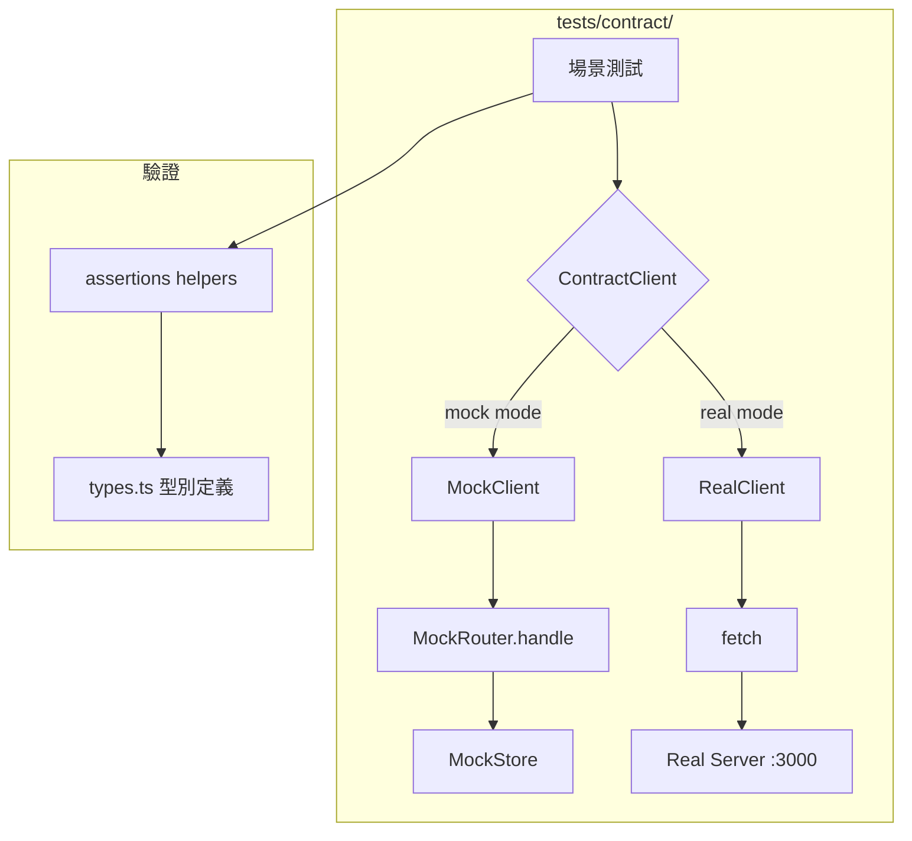

# S1 Dev Spec: Contract Testing

> **階段**: S1 技術分析
> **建立時間**: 2026-03-15 21:30
> **Agent**: codebase-explorer (Phase 1) + architect (Phase 2)
> **工作類型**: new_feature
> **複雜度**: M

---

## 1. 概述

### 1.1 需求參照
> 完整需求見 `s0_brief_spec.md`，以下僅摘要。

建立 contract test suite，同一組測試同時驗證 mock handler 和真實 server 的 response schema 與行為一致性，確保 CLI 測試用的 mock 不會與 real server 產生行為分歧。

### 1.2 技術方案摘要

以 **ContractClient 介面** 抽象 HTTP 互動，分別實作 MockClient（直接呼叫 `MockRouter.handle()`）和 RealClient（HTTP 請求至 `CONTRACT_TEST_BASE_URL`）。透過環境變數切換 target，同一份測試程式碼對兩個 target 執行完全相同的斷言。Response 驗證採用結構型別檢查 helper（基於 `src/api/types.ts` 定義），不引入 Zod runtime schema。已知 drift 以 relaxed assertion 或 skip 處理，不修改 mock 或 server 程式碼。

---

## 2. 影響範圍（Phase 1：codebase-explorer）

### 2.1 受影響檔案

#### 新增檔案（tests/contract/）
| 檔案 | 變更類型 | 說明 |
|------|---------|------|
| `tests/contract/harness/client.ts` | 新增 | ContractClient 介面 + MockClient + RealClient |
| `tests/contract/harness/setup.ts` | 新增 | vitest setup：建立 client 實例、場景隔離 |
| `tests/contract/helpers/assertions.ts` | 新增 | Response 結構驗證 helpers |
| `tests/contract/helpers/fixtures.ts` | 新增 | 共用 test fixtures（email、password、key name 等） |
| `tests/contract/scenarios/auth.contract.test.ts` | 新增 | Auth 場景 |
| `tests/contract/scenarios/credits.contract.test.ts` | 新增 | Credits 場景 |
| `tests/contract/scenarios/keys.contract.test.ts` | 新增 | Keys 場景 |
| `tests/contract/scenarios/errors.contract.test.ts` | 新增 | 錯誤處理場景 |
| `tests/contract/scenarios/oauth.contract.test.ts` | 新增 | OAuth 場景（real 模式 skip） |
| `tests/contract/scenarios/idempotency.contract.test.ts` | 新增 | 冪等性場景 |
| `vitest.config.ts` | 新增 | vitest 設定（不影響現有 `npm test`） |

#### 不變更的檔案
| 範圍 | 說明 |
|------|------|
| `src/**/*` | 完全不修改，包含 mock handlers、types、client |
| `tests/unit/**`, `tests/integration/**` | 完全不修改，現有 166 個測試不受影響 |

### 2.2 依賴關係
- **上游依賴**: `src/mock/handler.ts`（MockRouter class）、`src/mock/index.ts`（handler 註冊）、`src/api/types.ts`（response 型別）
- **下游影響**: 無。contract tests 是獨立的測試套件

### 2.3 現有模式與技術考量

**Mock 架構**：`MockRouter` 是純函式路由器，`handle(MockRequest)` 回傳 `Promise<MockResponse>`。contract test 的 MockClient 可直接呼叫此方法，不需 HTTP stack。

**Response 信封格式**：成功回應包在 `{ data: { ... } }` 中；錯誤回應為 `{ error: { code, message } }`。

**認證機制**：Bearer token 在 `Authorization` header，mock 驗證 `sk-mgmt-*` 格式 + tokenEmailMap 映射。

**現有測試架構**：vitest，無 `vitest.config.ts`（使用預設設定），`npm test` 執行 `vitest run` 跑所有 `tests/` 下的 `*.test.ts`。

---

## 3. Test Harness 架構（Phase 2：architect）

### 3.1 核心介面

```
ContractResponse {
  status: number
  body: unknown
}

ContractClient {
  send(method, path, options?: { body?, headers?, query? }): Promise<ContractResponse>
  getMode(): 'mock' | 'real'
}
```

### 3.2 MockClient

- 內部建立獨立 `MockRouter` 實例 + 獨立 `MockStore` 實例
- 每個 test suite（describe block）建立新的 store 確保場景隔離
- 呼叫 `router.handle()` 取得 `MockResponse`，映射為 `ContractResponse`

```
MockClient implements ContractClient {
  router: MockRouter
  store: MockStore

  send(method, path, options?) {
    const resp = await router.handle({ method, path, body, headers, query })
    return { status: resp.status, body: resp.data }
  }
}
```

### 3.3 RealClient

- 使用原生 `fetch`（Node 18+ 內建）對 `CONTRACT_TEST_BASE_URL` 發送 HTTP 請求
- 不使用 axios，避免與 src/ 的 axios mock adapter 互動
- 回傳原始 JSON body，不經過任何 error interceptor

```
RealClient implements ContractClient {
  baseUrl: string  // from CONTRACT_TEST_BASE_URL

  send(method, path, options?) {
    const resp = await fetch(baseUrl + path, { method, body, headers })
    const json = await resp.json()
    return { status: resp.status, body: json }
  }
}
```

### 3.4 Client 工廠

```
createContractClient(): ContractClient {
  if (CONTRACT_TEST_BASE_URL is set)
    return new RealClient(CONTRACT_TEST_BASE_URL)
  else
    return new MockClient()
}
```

### 3.5 場景隔離策略

**Mock 模式**：每個 test file 的 `beforeAll` 建立獨立 `MockStore`，測試間完全隔離。

**Real 模式**：每個場景使用 unique email（`contract-{uuid}@test.openclaw.dev`），確保不與其他測試互相干擾。`afterAll` 不做 cleanup（server side 無 delete user API）。

### 3.6 架構圖



---

## 4. Response 驗證 Helpers

### 4.1 設計原則

- **結構驗證，不驗精確值**：檢查欄位存在 + 型別正確，不比對 timestamp/UUID 等動態值
- **寬鬆欄位策略**：response 多出的欄位不報錯（superset OK），缺少必要欄位才報錯
- **Known drift 特殊處理**：見 4.2

### 4.2 已知 Drift 處理策略

| Drift | 位置 | 處理方式 |
|-------|------|---------|
| `updated_at` | PATCH /keys/:hash response | mock 多回此欄位，real 沒有。驗證時**不檢查此欄位**（superset 允許策略自動處理） |
| `usage_weekly` 係數 | GET /keys/:hash response | mock 用 0.6 係數，real 用 0.45。只驗 `typeof === 'number'`，不驗精確值 |
| OAuth error format | POST /oauth/device/token error | mock 用 `{error:{code,message}}`，real 用 `{error:"...",error_description:"..."}`。OAuth real 模式整體 skip，此差異不會觸發 |

### 4.3 Helper 函式清單

```typescript
// 核心驗證
assertSuccessEnvelope(body: unknown): asserts body is { data: Record<string, unknown> }
assertErrorEnvelope(body: unknown): asserts body is { error: { code: string; message: string } }

// 型別欄位驗證
assertHasFields(obj: Record<string, unknown>, fields: FieldSpec[]): void
// FieldSpec = { name: string; type: 'string' | 'number' | 'boolean' | 'object' | 'array' | 'nullable-string' | 'nullable-number'; optional?: boolean }

// 場景特化
assertAuthRegisterShape(body: unknown): void
assertAuthLoginShape(body: unknown): void
assertAuthMeShape(body: unknown): void
assertCreditsShape(body: unknown): void
assertCreditsPurchaseShape(body: unknown): void
assertKeysListShape(body: unknown): void
assertKeyDetailShape(body: unknown): void
assertKeyCreateShape(body: unknown): void
```

---

## 5. 測試結構

### 5.1 場景清單

| # | 場景 | 檔案 | 端點 | Real 模式 |
|---|------|------|------|----------|
| S1 | 註冊 + 登入 | auth.contract.test.ts | POST /auth/register, POST /auth/login | 執行 |
| S2 | 查詢帳戶資訊 | auth.contract.test.ts | GET /auth/me | 執行 |
| S3 | 查詢餘額 | credits.contract.test.ts | GET /credits | 執行 |
| S4 | 購買 credits | credits.contract.test.ts | POST /credits/purchase | 執行 |
| S5 | 查詢歷史 | credits.contract.test.ts | GET /credits/history | 執行 |
| S6 | 建立 key | keys.contract.test.ts | POST /keys | 執行 |
| S7 | 列出 keys | keys.contract.test.ts | GET /keys | 執行 |
| S8 | 查詢 key 詳情 | keys.contract.test.ts | GET /keys/:hash | 執行 |
| S9 | 更新 key | keys.contract.test.ts | PATCH /keys/:hash | 執行 |
| S10 | 撤銷 key | keys.contract.test.ts | DELETE /keys/:hash | 執行 |
| S11 | 認證錯誤 | errors.contract.test.ts | 各端點 401 | 執行 |
| S12 | 輸入驗證錯誤 | errors.contract.test.ts | 各端點 400 | 執行 |
| S13 | OAuth device flow | oauth.contract.test.ts | /oauth/device/* | **skip real** |
| S14 | 冪等性（Idempotency-Key） | idempotency.contract.test.ts | POST /credits/purchase | 執行 |

### 5.2 測試模式標記

```typescript
// 在場景中使用 skipInRealMode helper
const describeOrSkip = (client.getMode() === 'real') ? describe.skip : describe;

describeOrSkip('OAuth Device Flow', () => {
  // ...只在 mock 模式執行
});
```

---

## 6. Vitest 設定

### 6.1 新增 vitest.config.ts

```typescript
import { defineConfig } from 'vitest/config';

export default defineConfig({
  test: {
    // 預設 include 不變，確保 npm test 行為不受影響
  },
});
```

**關鍵**：現有 `npm test`（`vitest run`）預設 include 為 `**/*.test.ts`，會掃到 `tests/contract/**/*.contract.test.ts`。但 contract tests 使用 `.contract.test.ts` 後綴，可透過 vitest workspace 或 npm script 明確指定 include pattern 隔離。

### 6.2 npm scripts 新增

```json
{
  "test:contract:mock": "vitest run --include 'tests/contract/**/*.contract.test.ts'",
  "test:contract:real": "CONTRACT_TEST_BASE_URL=http://localhost:3000 vitest run --include 'tests/contract/**/*.contract.test.ts'"
}
```

### 6.3 現有測試隔離

為確保 `npm test` 不會跑 contract tests，需要在 `vitest.config.ts` 中排除：

```typescript
export default defineConfig({
  test: {
    exclude: ['tests/contract/**', 'node_modules/**'],
  },
});
```

`test:contract:*` scripts 明確 include contract 檔案，覆蓋此 exclude。

---

## 7. 任務清單

### 7.1 任務總覽

| # | 任務 | 類型 | 複雜度 | Agent | 依賴 | 波次 |
|---|------|------|--------|-------|------|------|
| 1 | ContractClient 介面 + MockClient + RealClient | 測試基礎設施 | M | test-engineer | - | W1 |
| 2 | Response 驗證 helpers | 測試基礎設施 | M | test-engineer | - | W1 |
| 3 | Fixtures + setup 模組 | 測試基礎設施 | S | test-engineer | #1 | W1 |
| 4 | vitest.config.ts + npm scripts | 測試基礎設施 | S | test-engineer | - | W1 |
| 5 | Auth 場景測試 | 場景實作 | M | test-engineer | #1, #2, #3 | W2 |
| 6 | Credits 場景測試 | 場景實作 | M | test-engineer | #1, #2, #3 | W2 |
| 7 | Keys 場景測試 | 場景實作 | M | test-engineer | #1, #2, #3 | W2 |
| 8 | Errors 場景測試 | 場景實作 | S | test-engineer | #1, #2, #3 | W2 |
| 9 | OAuth + Idempotency 場景 | 場景實作 | M | test-engineer | #1, #2, #3 | W3 |
| 10 | 全量驗證 + 最終整合 | 驗證 | S | test-engineer | #4~#9 | W4 |

### 7.2 任務詳情

#### Task #1: ContractClient 介面 + MockClient + RealClient
- **類型**: 測試基礎設施
- **複雜度**: M
- **Agent**: test-engineer
- **描述**: 定義 `ContractClient` 介面與 `ContractResponse` 型別。實作 `MockClient`（使用獨立 MockRouter + MockStore 實例，直接呼叫 `router.handle()`）和 `RealClient`（使用原生 `fetch` 對 `CONTRACT_TEST_BASE_URL` 發請求）。實作 `createContractClient()` 工廠函式。
- **DoD**:
  - [ ] `ContractClient` 介面定義完成，包含 `send()` 和 `getMode()`
  - [ ] `MockClient` 可獨立建構，呼叫 `router.handle()` 回傳 `ContractResponse`
  - [ ] `RealClient` 使用 `fetch`，正確組裝 URL/headers/body
  - [ ] `createContractClient()` 根據 `CONTRACT_TEST_BASE_URL` 環境變數回傳對應實例
  - [ ] MockClient 每次建構使用獨立 MockStore（場景隔離）
- **驗收方式**: 單獨 import 並呼叫 MockClient.send('GET', '/credits')，確認回傳結構正確

#### Task #2: Response 驗證 helpers
- **類型**: 測試基礎設施
- **複雜度**: M
- **Agent**: test-engineer
- **描述**: 實作 `assertSuccessEnvelope`、`assertErrorEnvelope`、`assertHasFields` 等通用驗證 helper，再基於 `src/api/types.ts` 的介面定義實作場景特化 assert 函式（如 `assertAuthRegisterShape`）。驗證策略：superset 允許、不驗動態值、known drift 寬鬆處理。
- **DoD**:
  - [ ] `assertSuccessEnvelope` 驗證 `{ data: { ... } }` 結構
  - [ ] `assertErrorEnvelope` 驗證 `{ error: { code, message } }` 結構
  - [ ] `assertHasFields` 支援 string/number/boolean/object/array/nullable 型別檢查
  - [ ] 每個場景至少一個特化 assert 函式
  - [ ] 驗證邏輯對應 `src/api/types.ts` 的介面定義
  - [ ] 多出的欄位不報錯（superset OK）
- **驗收方式**: 對 mock response fixture 執行 assert，確認通過

#### Task #3: Fixtures + setup 模組
- **類型**: 測試基礎設施
- **複雜度**: S
- **Agent**: test-engineer
- **依賴**: Task #1
- **描述**: 建立共用 fixtures（unique email 生成、密碼、key name 等）和 setup 模組（`beforeAll` 建立 client、`afterAll` cleanup）。Real 模式使用 `contract-{uuid}@test.openclaw.dev` 格式避免衝突。
- **DoD**:
  - [ ] `generateUniqueEmail()` 回傳不重複的測試 email
  - [ ] `TEST_PASSWORD` 等常數定義
  - [ ] setup helper 提供 `beforeAll`/`afterAll` hooks
  - [ ] Mock 模式每個 test file 使用獨立 store
- **驗收方式**: 在空白 test file 中使用 setup，確認 client 正常初始化

#### Task #4: vitest.config.ts + npm scripts
- **類型**: 測試基礎設施
- **複雜度**: S
- **Agent**: test-engineer
- **描述**: 新增 `vitest.config.ts`，在 `test.exclude` 中排除 `tests/contract/**`，確保 `npm test` 不跑 contract tests。新增 `test:contract:mock` 和 `test:contract:real` npm scripts，明確 include contract test 檔案。
- **DoD**:
  - [ ] `vitest.config.ts` 存在且排除 contract tests
  - [ ] `npm test` 仍跑原有 166 個測試，結果不變
  - [ ] `npm run test:contract:mock` 能執行 contract tests
  - [ ] `npm run test:contract:real` 設定 `CONTRACT_TEST_BASE_URL` 並執行
- **驗收方式**: 執行 `npm test` 確認測試數量不變；執行 `npm run test:contract:mock` 確認只跑 contract tests

#### Task #5: Auth 場景測試
- **類型**: 場景實作
- **複雜度**: M
- **Agent**: test-engineer
- **依賴**: #1, #2, #3
- **描述**: 實作 auth.contract.test.ts，覆蓋 S1（註冊 + 登入）和 S2（查詢帳戶資訊）場景。驗證 response status code + body schema。
- **DoD**:
  - [ ] POST /auth/register：201 + `AuthRegisterResponse` 結構
  - [ ] POST /auth/login：200 + `AuthLoginResponse` 結構
  - [ ] GET /auth/me：200 + `AuthMeResponse` 結構
  - [ ] 使用 register 回傳的 management_key 進行後續呼叫
  - [ ] Mock 模式全部通過
- **驗收方式**: `npm run test:contract:mock` 中 auth 場景全綠

#### Task #6: Credits 場景測試
- **類型**: 場景實作
- **複雜度**: M
- **Agent**: test-engineer
- **依賴**: #1, #2, #3
- **描述**: 實作 credits.contract.test.ts，覆蓋 S3（查詢餘額）、S4（購買）、S5（查詢歷史）場景。先註冊帳號再操作。
- **DoD**:
  - [ ] GET /credits：200 + `CreditsResponse` 結構
  - [ ] POST /credits/purchase：200 + `CreditsPurchaseResponse` 結構
  - [ ] GET /credits/history：200 + `CreditsHistoryResponse` 結構（含 items array 內元素驗證）
  - [ ] 購買後餘額反映正確（結構驗證，非精確金額）
  - [ ] Mock 模式全部通過
- **驗收方式**: `npm run test:contract:mock` 中 credits 場景全綠

#### Task #7: Keys 場景測試
- **類型**: 場景實作
- **複雜度**: M
- **Agent**: test-engineer
- **依賴**: #1, #2, #3
- **描述**: 實作 keys.contract.test.ts，覆蓋 S6~S10（建立、列出、詳情、更新、撤銷）場景。Key detail 的 `usage_weekly` 只驗型別。PATCH response 的 `updated_at` 不驗（superset 允許）。
- **DoD**:
  - [ ] POST /keys：201 + `ProvisionedKey` 結構（含 `key` 欄位）
  - [ ] GET /keys：200 + `KeysListResponse` 結構
  - [ ] GET /keys/:hash：200 + `KeyDetailResponse` 結構，`usage_weekly` 只驗 number
  - [ ] PATCH /keys/:hash：200 + `ProvisionedKey` 結構（不驗 `updated_at`）
  - [ ] DELETE /keys/:hash：200 + `KeyRevokeResponse` 結構
  - [ ] Mock 模式全部通過
- **驗收方式**: `npm run test:contract:mock` 中 keys 場景全綠

#### Task #8: Errors 場景測試
- **類型**: 場景實作
- **複雜度**: S
- **Agent**: test-engineer
- **依賴**: #1, #2, #3
- **描述**: 實作 errors.contract.test.ts，覆蓋 S11（401 認證錯誤）和 S12（400 輸入驗證錯誤）。驗證 error envelope 結構 `{ error: { code, message } }`。
- **DoD**:
  - [ ] 無 token 呼叫受保護端點 → 401 + error envelope
  - [ ] 無效 token 呼叫 → 401 + error envelope
  - [ ] 缺少必要欄位（如 register 缺 email）→ 400 + error envelope
  - [ ] 金額不足（purchase amount < 5）→ 400 + error envelope
  - [ ] Mock 模式全部通過
- **驗收方式**: `npm run test:contract:mock` 中 errors 場景全綠

#### Task #9: OAuth + Idempotency 場景
- **類型**: 場景實作
- **複雜度**: M
- **Agent**: test-engineer
- **依賴**: #1, #2, #3
- **描述**: 實作 oauth.contract.test.ts（real 模式 skip）和 idempotency.contract.test.ts。OAuth 驗證 device code response 結構。Idempotency 驗證重複 purchase 回傳相同結果。
- **DoD**:
  - [ ] OAuth：POST /oauth/device/code → 200 + `OAuthDeviceCodeResponse` 結構（mock only）
  - [ ] OAuth：real 模式 `describe.skip` 並加 `// Known difference: OAuth error format diverges` 註解
  - [ ] Idempotency：相同 `Idempotency-Key` 重複 purchase → 200 + 同一 `transaction_id`
  - [ ] Mock 模式全部通過
- **驗收方式**: `npm run test:contract:mock` 全綠；real 模式 OAuth 被 skip

#### Task #10: 全量驗證 + 最終整合
- **類型**: 驗證
- **複雜度**: S
- **Agent**: test-engineer
- **依賴**: #4~#9
- **描述**: 執行 `npm test` 確認 166 個現有測試不受影響。執行 `npm run test:contract:mock` 確認所有 contract tests 通過。確認 test file 組織結構完整。
- **DoD**:
  - [ ] `npm test` 結果與修改前一致（166 tests passed）
  - [ ] `npm run test:contract:mock` 全部場景通過（至少 14 個 test cases）
  - [ ] 無 TypeScript 型別錯誤（`npm run typecheck` 通過）
  - [ ] contract test 檔案結構符合規劃
- **驗收方式**: CI 驗證兩個 test 指令皆通過

---

## 8. 技術決策

### 8.1 架構決策

| 決策點 | 選項 | 選擇 | 理由 |
|--------|------|------|------|
| HTTP client（RealClient） | A: axios / B: 原生 fetch | B: fetch | 避免與 src/ 的 axios mock adapter 發生衝突；Node 18+ 原生支援 |
| Schema 驗證 | A: Zod runtime / B: 手寫 assert helper | B: assert helper | 專案已有 zod 但 types.ts 未用 Zod schema；手寫 helper 更輕量，且能精確控制 drift 寬鬆策略 |
| Mock 呼叫方式 | A: 啟動 HTTP server / B: 直接呼叫 MockRouter.handle() | B: handle() | 無需 port 管理，速度快，與現有整合測試模式一致 |
| 場景隔離 | A: 共用 store + beforeEach reset / B: 每個 file 獨立 store | B: 獨立 store | 場景間完全隔離，平行執行安全 |
| Test file 命名 | A: *.test.ts / B: *.contract.test.ts | B: .contract.test.ts | 與現有 .test.ts 區隔，方便 vitest include/exclude |

### 8.2 設計模式
- **Strategy Pattern**: ContractClient 介面讓 MockClient 和 RealClient 可互換
- **Factory Pattern**: `createContractClient()` 根據環境變數決定實例

### 8.3 相容性考量
- **向後相容**: 完全不影響現有程式碼和測試
- **Migration**: 不需要

---

## 9. 驗收標準

### 9.1 功能驗收
| # | 場景 | Given | When | Then | 優先級 |
|---|------|-------|------|------|--------|
| AC1 | Mock 模式全通過 | 無外部依賴 | 執行 `npm run test:contract:mock` | 所有場景通過，至少 14 個 test cases | P0 |
| AC2 | 現有測試不受影響 | contract tests 已加入 | 執行 `npm test` | 166 個測試全通過，數量不變 | P0 |
| AC3 | Real 模式可切換 | Real server 在 localhost:3000 運行 | 設定 `CONTRACT_TEST_BASE_URL=http://localhost:3000` 並執行 `npm run test:contract:real` | Auth/Credits/Keys/Errors/Idempotency 場景通過；OAuth 被 skip | P1 |
| AC4 | 同一斷言雙 target | 同一 test file | 分別以 mock 和 real 模式執行 | 通過的斷言完全相同（除 OAuth skip） | P1 |
| AC5 | Drift 不阻塞 | 已知 drift 存在 | 執行 contract tests | `updated_at` 不報錯、`usage_weekly` 只驗型別、OAuth error 被 skip | P0 |
| AC6 | 型別檢查通過 | 所有新檔案 | 執行 `npm run typecheck` | 無型別錯誤 | P0 |

### 9.2 非功能驗收
| 項目 | 標準 |
|------|------|
| 效能 | Mock 模式 contract tests 執行時間 < 5 秒 |
| 可維護性 | 新增場景只需新增 test file + assert helper，不需修改 harness |

### 9.3 測試計畫
- **Contract Tests**: 14 個場景，覆蓋所有公開 API 端點的 response schema
- **回歸測試**: `npm test` 166 個現有測試

---

## 10. 風險與緩解

| 風險 | 影響 | 機率 | 緩解措施 | 負責人 |
|------|------|------|---------|--------|
| vitest.config.ts 影響現有測試 | 高 | 中 | 只加 exclude，不改 include；W4 全量驗證確認 166 測試不變 | test-engineer |
| Real server API 行為與 mock 不符（未知 drift） | 中 | 中 | assert helper 採 superset 寬鬆策略；新發現的 drift 記錄為 known difference | test-engineer |
| MockRouter 直接呼叫繞過 HTTP 層，漏掉 content-type 等差異 | 低 | 低 | Contract test 目標是 schema 一致性，非 HTTP 協議細節；HTTP 層問題由整合測試覆蓋 | test-engineer |
| Real 模式測試資料殘留 | 低 | 高 | 使用 unique email 確保隔離，不依賴 cleanup | test-engineer |

### 已知 Drift 記錄

以下 drift 已確認存在，contract test 中以寬鬆斷言或 skip 處理，**不在本 SOP 修復**：

1. **PATCH /keys/:hash — `updated_at`**：mock response 多回 `updated_at` 欄位，real server 不回。contract test 不驗此欄位。
2. **GET /keys/:hash — `usage_weekly` 係數**：mock 用 `usage * 0.6`，real 用 `usage * 0.45`。contract test 只驗 `typeof === 'number'`。
3. **POST /oauth/device/token — error format**：mock 用 `{error:{code,message}}`，real 用 `{error:"...",error_description:"..."}`（RFC 8628 標準格式）。OAuth real 模式整體 skip。

### 回歸風險
- `vitest.config.ts` 新增可能改變預設 include/exclude 行為 — 透過 AC2 驗證
- contract test 檔案被 `npm test` 掃到 — 透過 `.contract.test.ts` 命名 + exclude 配置阻擋

---

## SDD Context

```json
{
  "sdd_context": {
    "stages": {
      "s1": {
        "status": "completed",
        "agents": ["codebase-explorer", "architect"],
        "output": {
          "dev_spec_path": "dev/specs/2026-03-15_4_contract-testing/s1_dev_spec.md",
          "completed_phases": [1, 2],
          "tasks": [
            "T1: ContractClient harness",
            "T2: Response assertion helpers",
            "T3: Fixtures + setup",
            "T4: vitest.config.ts + npm scripts",
            "T5: Auth scenarios",
            "T6: Credits scenarios",
            "T7: Keys scenarios",
            "T8: Error scenarios",
            "T9: OAuth + Idempotency scenarios",
            "T10: Full validation"
          ],
          "acceptance_criteria": [
            "AC1: npm run test:contract:mock all pass (>= 14 cases)",
            "AC2: npm test still 166 tests",
            "AC3: real mode switchable via env var",
            "AC4: same assertions for both targets",
            "AC5: known drifts handled gracefully",
            "AC6: typecheck passes"
          ],
          "assumptions": [
            "Node 18+ with native fetch support",
            "Real server runs at localhost:3000 with PostgreSQL",
            "MockRouter.handle() is stable public API",
            "Response envelope { data: {} } / { error: {} } is consistent"
          ],
          "solution_summary": "Dual-mode contract test harness with ContractClient interface, structural response validation helpers, and 14 scenarios covering all public API endpoints",
          "tech_debt": [
            "OAuth error format divergence (RFC 8628 vs internal format)",
            "PATCH /keys/:hash updated_at field inconsistency",
            "usage_weekly coefficient mismatch"
          ],
          "regression_risks": [
            "vitest.config.ts may alter default test include behavior",
            "contract test files accidentally picked up by npm test"
          ]
        }
      }
    }
  }
}
```
