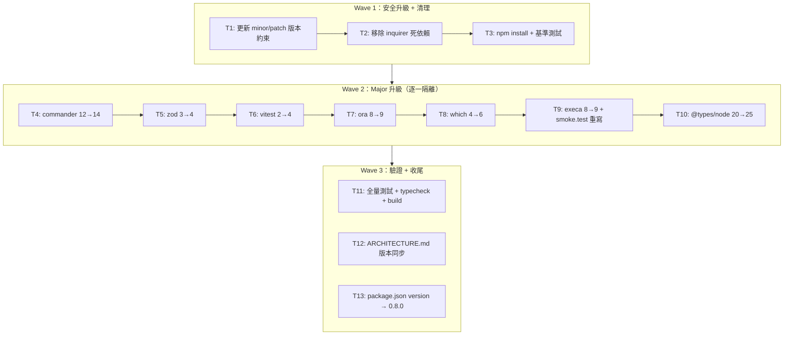

# S1 Dev Spec: tech-upgrade

> **階段**: S1 技術分析
> **建立時間**: 2026-03-15 23:20
> **Agent**: codebase-explorer (Phase 1) + architect (Phase 2)
> **工作類型**: refactor
> **複雜度**: M

---

## 1. 概述

### 1.1 需求參照
> 完整需求見 `s0_brief_spec.md`，以下僅摘要。

升級所有 dependencies 至最新版本、移除死依賴（inquirer）、確保 173 既有測試全過且外部行為不變。

### 1.2 技術方案摘要

分三波執行：Wave 1 先升 minor/patch 套件並移除死依賴，建立乾淨基準；Wave 2 逐一升級 6 個 major 版本套件（每升一個立即跑測試，隔離 breaking change）；Wave 3 全量驗證 + 文件同步。整個過程外部 CLI 行為完全不變，只動 package.json 約束、少量 import 寫法與 smoke test 實作。

---

## 2. 影響範圍（Phase 1：codebase-explorer）

### 2.1 受影響檔案

#### CLI Source（Node.js / TypeScript）

| 檔案 | 變更類型 | 說明 |
|------|---------|------|
| `package.json` | 修改 | 版本約束更新、移除 inquirer |
| `src/commands/auth.ts` | 可能修改 | commander v14 action() 第二參數驗證 |
| `src/config/schema.ts` | 可能修改 | zod v4 breaking change（.nullable() 行為） |
| `src/utils/validation.ts` | 可能修改 | zod v4 error message 格式 |
| `src/output/spinner.ts` | 可能修改 | ora v9 default import + Ora type |
| `src/services/oauth.service.ts` | 可能修改 | ora v9 import style |
| `src/services/integrate.service.ts` | 可能修改 | which v6 bundled types 處理 |
| `vitest.config.ts` | 可能修改 | vitest v4 globals:true / coverage config |
| `vitest.contract.config.ts` | 可能修改 | vitest v4 config 相容性 |
| `tests/integration/smoke.test.ts` | **必定修改** | execaCommand() 在 execa v9 已移除，必須重寫 |
| `ARCHITECTURE.md` | 修改 | 版本號碼同步更新 |

#### 測試檔案（間接影響）

| 類別 | 數量 | 風險 |
|------|------|------|
| unit tests | ~30 | 低（zod error message 格式可能變） |
| contract tests | 3 | 低 |
| integration tests | 1（smoke.test.ts） | **高**（必須重寫） |

### 2.2 依賴關係

- **上游依賴**: npm registry 最新穩定版
- **下游影響**:
  - commander → 8 個 command 檔案的 action() callback（僅 auth.ts:41 使用雙參數模式需特別驗證）
  - zod → schema.ts、validation.ts、manager.ts（consumer）
  - vitest → 全部 24 個測試檔（`npm test` 範圍）+ 6 個 contract 測試檔
  - ora → spinner.ts、oauth.service.ts
  - which → integrate.service.ts
  - execa → smoke.test.ts

### 2.3 現有模式與技術考量

- 整個專案為 ESM module（`"type": "module"`），所有套件均需 ESM 相容
- ora 自 v6 起已是 ESM-only，升級到 v9 這點不變
- 測試框架 config 有 `globals: true`，但所有 31 個測試檔實際上都已明確 `import { describe, it, expect } from 'vitest'`，所以 globals 設定移除不會造成破壞
- 目前 which 由 @types/which 提供型別，which v6 是否 bundle types 待 T8 執行時確認

---

## 2.5 [refactor 專用] 現狀分析

### 現狀問題

| # | 問題 | 嚴重度 | 影響範圍 | 說明 |
|---|------|--------|---------|------|
| 1 | inquirer 死依賴 | 中 | package.json | 專案 0 個檔案 import inquirer，但仍列在 dependencies，增加安裝體積與安全掃描雜訊 |
| 2 | execa v8 使用已廢棄 execaCommand() | 高 | smoke.test.ts | execaCommand 在 execa v8 已標記 deprecated，在 v9 直接移除，升級後 import 即失敗 |
| 3 | dependencies 落後 1~2 major | 中 | 全域 | commander 12→14、zod 3→4、vitest 2→4、ora 8→9、which 4→6、execa 8→9 |
| 4 | ARCHITECTURE.md 版本號碼過時 | 低 | 文件 | 記載 Commander ^12、Vitest ^2.1、Zod ^3.23，升級後失實 |

### 目標狀態（Before → After）

| 面向 | Before | After |
|------|--------|-------|
| commander | ^12.1.0 | ^14.x（最新穩定） |
| zod | ^3.23.0 | ^4.x |
| vitest | ^2.0.0 | ^4.x |
| ora | ^8.1.0 | ^9.x |
| which | ^4.0.0 | ^6.x |
| execa（devDep） | ^8.0.1 | ^9.x |
| @types/node | ^20.14.0 | ^25.x |
| inquirer | ^9.3.0（dead dep） | **移除** |
| @types/which | ^3.0.4 | 視 which v6 是否 bundle types 決定保留或移除 |
| smoke.test.ts | 使用 execaCommand()（已廢棄） | 使用 execa() 或 $ template literal |
| package version | 0.7.0 | 0.8.0 |

### 遷移路徑

1. Wave 1：更新 minor/patch 套件版本約束、移除 inquirer、npm install、跑測試確立基準
2. Wave 2：逐一升級 major 版本套件，每升一個立即跑 `npm test` + `npm run typecheck`，隔離 breaking change
3. Wave 3：全量測試（unit + contract + integration）+ build 驗證 + ARCHITECTURE.md 更新 + 版本號碼 bump 0.8.0

### 回歸風險矩陣

| 外部行為 | 驗證方式 | 風險等級 |
|---------|---------|---------|
| CLI 所有子指令 help 輸出不變 | smoke.test.ts `--help` cases | 低 |
| auth login --github OAuth flow 正常 | smoke.test.ts + 手動 | **中**（依賴 commander action() 第二參數） |
| config schema 驗證行為不變 | unit/config tests | 中（zod v4 error message） |
| validation.ts 拋出錯誤訊息格式不變 | validation.test.ts | 中（zod v4） |
| spinner 視覺輸出正常 | 手動執行 key list 指令 | 低 |
| which 找不到工具時拋出正確錯誤 | integrate service test | 低 |

---

## 3. 升級流程

### 流程說明

Wave 2 任務順序設計原則：
- T4 commander 先做，因為它影響最多 command 檔案，若有問題早暴露
- T5 zod 次之，只影響 2 個 schema 檔，相對隔離
- T6 vitest 影響測試框架本身，做完後後續每個任務的測試環境才確定穩定
- T7 ora 低風險，快速通過
- T8 which 低風險，但需確認 @types/which 去留
- T9 execa 最後，因為需要重寫 smoke.test.ts，工作量最確定但範圍明確
- T10 @types/node 放最後，因為型別升級可能暴露其他套件的隱性問題，集中處理

---

## 4. 任務清單

### 4.1 任務總覽

| # | 任務 | Wave | 複雜度 | Agent | 依賴 |
|---|------|------|--------|-------|------|
| T1 | 更新 minor/patch 版本約束 | 1 | S | backend-developer | - |
| T2 | 移除 inquirer 死依賴 | 1 | S | backend-developer | - |
| T3 | npm install + 基準測試 | 1 | S | backend-developer | T1, T2 |
| T4 | 升級 commander 12→14 | 2 | M | backend-developer | T3 |
| T5 | 升級 zod 3→4 | 2 | M | backend-developer | T4 |
| T6 | 升級 vitest 2→4 | 2 | M | backend-developer | T5 |
| T7 | 升級 ora 8→9 | 2 | S | backend-developer | T6 |
| T8 | 升級 which 4→6 | 2 | S | backend-developer | T7 |
| T9 | 升級 execa 8→9 + 重寫 smoke.test.ts | 2 | M | backend-developer | T8 |
| T10 | 升級 @types/node 20→25 | 2 | S | backend-developer | T9 |
| T11 | 全量測試 + typecheck + build 驗證 | 3 | S | backend-developer | T10 |
| T12 | 更新 ARCHITECTURE.md 版本引用 | 3 | S | backend-developer | T11 |
| T13 | bump package.json version → 0.8.0 | 3 | S | backend-developer | T12 |

### 4.2 任務詳情

#### Task T1: 更新 minor/patch 版本約束
- **Wave**: 1（安全升級）
- **複雜度**: S
- **Agent**: backend-developer
- **描述**: 將 package.json 中 axios、chalk、tsup、tsx、typescript、cli-table3、@inquirer/prompts 的版本約束更新至最新 minor/patch。這些套件沒有 breaking change，只需更新版本字串。實際安裝在 T3 的 npm install 時執行。
- **修改範圍**: `package.json` 的 dependencies 和 devDependencies 版本字串
- **DoD**:
  - [ ] package.json 中 axios、chalk、cli-table3、@inquirer/prompts 版本約束反映最新穩定版（dependencies）
  - [ ] package.json 中 tsup、tsx、typescript 版本約束反映最新穩定版（devDependencies）
  - [ ] 不修改 major 版本套件的約束（commander、zod、vitest、ora、which、execa 留待 Wave 2）
- **驗收方式**: `cat package.json` 確認版本號更新

#### Task T2: 移除 inquirer 死依賴
- **Wave**: 1（清理）
- **複雜度**: S
- **Agent**: backend-developer
- **描述**: 從 package.json 的 dependencies 中移除 inquirer。已確認 0 個 src/tests 檔案 import inquirer（只用 @inquirer/prompts），為純死依賴。
- **修改範圍**: `package.json` dependencies
- **DoD**:
  - [ ] package.json dependencies 中不存在 inquirer 欄位
  - [ ] grep -r '"inquirer"' src/ tests/ 結果為空（確認無 import）
- **驗收方式**: `grep -r "from 'inquirer'" src/ tests/` 無輸出

#### Task T3: npm install + 基準測試
- **Wave**: 1（基準確立）
- **複雜度**: S
- **Agent**: backend-developer
- **描述**: 執行 npm install 讓 package-lock.json 同步，然後跑完整測試確立 Wave 2 開始前的乾淨基準。此步驟不應有任何測試失敗——若有失敗表示 Wave 1 改動有問題，需先修正。
- **DoD**:
  - [ ] `npm install` 成功（exit code 0；peer dependency 警告需逐一評估，非阻斷）
  - [ ] `npm test` 全部通過（24 test files, 173 tests）
  - [ ] `npm run typecheck` 通過
  - [ ] node_modules/inquirer 不存在
- **驗收方式**: 貼出 `npm test` 的測試結果摘要（173 passed, 0 failed）

#### Task T4: 升級 commander 12→14
- **Wave**: 2（major 升級）
- **複雜度**: M
- **Agent**: backend-developer
- **描述**: 將 package.json commander 版本更新至 ^14.x，npm install，檢查 CHANGELOG 確認 action() callback 簽章是否在 v13/v14 有異動。重點驗證 `src/commands/auth.ts` line ~41 的 `.action(async (_opts, cmd) => { const loginOpts = cmd.opts() })` 模式。處理任何 breaking change（若 action() 第二參數被移除，需改用 `.command.opts()` 或重構）。
- **需驗證（U-2）**: commander v13/v14 action() callback 是否仍提供 Command object 作為第二參數
- **修改範圍**: `package.json`、`src/commands/auth.ts`（視 U-2 結果）
- **DoD**:
  - [ ] package.json commander 版本更新至 ^14.x
  - [ ] `npm install` 成功
  - [ ] `npm run typecheck` 通過
  - [ ] `npm test` 全部通過
  - [ ] auth login --github 指令的 action callback 邏輯正確（手動確認 or 測試覆蓋）
- **驗收方式**: `npm test` 通過 + `npm run typecheck` 通過

#### Task T5: 升級 zod 3→4
- **Wave**: 2（major 升級）
- **複雜度**: M
- **Agent**: backend-developer
- **描述**: 將 package.json zod 版本更新至 ^4.x，npm install，參閱 zod v4 migration guide。檢查 `src/config/schema.ts` 和 `src/utils/validation.ts` 的 .nullable() 使用、.parse() 行為。執行 `tests/unit/utils/validation.test.ts` 特別注意 error message 字串比對的斷言是否失敗——zod v4 更改了 error message 格式。
- **需驗證（U-3）**: zod v4 .nullable() 行為是否變化、error message 格式是否改變
- **修改範圍**: `package.json`、`src/config/schema.ts`、`src/utils/validation.ts`（視 breaking change）、相關 test 的 error message 斷言
- **DoD**:
  - [ ] package.json zod 版本更新至 ^4.x
  - [ ] `npm run typecheck` 通過（無 zod 相關型別錯誤）
  - [ ] `npm test` 全部通過（特別是 validation.test.ts）
  - [ ] schema.ts 和 validation.ts 的 .nullable()、.parse() 行為與升級前等效
- **驗收方式**: `npm test -- tests/unit/utils/validation.test.ts` 通過

#### Task T6: 升級 vitest 2→4
- **Wave**: 2（major 升級）
- **複雜度**: M
- **Agent**: backend-developer
- **描述**: 將 package.json vitest 版本更新至 ^4.x，npm install，檢查 v3/v4 CHANGELOG 確認 config schema 變化（coverage.provider、environment 等）。注意：所有測試檔已明確 import from 'vitest'，globals:true 移除不會造成破壞，但 config 格式可能需調整。
- **需驗證（U-4）**: vitest v4 config schema 是否有 breaking change（coverage、environment 等）
- **修改範圍**: `package.json`、`vitest.config.ts`、`vitest.contract.config.ts`
- **DoD**:
  - [ ] package.json vitest 版本更新至 ^4.x
  - [ ] vitest.config.ts 和 vitest.contract.config.ts 通過 vitest v4 的 config 驗證
  - [ ] `npm test` 全部通過（24 個測試檔，173 個測試）
  - [ ] `npm run test:contract:mock` 通過
- **驗收方式**: `npm test` 173 tests passed

#### Task T7: 升級 ora 8→9
- **Wave**: 2（major 升級，低風險）
- **複雜度**: S
- **Agent**: backend-developer
- **描述**: 將 package.json ora 版本更新至 ^9.x，npm install，確認 `src/output/spinner.ts` 的 default import 仍有效；確認 `src/services/oauth.service.ts` 的 `default import + type Ora named import` 模式仍有效。ora 自 v6 起 ESM-only，v9 預計無 import 模式異動。
- **修改範圍**: `package.json`、`src/output/spinner.ts`、`src/services/oauth.service.ts`（視 import 變化）
- **DoD**:
  - [ ] package.json ora 版本更新至 ^9.x
  - [ ] `npm run typecheck` 通過（Ora type import 無錯誤）
  - [ ] `npm test` 全部通過
- **驗收方式**: `npm run typecheck` 通過

#### Task T8: 升級 which 4→6 + 處理 @types/which
- **Wave**: 2（major 升級，低風險）
- **複雜度**: S
- **Agent**: backend-developer
- **描述**: 將 package.json which 版本更新至 ^6.x，npm install。安裝後檢查 which v6 的 package.json 是否有 types/typings 欄位（`cat node_modules/which/package.json | grep types`）。若 v6 bundle 了自己的 types 且與 @types/which 衝突，移除 @types/which；若 v6 仍無 bundled types，保留 @types/which。確認 `src/services/integrate.service.ts` 的 `await which('openclaw')` 呼叫型別正確。
- **需驗證（U-1）**: which v6 是否 bundle 自己的 TypeScript types
- **修改範圍**: `package.json`（which 版本、可能移除 @types/which）
- **DoD**:
  - [ ] package.json which 版本更新至 ^6.x
  - [ ] U-1 已解決：@types/which 保留或移除的決策已執行
  - [ ] `npm run typecheck` 通過（integrate.service.ts 的 which import 型別正確）
  - [ ] `npm test` 全部通過
- **驗收方式**: `npm run typecheck` 通過，並在 DoD 備註說明 @types/which 的最終決策

#### Task T9: 升級 execa 8→9 + 重寫 smoke.test.ts
- **Wave**: 2（major 升級，**高風險**）
- **複雜度**: M
- **Agent**: backend-developer
- **描述**: 將 package.json execa 版本更新至 ^9.x，npm install。`execaCommand()` 在 execa v9 已完全移除，`tests/integration/smoke.test.ts` 使用此 API，必須重寫。替代方案：改用 `execa('npx', ['tsx', CLI, ...args])` 模式，或使用 `$` template literal（`import { $ } from 'execa'`）。重寫時保持所有現有 test case 的語意不變，只改執行 CLI 的方式。
- **修改範圍**: `package.json`（execa 版本）、`tests/integration/smoke.test.ts`（重寫執行方式）
- **DoD**:
  - [ ] package.json execa 版本更新至 ^9.x
  - [ ] smoke.test.ts 不再使用 execaCommand（grep 驗證）
  - [ ] smoke.test.ts 使用 execa() 或 $ 重寫，所有原有 test case 語意不變
  - [ ] `npm test` 全部通過（包含 smoke.test.ts）
  - [ ] `npm run typecheck` 通過
- **驗收方式**: `grep -n 'execaCommand' tests/integration/smoke.test.ts` 無輸出；`npm test` 通過

#### Task T10: 升級 @types/node 20→25
- **Wave**: 2（major 升級，低風險）
- **複雜度**: S
- **Agent**: backend-developer
- **描述**: 將 package.json @types/node 版本更新至 ^25.x，npm install。@types/node major 升級通常只增加新 API 型別，鮮少 breaking。專案使用 fs/promises、path、os、child_process.execFile、setInterval/clearInterval 等基礎 API，預期型別相容。若有型別錯誤（通常是 return type 收窄），逐一修正。
- **修改範圍**: `package.json`、可能少量 tsconfig 或 type assertion 調整
- **DoD**:
  - [ ] package.json @types/node 版本更新至 ^25.x
  - [ ] `npm run typecheck` 通過（無 node 型別錯誤）
  - [ ] `npm test` 全部通過
- **驗收方式**: `npm run typecheck` 通過

#### Task T11: 全量測試 + typecheck + build 驗證
- **Wave**: 3（全量驗證）
- **複雜度**: S
- **Agent**: backend-developer
- **描述**: 執行完整驗證序列：(1) `npm run typecheck`，(2) `npm test`，(3) `npm run test:contract:mock`，(4) `npm run build`，確認全部通過。記錄最終測試數字。若有失敗，追查原因並修正（此時不應有新的 breaking change，若有表示前面 Wave 2 某個任務漏修）。
- **DoD**:
  - [ ] `npm run typecheck` 通過（0 errors）
  - [ ] `npm test` 全部通過（≥173 tests，0 failed）
  - [ ] `npm run test:contract:mock` 通過
  - [ ] `npm run build` 成功，dist/ 目錄產生
  - [ ] 無 any type hack 被引入（git diff 確認）
- **驗收方式**: 貼出四個指令的執行結果摘要

#### Task T12: 更新 ARCHITECTURE.md 版本引用
- **Wave**: 3（文件同步）
- **複雜度**: S
- **Agent**: backend-developer
- **描述**: 更新 ARCHITECTURE.md 中所有提及套件版本的地方（如 Commander ^12、Vitest ^2.1、Zod ^3.23），改為升級後的實際版本。只改版本號碼，不改架構描述內容。
- **修改範圍**: `ARCHITECTURE.md`
- **DoD**:
  - [ ] ARCHITECTURE.md 中不存在舊版本號碼（grep Commander ^12、Zod ^3、Vitest ^2 結果為空）
  - [ ] 所有版本引用與 package.json 實際版本一致
- **驗收方式**: `grep -n 'Commander\|Vitest\|Zod' ARCHITECTURE.md` 輸出版本號碼確認正確（execa/ora/which 未記錄於 ARCHITECTURE.md）

#### Task T13: bump package.json version → 0.8.0
- **Wave**: 3（版本收尾）
- **複雜度**: S
- **Agent**: backend-developer
- **描述**: 將 package.json 頂層 version 從 0.7.0 更新至 0.8.0，代表此次 dependency 升級里程碑。
- **修改範圍**: `package.json` version 欄位
- **DoD**:
  - [ ] package.json `"version"` 欄位為 `"0.8.0"`
- **驗收方式**: `cat package.json | grep '"version"'` 輸出 `"version": "0.8.0"`

---

## 5. 技術決策

### 5.1 架構決策

| 決策點 | 選項 | 選擇 | 理由 |
|--------|------|------|------|
| execa v9 遷移策略 | A: `execa(cmd, args[])` / B: `$ template literal` | A: `execa(cmd, args[])` | 明確 arg 分離，型別更安全，不依賴 template literal 解析行為；smoke.test.ts 已有 string args 拆分邏輯，改 execa() 最小化改動 |
| Wave 2 升級順序 | 並行 vs 逐一序列 | 逐一序列 | 隔離每個 breaking change 的影響範圍，任何失敗立即歸因，不混淆多個套件同時升級 |
| which v6 @types 決策 | 執行前決定 vs 升級後驗證 | 升級後驗證 | which v6 bundled types 狀態未知（U-1），需安裝後才能確認 |
| zod v4 error message 斷言 | 修改 test 斷言 vs 封裝 error message | 修改 test 斷言 | 此次 refactor 不修改外部 API 介面，error message 是測試問題而非 API 問題 |

### 5.2 設計模式
- **Pattern**: 逐一升級 + 即時測試（Incremental Upgrade with Immediate Regression Detection）
- **理由**: 任何一個 major 升級失敗時，立即可歸因到具體套件，不需 bisect；且每個任務都是自包含的可提交單元

### 5.3 相容性考量
- **向後相容**: CLI 外部行為完全不變（指令名稱、選項、輸出格式）
- **Migration**: 無資料遷移，純程式碼層面

---

## 6. 驗收標準

### 6.1 功能驗收

| # | 場景 | Given | When | Then | 優先級 |
|---|------|-------|------|------|--------|
| AC-1 | 全量測試通過 | 所有 Wave 1-2 任務完成 | 執行 `npm test` | 173 tests passed, 0 failed | P0 |
| AC-2 | 型別檢查通過 | 所有套件升級完成 | 執行 `npm run typecheck` | 0 errors | P0 |
| AC-3 | Build 成功 | typecheck 通過 | 執行 `npm run build` | dist/ 產生，無 error | P0 |
| AC-4 | inquirer 已移除 | package.json 修改後 npm install | 檢查 node_modules | node_modules/inquirer 不存在 | P0 |
| AC-5 | smoke.test.ts 無 execaCommand | execa 升級完成 | grep smoke.test.ts | 無 execaCommand 字串 | P0 |
| AC-6 | contract tests 通過 | 全量驗證階段 | 執行 `npm run test:contract:mock` | 所有 contract tests passed | P1 |
| AC-7 | ARCHITECTURE.md 版本正確 | T12 完成 | 目視確認版本號 | 無過時版本號 | P1 |
| AC-8 | package version 0.8.0 | T13 完成 | `cat package.json` | version: "0.8.0" | P2 |

### 6.2 非功能驗收

| 項目 | 標準 |
|------|------|
| 外部行為不變 | CLI 指令、選項、輸出格式完全不變 |
| 無 any hack | git diff 不包含新增的 `as any` 或 `// @ts-ignore` |
| 安裝體積 | node_modules 體積不應因 inquirer 移除後增加（移除後應減少） |

### 6.3 測試計畫

- **單元測試**: 24 個測試檔（`npm test` 範圍），173 個 test cases，升級後全數通過
- **Contract tests**: `npm run test:contract:mock` — 覆蓋 mock handler 隔離邏輯
- **Integration tests**: smoke.test.ts 重寫後執行，驗證 CLI 端對端行為
- **手動驗證重點**: `openclaw-token auth login --github` 指令（commander action() 第二參數依賴）

---

## 7. 風險評估

### 7.1 風險矩陣

| 風險 | 影響 | 機率 | 緩解措施 | 負責 Task |
|------|------|------|---------|-----------|
| execa v9 execaCommand() 移除導致 import 失敗 | 高 | 確定發生 | T9 強制重寫 smoke.test.ts | T9 |
| commander v14 action() callback 第二參數移除 | 高 | 中（U-2） | 升級前查 CHANGELOG；升級後 auth 指令立即驗證 | T4 |
| zod v4 error message 格式改變，test 斷言失敗 | 中 | 中（U-3） | 升級後優先跑 validation.test.ts；逐一修正 message 斷言 | T5 |
| vitest v4 config schema breaking change | 中 | 低（U-4） | 所有測試檔已有明確 import，globals:true 不是風險；聚焦 coverage/environment config 變化 | T6 |
| which v6 bundled types 與 @types/which 型別衝突 | 低 | 低（U-1） | 升級後檢查 which/package.json；選擇移除或保留 | T8 |
| @types/node v25 收窄型別導致 typecheck 失敗 | 低 | 低 | 升級後 typecheck；逐一修正型別 | T10 |

### 7.2 Unknowns 處理策略

| ID | 問題 | 處理方式 | 解決時機 |
|----|------|---------|---------|
| U-1 | which v6 是否 bundle types | npm install 後 `cat node_modules/which/package.json` 確認 | T8 |
| U-2 | commander v14 action() 簽章是否變化 | 查 commander v13/v14 CHANGELOG.md | T4 開始前 |
| U-3 | zod v4 .nullable() 行為和 error message | 查 zod v4 migration guide + 跑 validation.test.ts | T5 執行中 |
| U-4 | vitest v4 globals:true 是否仍支援 | 查 vitest v3/v4 CHANGELOG | T6 開始前 |

### 7.3 回歸風險

- smoke.test.ts execaCommand() 在 execa v9 import 時即失敗——T9 時重寫（T3 基準測試在 execa v8 環境下正常執行，不需 skip）
- auth login --github command flow 依賴 Commander action() 第二參數——T4 後立即手動或測試驗證
- validation.test.ts 的 error message 字串斷言對 zod v4 敏感——T5 後優先確認此檔案
- 歷史 pitfall P-CLI-003（mock handlers 必須用 router-injected store）：vitest 升級後測試隔離仍需保持，T6 後確認 mock 行為
