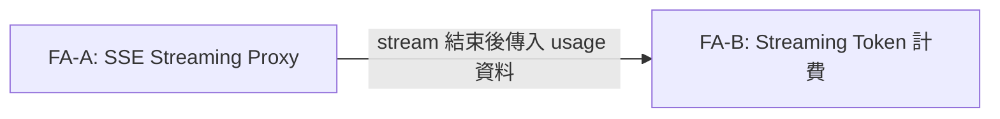
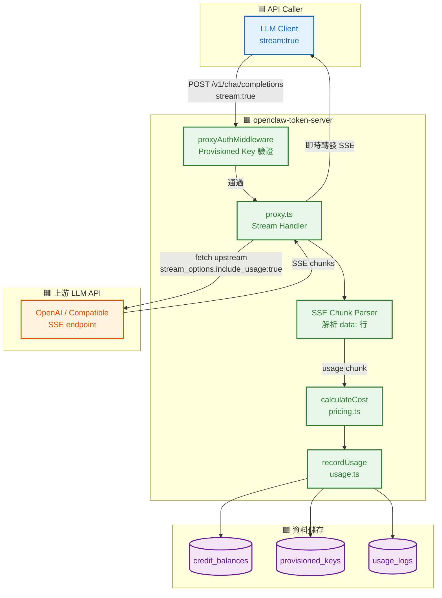
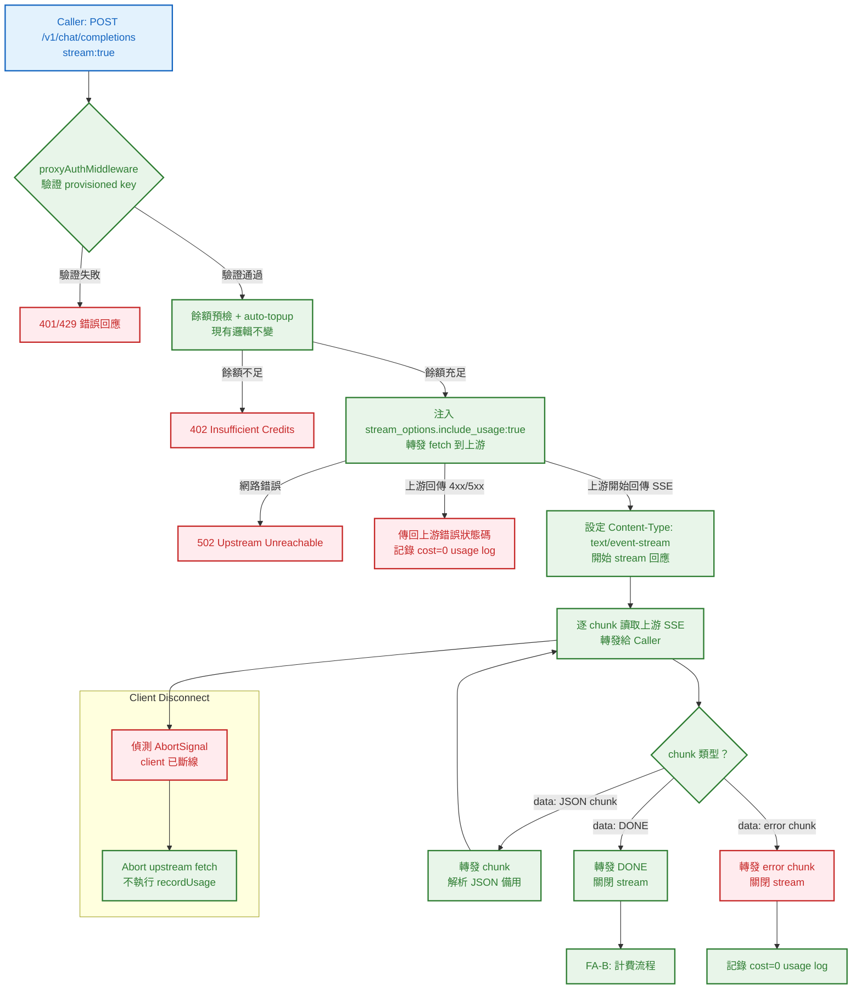
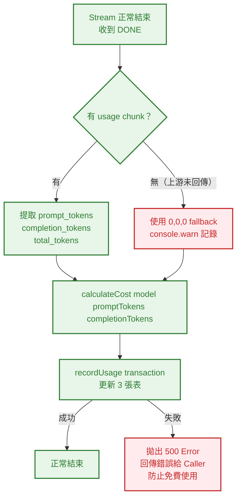
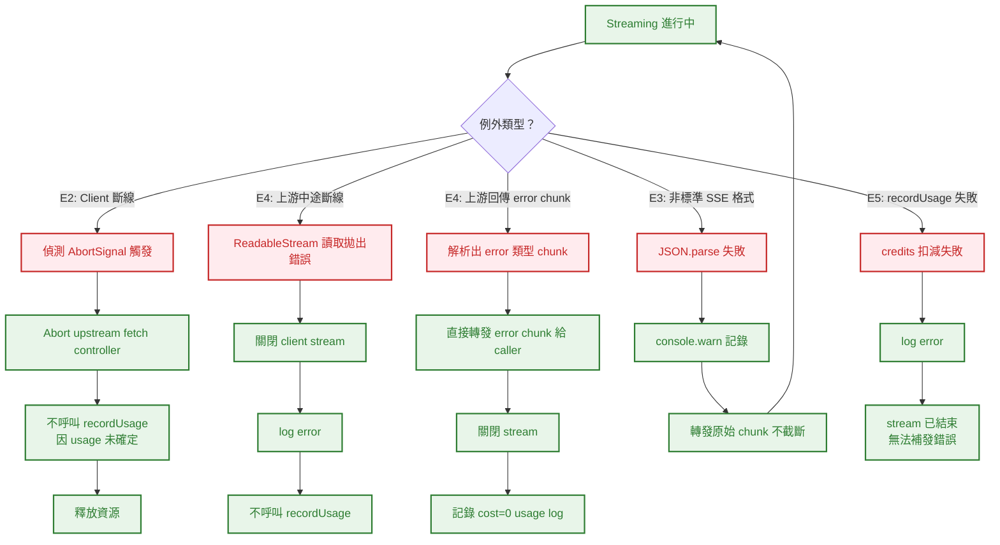

# S0 Brief Spec: SSE Streaming Proxy

> **階段**: S0 需求討論
> **建立時間**: 2026-03-15 00:00
> **Agent**: requirement-analyst
> **Spec Mode**: Full Spec
> **工作類型**: new_feature

---

## 0. 工作類型

| 類型 | 代碼 | 說明 |
|------|------|------|
| 新需求 | `new_feature` | 全新功能或流程，S1 聚焦影響範圍+可複用元件 |
| 重構 | `refactor` | 改善程式碼品質/架構，S1 深度分析現狀+耦合點 |
| Bug 修復 | `bugfix` | 修正錯誤行為，S1 追蹤 root cause+呼叫鏈 |
| 調查 | `investigation` | 方向不明，S1 橫向掃描+假設排除（可能轉型） |

**本次工作類型**：`new_feature`

## 1. 一句話描述

為 openclaw-token-server 的 API Proxy 加入 SSE Streaming 支援，將上游 LLM 的 streaming response 即時逐 chunk 轉發給 caller，並在 stream 結束後從 usage chunk 扣減 credits。

## 2. 為什麼要做

### 2.1 痛點

- **強制阻擋 stream:true 請求**：目前 `proxy.ts` 在 L29-31 硬拒絕所有 `stream:true` 請求（回傳 `400 UNSUPPORTED`），導致所有依賴 streaming 的 LLM client（Claude Code、OpenAI SDK、LangChain 等）無法透過 openclaw-token-server proxy 使用，等於 token management 功能對 streaming 用戶完全無效。
- **大型模型回應體驗差**：即使用戶繞過限制，non-streaming 需等待完整 response 才能顯示，大型回應（數千 token）等待時間達數十秒，嚴重影響使用體驗。
- **API 相容性缺失**：OpenAI-compatible API 的標準使用場景大多依賴 streaming，缺少支援使 proxy 的市場定位大打折扣。

### 2.2 目標

- 讓所有符合 OpenAI streaming 協議的 client 能無縫透過 proxy 發送 `stream:true` 請求
- 達到接近零額外延遲的 streaming 轉發（Time to First Byte 不超過 non-streaming 基準 +50ms）
- 在不破壞現有 non-streaming 路徑的前提下，將 streaming token usage 正確記錄並扣減 credits

## 3. 使用者

| 角色 | 說明 |
|------|------|
| API Caller（開發者） | 使用 provisioned key 呼叫 `POST /v1/chat/completions`，設定 `stream:true`，期待收到即時 SSE 串流 |
| openclaw 帳戶持有者 | 擁有 credit balance，stream 結束後自動被扣減實際消耗的 token cost |
| server 管理者 | 確認 streaming 不造成 server 記憶體洩漏或連線積壓，usage_logs 完整記錄 |

## 4. 核心流程

> **閱讀順序**：功能區拆解（理解全貌）→ 系統架構總覽（理解組成）→ 各功能區流程圖（對焦細節）→ 例外處理（邊界情境）

> 圖例：🟦 藍色 = 前端頁面/UI　｜　🟩 綠色 = 後端 API/服務　｜　🟧 橘色 = 第三方服務　｜　🟪 紫色 = 資料儲存　｜　🟥 紅色 = 例外/錯誤

### 4.0 功能區拆解（Functional Area Decomposition）

#### 功能區識別表

| FA ID | 功能區名稱 | 一句話描述 | 入口 | 獨立性 |
|-------|-----------|-----------|------|--------|
| FA-A | SSE Streaming Proxy | 接收 stream:true 請求，逐 chunk 轉發上游 SSE，正確處理 client 斷線與上游錯誤 | `POST /v1/chat/completions` with `stream:true` | 低 |
| FA-B | Streaming Token 計費 | 從 streaming 結束後的 usage chunk 擷取 token 數，呼叫 recordUsage 扣減 credits | streaming 結束事件（usage chunk 或 [DONE]） | 低 |

> 兩個 FA 高度耦合（streaming proxy 結束時直接觸發計費），不適合拆分為獨立 SOP。

#### 拆解策略

**本次策略**：`single_sop`

> FA-A 與 FA-B 在同一個 stream handler 內完成，無法獨立部署或測試，採單一 SOP 處理。

#### 跨功能區依賴



| 來源 FA | 目標 FA | 依賴類型 | 說明 |
|---------|---------|---------|------|
| FA-A | FA-B | 事件觸發 | stream 結束時，FA-A 將已解析的 usage 物件傳給 FA-B 執行 recordUsage |

---

### 4.1 系統架構總覽



**架構重點**：

| 層級 | 組件 | 職責 |
|------|------|------|
| **Caller** | LLM Client | 發送 stream:true 請求，接收 SSE 串流 |
| **後端** | proxyAuthMiddleware | 驗證 provisioned key 有效性與 credit limit |
| **後端** | proxy.ts Stream Handler | 偵測 stream:true，建立 SSE pipe，偵測 client 斷線 |
| **後端** | SSE Chunk Parser | 解析 `data: {...}` 行，識別 usage chunk 與 error chunk |
| **後端** | recordUsage / calculateCost | stream 結束後計費並寫入 DB（已有邏輯，不需修改） |
| **第三方** | 上游 LLM API | 回傳 SSE 格式的 streaming response |
| **資料** | credit_balances / provisioned_keys / usage_logs | 計費資料，由 recordUsage transaction 原子更新 |

---

### 4.2 FA-A: SSE Streaming Proxy

#### 4.2.1 全局流程圖



**技術細節補充**：
- `stream_options.include_usage: true` 必須在轉發給上游前注入 request body，確保 OpenAI 在最後一個 chunk 之後回傳獨立的 usage chunk（`choices: []`）
- Hono 4.6 使用 `c.stream()` 或直接 `return new Response(ReadableStream, { headers: {'Content-Type': 'text/event-stream'} })` 實作 SSE 回應
- client disconnect 偵測：透過 `c.req.raw.signal`（Web API AbortSignal）偵測，abort upstream fetch 的 controller
- Bun runtime 支援 Web Streams API（`ReadableStream`、`TransformStream`），不需 Node.js stream

---

#### 4.2.2 SSE Chunk 解析子流程

```mermaid
flowchart TD
    Start[從上游讀取 chunk bytes]:::be --> Decode[TextDecoder 解碼]:::be
    Decode --> Split[依 \n\n 切分 SSE 事件]:::be
    Split --> Line{行首檢查}:::be
    Line -->|data: [DONE]| Done[標記 stream 結束]:::be
    Line -->|data: {...}| Parse[JSON.parse data 部分]:::be
    Line -->|其他行 / 空行| Skip[忽略，繼續]:::be
    Parse -->|解析失敗| MalformedLog[console.warn 記錄\n繼續轉發原始 chunk]:::ex
    Parse -->|解析成功| CheckUsage{有 usage 欄位？}:::be
    CheckUsage -->|是| CaptureUsage[記錄 usage 資料\n供後續計費]:::be
    CheckUsage -->|否| Forward[直接轉發 chunk]:::be
    CaptureUsage --> Forward
    Forward --> Start

    classDef fe fill:#e3f2fd,color:#1565c0,stroke:#1565c0,stroke-width:2px
    classDef be fill:#e8f5e9,color:#2e7d32,stroke:#2e7d32,stroke-width:2px
    classDef ex fill:#ffebee,color:#c62828,stroke:#c62828,stroke-width:2px
```

**SSE 解析特殊注意事項**：
- OpenAI streaming 的 usage chunk 格式（需 `stream_options.include_usage: true`）：`data: {"id":"...","object":"chat.completion.chunk","choices":[],"usage":{"prompt_tokens":N,"completion_tokens":N,"total_tokens":N}}`
- chunk 緩衝：TCP 可能將多個 SSE 事件合併在一個 chunk，也可能單個事件跨多個 chunk，需實作緩衝區處理殘缺行
- 轉發策略：**無論解析是否成功，所有原始 bytes 都必須轉發給 caller**，不因解析錯誤截斷

---

#### 4.2.N Happy Path 摘要

| 路徑 | 入口 | 結果 |
|------|------|------|
| **A：正常 streaming** | `POST /v1/chat/completions` stream:true → auth 通過 → 餘額足夠 → 上游正常回應 | Caller 即時收到 SSE chunks，stream 結束後 credits 正確扣減 |
| **B：上游立即結束（空回應）** | 上游回傳 `data: [DONE]` 無任何 content chunk | Caller 收到空 stream，usage={0,0,0}，記錄 cost=0 usage log |

---

### 4.3 FA-B: Streaming Token 計費

#### 4.3.1 全局流程圖



**技術細節補充**：
- streaming 情境下 recordUsage **必須在 stream 完全結束後才呼叫**，因為 usage 資料在最後一個 chunk 才確定
- Hono streaming response 已經開始發送（headers 已送出），recordUsage 失敗時無法回傳 HTTP 500 給 caller，改為：log error + 後台補扣（本次範圍外）或允許此情況（需業務確認）
- 目前非 streaming 的行為是「recordUsage 失敗則回傳 500」，streaming 無法複製此行為（stream 已開始），需明確決策
- **決策（本次採用）**：streaming recordUsage 失敗時，log error 並關閉 stream，不嘗試向已完成的 caller 補傳錯誤（HTTP 協議限制）

---

#### 4.3.N Happy Path 摘要

| 路徑 | 入口 | 結果 |
|------|------|------|
| **A：正常計費** | stream 結束，usage chunk 有效 | calculateCost → recordUsage transaction 成功，credits 扣減 |
| **B：usage 缺失 fallback** | stream 結束，未收到 usage chunk | cost=0，記錄 usage log（防遺漏），console.warn |

---

### 4.4 例外流程圖



**技術細節補充**：
- `c.req.raw.signal` 是 Hono/Bun 暴露的 Request AbortSignal，在 client 斷線時觸發
- 上游 fetch 需傳入 `signal: abortController.signal`，讓 client 斷線時能 abort 上游 fetch
- E5 的 credits 漏扣問題：本次範圍內只記錄 log，後續可設計補扣機制（不在本 SOP）

---

### 4.5 六維度例外清單

| 維度 | ID | FA | 情境 | 觸發條件 | 預期行為 | 嚴重度 |
|------|-----|-----|------|---------|---------|--------|
| 並行/競爭 | E1 | 全域 | 多個 streaming 請求同時進行，credits 扣減 race condition | 兩個 stream 同時結束並呼叫 recordUsage | recordUsage 使用 `sql.begin` transaction，已有 serial 保證，無 race condition | P2 |
| 並行/競爭 | E1b | 全域 | auto-topup 在 streaming 進行中被觸發 | 另一個請求觸發 auto-topup，改變餘額 | auto-topup 在請求開始時做預檢，streaming 不改變此邏輯；最壞情況為負餘額（現有非 streaming 也有此問題） | P2 |
| 狀態轉換 | E2 | FA-A | Client 在 streaming 進行中斷線 | 用戶關閉瀏覽器/app、網路斷線、timeout | 偵測 `c.req.raw.signal` abort → abort 上游 fetch → 不呼叫 recordUsage（usage 未確定）→ 釋放資源 | P1 |
| 狀態轉換 | E2b | FA-A | Server 在 stream 結束後呼叫 recordUsage，但 DB 連線中斷 | DB 短暫不可用 | log error，stream 已結束無法通知 caller；credits 漏扣，需後續補扣機制 | P1 |
| 資料邊界 | E3 | FA-A | 超長 streaming response（10 萬+ token） | 請求非常長的生成任務 | 逐 chunk 轉發不緩存完整回應，記憶體使用量與 chunk 大小成正比，不與總 token 數成正比；recordUsage 最後一次性執行 | P2 |
| 資料邊界 | E3b | FA-A | 上游立即回傳 `data: [DONE]`（空回應） | 上游模型拒絕生成 or 空輸入 | 轉發 DONE，usage={0,0,0}，記錄 cost=0 usage log | P2 |
| 資料邊界 | E3c | FA-A | 上游回傳非標準 SSE 格式（無 `data: ` prefix，或 JSON 格式不符） | 上游非 OpenAI 相容 API，或上游 bug | JSON.parse 失敗 → console.warn → 轉發原始 chunk 不截斷 → usage fallback 0,0,0 | P2 |
| 資料邊界 | E3d | FA-A | TCP 分包導致單個 SSE 事件跨多個 chunk | 網路條件惡劣或 chunk 很大 | 實作行緩衝區（line buffer），累積到 `\n\n` 才處理一個完整 SSE 事件 | P1 |
| 網路/外部 | E4 | FA-A | 上游 streaming 中途斷線（ReadableStream 拋出錯誤） | 上游服務崩潰、連線超時 | catch ReadableStream 讀取錯誤 → 向 caller 發送 error chunk 或關閉 stream → log error → 不呼叫 recordUsage | P1 |
| 網路/外部 | E4b | FA-A | 上游回傳 error chunk（`data: {"error":{...}}`） | 上游 rate limit、token 超限 | 識別 error chunk → 直接轉發給 caller → 關閉 stream → 記錄 cost=0 usage log | P1 |
| 網路/外部 | E4c | FA-A | upstream fetch 連線建立失敗（stream 尚未開始） | DNS 失敗、連線被拒 | 與現有 non-streaming 行為相同：回傳 502 Upstream Unreachable | P1 |
| 業務邏輯 | E5 | FA-B | streaming 結束時 credits 已被其他請求耗盡（負餘額） | 並行請求消耗完餘額，但本 stream 已在進行 | recordUsage 仍執行（可能產生負餘額），log warning；本次不實作 streaming 中途截止機制 | P2 |
| 業務邏輯 | E5b | FA-B | recordUsage transaction 失敗（DB 錯誤） | DB 不可用、constraint 違反 | log error；stream 已完成無法通知 caller；credits 漏扣，需後續補扣機制（範圍外） | P1 |
| 業務邏輯 | E5c | FA-A | 上游未回傳 usage chunk（stream_options 未生效或上游不支援） | 非 OpenAI API、或 upstream 不支援 include_usage | usage fallback 到 {0,0,0}，cost=0，console.warn 記錄，不中斷 stream | P2 |
| UI/體驗 | E6 | N/A | 純 server 端，無 UI | N/A | N/A | N/A |

### 4.6 白話文摘要

這次改造讓所有使用 `stream:true` 的 LLM client（如 Claude Code、ChatGPT 前端、LangChain）可以透過 openclaw-token-server proxy 即時收到 AI 回應，而不是等到全部生成完才顯示。當 AI 在串流過程中突然斷線，或用戶自己關閉連線，server 會乾淨地中止並釋放資源，不影響其他用戶。最壞情況下如果計費資料庫在 stream 結束的瞬間發生錯誤，用戶可能獲得免費的一次生成，但我們會記錄完整 log 供後續追查補扣。

## 5. 成功標準

| # | FA | 類別 | 標準 | 驗證方式 |
|---|-----|------|------|---------|
| 1 | FA-A | 功能 | `stream:true` 請求不再回傳 400，改為 `Content-Type: text/event-stream` SSE 回應 | curl 發送 stream:true 請求，觀察回應 headers 與 chunk 格式 |
| 2 | FA-A | 功能 | SSE 回應格式符合 OpenAI 協議（`data: {...}` 行，結尾 `data: [DONE]`） | 解析回應，驗證每行格式 |
| 3 | FA-A | 效能 | Time to First Byte（收到第一個 data chunk）不超過同等 non-streaming 請求的 baseline + 50ms | 計時測試 |
| 4 | FA-B | 功能 | stream 正常結束後，usage_logs 有對應記錄，`cost > 0`（非零 token 請求） | 查詢 DB usage_logs 表 |
| 5 | FA-B | 功能 | stream 正常結束後，credit_balances.total_usage 增加對應 cost | 查詢 DB 前後差值 |
| 6 | FA-A | 健壯性 | client 中途斷線不造成 server crash 或 unhandled rejection | 測試：stream 進行中強制關閉 client 連線，觀察 server 日誌 |
| 7 | FA-A | 健壯性 | 上游 streaming 中途斷線，server 乾淨關閉連線並 log error，不 crash | 模擬上游斷線，觀察 server 日誌 |
| 8 | 全域 | 回歸 | 現有 non-streaming（無 `stream` 欄位或 `stream:false`）行為完全不受影響 | 執行現有 non-streaming 測試 |
| 9 | FA-A | 功能 | stream 請求在 auth 失敗時正確回傳 401/429（stream 尚未開始） | 使用無效 key 發送 stream:true 請求 |

## 6. 範圍

### 範圍內
- **FA-A**：`proxy.ts` 修改：移除 L29-31 的拒絕邏輯，加入 streaming 分支
- **FA-A**：在轉發前注入 `stream_options: { include_usage: true }` 到 request body
- **FA-A**：建立 SSE streaming pipe（上游 `response.body` → TextDecoder → 轉發給 caller）
- **FA-A**：實作行緩衝區（line buffer）處理跨 chunk 的不完整 SSE 事件
- **FA-A**：偵測 `c.req.raw.signal`（client disconnect），abort 上游 fetch
- **FA-A**：上游 error chunk、中途斷線的錯誤處理
- **FA-B**：從 SSE chunk 解析並捕獲 usage 資料
- **FA-B**：stream 結束後呼叫現有 `calculateCost` + `recordUsage`（不修改這兩個 util）
- **全域**：可選新增 `src/utils/sse-parser.ts`（SSE 解析邏輯獨立為 utility）

### 範圍外
- CLI repo（token-cli）的任何修改
- `pricing.ts` 的 model 定價修改
- `usage.ts` 的 `recordUsage` 邏輯修改
- `proxy-auth.ts` 的驗證邏輯修改
- streaming 過程中的動態 credits 監控（即時限流、stream 中途截止）
- credits 負餘額補扣機制
- WebSocket streaming 支援（只支援 SSE）
- 上游 API 非 OpenAI 相容格式的特殊處理（只對 OpenAI SSE 格式保證正確）

## 7. 已知限制與約束

- **Runtime**：Bun（支援 Web Streams API，不支援 Node.js `stream` 模組；需使用 `ReadableStream`、`TextDecoder`）
- **Framework**：Hono 4.6（已有 `c.stream()` helper，或直接 `new Response(ReadableStream)`）
- **無額外依賴**：不引入 tiktoken 或其他新 npm 套件
- **streaming recordUsage 失敗無法通知 caller**：HTTP streaming response 一旦開始就無法中途改 status code，recordUsage 失敗只能 log，credits 漏扣是已知可接受風險
- **upstream usage chunk 依賴**：方案 A 依賴上游回傳 usage chunk（需 `stream_options.include_usage: true`）；若上游不支援，fallback 到 cost=0（可接受）
- **TCP 分包處理複雜度**：行緩衝區邏輯是本次最大的實作複雜度，S1 需深入評估實作方式

## 8. 前端 UI 畫面清單

> 純後端功能，無 UI，省略此節。

## 9. 補充說明

### 方案比較（已選定方案 A）

| | 方案 A（推薦）| 方案 B | 方案 C |
|-|-------------|--------|--------|
| **描述** | 逐 chunk 轉發 + 從 usage chunk 扣費 | Buffer-then-forward（等全部結束才回傳） | 逐 chunk 轉發 + 本地 tiktoken 計數 |
| **streaming 體驗** | 真實 streaming | 偽 streaming，用戶體感延遲高 | 真實 streaming |
| **計費準確性** | 高（用上游官方 usage） | 高（用上游官方 usage） | 中（tiktoken 可能與上游版本不同） |
| **實作複雜度** | 中（SSE 解析 + client disconnect） | 低（改動最小） | 高（需引入 tiktoken + Bun 相容性未知） |
| **新依賴** | 無 | 無 | 需 tiktoken |
| **選定原因** | 體驗最佳，計費準確，無新依賴 | 失去 streaming 意義 | 依賴不確定性高 |

### 現有程式碼關鍵點（供 S1 參考）

- 拒絕邏輯位置：`proxy.ts` L29-31
- auto-topup 邏輯：`proxy.ts` L55-80，在 streaming 情境下維持現有行為（請求開始時預檢）
- `recordUsage` 已是 transaction-safe，streaming 複用不需修改
- `calculateCost` 純函數，直接複用

### stream_options 注入策略

上游 OpenAI-compatible API 在 streaming 模式下，預設**不回傳** usage 資訊。需在轉發 request body 前注入：

```json
{
  "stream_options": {
    "include_usage": true
  }
}
```

這樣上游會在 `data: [DONE]` 之前額外發送一個 usage chunk：
```
data: {"id":"...","object":"chat.completion.chunk","choices":[],"usage":{"prompt_tokens":10,"completion_tokens":50,"total_tokens":60}}

data: [DONE]
```

若上游不支援 `stream_options`（非 OpenAI 相容），此欄位會被忽略，fallback 到 cost=0。

---

## 10. SDD Context

```json
{
  "sdd_context": {
    "stages": {
      "s0": {
        "status": "pending_confirmation",
        "agent": "requirement-analyst",
        "output": {
          "brief_spec_path": "dev/specs/2026-03-15_9_streaming-proxy/s0_brief_spec.md",
          "work_type": "new_feature",
          "requirement": "為 openclaw-token-server 的 API Proxy 加入 SSE Streaming 支援，將上游 LLM 的 streaming response 即時逐 chunk 轉發給 caller，並在 stream 結束後從 usage chunk 扣減 credits",
          "pain_points": [
            "proxy.ts 硬拒絕所有 stream:true 請求（400 UNSUPPORTED），streaming LLM client 完全無法使用 proxy",
            "non-streaming 大型回應等待時間過長，影響使用體驗",
            "OpenAI-compatible API 標準使用場景大多依賴 streaming，缺少支援使 proxy 市場定位受限"
          ],
          "goal": "讓所有符合 OpenAI streaming 協議的 client 能無縫透過 proxy 發送 stream:true 請求，並正確記錄計費",
          "success_criteria": [
            "stream:true 請求不再回傳 400，改為 SSE 串流回應",
            "SSE 格式符合 OpenAI 協議",
            "Time to First Byte 不超過 non-streaming baseline +50ms",
            "stream 結束後 usage_logs 有記錄且 cost > 0（非零請求）",
            "client 斷線不造成 server crash",
            "現有 non-streaming 行為不受影響"
          ],
          "scope_in": [
            "proxy.ts 修改：移除拒絕邏輯，加入 streaming 分支",
            "注入 stream_options.include_usage:true",
            "建立 SSE streaming pipe 含行緩衝區",
            "client disconnect abort 處理",
            "上游錯誤/斷線處理",
            "usage chunk 擷取與 recordUsage 呼叫"
          ],
          "scope_out": [
            "CLI repo 任何修改",
            "pricing.ts / usage.ts / proxy-auth.ts 邏輯修改",
            "streaming 動態 credits 限流",
            "credits 負餘額補扣機制",
            "WebSocket streaming 支援",
            "非 OpenAI 相容格式特殊處理"
          ],
          "constraints": [
            "Runtime Bun：使用 Web Streams API，不使用 Node.js stream",
            "Hono 4.6：使用 c.stream() 或 new Response(ReadableStream)",
            "不引入新 npm 依賴（無 tiktoken）",
            "streaming recordUsage 失敗無法通知 caller（HTTP 協議限制）"
          ],
          "functional_areas": [
            {
              "id": "FA-A",
              "name": "SSE Streaming Proxy",
              "description": "接收 stream:true 請求，逐 chunk 轉發上游 SSE，處理 client 斷線與上游錯誤",
              "independence": "low"
            },
            {
              "id": "FA-B",
              "name": "Streaming Token 計費",
              "description": "從 streaming 結束後的 usage chunk 擷取 token 數，呼叫 recordUsage 扣減 credits",
              "independence": "low"
            }
          ],
          "decomposition_strategy": "single_sop",
          "child_sops": []
        }
      }
    }
  }
}
```
