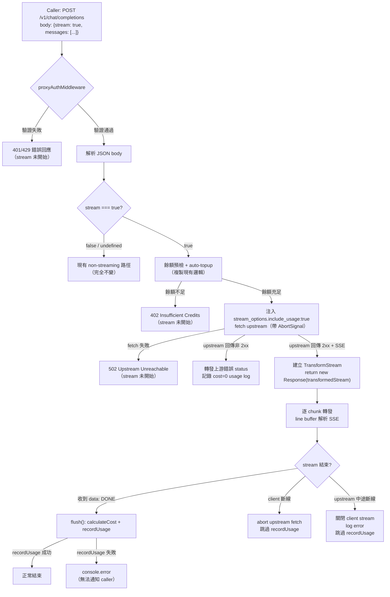
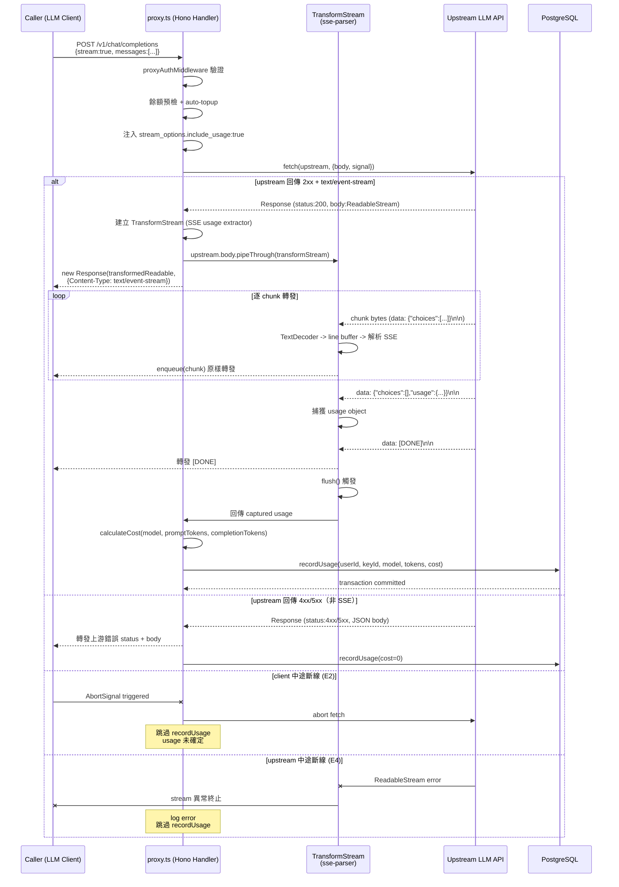

# S1 Dev Spec: SSE Streaming Proxy

> **階段**: S1 技術分析
> **建立時間**: 2026-03-15 01:30
> **Agent**: codebase-explorer (Phase 1) + architect (Phase 2)
> **工作類型**: new_feature
> **複雜度**: M

---

## 1. 概述

### 1.1 需求參照
> 完整需求見 `s0_brief_spec.md`，以下僅摘要。

為 openclaw-token-server 的 `POST /v1/chat/completions` 加入 SSE streaming proxy 支援。移除現有 `stream:true` 的 400 拒絕邏輯，改為逐 chunk 轉發上游 LLM 的 SSE response，並在 stream 結束後從 usage chunk 擷取 token 用量、呼叫現有 `calculateCost` + `recordUsage` 完成計費。

### 1.2 技術方案摘要

採用 **TransformStream 方案**：上游 `response.body`（ReadableStream）通過一個 TransformStream，其 `transform()` 函數在轉發原始 bytes 給 client 的同時，以 line buffer 解析 SSE 事件並捕獲 usage chunk；`flush()` 在 stream 結束時觸發 `recordUsage` 完成計費。最終以 `new Response(transformedStream, { headers })` 直接回傳給 Hono，繞過 Hono 的 `stream()` helper（因為我們是 pass-through proxy，不是 server-driven writing）。

---

## 2. 影響範圍（Phase 1：codebase-explorer）

### 2.1 受影響檔案

#### Backend (Hono + Bun)

| 檔案 | 變更類型 | 影響度 | 說明 |
|------|---------|--------|------|
| `src/routes/proxy.ts` | 修改 | 高 | 核心修改：移除 L29-31 blocking guard，加入 streaming 分支（偵測 `stream:true`、注入 `stream_options`、建立 TransformStream pipe、呼叫 recordUsage） |
| `src/utils/sse-parser.ts` | 新增 | 中 | SSE line-buffer 解析工具：`createSSEUsageExtractor()` 回傳 TransformStream，內含 line buffer + usage 捕獲邏輯 |
| `tests/integration/proxy-streaming.test.ts` | 新增 | 中 | Streaming 整合測試：mock upstream 回傳 SSE response，驗證 streaming 轉發、usage 計費、client 斷線處理 |

#### 確認不變的檔案

| 檔案 | 說明 |
|------|------|
| `src/utils/pricing.ts` | `calculateCost` 純函數，直接複用 |
| `src/utils/usage.ts` | `recordUsage` transaction，直接複用 |
| `src/middleware/proxy-auth.ts` | 驗證邏輯不變，streaming 請求通過後 `c.get('userId')` / `c.get('keyId')` 已設定 |
| `src/app.ts` | 路由掛載不變 |
| `src/errors.ts` | AppError 類別不變 |
| `src/db/client.ts` | DB client 不變 |
| `src/config.ts` | 環境變數不變 |

### 2.2 依賴關係

- **上游依賴**：`pricing.ts`（calculateCost）、`usage.ts`（recordUsage）、`proxy-auth.ts`（middleware 設定 userId/keyId）、`config.ts`（upstreamApiBase, upstreamApiKey）
- **下游影響**：無。新增的 streaming 路徑是 proxy.ts 的內部分支，不影響其他路由或模組
- **Framework**：Hono 4.6（handler 可直接回傳 `Response` 物件）、Bun Web Streams API（`ReadableStream`、`TransformStream`、`TextDecoder`）

### 2.3 現有模式與技術考量

- **proxy.ts 現有流程**：`proxyAuthMiddleware` → JSON body 解析 → 拒絕 `stream:true`（L29-31）→ credit check + auto-topup → `fetch` upstream → `await resp.json()` → `recordUsage` → `c.json()`
- **streaming 分支插入點**：在 JSON body 解析之後、credit check 之前，偵測 `body.stream === true`，進入 streaming 路徑
- **auto-topup**：streaming 分支需複製現有 auto-topup 預檢邏輯（在 stream 開始前執行，與 non-streaming 一致）
- **recordUsage 模式**：現有 non-streaming 是「response 收到後同步呼叫」；streaming 改為「stream 結束後在 flush() 中非同步呼叫」

---

## 3. User Flow（Phase 2：architect）



### 3.1 主要流程

| 步驟 | 動作 | 系統回應 | 備註 |
|------|------|---------|------|
| 1 | Caller 發送 `POST /v1/chat/completions` with `stream:true` | proxyAuthMiddleware 驗證 provisioned key | 與 non-streaming 共用 middleware |
| 2 | 通過驗證 | 解析 JSON body，偵測 `stream === true` | 進入 streaming 分支 |
| 3 | streaming 分支 | 餘額預檢 + auto-topup（stream 開始前） | 複製現有邏輯 |
| 4 | 餘額充足 | 注入 `stream_options.include_usage:true`，fetch upstream | 帶 `c.req.raw.signal` 作為 abort signal |
| 5 | upstream 回傳 2xx + `text/event-stream` | 建立 TransformStream，回傳 `new Response(stream)` | Content-Type: text/event-stream |
| 6 | 逐 chunk 轉發 | line buffer 解析 SSE 事件，捕獲 usage chunk | 原始 bytes 不修改，直接 enqueue |
| 7 | 收到 `data: [DONE]` | flush() 觸發 calculateCost + recordUsage | credits 扣減 |

### 3.2 異常流程

| S0 ID | 情境 | 觸發條件 | 系統處理 | Caller 看到 |
|-------|------|---------|---------|-------------|
| E2 | Client 中途斷線 | `c.req.raw.signal` abort | Abort upstream fetch，跳過 recordUsage | 連線中斷（client 端自行處理） |
| E3d | 跨 chunk 不完整 SSE | TCP 分包 | Line buffer 累積到 `\n` 才處理 | 無影響，chunk 正常接收 |
| E4 | 上游中途斷線 | ReadableStream 讀取拋錯 | 關閉 client stream，log error | stream 異常終止 |
| E4b | 上游回傳 error chunk | `data: {"error":{...}}` | 轉發 error chunk，關閉 stream | 收到 error 事件 |
| E4c | upstream fetch 失敗 | DNS/連線錯誤 | 回傳 502（stream 未開始） | 502 錯誤回應 |
| E5b | recordUsage 失敗 | DB 不可用 | console.error，stream 已結束 | 無影響（已收到完整 stream） |
| E5c | 無 usage chunk | 上游不支援 stream_options | fallback usage={0,0,0}，cost=0 | 無影響 |

### 3.3 S0 -> S1 例外追溯表

| S0 ID | 維度 | S0 描述 | S1 處理位置 | 覆蓋狀態 |
|-------|------|---------|-----------|----------|
| E1 | 並行/競爭 | 多 stream 同時 recordUsage race condition | recordUsage 已有 `sql.begin` transaction 保護 | ✅ 覆蓋 |
| E1b | 並行/競爭 | auto-topup 在 streaming 中被觸發 | 維持現有行為，最壞情況負餘額（與 non-streaming 一致） | ✅ 覆蓋 |
| E2 | 狀態轉換 | Client streaming 中斷線 | TransformStream + `c.req.raw.signal` abort upstream | ✅ 覆蓋 |
| E2b | 狀態轉換 | recordUsage 時 DB 斷線 | console.error，credits 漏扣（log 追查） | ✅ 覆蓋 |
| E3 | 資料邊界 | 超長 streaming response | 逐 chunk 轉發不緩存，記憶體 O(chunk_size) | ✅ 覆蓋 |
| E3b | 資料邊界 | 上游立即回傳 DONE | 轉發 DONE，usage={0,0,0}，cost=0 | ✅ 覆蓋 |
| E3c | 資料邊界 | 非標準 SSE 格式 | JSON.parse 失敗 -> warn + 轉發原始 chunk | ✅ 覆蓋 |
| E3d | 資料邊界 | TCP 分包導致跨 chunk SSE | Line buffer 機制 | ✅ 覆蓋 |
| E4 | 網路/外部 | 上游 streaming 中途斷線 | catch ReadableStream error -> 關閉 client stream | ✅ 覆蓋 |
| E4b | 網路/外部 | 上游回傳 error chunk | 轉發 error chunk -> 關閉 stream -> cost=0 | ✅ 覆蓋 |
| E4c | 網路/外部 | upstream fetch 連線失敗 | 502 回應（stream 未開始） | ✅ 覆蓋 |
| E5 | 業務邏輯 | stream 結束時 credits 已耗盡 | recordUsage 仍執行（可能負餘額），log warning | ✅ 覆蓋 |
| E5b | 業務邏輯 | recordUsage transaction 失敗 | console.error，stream 已結束無法通知 | ✅ 覆蓋 |
| E5c | 業務邏輯 | 上游未回傳 usage chunk | fallback {0,0,0}，cost=0，console.warn | ✅ 覆蓋 |

---

## 4. Data Flow



### 4.1 API 契約

> 本次不新增 API endpoint，僅擴展現有 `POST /v1/chat/completions` 的行為。

**Endpoint 摘要**

| Method | Path | 變更 | 說明 |
|--------|------|------|------|
| `POST` | `/v1/chat/completions` | 擴展 | 新增 `stream:true` 支援，回傳 SSE 串流 |

**Request 變更**

原有 request body 不變，新增支援 `stream: true` 欄位：

```json
{
  "model": "gpt-4o",
  "messages": [{"role": "user", "content": "Hello"}],
  "stream": true
}
```

**Response 變更**

當 `stream: true` 時，Response 從 JSON 改為 SSE：

- **Content-Type**: `text/event-stream`
- **Transfer-Encoding**: `chunked`
- **Cache-Control**: `no-cache`
- **Connection**: `keep-alive`

Response body 格式：
```
data: {"id":"chatcmpl-xxx","object":"chat.completion.chunk","choices":[{"index":0,"delta":{"role":"assistant"},"finish_reason":null}]}\n\n
data: {"id":"chatcmpl-xxx","object":"chat.completion.chunk","choices":[{"index":0,"delta":{"content":"Hello"},"finish_reason":null}]}\n\n
data: {"id":"chatcmpl-xxx","object":"chat.completion.chunk","choices":[{"index":0,"delta":{},"finish_reason":"stop"}]}\n\n
data: {"id":"chatcmpl-xxx","object":"chat.completion.chunk","choices":[],"usage":{"prompt_tokens":10,"completion_tokens":5,"total_tokens":15}}\n\n
data: [DONE]\n\n
```

### 4.2 資料模型

無新增資料模型。`usage_logs`、`credit_balances`、`provisioned_keys` 結構不變，streaming 使用現有 `recordUsage` transaction 寫入。

---

## 5. 任務清單

### 5.1 任務總覽

| # | 任務 | 類型 | 複雜度 | Agent | 依賴 |
|---|------|------|--------|-------|------|
| 1 | SSE line buffer + usage parser utility | 後端 | M | backend-expert | - |
| 2 | proxy.ts streaming 分支 | 後端 | M | backend-expert | #1 |
| 3 | 更新 TC-08 + 新增 streaming 整合測試 | 後端 | M | backend-expert | #2 |
| 4 | Edge case 測試（client 斷線、upstream 錯誤） | 後端 | S | backend-expert | #2 |

### 5.2 任務詳情

#### Task #1: SSE line buffer + usage parser utility

- **類型**: 後端
- **複雜度**: M
- **Agent**: backend-expert
- **描述**: 新增 `src/utils/sse-parser.ts`，提供 `createSSEUsageExtractor()` 函數。此函數回傳一個物件，包含：
  - `transformStream`: 一個 `TransformStream<Uint8Array, Uint8Array>`，其 `transform()` 將接收的 chunk 原樣 `enqueue` 轉發，同時以 TextDecoder + line buffer 解析 SSE 事件，從 `data: {...}` 行中偵測含 `usage` 欄位的 JSON 並儲存
  - `getUsage()`: 回傳已捕獲的 `{ prompt_tokens, completion_tokens, total_tokens } | null`

  **Line buffer 邏輯**：
  1. 維護一個 `buffer: string`，每次 `transform(chunk)` 時將 `TextDecoder.decode(chunk, { stream: true })` 的結果 append 到 buffer
  2. 以 `\n` 切分 buffer，最後一段（可能不完整）保留在 buffer
  3. 對每行完整的 `data: ...` 行，若不是 `data: [DONE]`，嘗試 `JSON.parse`
  4. 若解析成功且有 `.usage` 欄位，儲存 usage
  5. JSON.parse 失敗則 `console.warn` 並跳過

- **DoD (Definition of Done)**:
  - [ ] `src/utils/sse-parser.ts` 建立，export `createSSEUsageExtractor()`
  - [ ] line buffer 正確處理跨 chunk 的不完整行
  - [ ] 正確擷取 usage chunk 中的 `prompt_tokens`, `completion_tokens`, `total_tokens`
  - [ ] 非 `data:` 行與 `data: [DONE]` 正確跳過
  - [ ] JSON.parse 失敗不拋錯，console.warn 記錄
  - [ ] chunk 原樣 enqueue（不修改 bytes）
  - [ ] 單元測試覆蓋：正常 SSE、跨 chunk 切分、無 usage chunk、malformed JSON

- **驗收方式**: 單元測試全數通過，手動驗證 line buffer 行為

#### Task #2: proxy.ts streaming 分支

- **類型**: 後端
- **複雜度**: M
- **Agent**: backend-expert
- **依賴**: Task #1
- **描述**: 修改 `src/routes/proxy.ts`：
  1. **移除** L29-31 的 `if (body.stream) return c.json({ error: 'UNSUPPORTED' }, 400)` 拒絕邏輯
  2. 在 body 解析後，偵測 `body.stream === true`，進入 streaming 分支：
     - 複製現有 credit check + auto-topup 邏輯（或提取為共用函數）
     - 修改 request body：注入 `body.stream_options = { include_usage: true }`
     - `fetch(upstream, { body: JSON.stringify(body), signal: c.req.raw.signal })`
     - 檢查 upstream response：
       - 若 `!resp.ok`：走現有非 streaming 錯誤路徑（回傳上游 status + body）
       - 若 `resp.ok` 且 Content-Type 包含 `text/event-stream`：建立 TransformStream pipe
     - 建立 `createSSEUsageExtractor()`
     - `const transformedStream = resp.body.pipeThrough(extractor.transformStream)`
     - 回傳 `new Response(transformedStream, { status: 200, headers: { 'Content-Type': 'text/event-stream', 'Cache-Control': 'no-cache', 'Connection': 'keep-alive' } })`
     - 在 stream 完成後（使用 `transformedStream` 的 readable side 被完全消費後），從 `extractor.getUsage()` 取得 usage，呼叫 `calculateCost` + `recordUsage`
  3. **stream 結束後計費的實作方式**：由於 `new Response()` 回傳後 Hono 會自行消費 readable stream，我們需要在 TransformStream 的 `flush()` 中觸發計費。具體做法：`createSSEUsageExtractor` 接受一個 `onComplete` callback，在 `flush()` 中呼叫
  4. **client 斷線處理**：`c.req.raw.signal` 傳給 upstream fetch，abort 時 TransformStream 自動終止，`flush()` 不會被呼叫（不計費，符合預期）
  5. **upstream 非 SSE 回應**（Content-Type 不是 `text/event-stream`）：走 non-streaming 錯誤路徑

- **DoD (Definition of Done)**:
  - [ ] L29-31 blocking guard 移除
  - [ ] `stream:true` 請求回傳 `Content-Type: text/event-stream` SSE 回應
  - [ ] `stream_options.include_usage:true` 正確注入上游請求
  - [ ] upstream 非 2xx 回傳原有錯誤格式（不進入 streaming）
  - [ ] stream 結束後 `recordUsage` 正確呼叫（usage_logs + credit_balances + provisioned_keys 更新）
  - [ ] client 斷線時 abort upstream fetch，不呼叫 recordUsage
  - [ ] 現有 non-streaming 路徑完全不受影響
  - [ ] `recordUsage` 失敗時 console.error，不 crash

- **驗收方式**: 整合測試通過 + 手動 curl 測試 streaming 回應

#### Task #3: 更新 TC-08 + 新增 streaming 整合測試

- **類型**: 後端
- **複雜度**: M
- **Agent**: backend-expert
- **依賴**: Task #2
- **描述**:
  1. **更新現有 TC-08**：原測試驗證 `stream:true -> 400`，現需改為驗證 streaming 回應正確（或移除此 TC，改由新測試覆蓋）
  2. **新增 `tests/integration/proxy-streaming.test.ts`**：
     - Mock upstream 支援 SSE response（建立一個 mock server 回傳 `text/event-stream` + 多個 `data:` chunk + usage chunk + `data: [DONE]`）
     - **TC-S01**：正常 streaming 轉發 - 驗證 response Content-Type 為 `text/event-stream`，chunk 格式正確
     - **TC-S02**：streaming 結束後 usage_logs 有記錄，cost > 0
     - **TC-S03**：streaming 結束後 credit_balances.total_usage 正確增加
     - **TC-S04**：`stream:false` 請求走 non-streaming 路徑（回歸測試）
     - **TC-S05**：upstream 回傳非 2xx 時回傳錯誤（stream 未開始）
     - **TC-S06**：無 usage chunk 時 cost=0 記錄

- **DoD (Definition of Done)**:
  - [ ] TC-08 更新或替換，不再驗證 `stream:true -> 400`
  - [ ] `proxy-streaming.test.ts` 建立，包含 TC-S01 ~ TC-S06
  - [ ] mock upstream 正確模擬 SSE 回應
  - [ ] 所有現有 proxy.test.ts TC-01 ~ TC-16 通過（回歸驗證）
  - [ ] 新測試全數通過

- **驗收方式**: `bun test` 全數通過

#### Task #4: Edge case 測試

- **類型**: 後端
- **複雜度**: S
- **Agent**: backend-expert
- **依賴**: Task #2
- **描述**:
  在 `proxy-streaming.test.ts` 中新增 edge case 測試：
  - **TC-S07**：client 中途斷線（abort request），驗證 server 不 crash、不產生 unhandled rejection
  - **TC-S08**：upstream 中途斷線（mock server 在 stream 途中關閉連線），驗證 server 不 crash
  - **TC-S09**：upstream 回傳 malformed SSE（非 `data:` prefix 行），驗證轉發不截斷
  - **TC-S10**：超長 chunk（多個 SSE 事件合併在一個 chunk），驗證 line buffer 正確解析

- **DoD (Definition of Done)**:
  - [ ] TC-S07 ~ TC-S10 建立並通過
  - [ ] client 斷線場景：server process 無 unhandled rejection
  - [ ] upstream 斷線場景：server 乾淨關閉連線
  - [ ] 所有測試通過

- **驗收方式**: `bun test` 全數通過

---

## 6. 技術決策

### 6.1 架構決策

| 決策點 | 選項 | 選擇 | 理由 |
|--------|------|------|------|
| Streaming 轉發機制 | A: `TransformStream` pass-through<br/>B: `tee()` 雙路<br/>C: Hono `stream()` + 手動 `write()` | A | 單一路徑、記憶體最小、transform 只讀不改 chunk、flush() 自然觸發計費。tee() 雙倍記憶體且 client 斷線時可能阻塞。Hono stream() 假設 server-driven writing，不適合 proxy pass-through |
| Response 建構方式 | A: `new Response(readableStream, { headers })`<br/>B: Hono `c.stream()` helper<br/>C: Hono `streamSSE()` helper | A | Hono handler 可直接回傳 `Response` 物件。`c.stream()` 設計給 server 主動 write 場景，不適合 pipe 上游 ReadableStream。`streamSSE()` 會自行格式化 SSE，但我們需要原樣轉發上游 bytes |
| Usage 擷取時機 | A: TransformStream flush() callback<br/>B: stream 消費完後 await | A | flush() 在 readable side 被完全消費時自動觸發，不需額外 await 機制。缺點是 flush() 中的非同步操作需 await（TransformStream flush 支援 async） |
| SSE 解析邏輯位置 | A: 獨立 `sse-parser.ts` utility<br/>B: 直接寫在 `proxy.ts` 內 | A | 獨立 utility 可單元測試 line buffer 邏輯，降低 proxy.ts 複雜度，符合單一職責原則 |
| stream_options 注入 | 在 proxy.ts 中直接修改 parsed body | 直接修改 | 最簡方案，body 已解析為 JSON object，直接設定 `body.stream_options = { include_usage: true }` 後 re-stringify |

### 6.2 設計模式

- **Pattern**: TransformStream Pipeline
- **理由**: Web Streams API 的 `pipeThrough()` 提供宣告式的 stream 處理鏈。TransformStream 的 `transform()` 和 `flush()` 生命週期完美匹配「逐 chunk 處理 + 結束後收尾」的需求。Bun runtime 原生支援，不需額外依賴。

### 6.3 相容性考量

- **向後相容**: 完全相容。`stream:false` 或無 `stream` 欄位的請求走現有路徑，行為不變。唯一的破壞性變更是 `stream:true` 從 400 變為正常回應，這是預期行為。
- **Migration**: 無資料遷移需求。

---

## 7. 驗收標準

### 7.1 功能驗收

| # | 場景 | Given | When | Then | 優先級 |
|---|------|-------|------|------|--------|
| 1 | 正常 streaming 回應 | 合法 provisioned key，充足 credits | `POST /v1/chat/completions` with `stream:true` | Response Content-Type 為 `text/event-stream`，收到多個 `data: {...}` chunk，最後收到 `data: [DONE]` | P0 |
| 2 | Streaming usage 計費 | stream 正常結束，上游回傳 usage chunk | stream 完全接收後 | `usage_logs` 新增一筆記錄，`cost > 0`；`credit_balances.total_usage` 增加對應 cost | P0 |
| 3 | Non-streaming 不受影響 | 與原有測試相同條件 | `POST /v1/chat/completions` with `stream:false` | 行為與修改前完全一致，TC-01 ~ TC-16（除 TC-08）全數通過 | P0 |
| 4 | Client 斷線不 crash | stream 正在進行中 | Client 關閉連線 | Server 無 unhandled rejection，upstream fetch 被 abort | P0 |
| 5 | Upstream 非 2xx | upstream 回傳 401/429/500 | `POST /v1/chat/completions` with `stream:true` | 回傳上游錯誤 status，不進入 streaming 路徑 | P0 |
| 6 | 無 usage chunk fallback | upstream 不支援 `stream_options` | stream 正常結束但無 usage chunk | 記錄 cost=0 usage log，`console.warn` | P1 |
| 7 | Upstream 中途斷線 | stream 進行中 upstream 關閉連線 | ReadableStream error | Server log error，不 crash，client stream 異常終止 | P1 |
| 8 | Auth 失敗 | 無效 provisioned key | `POST /v1/chat/completions` with `stream:true` | 回傳 401（stream 未開始） | P1 |
| 9 | 跨 chunk SSE 解析 | SSE 事件跨多個 TCP chunk | 持續接收 chunk | line buffer 正確累積，SSE 事件完整解析 | P1 |

### 7.2 非功能驗收

| 項目 | 標準 |
|------|------|
| 效能 | Time to First Byte 不超過 non-streaming baseline + 50ms |
| 記憶體 | streaming 過程中記憶體使用量與 chunk 大小成正比（O(chunk_size)），不與總 token 數成正比 |
| 安全 | upstream API key 不洩漏給 caller（現有行為，不變） |

### 7.3 測試計畫

- **單元測試**: `sse-parser.ts` 的 line buffer + usage 擷取邏輯（正常、跨 chunk、無 usage、malformed JSON）
- **整合測試**: `proxy-streaming.test.ts` TC-S01 ~ TC-S10（含 mock upstream SSE server）
- **回歸測試**: 現有 `proxy.test.ts` TC-01 ~ TC-16 全數通過（TC-08 更新）

---

## 8. 風險與緩解

| 風險 | 影響 | 機率 | 緩解措施 | 負責人 |
|------|------|------|---------|--------|
| Client 斷線導致 recordUsage 未執行，credits 漏扣 | 高 | 中 | 偵測 `c.req.raw.signal` abort，abort upstream fetch。漏扣是已知可接受風險（HTTP 協議限制）。後續可加補扣機制（不在本次範圍） | backend-expert |
| 跨 chunk 不完整 SSE line 導致 usage 擷取失敗 | 高 | 中 | 實作 line buffer，以 `\n` 切分，不完整行保留在 buffer。單元測試充分覆蓋邊界 case | backend-expert |
| TransformStream flush() 中 async recordUsage 的行為 | 中 | 低 | TransformStream 的 flush() 支援回傳 Promise（Web Streams spec）。Bun runtime 已驗證支援 async flush | backend-expert |
| stream_options.include_usage 不被上游支援 | 中 | 低 | 降級策略：usage fallback 到 {0,0,0}，cost=0，console.warn 記錄。與現有 TC-11 no_usage 行為一致 | backend-expert |
| Upstream 回傳非 SSE 的 2xx（Content-Type 不是 text/event-stream） | 中 | 低 | 在 pipe 前檢查 Content-Type，非 SSE 走 non-streaming 錯誤路徑 | backend-expert |
| 測試中 mock upstream SSE server 的 timing 不穩定 | 低 | 中 | 使用 deterministic SSE response（預設固定 chunk），避免依賴 timing | backend-expert |

### 回歸風險

- 現有 non-streaming 路徑（`stream:false` 或無 `stream` 欄位）必須完全不受影響
- `proxy.test.ts` TC-01 ~ TC-16 全部必須繼續通過（TC-08 更新後）
- `stream:false` 請求不應走進新的 streaming 分支

### 技術債

- `tests/integration/proxy.test.ts` L3 引用 `@hono/node-server` 而非 `Bun.serve`，mock upstream 用 `Bun.serve`（L43），混用適配器是潛在問題，但與本次 feature 無直接關係
- `proxy.ts` 的 auto-topup 邏輯（L55-81）是 placeholder，streaming 分支需複製相同 placeholder 邏輯；未來整合 Stripe 時兩個分支需統一重構

---

## SDD Context

```json
{
  "sdd_context": {
    "stages": {
      "s1": {
        "status": "completed",
        "agents": ["codebase-explorer", "architect"],
        "output": {
          "completed_phases": [1, 2],
          "dev_spec_path": "dev/specs/2026-03-15_9_streaming-proxy/s1_dev_spec.md",
          "solution_summary": "TransformStream pass-through proxy：上游 SSE ReadableStream 通過 TransformStream（line buffer + usage 擷取），以 new Response(transformedStream) 回傳。flush() 觸發 recordUsage 計費。",
          "impact_scope": {
            "primary_files": ["src/routes/proxy.ts"],
            "new_files": ["src/utils/sse-parser.ts", "tests/integration/proxy-streaming.test.ts"],
            "no_change_confirmed": ["src/utils/pricing.ts", "src/utils/usage.ts", "src/middleware/proxy-auth.ts", "src/app.ts", "src/errors.ts"]
          },
          "tasks": [
            {"id": "T1", "title": "SSE line buffer + usage parser utility", "type": "backend", "complexity": "M", "agent": "backend-expert"},
            {"id": "T2", "title": "proxy.ts streaming 分支", "type": "backend", "complexity": "M", "agent": "backend-expert", "depends": ["T1"]},
            {"id": "T3", "title": "更新 TC-08 + 新增 streaming 整合測試", "type": "backend", "complexity": "M", "agent": "backend-expert", "depends": ["T2"]},
            {"id": "T4", "title": "Edge case 測試", "type": "backend", "complexity": "S", "agent": "backend-expert", "depends": ["T2"]}
          ],
          "acceptance_criteria": [
            "stream:true 回傳 Content-Type: text/event-stream SSE 回應",
            "stream 結束後 usage_logs 記錄 cost > 0",
            "non-streaming 行為完全不受影響",
            "client 斷線不 crash、不 unhandled rejection",
            "upstream 非 2xx 回傳錯誤不進入 streaming"
          ],
          "assumptions": [
            "Bun TransformStream flush() 支援 async（回傳 Promise）",
            "Hono handler 可直接回傳 new Response() 物件",
            "上游 OpenAI-compatible API 支援 stream_options.include_usage"
          ],
          "tech_debt": [
            "proxy.test.ts 混用 @hono/node-server 與 Bun.serve",
            "proxy.ts auto-topup 是 placeholder，streaming 分支複製相同邏輯"
          ],
          "regression_risks": [
            "non-streaming 路徑必須完全不受影響",
            "proxy.test.ts TC-01~TC-16 全部通過（TC-08 更新）"
          ]
        }
      }
    }
  }
}
```
