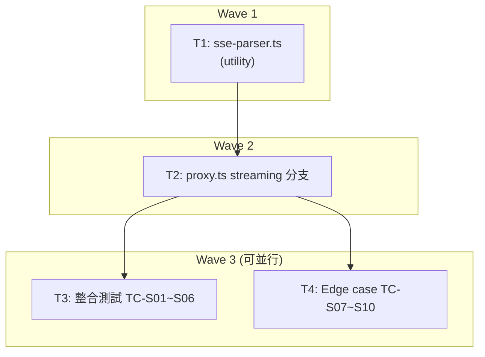

# S3 Implementation Plan: SSE Streaming Proxy

> **階段**: S3 實作
> **建立時間**: 2026-03-16 00:45
> **Agents**: backend-expert

---

## 1. 概述

### 1.1 功能目標

為 openclaw-token-server 的 `POST /v1/chat/completions` 加入 SSE streaming proxy 支援。移除現有 `stream:true` 的 400 拒絕邏輯，改為逐 chunk 轉發上游 LLM 的 SSE response，並在 stream 結束後從 usage chunk 擷取 token 用量、呼叫現有 `calculateCost` + `recordUsage` 完成計費。

### 1.2 實作範圍

- **範圍內**：
  - `proxy.ts` 移除 L29-31 拒絕邏輯，加入 streaming 分支
  - 新增 `src/utils/sse-parser.ts`（TransformStream + line buffer + usage 擷取）
  - 注入 `stream_options.include_usage:true`
  - client disconnect abort 處理
  - 上游錯誤/斷線處理
  - 整合測試 TC-S01~TC-S10，更新 TC-08
- **範圍外**：
  - CLI repo 任何修改
  - `pricing.ts`、`usage.ts`、`proxy-auth.ts` 邏輯修改
  - streaming 動態 credits 限流
  - credits 負餘額補扣機制

### 1.3 關聯文件

| 文件 | 路徑 | 狀態 |
|------|------|------|
| Brief Spec | `./s0_brief_spec.md` | ✅ |
| Dev Spec | `./s1_dev_spec.md` | ✅ |
| Implementation Plan | `./s3_implementation_plan.md` | 📝 當前 |

---

## 2. 實作任務清單

### 2.1 任務總覽

| # | 任務 | 類型 | Agent | 依賴 | 複雜度 | source_ref | TDD | 狀態 |
|---|------|------|-------|------|--------|------------|-----|------|
| T1 | SSE line buffer + usage parser utility | 後端 | `backend-expert` | - | M | - | ✅ | ⬜ |
| T2 | proxy.ts streaming 分支 | 後端 | `backend-expert` | T1 | M | - | ✅ | ⬜ |
| T3 | 更新 TC-08 + 新增 streaming 整合測試 (TC-S01~S06) | 後端 | `backend-expert` | T2 | M | - | ✅ | ⬜ |
| T4 | Edge case 測試 (TC-S07~S10) | 後端 | `backend-expert` | T2 | S | - | ✅ | ⬜ |

**狀態圖例**：
- ⬜ pending（待處理）
- 🔄 in_progress（進行中）
- ✅ completed（已完成）
- ❌ blocked（被阻擋）
- ⏭️ skipped（跳過）

**複雜度**：
- S（小，<30min）
- M（中，30min-2hr）

---

## 3. 任務詳情

### Task T1: SSE line buffer + usage parser utility

**基本資訊**
| 項目 | 內容 |
|------|------|
| 類型 | 後端 utility |
| Agent | `backend-expert` |
| 複雜度 | M |
| 依賴 | - |
| 狀態 | ⬜ pending |

**描述**

新增 `src/utils/sse-parser.ts`，提供 `createSSEUsageExtractor()` 函數。回傳物件包含：
- `transformStream`: `TransformStream<Uint8Array, Uint8Array>`，`transform()` 將 chunk 原樣 `enqueue` 轉發，同時以 `TextDecoder` + line buffer 解析 SSE 事件，捕獲含 `usage` 欄位的 JSON
- `getUsage()`: 回傳已捕獲的 `{ prompt_tokens, completion_tokens, total_tokens } | null`

Line buffer 邏輯：
1. 維護 `buffer: string`，每次 `transform(chunk)` 將 `TextDecoder.decode(chunk, { stream: true })` append 到 buffer
2. 以 `\n` 切分 buffer，最後不完整段保留
3. 對每行 `data: ...` 行（非 `data: [DONE]`），嘗試 `JSON.parse`
4. 解析成功且有 `.usage` 欄位，儲存 usage
5. `JSON.parse` 失敗則 `console.warn` 並跳過

**受影響檔案**
| 檔案 | 變更類型 | 說明 |
|------|---------|------|
| `src/utils/sse-parser.ts` | 新增 | SSE usage extractor utility |

**DoD**
- [ ] `src/utils/sse-parser.ts` 建立，export `createSSEUsageExtractor()`
- [ ] line buffer 正確處理跨 chunk 的不完整行
- [ ] 正確擷取 usage chunk 中的 `prompt_tokens`, `completion_tokens`, `total_tokens`
- [ ] 非 `data:` 行與 `data: [DONE]` 正確跳過
- [ ] JSON.parse 失敗不拋錯，`console.warn` 記錄
- [ ] chunk 原樣 enqueue（不修改 bytes）
- [ ] 單元測試全數通過

**TDD Plan**
| 項目 | 內容 |
|------|------|
| 測試檔案 | `tests/unit/sse-parser.test.ts` |
| 測試指令 | `cd /Users/asd/demo/openclaw-token-server && bun test tests/unit/sse-parser.test.ts` |
| 預期測試案例 | `正常 SSE 序列擷取 usage`, `跨 chunk 的不完整行 (line buffer)`, `多個 SSE 事件在同一 chunk`, `無 usage chunk 回傳 null`, `malformed JSON warn 並跳過`, `data: [DONE] 不觸發 JSON.parse`, `非 data: 行被忽略`, `chunk 原樣轉發不修改 bytes` |

**驗證方式**
```bash
cd /Users/asd/demo/openclaw-token-server && bun test tests/unit/sse-parser.test.ts
```

**實作備註**
- 使用 Bun 原生 `TextDecoder`（Web API），不使用 Node.js `Buffer`
- `TransformStream` 的 `flush()` 不需額外邏輯（計費在 T2 的 proxy.ts 中透過 `onComplete` callback 觸發）
- `createSSEUsageExtractor` 接受一個可選的 `onComplete?: (usage: UsageData | null) => Promise<void>` callback，在 `flush()` 中 await 呼叫

---

### Task T2: proxy.ts streaming 分支

**基本資訊**
| 項目 | 內容 |
|------|------|
| 類型 | 後端 |
| Agent | `backend-expert` |
| 複雜度 | M |
| 依賴 | T1 |
| 狀態 | ⬜ pending |

**描述**

修改 `src/routes/proxy.ts`：

1. **移除** L29-31 的 `if (body.stream) return c.json({ error: 'UNSUPPORTED' }, 400)` 拒絕邏輯

2. 在 body 解析後偵測 `body.stream === true`，進入 streaming 分支：
   - 複製現有 credit check + auto-topup 邏輯（L40-85）
   - 注入 `body.stream_options = { include_usage: true }`
   - `fetch(upstreamUrl, { ..., signal: c.req.raw.signal })`
   - 若 `!resp.ok`：走錯誤路徑（回傳上游 status + body，記錄 cost=0 usage log）
   - 若 `resp.ok`：建立 `createSSEUsageExtractor(onComplete)` 並 pipe
   - `onComplete` callback 中執行 `calculateCost` + `recordUsage`（失敗時 `console.error`）
   - 回傳 `new Response(transformedStream, { status: 200, headers: { 'Content-Type': 'text/event-stream', 'Cache-Control': 'no-cache', 'Connection': 'keep-alive' } })`

3. **client 斷線**：`c.req.raw.signal` 傳給 upstream fetch，abort 時 TransformStream 自動終止，`flush()` 不呼叫（不計費）

**受影響檔案**
| 檔案 | 變更類型 | 說明 |
|------|---------|------|
| `src/routes/proxy.ts` | 修改 | 移除拒絕邏輯，加入 streaming 分支 |
| `src/utils/sse-parser.ts` | 依賴（T1 產出） | import `createSSEUsageExtractor` |

**DoD**
- [ ] L29-31 blocking guard 已移除
- [ ] `stream:true` 請求回傳 `Content-Type: text/event-stream` SSE 回應
- [ ] `stream_options.include_usage:true` 正確注入上游請求
- [ ] upstream 非 2xx 回傳原有錯誤格式，記錄 cost=0 usage log
- [ ] stream 結束後 `recordUsage` 正確呼叫
- [ ] client 斷線時 abort upstream fetch，不呼叫 `recordUsage`
- [ ] `recordUsage` 失敗時 `console.error`，不 crash
- [ ] 現有 non-streaming 路徑行為完全不受影響

**TDD Plan**: N/A — T2 本身無獨立測試；正確性由 T3（整合測試）覆蓋。回歸驗證透過現有 `proxy.test.ts` TC-01~TC-16（TC-08 待 T3 更新）確認。

驗證指令（在 T3 完成前可用於基本冒煙）：
```bash
cd /Users/asd/demo/openclaw-token-server && bun test tests/integration/proxy.test.ts
```

**實作備註**
- streaming 分支與 non-streaming 分支共用 `model` 解析與 credit check，可考慮提取共用邏輯，但 dev_spec 允許直接複製 placeholder（tech debt 已記錄）
- upstream Content-Type 若不含 `text/event-stream` 但 resp.ok，視同錯誤走 non-streaming 錯誤路徑

---

### Task T3: 更新 TC-08 + 新增 streaming 整合測試 (TC-S01~S06)

**基本資訊**
| 項目 | 內容 |
|------|------|
| 類型 | 後端 測試 |
| Agent | `backend-expert` |
| 複雜度 | M |
| 依賴 | T2 |
| 狀態 | ⬜ pending |

**描述**

1. **更新 `tests/integration/proxy.test.ts` TC-08**：原 TC-08 驗證 `stream:true -> 400`，改為驗證 streaming 回應（Content-Type: text/event-stream）或直接移除，由新測試覆蓋。

2. **新增 `tests/integration/proxy-streaming.test.ts`**：
   - 建立 mock upstream SSE server（`Bun.serve`），可回傳 SSE chunks + usage chunk + `data: [DONE]`
   - 支援控制旗標切換 mock 行為（類似現有 `mockUpstreamBehavior`）

   測試案例：
   - **TC-S01**：正常 streaming 轉發，驗證 response Content-Type 為 `text/event-stream`，逐 chunk 格式正確
   - **TC-S02**：streaming 結束後 `usage_logs` 有記錄，`cost > 0`
   - **TC-S03**：streaming 結束後 `credit_balances.total_usage` 正確增加
   - **TC-S04**：`stream:false` 請求走 non-streaming 路徑（回歸確認）
   - **TC-S05**：upstream 回傳非 2xx 時回傳錯誤，不進入 streaming
   - **TC-S06**：無 usage chunk 時 cost=0 記錄，無 crash

**受影響檔案**
| 檔案 | 變更類型 | 說明 |
|------|---------|------|
| `tests/integration/proxy.test.ts` | 修改 | 更新 TC-08 |
| `tests/integration/proxy-streaming.test.ts` | 新增 | TC-S01~S06 |

**DoD**
- [ ] TC-08 更新或移除，不再驗證 `stream:true -> 400`
- [ ] `proxy-streaming.test.ts` 建立，包含 TC-S01~TC-S06
- [ ] mock upstream 正確模擬 SSE 回應（`text/event-stream` + 多個 `data:` chunk + usage chunk + `data: [DONE]`）
- [ ] 所有現有 proxy.test.ts TC-01~TC-16 通過（回歸驗證）
- [ ] TC-S01~TC-S06 全數通過

**TDD Plan**
| 項目 | 內容 |
|------|------|
| 測試檔案 | `tests/integration/proxy-streaming.test.ts` |
| 測試指令 | `cd /Users/asd/demo/openclaw-token-server && bun test tests/integration/proxy-streaming.test.ts` |
| 預期測試案例 | `TC-S01: streaming response Content-Type is text/event-stream`, `TC-S02: usage_logs recorded with cost > 0 after stream ends`, `TC-S03: credit_balances.total_usage increases after stream`, `TC-S04: stream:false uses non-streaming path`, `TC-S05: upstream 4xx returns error without streaming`, `TC-S06: no usage chunk records cost=0` |

**驗證方式**
```bash
# 新測試
cd /Users/asd/demo/openclaw-token-server && bun test tests/integration/proxy-streaming.test.ts

# 回歸
cd /Users/asd/demo/openclaw-token-server && bun test tests/integration/proxy.test.ts
```

**實作備註**
- Mock SSE server 回傳格式：每行 `data: {...}\n\n`，最後 `data: [DONE]\n\n`
- 讀取 streaming response body：使用 `response.body.getReader()` 逐 chunk 收集，再 decode 驗證格式
- 參考現有 `proxy.test.ts` 的 `Bun.serve` mock 模式（L43 起）
- TC-S02/S03 需等待 stream 完全消費後查 DB（`flush()` 內 async recordUsage）

---

### Task T4: Edge case 測試 (TC-S07~S10)

**基本資訊**
| 項目 | 內容 |
|------|------|
| 類型 | 後端 測試 |
| Agent | `backend-expert` |
| 複雜度 | S |
| 依賴 | T2 |
| 狀態 | ⬜ pending |

**描述**

在 `tests/integration/proxy-streaming.test.ts` 中追加 edge case 測試：

- **TC-S07**：client 中途斷線（abort request），驗證 server 無 unhandled rejection，`usage_logs` 無新增記錄
- **TC-S08**：upstream 中途斷線（mock server 在 stream 途中關閉連線），驗證 server 無 crash，client stream 異常終止
- **TC-S09**：upstream 回傳 malformed SSE（無 `data:` prefix 行夾雜其中），驗證轉發不截斷，client 收到完整 chunk
- **TC-S10**：超長 chunk（多個 SSE 事件合併在一個 TCP chunk），驗證 line buffer 正確解析，usage 正確擷取

**受影響檔案**
| 檔案 | 變更類型 | 說明 |
|------|---------|------|
| `tests/integration/proxy-streaming.test.ts` | 修改（追加） | TC-S07~S10 |

**DoD**
- [ ] TC-S07~TC-S10 建立並通過
- [ ] TC-S07：`usage_logs` 無新增記錄（斷線不計費）
- [ ] TC-S08：server process 無 unhandled rejection，連線乾淨關閉
- [ ] TC-S09：malformed 行不截斷 stream，後續 chunk 繼續轉發
- [ ] TC-S10：合併 chunk 正確解析，usage 擷取準確

**TDD Plan**
| 項目 | 內容 |
|------|------|
| 測試檔案 | `tests/integration/proxy-streaming.test.ts` |
| 測試指令 | `cd /Users/asd/demo/openclaw-token-server && bun test tests/integration/proxy-streaming.test.ts` |
| 預期測試案例 | `TC-S07: client disconnect aborts upstream and skips recordUsage`, `TC-S08: upstream mid-stream disconnect closes client stream cleanly`, `TC-S09: malformed SSE line does not truncate stream`, `TC-S10: multiple events in single chunk parsed correctly by line buffer` |

**驗證方式**
```bash
cd /Users/asd/demo/openclaw-token-server && bun test tests/integration/proxy-streaming.test.ts
```

**實作備註**
- TC-S07：使用 `AbortController` 在 `response.body.getReader()` 讀取中途 abort
- TC-S08：mock server 在發送若干 chunk 後直接關閉 socket（Bun.serve 中 `server.stop()`）
- TC-S07 的「無 unhandled rejection」可透過監聽 `process.on('unhandledRejection')` 驗證
- T3 與 T4 均寫入同一檔案 `proxy-streaming.test.ts`，T4 追加在 T3 之後，可在 T3 完成後並行開始

---

## 4. 依賴關係圖



---

## 5. 執行順序與 Agent 分配

### 5.1 執行波次

| 波次 | 任務 | Agent | 可並行 | 備註 |
|------|------|-------|--------|------|
| Wave 1 | T1 | `backend-expert` | 否 | utility 無依賴，先行實作 |
| Wave 2 | T2 | `backend-expert` | 否 | 依賴 T1，核心實作 |
| Wave 3 | T3 | `backend-expert` | 是 | 依賴 T2，與 T4 並行 |
| Wave 3 | T4 | `backend-expert` | 是 | 依賴 T2，與 T3 並行 |

### 5.2 Agent 調度指令

```
# Task T1 - SSE Parser Utility
Task(
  subagent_type: "backend-expert",
  prompt: "實作 Task T1: SSE line buffer + usage parser utility\n\n目標檔案：/Users/asd/demo/openclaw-token-server/src/utils/sse-parser.ts\n\nDoD:\n- export createSSEUsageExtractor(onComplete?: (usage) => Promise<void>)\n- 回傳 { transformStream: TransformStream<Uint8Array, Uint8Array>, getUsage() }\n- line buffer 以 \\n 切分，不完整行保留\n- 捕獲含 usage 欄位的 SSE data: 行\n- JSON.parse 失敗 console.warn 並跳過\n- chunk 原樣 enqueue 不修改\n- flush() 中 await onComplete(capturedUsage)\n\nTDD: 先寫 tests/unit/sse-parser.test.ts，再實作",
  description: "S3-T1 SSE Parser Utility"
)

# Task T2 - proxy.ts streaming 分支
Task(
  subagent_type: "backend-expert",
  prompt: "實作 Task T2: proxy.ts streaming 分支\n\n目標檔案：/Users/asd/demo/openclaw-token-server/src/routes/proxy.ts\n\nDoD:\n- 移除 L29-31 的 stream:true 400 拒絕邏輯\n- 在 body 解析後偵測 body.stream === true，進入 streaming 分支\n- streaming 分支複製現有 credit check + auto-topup 邏輯\n- 注入 body.stream_options = { include_usage: true }\n- fetch upstream 帶 signal: c.req.raw.signal\n- upstream 非 2xx：回傳錯誤，記錄 cost=0 usage log\n- upstream 2xx：createSSEUsageExtractor(onComplete) pipe，回傳 new Response(transformedStream, { 'Content-Type': 'text/event-stream', 'Cache-Control': 'no-cache', 'Connection': 'keep-alive' })\n- onComplete 中 calculateCost + recordUsage，失敗 console.error\n- non-streaming 路徑完全不受影響",
  description: "S3-T2 proxy.ts streaming 分支"
)

# Task T3 - 整合測試 TC-S01~S06
Task(
  subagent_type: "backend-expert",
  prompt: "實作 Task T3: 更新 TC-08 + 新增 streaming 整合測試 TC-S01~S06\n\n目標：\n1. 更新 /Users/asd/demo/openclaw-token-server/tests/integration/proxy.test.ts TC-08（不再驗證 stream:true -> 400）\n2. 新增 /Users/asd/demo/openclaw-token-server/tests/integration/proxy-streaming.test.ts\n\n測試案例：\n- TC-S01: streaming response Content-Type is text/event-stream\n- TC-S02: usage_logs recorded with cost > 0 after stream ends\n- TC-S03: credit_balances.total_usage increases after stream\n- TC-S04: stream:false uses non-streaming path\n- TC-S05: upstream 4xx returns error without streaming\n- TC-S06: no usage chunk records cost=0\n\nmock upstream 用 Bun.serve 回傳 text/event-stream SSE（參考現有 proxy.test.ts L43 的 Bun.serve 模式）",
  description: "S3-T3 streaming 整合測試"
)

# Task T4 - Edge case 測試 TC-S07~S10
Task(
  subagent_type: "backend-expert",
  prompt: "實作 Task T4: Edge case 測試 TC-S07~S10\n\n目標：在 /Users/asd/demo/openclaw-token-server/tests/integration/proxy-streaming.test.ts 追加\n\n測試案例：\n- TC-S07: client disconnect aborts upstream and skips recordUsage（usage_logs 無新增）\n- TC-S08: upstream mid-stream disconnect closes client stream cleanly（server 無 crash）\n- TC-S09: malformed SSE line does not truncate stream\n- TC-S10: multiple events in single chunk parsed correctly by line buffer\n\nTC-S07 用 AbortController abort；TC-S08 mock server 途中 stop()",
  description: "S3-T4 edge case 測試"
)
```

---

## 6. 驗證計畫

### 6.1 逐任務驗證

| 任務 | 驗證指令 | 預期結果 |
|------|---------|---------|
| T1 | `cd /Users/asd/demo/openclaw-token-server && bun test tests/unit/sse-parser.test.ts` | 8 tests passed |
| T2 | `cd /Users/asd/demo/openclaw-token-server && bun test tests/integration/proxy.test.ts` | TC-01~TC-16 通過（TC-08 更新後） |
| T3 | `cd /Users/asd/demo/openclaw-token-server && bun test tests/integration/proxy-streaming.test.ts` | TC-S01~TC-S06 passed |
| T4 | `cd /Users/asd/demo/openclaw-token-server && bun test tests/integration/proxy-streaming.test.ts` | TC-S07~TC-S10 passed |

### 6.2 整體驗證

```bash
# 全部測試
cd /Users/asd/demo/openclaw-token-server && bun test

# 分檔確認
cd /Users/asd/demo/openclaw-token-server && bun test tests/unit/sse-parser.test.ts
cd /Users/asd/demo/openclaw-token-server && bun test tests/integration/proxy.test.ts
cd /Users/asd/demo/openclaw-token-server && bun test tests/integration/proxy-streaming.test.ts
```

---

## 7. 實作進度追蹤

### 7.1 進度總覽

| 指標 | 數值 |
|------|------|
| 總任務數 | 4 |
| 已完成 | 0 |
| 進行中 | 0 |
| 待處理 | 4 |
| 完成率 | 0% |

### 7.2 時間軸

| 時間 | 事件 | 備註 |
|------|------|------|
| 2026-03-16 | 實作計畫確認 | S3 pending_confirmation |
| | Wave 1: T1 | sse-parser.ts |
| | Wave 2: T2 | proxy.ts |
| | Wave 3: T3 + T4 | 並行測試 |

---

## 8. 變更記錄

### 8.1 檔案變更清單

```
新增：
  /Users/asd/demo/openclaw-token-server/src/utils/sse-parser.ts
  /Users/asd/demo/openclaw-token-server/tests/unit/sse-parser.test.ts
  /Users/asd/demo/openclaw-token-server/tests/integration/proxy-streaming.test.ts

修改：
  /Users/asd/demo/openclaw-token-server/src/routes/proxy.ts
  /Users/asd/demo/openclaw-token-server/tests/integration/proxy.test.ts
```

---

## 9. 風險與問題追蹤

### 9.1 已識別風險

| # | 風險 | 影響 | 緩解措施 | 狀態 |
|---|------|------|---------|------|
| R1 | 跨 chunk 不完整 SSE line 導致 usage 擷取失敗 | 高 | line buffer 以 `\n` 切分，不完整行保留在 buffer；T1 單元測試充分覆蓋 | 監控中 |
| R2 | client 斷線導致 recordUsage 未執行 | 高 | `c.req.raw.signal` abort upstream fetch；漏扣是已知可接受風險 | 接受 |
| R3 | TransformStream flush() 內 async recordUsage 行為 | 中 | Web Streams spec 支援 async flush；Bun 預期支援 | 監控中 |
| R4 | mock upstream SSE server timing 不穩定 | 低 | 使用 deterministic SSE（固定 chunk 數量），避免依賴 timing | 監控中 |

---

## SDD Context

```json
{
  "sdd_context": {
    "stages": {
      "s3": {
        "status": "pending_confirmation",
        "agent": "architect",
        "completed_at": "2026-03-16T00:45:00.000Z",
        "output": {
          "implementation_plan_path": "dev/specs/2026-03-15_9_streaming-proxy/s3_implementation_plan.md",
          "waves": [
            {
              "wave": 1,
              "name": "utility 層",
              "tasks": [
                {
                  "id": "T1",
                  "name": "SSE line buffer + usage parser utility",
                  "agent": "backend-expert",
                  "dependencies": [],
                  "complexity": "M",
                  "dod": [
                    "export createSSEUsageExtractor()",
                    "line buffer 正確處理跨 chunk 不完整行",
                    "正確擷取 usage chunk",
                    "JSON.parse 失敗 console.warn 並跳過",
                    "chunk 原樣 enqueue",
                    "單元測試全數通過"
                  ],
                  "parallel": false,
                  "affected_files": [
                    "src/utils/sse-parser.ts",
                    "tests/unit/sse-parser.test.ts"
                  ],
                  "tdd_plan": {
                    "test_file": "tests/unit/sse-parser.test.ts",
                    "test_cases": [
                      "正常 SSE 序列擷取 usage",
                      "跨 chunk 的不完整行 (line buffer)",
                      "多個 SSE 事件在同一 chunk",
                      "無 usage chunk 回傳 null",
                      "malformed JSON warn 並跳過",
                      "data: [DONE] 不觸發 JSON.parse",
                      "非 data: 行被忽略",
                      "chunk 原樣轉發不修改 bytes"
                    ],
                    "test_command": "cd /Users/asd/demo/openclaw-token-server && bun test tests/unit/sse-parser.test.ts"
                  }
                }
              ],
              "parallel": false
            },
            {
              "wave": 2,
              "name": "核心實作",
              "tasks": [
                {
                  "id": "T2",
                  "name": "proxy.ts streaming 分支",
                  "agent": "backend-expert",
                  "dependencies": ["T1"],
                  "complexity": "M",
                  "dod": [
                    "移除 L29-31 blocking guard",
                    "stream:true 回傳 Content-Type: text/event-stream",
                    "stream_options.include_usage:true 注入",
                    "upstream 非 2xx 回傳錯誤不進入 streaming",
                    "stream 結束後 recordUsage 正確呼叫",
                    "client 斷線 abort upstream，不呼叫 recordUsage",
                    "recordUsage 失敗 console.error 不 crash",
                    "non-streaming 路徑完全不受影響"
                  ],
                  "parallel": false,
                  "affected_files": [
                    "src/routes/proxy.ts"
                  ],
                  "tdd_plan": null
                }
              ],
              "parallel": false
            },
            {
              "wave": 3,
              "name": "測試覆蓋",
              "tasks": [
                {
                  "id": "T3",
                  "name": "更新 TC-08 + 新增 streaming 整合測試 TC-S01~S06",
                  "agent": "backend-expert",
                  "dependencies": ["T2"],
                  "complexity": "M",
                  "dod": [
                    "TC-08 更新不再驗證 stream:true -> 400",
                    "proxy-streaming.test.ts 建立含 TC-S01~TC-S06",
                    "mock upstream 正確模擬 SSE 回應",
                    "TC-01~TC-16 全數通過（回歸）",
                    "TC-S01~TC-S06 全數通過"
                  ],
                  "parallel": true,
                  "affected_files": [
                    "tests/integration/proxy.test.ts",
                    "tests/integration/proxy-streaming.test.ts"
                  ],
                  "tdd_plan": {
                    "test_file": "tests/integration/proxy-streaming.test.ts",
                    "test_cases": [
                      "TC-S01: streaming response Content-Type is text/event-stream",
                      "TC-S02: usage_logs recorded with cost > 0 after stream ends",
                      "TC-S03: credit_balances.total_usage increases after stream",
                      "TC-S04: stream:false uses non-streaming path",
                      "TC-S05: upstream 4xx returns error without streaming",
                      "TC-S06: no usage chunk records cost=0"
                    ],
                    "test_command": "cd /Users/asd/demo/openclaw-token-server && bun test tests/integration/proxy-streaming.test.ts"
                  }
                },
                {
                  "id": "T4",
                  "name": "Edge case 測試 TC-S07~S10",
                  "agent": "backend-expert",
                  "dependencies": ["T2"],
                  "complexity": "S",
                  "dod": [
                    "TC-S07~TC-S10 建立並通過",
                    "TC-S07: usage_logs 無新增記錄（斷線不計費）",
                    "TC-S08: server 無 crash 連線乾淨關閉",
                    "TC-S09: malformed 行不截斷 stream",
                    "TC-S10: 合併 chunk 正確解析 usage"
                  ],
                  "parallel": true,
                  "affected_files": [
                    "tests/integration/proxy-streaming.test.ts"
                  ],
                  "tdd_plan": {
                    "test_file": "tests/integration/proxy-streaming.test.ts",
                    "test_cases": [
                      "TC-S07: client disconnect aborts upstream and skips recordUsage",
                      "TC-S08: upstream mid-stream disconnect closes client stream cleanly",
                      "TC-S09: malformed SSE line does not truncate stream",
                      "TC-S10: multiple events in single chunk parsed correctly by line buffer"
                    ],
                    "test_command": "cd /Users/asd/demo/openclaw-token-server && bun test tests/integration/proxy-streaming.test.ts"
                  }
                }
              ],
              "parallel": true
            }
          ],
          "total_tasks": 4,
          "estimated_waves": 3,
          "verification": {
            "unit_tests": [
              "cd /Users/asd/demo/openclaw-token-server && bun test tests/unit/sse-parser.test.ts"
            ],
            "integration_tests": [
              "cd /Users/asd/demo/openclaw-token-server && bun test tests/integration/proxy.test.ts",
              "cd /Users/asd/demo/openclaw-token-server && bun test tests/integration/proxy-streaming.test.ts"
            ],
            "all": [
              "cd /Users/asd/demo/openclaw-token-server && bun test"
            ]
          }
        }
      }
    }
  }
}
```
