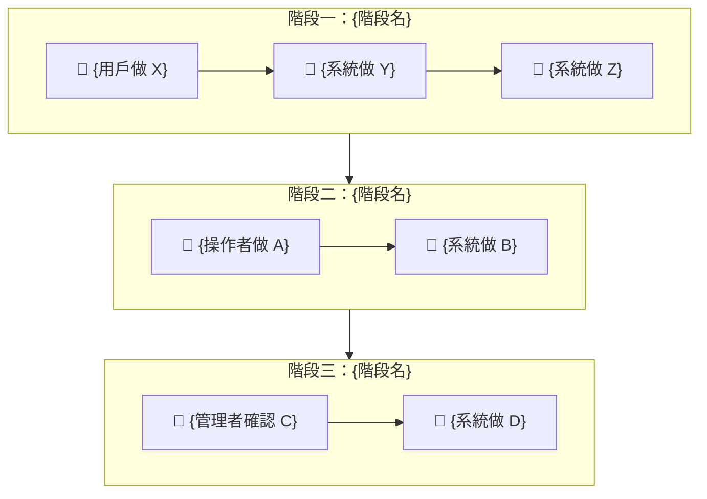

# 需求輸入：{功能名稱}

> **文件角色**：需求詳細文件（Detailed Requirement Document）。
> 可在 SOP 外獨立填寫，作為 S0 的輸入源。S0 消費本文件後產出精簡版 `s0_brief_spec.md`。
> 本文件在整個 SOP 生命週期中作為「需求百科」被 S1~S7 各階段引用。
>
> 填寫說明：帶 `*` 為必填，其餘選填。填得越完整 S0 討論越快收斂。
> 不確定的欄位寫「待討論」即可，S0 會主動釐清。

---

## 0. 工作類型 *

> 勾選最符合的一項。不確定就選「待討論」，S0 會協助判斷。

- [ ] 新需求（全新功能或流程）
- [ ] 重構（改善現有程式碼品質/架構，不改變外部行為）
- [ ] Bug 修復（修正錯誤行為）
- [ ] 調查（問題方向不明，需先探索再決定行動）
- [ ] 補完（已有部分實作，需補齊缺漏功能/修正問題）
- [ ] 待討論

## 1. 一句話描述 *

{用一句話說明你要做什麼}

## 2. 為什麼要做 *

{這個功能解決什麼問題？目前的痛點是什麼？}

## 3. 使用者是誰 *

> 列出所有相關角色，標明是操作者、被通知者、還是管理者。

| 角色 | 參與方式 | 說明 |
|------|---------|------|
| {角色A} | 操作者 | {在這個功能中做什麼} |
| {角色B} | 被通知者 | {收到什麼通知、何時收到} |
| {角色C} | 管理者 | {監控/對帳/確認什麼} |

## 4. 核心流程 *

> 用 Mermaid flowchart 描述 happy path。用 subgraph 分階段，節點標注自動/人工。
> 不用寫得很完整，抓重點就好。異常流程用表格補充。

### 4.1 Happy Path

> 節點標注規則：🤖 = 系統自動、👤 = 人工操作、🔄 = 半自動（需人工確認）、🌐 = 外部服務

### 4.2 異常/邊界情境

| 情境 | 預期行為 | 現況 |
|------|---------|------|
| {異常情境1} | {處理方式} | {✅ 已實作 / ❌ 缺少 / ⚠️ 部分} |
| {異常情境2} | {處理方式} | {狀態} |

## 5. 成功長什麼樣 *

> 怎樣算做完了？列出你心中的驗收標準。

- [ ] {標準 1}
- [ ] {標準 2}
- [ ] {標準 3}

## 6. 不做什麼（選填）

> 明確排除的範圍，避免 scope creep。

- {不做 A}
- {不做 B}

---

## 7. 業務邏輯（選填，涉及金流/多角色/外部服務時建議填寫）

> 描述商業模式和金流走向。如果功能涉及付款、對帳、多方結算，這段非常重要。

### 7.1 金流模型

> 誰付錢給誰？什麼時間點？用 Mermaid flowchart LR 描述。

### 7.2 各角色操作職責

> 每個角色在整個流程中的具體操作，越詳細越好。

| 角色 | 操作 | 使用介面 | 觸發時機 |
|------|------|---------|---------|
| {角色A} | {做什麼} | {前台/後台/Email} | {什麼時候做} |

### 7.3 業務規則

> 例如：計價邏輯、分潤規則、稅務處理等。

| 規則 | 值 | 說明 |
|------|-----|------|
| {規則名} | {值} | {影響什麼} |

## 8. 通知與溝通矩陣（選填，涉及多角色通知時建議填寫）

> 哪個事件觸發通知？通知誰？用什麼方式？

| 事件/狀態 | 消費者 | 操作者 | 管理員 |
|----------|--------|--------|--------|
| {事件1} | {Email/推播/無} | {Email/後台/無} | {後台/無} |
| {事件2} | ... | ... | ... |

## 9. 外部服務與依賴（選填）

> 列出第三方 API、服務限制、環境差異等。

| 服務 | 用途 | 已知限制 | 環境狀態 |
|------|------|---------|---------|
| {服務名} | {做什麼} | {限制} | {sandbox/production/待開通} |

## 10. 已有實作 Baseline（選填，補完/重構類必填）

> 如果不是從零開始，描述已有的基礎和已知問題。

### 10.1 已完成

- {已做好的功能 1}
- {已做好的功能 2}

### 10.2 已知問題

| ID | 嚴重度 | 問題 |
|----|--------|------|
| {BUG-1} | {blocker/high/medium/low} | {描述} |

### 10.3 參考文件

> Baseline spec、架構文件、之前的分析報告等。

- {檔案路徑 1}
- {檔案路徑 2}

## 11. 已知限制或依賴（選填）

> 任何技術限制、業務規則、已有的相關功能。

- {限制/依賴 1}
- {限制/依賴 2}

## 12. 優先級（選填）

- [ ] 緊急（阻斷其他工作）
- [ ] 高（本週要完成）
- [ ] 中（排入計畫）
- [ ] 低（有空再做）

## 13. 補充說明（選填）

{任何上面沒涵蓋到但你覺得重要的事}
