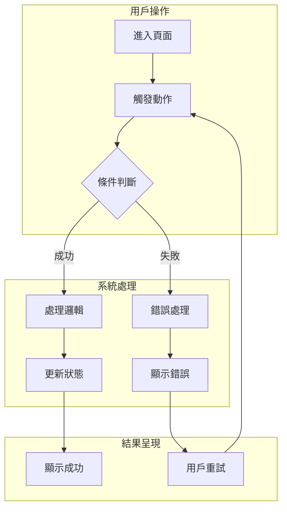
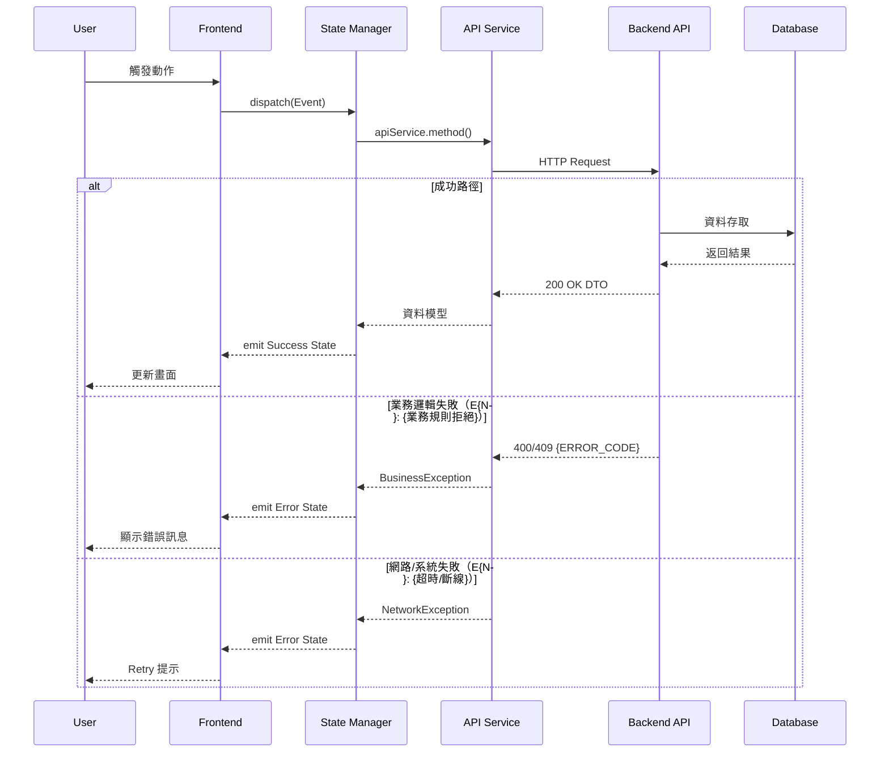

# S1 Dev Spec: {功能名稱}

> **階段**: S1 技術分析
> **建立時間**: {YYYY-MM-DD HH:mm}
> **Agent**: codebase-explorer (Phase 1) + architect (Phase 2)
> **工作類型**: {work_type}
> **複雜度**: S/M/L

---

## 1. 概述

### 1.1 需求參照
> 完整需求見 `s0_brief_spec.md`，以下僅摘要。

{一句話描述核心需求}

### 1.2 技術方案摘要
{一段話描述整體技術方案}

---

## 2. 影響範圍（Phase 1：codebase-explorer）

### 2.1 受影響檔案

#### Frontend (Flutter)
| 檔案 | 變更類型 | 說明 |
|------|---------|------|
| `app/lib/...` | 新增/修改 | {說明} |

#### Backend (.NET)
| 檔案 | 變更類型 | 說明 |
|------|---------|------|
| `server/src/...` | 新增/修改 | {說明} |

#### Database
| 資料表 | 變更類型 | 說明 |
|--------|---------|------|
| `TableName` | 新增/修改 | {說明} |

### 2.2 依賴關係
- **上游依賴**: {此功能依賴的現有模組}
- **下游影響**: {會受此功能影響的模組}

### 2.3 現有模式與技術考量
{描述現有 codebase 中的相關模式，確保新功能遵循}

---

<!-- ======== 條件區段：根據 work_type 只保留對應的，刪除其餘 ======== -->

## 2.5 [refactor 專用] 現狀分析

> architect 根據 work_type 決定是否保留此區段。僅 refactor 類型使用。

### 現狀問題

| # | 問題 | 嚴重度 | 影響範圍 | 說明 |
|---|------|--------|---------|------|
| 1 | {問題描述} | 高/中/低 | {影響的模組} | {詳細說明} |

### 目標狀態（Before → After）

| 面向 | Before | After |
|------|--------|-------|
| {架構/耦合/可讀性} | {現狀} | {目標} |

### 遷移路徑

1. {步驟 1}
2. {步驟 2}
3. {步驟 3}

### 回歸風險矩陣

| 外部行為 | 驗證方式 | 風險等級 |
|---------|---------|---------|
| {行為 1 不應改變} | {測試/手動驗證} | 高/中/低 |

---

## 2.6 [bugfix 專用] Root Cause 分析

> architect 根據 work_type 決定是否保留此區段。僅 bugfix 類型使用。

### 預期行為 vs 實際行為

| 面向 | 預期 | 實際 |
|------|------|------|
| {面向} | {預期行為} | {實際行為} |

### Root Cause

{root cause 描述，含程式碼位置和邏輯錯誤}

### 修復方案

| 方案 | 描述 | 優點 | 缺點 | 推薦 |
|------|------|------|------|------|
| A | {方案描述} | {優點} | {缺點} | ✅/❌ |
| B | {方案描述} | {優點} | {缺點} | ✅/❌ |

### 防禦措施

- {防禦措施 1：避免同類 bug 再發生}
- {防禦措施 2}

---

## 2.7 [investigation 專用] 調查報告

> architect 根據 work_type 決定是否保留此區段。僅 investigation 類型使用（若已轉型則按新類型產出）。

### 假設驗證表

| # | 假設 | 驗證方法 | 結果 | 備註 |
|---|------|---------|------|------|
| 1 | {假設描述} | {驗證方法} | ✅ 確認 / ❌ 排除 / ⏳ 待定 | {備註} |

### 發現摘要

{調查過程中的關鍵發現}

### 結論與行動建議

- **結論**：{調查結論}
- **建議行動**：{下一步行動}
- **轉型建議**：{是否建議轉型為 bugfix/refactor/new_feature，及原因}

---

<!-- ======== 條件區段結束 ======== -->

## 3. User Flow（Phase 2：architect）



### 3.1 主要流程
| 步驟 | 用戶動作 | 系統回應 | 備註 |
|------|---------|---------|------|
| 1 | {動作} | {回應} | {備註} |
| 2 | {動作} | {回應} | {備註} |

### 3.2 異常流程

> 每個例外情境引用 S0 的 E{N} 編號，確保追溯。

| S0 ID | 情境 | 觸發條件 | 系統處理 | 用戶看到 |
|-------|------|---------|---------|---------|
| E{N} | {情境1} | {條件} | {處理} | {結果} |

### 3.3 S0→S1 例外追溯表

> 確認 S0 每個例外情境在 S1 都有對應處理。參考 `.claude/references/exception-discovery-framework.md`。

| S0 ID | 維度 | S0 描述 | S1 處理位置 | 覆蓋狀態 |
|-------|------|---------|-----------|---------|
| E{N} | {維度} | {S0 的情境描述} | {處理模組/層級} | ✅ 覆蓋 / ❌ 缺漏 / ⚠️ 部分 |

---

## 4. Data Flow



> **必須包含錯誤路徑**：Data Flow 的 sequenceDiagram 必須使用 `alt`/`opt` 展示至少一條業務錯誤和一條系統錯誤的傳播路徑。參考 `.claude/references/exception-discovery-framework.md`。

### 4.1 API 契約

> 完整 API 規格（Request/Response/Error Codes）見 [`s1_api_spec.md`](./s1_api_spec.md)。

**Endpoint 摘要**

| Method | Path | 說明 |
|--------|------|------|
| `POST` | `/api/v1/{endpoint}` | {說明} |
| `GET` | `/api/v1/{endpoint}` | {說明} |

### 4.2 資料模型

#### Backend Entity
```
{EntityName}:
  id: ID
  field1: string
  // ...
```

> Frontend DTO 定義見 [`s1_frontend_handoff.md`](./s1_frontend_handoff.md) §5.1（若有前端任務時產出）。

---

## 5. 任務清單

### 5.1 任務總覽

| # | 任務 | 類型 | 複雜度 | Agent | 依賴 |
|---|------|------|--------|-------|------|
| 1 | {任務1} | 資料層 | S | sql-expert | - |
| 2 | {任務2} | 後端 | M | dotnet-expert | #1 |
| 3 | {任務3} | 前端 | M | flutter-expert | #2 |

### 5.2 任務詳情

#### Task #1: {任務名稱}
- **類型**: 資料層 / 後端 / 前端
- **複雜度**: S/M/L
- **Agent**: sql-expert / dotnet-expert / flutter-expert
- **描述**: {詳細描述}
- **DoD (Definition of Done)**:
  - [ ] {完成條件1}
  - [ ] {完成條件2}
  - [ ] {完成條件3}
- **驗收方式**: {如何驗證此任務完成}

#### Task #2: {任務名稱}
- **類型**: {類型}
- **複雜度**: {複雜度}
- **Agent**: {agent}
- **依賴**: Task #1
- **描述**: {詳細描述}
- **DoD**:
  - [ ] {完成條件}
- **驗收方式**: {驗收方式}

---

## 6. 技術決策

### 6.1 架構決策

| 決策點 | 選項 | 選擇 | 理由 |
|--------|------|------|------|
| {決策1} | A / B | A | {理由} |
| {決策2} | X / Y / Z | Y | {理由} |

### 6.2 設計模式
- **Pattern**: {使用的設計模式}
- **理由**: {為何選擇此模式}

### 6.3 相容性考量
- **向後相容**: {是否需要、如何處理}
- **Migration**: {是否需要資料遷移}

---

## 7. 驗收標準

### 7.1 功能驗收
| # | 場景 | Given | When | Then | 優先級 |
|---|------|-------|------|------|--------|
| 1 | {場景1} | {前置條件} | {動作} | {結果} | P0 |
| 2 | {場景2} | {前置條件} | {動作} | {結果} | P1 |

### 7.2 非功能驗收
| 項目 | 標準 |
|------|------|
| 效能 | {效能要求} |
| 安全 | {安全要求} |

### 7.3 測試計畫
- **單元測試**: {範圍}
- **整合測試**: {範圍}
- **E2E 測試**: {範圍}

---

## 8. 風險與緩解

| 風險 | 影響 | 機率 | 緩解措施 | 負責人 |
|------|------|------|---------|--------|
| {風險1} | 高 | 中 | {措施} | {Agent} |
| {風險2} | 中 | 低 | {措施} | {Agent} |

### 回歸風險
- {回歸風險1}
- {回歸風險2}

---

## SDD Context

```json
{
  "sdd_context": {
    "stages": {
      "s1": {
        "status": "completed",
        "agents": ["codebase-explorer", "architect"],
        "output": {
          "dev_spec_path": "dev/specs/{folder}/s1_dev_spec.md",
          "impact_scope": {},
          "tasks": [],
          "acceptance_criteria": [],
          "risks": [],
          "solution_summary": ""
        }
      }
    }
  }
}
```
