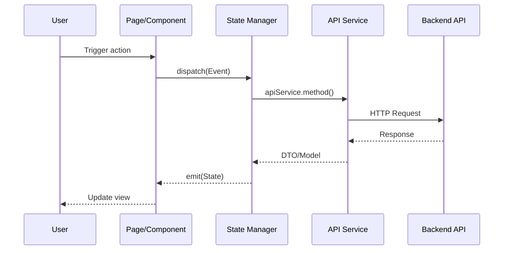
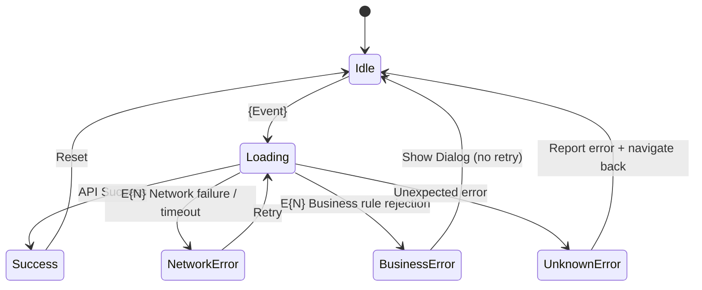

# Frontend Handoff: {Feature Name}

> **Target Audience**: Frontend UI developers
> **Source**: Extracted from S0 + S1 + S3, with frontend layered development guidance
> **Created**: {YYYY-MM-DD HH:mm}
> **Output Condition**: Only produced when the feature involves frontend tasks

---

## 1. Feature Overview

{One-sentence description (from S0)}

**Design Mockup**: {Figma / Design tool URL or "None"}

**Related Documents**

| Document | Purpose |
|----------|---------|
| [`s0_brief_spec.md`](./s0_brief_spec.md) | Full requirements and success criteria |
| [`s1_api_spec.md`](./s1_api_spec.md) | API contract (Request/Response/Error Codes) |
| [`s3_implementation_plan.md`](./s3_implementation_plan.md) | Full task details and DoD |

---

## 2. User Flow

> Carry over from S1 Section 3, retaining only the frontend-relevant flows.

```mermaid
flowchart TD
    A[{Starting Action}] --> B{Decision Point}
    B -->|Condition A| C[{Step A}]
    B -->|Condition B| D[{Step B}]
    C --> E[{Result}]
    D --> E
```

### Main Flow
| Step | User Action | System Response | Frontend Responsibility |
|------|-------------|-----------------|------------------------|
| 1 | {Action} | {Response} | {Component / State Manager / Navigation} |
| 2 | {Action} | {Response} | {Component / State Manager / Navigation} |

### Exception Flows
| Scenario | Trigger Condition | User Sees | Frontend Handling |
|----------|-------------------|-----------|-------------------|
| {Scenario1} | {Condition} | {Result} | {Toast / Dialog / Redirect} |

---

## 3. API Spec Summary

> Full spec in [`s1_api_spec.md`](./s1_api_spec.md). Below is a quick reference for frontend integration.

### Endpoint List

| Method | Path | Purpose | Frontend Call Trigger |
|--------|------|---------|----------------------|
| `POST` | `/api/v1/{endpoint}` | {Purpose} | {Which state manager event triggers this} |
| `GET` | `/api/v1/{endpoint}` | {Purpose} | {Which state manager event triggers this} |

### Key Response Fields

> Fields that require special frontend handling.

| Endpoint | Field | Type | Frontend Usage |
|----------|-------|------|----------------|
| `POST /endpoint` | `data.fieldA` | bool | Controls navigation or display logic |
| `POST /endpoint` | `data.fieldB` | int | Updates UI counter or balance |

### Error Code Handling

| Error Code | Frontend Display | Handling Approach |
|-----------|-----------------|-------------------|
| `{ERROR_CODE_1}` | Toast: {message} | No retry needed |
| `{ERROR_CODE_2}` | Dialog: {message} | Prompt user to take corrective action |

---

## 4. Frontend Data Flow

> Simplified sequence diagram, stopping at the API layer.



---

## 5. Frontend Layered Development Guide

### 5.1 Data Layer (DTO / Model / API Service)

#### New/Modified DTOs

```
// {file_path}
class {FeatureName}Request {
  field1: string;
  // ...
  toJson(): object { return { field1: this.field1 }; }
}
```

```
// {file_path}
class {FeatureName}Result {
  success: boolean;
  data?: string;
  // ...
  static fromJson(json: object): {FeatureName}Result { ... }
}
```

#### API Service Changes

| Method | Change Type | Description |
|--------|------------|-------------|
| `{service}.{method}()` | New / Modified | {Description} |

#### Model Change Summary

| Model | Change | Description |
|-------|--------|-------------|
| `{ModelName}` | Add field `fieldX` | {Description} |
| `{ModelName}` | Remove `fieldY` | {Description} |

---

### 5.2 State Management Layer (Events / State / Logic)

#### State Manager Scope

| State Manager | Scope | Creation Point | Description |
|---------------|-------|----------------|-------------|
| `{FeatureName}Manager` | Page-level | Created on mount, disposed on unmount | {Description} |

#### Events

| Event | Parameters | Trigger Timing |
|-------|------------|----------------|
| `{EventName}` | `{Parameter list}` | {What user did} |

#### States

| State / Field | Type | Description | Trigger Condition |
|---------------|------|-------------|-------------------|
| `isLoading` | bool | Request in progress | After event dispatch |
| `{resultField}` | {Type}? | Operation result | After API response |
| `error` | String? | Error message | On API failure |

#### State Transitions



#### Error Handling Matrix

| Error Type | Corresponding S0 ID | Trigger Condition | UI Presentation | Recovery Action |
|------------|---------------------|-------------------|-----------------|-----------------|
| NetworkError | E{N} | API timeout / connection lost | Toast: "Network error" | Auto-retry / manual retry button |
| BusinessError | E{N} | 400/409 business rule rejection | Dialog with specific error message | Navigate back / redirect to relevant page |
| UnknownError | — | 500 / unexpected exception | Toast: "System error, please try again" | Report error + navigate to home |

---

### 5.3 Presentation Layer (Pages / Components)

#### New/Modified Pages

| Page | Route | Change Type | Description |
|------|-------|-------------|-------------|
| `{PageName}` | `/{route}` | New / Modified | {Description} |

#### New/Modified Components

| Component | File | Change Type | Description |
|-----------|------|-------------|-------------|
| `{ComponentName}` | `src/...` | New / Modified | {Description} |

#### UI Behavior Rules

| Element | Condition | Behavior | Notes |
|---------|-----------|----------|-------|
| {Button A} | {Condition} | enabled / disabled | {Reason} |
| {Section B} | {Condition} | show / hide | {Reason} |
| {Action C} | {Another action in progress} | mutually exclusive lock | {Which actions are mutually exclusive} |

#### Loading / Error States

| State | UI Presentation | Description |
|-------|----------------|-------------|
| Loading | {Shimmer / Spinner / Skeleton} | {Description} |
| Error | {Toast / Snackbar / Inline message} | {Description} |
| Empty | {Empty state screen} | {Description} |

---

## 6. Frontend Task List

> Extracted from S3, listing only frontend-related tasks. Full DoD in [`s3_implementation_plan.md`](./s3_implementation_plan.md).

| # | Task | Layer | Complexity | Dependencies | Wave |
|---|------|-------|------------|--------------|------|
| T{N} | {Task name} | Data | S | - | W1 |
| T{N} | {Task name} | State | S | T{N} | W1 |
| T{N} | {Task name} | Presentation | M | T{N} | W1 |

---

## 7. Frontend Acceptance Criteria

> Extracted from S1 Section 7, retaining only frontend-verifiable ACs.

| # | Scenario | Given | When | Then | Priority |
|---|----------|-------|------|------|----------|
| AC-{N} | {Scenario} | {Precondition} | {User action} | {Expected result} | P0 |

---

## 8. Conventions and Constraints

### Design System

- Pages must use the project's standard scaffold/layout component
- Colors must reference theme tokens -- **no hardcoded color values**
- Dialogs must use the shared dialog component
- New components should include showcase / storybook entries

### Network Layer

- Use the project's shared API client -- **no direct HTTP library calls**
- Authentication tokens are injected automatically; do not handle tokens manually

### Feature-Specific Constraints

- {Constraint 1}
- {Constraint 2}

---

## 9. Mock Data Spec

> For pure UI development. UI developers use these factory methods to construct static mock data, enabling all screen states to be developed without a running backend.
> Mock data file location: `{mock_data_file_path}`

### 9.1 Model Mock Factory

> For each Model/Result used by the frontend, provide a factory method with sensible defaults.

| Factory Method | Return Type | Description | Key Field Defaults |
|----------------|------------|-------------|-------------------|
| `make{ModelName}({overrides})` | `{ModelName}` | {Scenario description} | `field: {default}` |

```
// {mock_data_file_path}

function make{ModelName}({
  id = 'mock-id-1',
  fieldA = '{sensible default}',
  fieldB = {sensible default},
} = {}) {
  return new {ModelName}({ id, fieldA, fieldB });
}
```

### 9.2 Scenario Data

> Each UI state maps to a static data combination. UI developers reference these directly.

| Scenario ID | Description | Data | Corresponding AC | UI State |
|-------------|-------------|------|-------------------|----------|
| `S-{N}` | {Scenario description} | `make{Model}({overrides})` | AC-{N} | {Success / Empty / Error} |

### 9.3 Edge Cases

| Case | Data Characteristics | Expected UI Behavior |
|------|---------------------|----------------------|
| {Very long text} | `field: 'A'.repeat({maxLength})` | Truncate / wrap |
| {Null value} | `field: null` | Fallback display |
| {Empty list} | `items: []` | Empty state screen |
| {Single item} | `items: [single]` | No scroll, normal layout |

---

## 10. Division of Labor

> Clearly separates "pure UI work" from "logic integration work" so two developers can work in parallel.

### 10.1 Pure UI Tasks (Using Mock Data, no backend required)

> U{N} / I{N} are division-of-labor markers and do not replace S3 main task numbers #{N}. Map to S3 task table via `source_ref` field.

| # | Corresponding Task | Component / Page | Input (Props) | Output (Callbacks) | Mock Scenario |
|---|-------------------|-----------------|---------------|-------------------|---------------|
| U{N} | #{M} | `{ComponentName}` | `{data}: {Type}` | `{onAction}({params})` | S-{N} |

**Delivery Criteria**:
- Component accepts props and displays correct UI
- All callbacks use no-op placeholders (integrator replaces them)
- All states can be independently demonstrated using Section 9 Mock Data
- Passes project linter / static analysis

### 10.2 Logic Integration Tasks (Requires backend API + state management)

| # | Integration Point | Corresponding UI Task | Integration Content |
|---|-------------------|----------------------|---------------------|
| I{N} | `{StateManager/Service}` | U{N} | {Replace mock with live state + API integration} |

### 10.3 Component Callback Contract

> UI developers design components to this interface; integrators wire up to this interface. This is the shared contract.

| Component | Props (Input) | Callbacks (Output) | Description |
|-----------|--------------|-------------------|-------------|
| `{ComponentName}` | `{data}: {Type}` | `{onXxx}: ({params}) => void` | {Description} |
