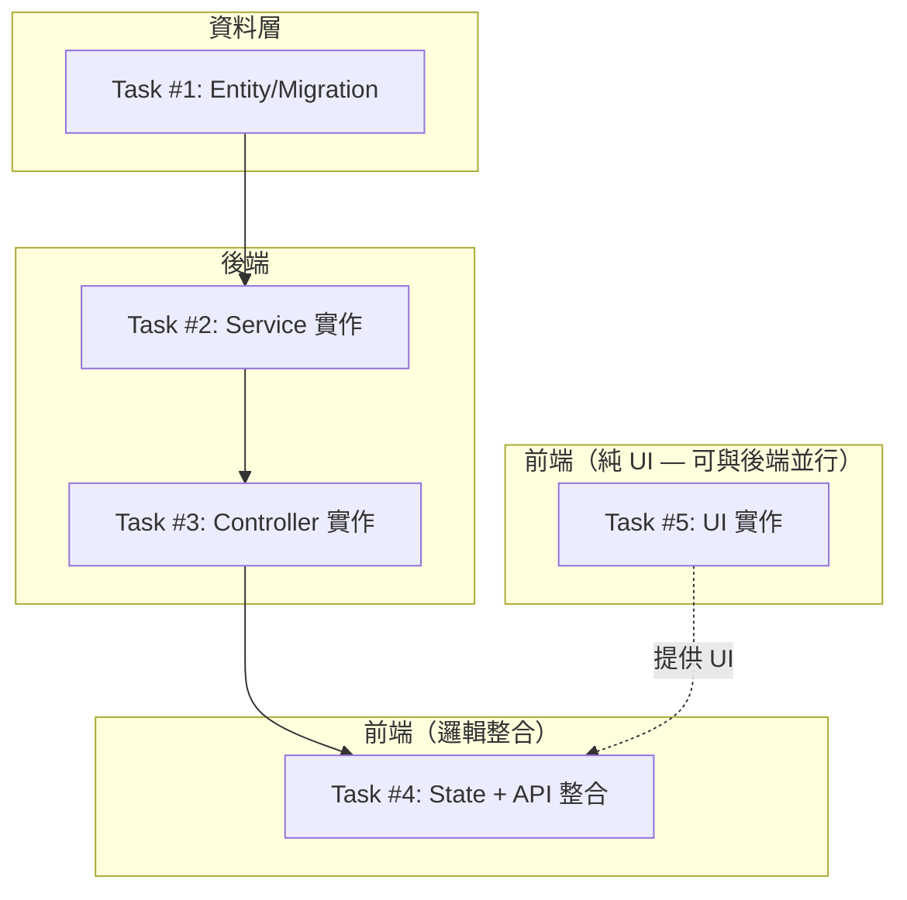

# S3 Implementation Plan: {功能名稱}

> **階段**: S3 實作
> **建立時間**: {YYYY-MM-DD HH:mm}
> **Agents**: {實作中使用的 Agents}

---

## 1. 概述

### 1.1 功能目標
{從 S0/S1/S2 繼承的功能目標}

### 1.2 實作範圍
- **範圍內**: {scope_in}
- **範圍外**: {scope_out}

### 1.3 關聯文件
| 文件 | 路徑 | 狀態 |
|------|------|------|
| Brief Spec | `./s0_brief_spec.md` | ✅ |
| Dev Spec | `./s1_dev_spec.md` | ✅ |
| Implementation Plan | `./s3_implementation_plan.md` | 📝 當前 |

---

## 2. 實作任務清單

### 2.1 任務總覽

| # | 任務 | 類型 | Agent | 依賴 | 複雜度 | source_ref | TDD | 狀態 |
|---|------|------|-------|------|--------|--------|-----|------|
| 1 | {任務1} | 資料層 | `sql-expert` | - | S | - | ✅ | ⬜ |
| 2 | {任務2} | 後端 | `dotnet-expert` | #1 | M | - | ✅ | ⬜ |
| 3 | {任務3} | 後端 | `dotnet-expert` | #2 | S | - | ✅ | ⬜ |
| 4 | {任務4} | 前端整合 | `flutter-expert` | #3, #5 | M | {I1} | ✅ | ⬜ |
| 5 | {任務5} | 前端 UI | `flutter-expert` | - | M | {U1} | ✅ | ⬜ |

**狀態圖例**：
- ⬜ pending（待處理）
- 🔄 in_progress（進行中）
- ✅ completed（已完成）
- ❌ blocked（被阻擋）
- ⏭️ skipped（跳過）

**複雜度**：
- S（小，<30min）
- M（中，30min-2hr）
- L（大，>2hr）

**TDD**: ✅ = has tdd_plan, ⛔ = N/A (skip_justification required)

---

## 3. 任務詳情

### Task #1: {任務名稱}

**基本資訊**
| 項目 | 內容 |
|------|------|
| 類型 | 資料層 / 後端 / 前端 |
| Agent | `sql-expert` / `dotnet-expert` / `flutter-expert` |
| 複雜度 | S / M / L |
| 依賴 | - |
| source_ref | -（填 U{N}/I{N}，無對應填 -） |
| 狀態 | ⬜ pending |

**描述**
{詳細描述任務內容}

**輸入**
- {前置條件 1}
- {前置條件 2}

**輸出**
- {預期產出 1}
- {預期產出 2}

**受影響檔案**
| 檔案 | 變更類型 | 說明 |
|------|---------|------|
| `path/to/file` | 新增/修改 | {說明} |

**DoD（完成定義）**
- [ ] {完成條件 1}
- [ ] {完成條件 2}
- [ ] {完成條件 3}

**TDD Plan**
| 項目 | 內容 |
|------|------|
| 測試檔案 | `tests/path/to/test_file` |
| 測試指令 | `{test_command}` |
| 預期失敗測試 | {test_case_1}, {test_case_2} |

<!-- 若無可測邏輯：-->
<!-- **TDD Plan**: N/A — {skip_justification} -->

**驗證方式**
```bash
# 執行驗證指令
{驗證指令}
```

**實作備註**
- {實作時的注意事項}
- {參考的現有模式}

---

### Task #2: {任務名稱}

**基本資訊**
| 項目 | 內容 |
|------|------|
| 類型 | {類型} |
| Agent | {agent} |
| 複雜度 | {複雜度} |
| 依賴 | Task #1 |
| 狀態 | ⬜ pending |

**描述**
{詳細描述}

**輸入**
- Task #1 的輸出
- {其他前置條件}

**輸出**
- {預期產出}

**受影響檔案**
| 檔案 | 變更類型 | 說明 |
|------|---------|------|
| `path/to/file` | 新增/修改 | {說明} |

**DoD**
- [ ] {完成條件}

**TDD Plan**
| 項目 | 內容 |
|------|------|
| 測試檔案 | `tests/path/to/test_file` |
| 測試指令 | `{test_command}` |
| 預期失敗測試 | {test_case_1}, {test_case_2} |

<!-- 若無可測邏輯：-->
<!-- **TDD Plan**: N/A — {skip_justification} -->

**驗證方式**
```bash
{驗證指令}
```

---

## 4. 依賴關係圖



---

## 5. 執行順序與 Agent 分配

### 5.1 執行波次

| 波次 | 任務 | Agent | 可並行 | 備註 |
|------|------|-------|--------|------|
| Wave 1 | #1 | `sql-expert` | 否 | |
| Wave 2 | #2 | `dotnet-expert` | 否 | |
| Wave 2 | #5（純 UI） | `flutter-expert` | 是（與後端並行） | 依 §10 分工，僅需 Mock Data |
| Wave 3 | #3 | `dotnet-expert` | 否 | |
| Wave 4 | #4 | `flutter-expert` | 否 | 整合 UI + State + API |

### 5.2 Agent 調度指令

```
# Task #1 - 資料層
Task(
  subagent_type: "sql-expert",
  prompt: "實作 Task #1: {任務描述}\n\nDoD:\n- {完成條件}",
  description: "S3-T1 資料層實作"
)

# Task #2 - 後端 Service
Task(
  subagent_type: "dotnet-expert",
  prompt: "實作 Task #2: {任務描述}\n\nDoD:\n- {完成條件}",
  description: "S3-T2 後端 Service"
)

# Task #3 - 後端 API
Task(
  subagent_type: "dotnet-expert",
  prompt: "實作 Task #3: {任務描述}\n\nDoD:\n- {完成條件}",
  description: "S3-T3 後端 API"
)

# Task #4 - 前端邏輯
Task(
  subagent_type: "flutter-expert",
  prompt: "實作 Task #4: {任務描述}\n\nDoD:\n- {完成條件}",
  description: "S3-T4 前端邏輯"
)

# Task #5 - 前端 UI
Task(
  subagent_type: "flutter-expert",
  prompt: "實作 Task #5: {任務描述}\n\nDoD:\n- {完成條件}",
  description: "S3-T5 前端 UI"
)
```

---

## 6. 驗證計畫

### 6.1 逐任務驗證

| 任務 | 驗證指令 | 預期結果 |
|------|---------|---------|
| #1 | `dotnet ef migrations list` | Migration 存在 |
| #2 | `dotnet test --filter "FullyQualifiedName~{ServiceName}"` | Tests passed |
| #3 | `curl -X GET http://localhost:5000/api/v1/{endpoint}` | 200 OK |
| #4 | `fvm flutter analyze` | No issues found |
| #5 | `fvm flutter analyze` | No issues found |

### 6.2 整體驗證

```bash
# Flutter 靜態分析
cd app && fvm flutter analyze

# Flutter 單元測試
cd app && fvm flutter test

# .NET 建置（替換為你的 .sln 檔案名）
cd server && dotnet build *.sln

# .NET 單元測試
cd server && dotnet test
```

---

## 7. 實作進度追蹤

### 7.1 進度總覽

| 指標 | 數值 |
|------|------|
| 總任務數 | {N} |
| 已完成 | 0 |
| 進行中 | 0 |
| 待處理 | {N} |
| 完成率 | 0% |

### 7.2 時間軸

| 時間 | 事件 | 備註 |
|------|------|------|
| {YYYY-MM-DD HH:mm} | 開始實作 | |
| | | |

---

## 8. 變更記錄

### 8.1 檔案變更清單

```
新增：
  (待實作後填寫)

修改：
  (待實作後填寫)

刪除：
  (待實作後填寫)
```

### 8.2 Commit 記錄

| Commit | 訊息 | 關聯任務 |
|--------|------|---------|
| | | |

---

## 9. 風險與問題追蹤

### 9.1 已識別風險

| # | 風險 | 影響 | 緩解措施 | 狀態 |
|---|------|------|---------|------|
| 1 | {風險描述} | 高/中/低 | {措施} | 監控中 |

### 9.2 問題記錄

| # | 問題 | 發現時間 | 狀態 | 解決方案 |
|---|------|---------|------|---------|
| | | | | |

---

## SDD Context

```json
{
  "sdd_context": {
    "stages": {
      "s3": {
        "status": "pending_confirmation",
        "agent": "architect",
        "output": {
          "implementation_plan_path": "dev/specs/{folder}/s3_implementation_plan.md",
          "waves": [
            {
              "wave": 1,
              "name": "波次名稱（可選）",
              "tasks": [
                { "id": 1, "name": "任務名稱", "agent": "agent-name", "dependencies": [], "complexity": "S", "dod": ["完成標準"], "parallel": false, "affected_files": ["預期檔案"], "tdd_plan": { "test_file": "tests/...", "test_cases": ["test_name"], "test_command": "..." } }
              ],
              "parallel": "false | true | 描述（可選，波次並行策略）"
            }
          ],
          "total_tasks": 5,
          "estimated_waves": 5,
          "verification": {
            "static_analysis": ["fvm flutter analyze", "dotnet build"],
            "unit_tests": ["fvm flutter test", "dotnet test"]
          },
          "e2e_test_plan": {
            "testability_summary": { "auto": 0, "api_only": 0, "hybrid": 0, "manual": 0 },
            "planned_test_files": [],
            "required_ui_keys": [],
            "assigned_tasks": {}
          }
        }
      }
    }
  }
}
```

---

## 10. E2E Test Plan

> 涉及前端 UI 檔案時必須產出。掃描 S0 成功標準 + S1 驗收場景，逐條標註 testability。

### 10.1 Testability 分類

| TC-ID | 描述 | Testability | E2E File | 分配 Task |
|-------|------|-------------|----------|----------|
| TC-1-1 | {測試案例描述} | `auto` / `api_only` / `hybrid` / `manual` | {file}_e2e_test | T{N} |

**Testability 定義**：
- `auto`：UI 互動 + 可驗證結果（操作 → 元素出現/消失/狀態變化）
- `api_only`：純 API 行為驗證
- `hybrid`：部分自動 + 部分人工
- `manual`：動畫/美感/手感

### 10.2 Required UI Test Keys

| Element | Key | 用途 | 所在檔案 |
|---------|-----|------|---------|
| {元素名稱} | `{feature}_{component}_{purpose}` | {驗證用途} | {檔案} |

### 10.3 E2E Test Files

| 檔案名稱 | 涵蓋 TC | 分配 Task |
|----------|---------|----------|
| `{feature}_e2e_test` | TC-1-1, TC-1-2 | T{N} |

---

## 附錄

### A. 相關文件
- S0 Brief Spec: `./s0_brief_spec.md`
- S1 Dev Spec: `./s1_dev_spec.md`
- 設計稿: {連結}

### B. 參考資料
- {參考1}
- {參考2}

### C. 專案規範提醒

#### Flutter 前端
- 網路請求**只能用** `locator<ApiClient>()`
- UI **必須用**設計系統元件（見 design-system-ref.md）
- 顏色用 `AppTheme.*`，不要硬編 `Colors.*`

#### .NET 後端
- 遵守 Clean Architecture 四層架構
- 命名格式遵守 `.editorconfig`
- 測試方法名稱：`Should_DoX_WhenY`
